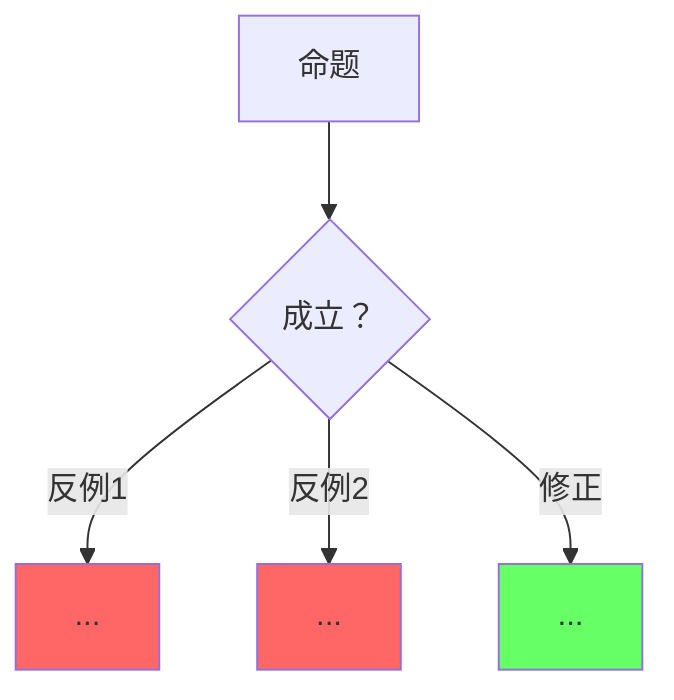

# Kimi 表征空间分析要求：Rust 语义边界与表达力

> **EN**: Kimi Semantic Space Analysis Requirements for Rust Expressiveness and Boundaries
> **Summary**: Reusable contract for Kimi when creating or auditing `concept/00_meta/00_framework/semantic_space.md`-style pages and cross-page semantic-space mapping annotations.
> **Scope**: `E:/_src/rust-lang` and all subdirectories.
> **Companion**: [`.kimi/kimi_content_requirements.md`](kimi_content_requirements.md) (page-level format), [`.kimi/kimi_thinking_representation_requirements.md`](kimi_thinking_representation_requirements.md) (representations), [`.kimi/kimi_kg_topology_requirements.md`](kimi_kg_topology_requirements.md) (KG/atlas).

---

## 1. 何时使用本要求

当你（Kimi）被要求：

- 新建或改写 Rust **表征空间 / 语义边界 / 表达力** 总论页；
- 为现有 `concept/` 权威页补充与表征空间总论的映射标注；
- 对 Rust 版本、语言特性、跨语言范式做「能表达 / 不能表达 / 痛苦表达」三维边界分析；
- 生成等价表达谱系、机制组合代数、跨语言对比矩阵；

必须先阅读本文件，再阅读 `concept/00_meta/00_framework/semantic_space.md`，最后生成内容。

---

## 2. 强制理论框架

每篇表征空间分析必须显式引用并应用以下四个框架中的**至少两个**，且必须与 Rust 具体机制结合，禁止只列理论名。

### 2.1 Felleisen 表达力（Felleisen 1991）

> 核心命题：一个特性是否增加语言表达力，取决于它是否需要**全局变换**而非局部变换来实现。

Rust 应用：

- **局部变换**（不增加表达力）：`?` 运算符、模式匹配简化、其他语法糖。
- **全局变换**（增加表达力）：异常 → `Result`（控制流全局重写）、类继承 → `Trait + enum`（设计模式全局改变）、GC → 所有权（运行时模型改变）。

### 2.2 观察等价性（Observational Equivalence）

> 核心命题：若两个表达式在所有上下文中行为不可区分，则它们观察等价。

Rust 应用：

- `Box<T>` vs `Unique<T>`（内部 unsafe）：观察等价，实现不同。
- `dyn Trait` vs `impl Trait` vs `enum + match`：语义等价，分发方式 / 扩展性 / 性能不同。
- `Rc<T>` vs `Arc<T>`（单线程场景）：观察等价，线程安全保证不同。

### 2.3 类型系统图灵完备性（Leffler 2017）

> Rust trait + 关联类型在理论上图灵完备；编译器通过递归深度与单态化限制保证实际可终止。

应用：解释类型级计算边界、`const generics`、`GATs`、`specialization` 等扩展如何改变表征空间。

### 2.4 语义封闭性（Semantic Closure）

> safe Rust 是一个封闭形式系统：所有权唯一性、借用规则、生命周期约束为公理；类型检查与借用检查为推理规则。

应用：

- 区分 **safe 封闭子集**、**unsafe 逃逸舱口**、**FFI / LLVM 实现层语义漂移**。
- unsafe 不改变类型系统规则，但允许程序员手动保证不变量；与 Haskell `unsafePerformIO`、ML `unsafe_cast` 类比。

---

## 3. 表征空间页必备章节

| 章节 | 必备内容 | 最低检查证据 |
|---|---|---|
| §1 表征空间定义 | 列出组成算子集合；说明子系统交互约束 | 至少 7 个算子，如 类型系统、所有权、借用、生命周期、Trait、泛型、宏、unsafe、async |
| §2 语义封闭性 | 公理、推理规则、封闭性结论；unsafe 作为逃逸舱口 | 引用 Rust Reference — Unsafe Rust |
| §3 表达边界 | 「能且高效 / 能但痛苦 / 不能」三维表格 | 每维 ≥5 行 |
| §4 等价表达谱系 | 同一语义的不同 Rust 表达，标明观察/语义/性能等价 | ≥5 条谱系 |
| §5 机制组合代数 | 基础算子 + 合法/非法组合规则 + 组合选择决策树 + 约束爆炸说明 | ≥6 个算子；≥3 条非法组合并配 `compile_fail` |
| §6 跨语言对比 | 五维以上对比矩阵；可扩展依赖类型语言 | 矩阵 + 包含关系图 |
| §7 认知路径 | 6 步问题链或学习路径 | ≥5 步 |
| §8 反命题与边界 | ≥3 个反命题决策树；每个命题配反例/修正 | Mermaid 图，反例红 / 修正绿 |
| §9 定理一致性矩阵 | 断言、前提 ⟹ 结论、反例/边界、典型场景、失效条件 | ≥8 行 |
| §10 来源与演进 | P0/P1/P2 来源表；演进方向 checklist | 表格 |

---

## 4. 必备表征形式

### 4.1 三维边界表

```markdown
| 类别 | 概念 | Rust 表达 | 语义保持 | 成本/痛点 | 权威来源 |
|---|---|---|---|---|---|
| 能且高效 | 系统编程 | 所有权 + unsafe | 完全 | 零运行时 | Rust Reference |
| 能但痛苦 | GUI 开发 | 生命周期 + Pin | 部分 | 自引用复杂 | RFC 2349 |
| 不能 | 绿色线程 | 无 | — | FFI/运行时成本 | RFC 230 |
```

要求：

- 「能且高效」必须给出零成本或编译期保证的证据。
- 「能但痛苦」必须说明痛点产生的结构性原因（如自引用、生命周期与回调冲突）。
- 「不能」必须引用官方决策或设计哲学（RFC、Reference、Release Notes）。

### 4.2 等价表达谱系

可用层级缩进文本或 Mermaid flowchart，必须覆盖：

- 继承层次 → `Trait` + 默认方法 + 组合
- 异常控制流 → `Result<T, E>` + `?`
- 虚函数调用 → `enum + match` 或 `dyn Trait`
- GC 自动回收 → 所有权 + `Rc`/`Arc` + `Weak`
- 模板元编程 → `const generics` + 过程宏

每条谱系必须标注：

- **观察等价**：外部可观测行为是否一致。
- **语义等价**：最终计算结果是否相同。
- **性能等价**：运行时开销是否相同。

### 4.3 机制组合决策树

使用 Mermaid `flowchart TD`，从以下至少两个维度引导选择：

- 内存管理：栈 / 堆 / 共享堆 / 裸指针
- 并发模型：单线程 / OS 线程 / async / 无锁
- 抽象级别：具体类型 / 泛型 / Trait bound / `dyn Trait` / `impl Trait`
- 可变性：编译期独占 / 运行时检查 / 原子 / unsafe

### 4.4 跨语言对比矩阵

至少 5 个维度，推荐 8 个：

| 维度 | Rust | C++ | Haskell | Go | Java |
|---|---|---|---|---|---|
| 表征空间边界 | ... | ... | ... | ... | ... |
| 封闭性 | ... | ... | ... | ... | ... |
| 表达力等价 | ... | ... | ... | ... | ... |
| 有效表达差异 | ... | ... | ... | ... | ... |
| 不能表达 | ... | ... | ... | ... | ... |
| 错误捕获时机 | ... | ... | ... | ... | ... |
| 内存安全保证 | ... | ... | ... | ... | ... |
| 并发安全保证 | ... | ... | ... | ... | ... |

### 4.5 反命题决策树

每个反命题使用 Mermaid `graph TD`：



### 4.6 定理一致性矩阵

```markdown
| 断言 | 前提 ⟹ 结论 | 反例/边界条件 | 典型场景 | 失效条件 |
|---|---|---|---|---|
```

要求：

- 每个断言必须能对应已注册定理编号或具体论文来源。
- 失效条件必须给出具体代码模式。

---

## 5. 代码块要求

- 每个算子或合法组合必须配 `rust` 可运行示例。
- 非法组合必须配 `rust,compile_fail` 块，并标注错误码（`E0502`、`E0382`、`E0597` 等）与修复方法。
- unsafe / FFI 边界示例可用 `rust,ignore` 并说明需要 SAFETY 注释。
- 类型级计算示例可用 `rust,ignore` 并说明递归深度限制。

---

## 6. 映射标注规范

### 6.1 概念页元数据

在 `concept/` 权威页头部元数据中加入：

```markdown
> **表征空间映射**: [semantic_space.md §X 章节名](../../00_meta/00_framework/semantic_space.md)
```

### 6.2 概念页映射节

在页尾「认知路径」前增加：

```markdown
## 与表征空间（Semantic Space）的映射

> 本页对应 [`concept/00_meta/00_framework/semantic_space.md`](../../00_meta/00_framework/semantic_space.md) 的 **§X 章节名** 与 **§Y 章节名**：

- 本页概念 X 对应表征空间算子 / 边界 / 等价表达 ...
- 本页决策 / 反例可在 semantic_space.md §Z 找到元层解释。
```

### 6.3 常用主题到章节的映射速查

| 主题 | 引用章节 |
|---|---|
| 所有权 | §2 语义封闭性 / §5 机制组合 |
| 借用 | §2 语义封闭性 / §5 机制组合 |
| 生命周期 | §2 语义封闭性 / §5 机制组合 |
| Trait | §4 等价表达 / §5 机制组合 |
| 泛型 | §4 等价表达 / §5 机制组合 |
| unsafe | §2 逃逸舱口 / §5 机制组合 |
| async / 并发 | §3 表达边界 / §5 机制组合 |
| 错误处理 | §4 等价表达 |
| 跨语言对比 / 范式迁移 | §6 跨语言对比 |

---

## 7. 来源与可信度要求

每页必须包含 P0/P1/P2 来源表：

| 层级 | 来源示例 | 在本页中的作用 |
|---|---|---|
| **P0 官方** | Rust Reference、TRPL、RFC、Release Notes | 语言规则与官方决策 |
| **P1 学术/形式化** | Felleisen 1991、Wadler 1989、Reynolds 1983、Leffler 2017、RustBelt、Tree Borrows | 表达力、等价性、形式化语义 |
| **P2 生态/工业** | 迁移报告、crate 文档、官方 blog | 工程实践与真实成本 |

---

## 8. 与 KG / Atlas 的衔接

- 将每个算子、边界案例、等价表达映射为 KG 实体。
- 关系谓词必须使用具体语义谓词：
  - `dependsOn`：算子依赖
  - `entails`：语义蕴含
  - `mutexWith`：不能同时成立
  - `refines`：细化
  - `equivalentTo`：等价
  - `counterExample`：反例
- 反命题 / 反例必须产出 `counterExample` 边。
- 「不能表达」项可产出 `ex:excludesFromScope` 或 `mutexWith` 边。

---

## 9. Kimi 自检清单

生成或审计表征空间页前确认：

- [ ] 四个理论框架至少引用两个，且与 Rust 具体机制结合。
- [ ] §1–§10 必备章节无遗漏。
- [ ] 三维边界表、等价谱系、组合决策树、跨语言矩阵、反命题树、定理矩阵齐全。
- [ ] 每个 `rust,compile_fail` 块标注 `E0xxx` 或失败原因。
- [ ] 概念页映射标注包含头部元数据 + 页尾映射节。
- [ ] P0/P1/P2 来源表完整。
- [ ] KG 关系使用具体谓词，无通用 `ex:RelationAnnotation`。

---

## 10. 协作关系

| 文件 | 层级 | 用途 |
|---|---|---|
| [`.kimi/kimi_content_requirements.md`](kimi_content_requirements.md) | 内容级 | 页级格式、代码块 10 桶、链接、元数据 |
| [`.kimi/kimi_thinking_representation_requirements.md`](kimi_thinking_representation_requirements.md) | 表征级 | mindmap、矩阵、五元组、决策树、故障树、定理链 |
| [`.kimi/kimi_kg_topology_requirements.md`](kimi_kg_topology_requirements.md) | 拓扑级 | KG 谓词、atlas、决策树 YAML |
| [`.kimi/templates/kimi_semantic_space_page_template.md`](templates/kimi_semantic_space_page_template.md) | 页模板 | 新建表征空间页骨架 |
| [`.kimi/prompts/semantic_space_analysis_prompt.md`](prompts/semantic_space_analysis_prompt.md) | Prompt | 生成 / 审计表征空间页 |

---

## 11. 修订历史

- 2026-09-06: 初版，整合 `.kimi/PLAN_Semantic_Space_Wave.md` 与 `concept/00_meta/00_framework/semantic_space.md` 实践，沉淀为 Kimi 可复用要求。
