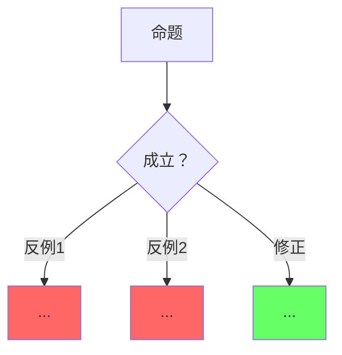

# Kimi 表征空间分析要求：Go 语义边界与表达力

> **状态**: 可选扩展 — 本仓库 AGENTS.md 体系尚未启用该机制，从 rust-lang 项目适配保留以便未来复用；不进入质量门。
>
> **EN**: Kimi Semantic Space Analysis Requirements for Go Expressiveness and Boundaries
> **Summary**: Reusable contract for Kimi when creating or auditing `go-knowledge-base/learning-paths/` 风格的表征空间总论页与跨页映射标注。
> **Scope**: `E:/_src/golang` 及其子目录（五维权威层 `go-knowledge-base/01..05-*`、索引层 `go-knowledge-base/indices/`、路径层 `go-knowledge-base/learning-paths/`）。
> **Companion**: [`.kimi/kimi_content_requirements.md`](kimi_content_requirements.md)（页级格式）、[`.kimi/kimi_thinking_representation_requirements.md`](kimi_thinking_representation_requirements.md)（表征形式）、[`.kimi/kimi_kg_topology_requirements.md`](kimi_kg_topology_requirements.md)（KG/图谱）。

---

## 1. 何时使用本要求

当你（Kimi）被要求：

- 新建或改写 Go **表征空间 / 语义边界 / 表达力** 总论页；
- 为现有五维权威页（`FT/LD/EC/TS/AD-NNN-*.md`）补充与表征空间总论的映射标注；
- 对 Go 版本、语言特性、跨语言范式做「能表达 / 不能表达 / 痛苦表达」三维边界分析；
- 生成等价表达谱系、机制组合代数、跨语言对比矩阵；

必须先阅读本文件，再阅读表征空间总论页（建议位置：`go-knowledge-base/learning-paths/00-semantic-space.md`，未启用时可先用本文 §3 骨架），最后生成内容。

---

## 2. 强制理论框架

每篇表征空间分析必须显式引用并应用以下四个框架中的**至少两个**，且必须与 Go 具体机制结合，禁止只列理论名。

### 2.1 Felleisen 表达力（Felleisen 1991）

> 核心命题：一个特性是否增加语言表达力，取决于它是否需要**全局变换**而非局部变换来实现。

Go 应用：

- **局部变换**（不增加表达力）：`errors.Is` 简化错误比较、`any` 作为 `interface{}` 别名、命名返回值的 `defer` 惯用法、类型嵌入带来的方法提升——纯语法或局部重构。
- **全局变换**（增加表达力）：异常 → error 值返回（整个调用链的控制流与签名全局重写）、类继承 → 接口 + 类型嵌入（设计模式全局改变）、GC 缺省 → arena/手动内存管理（整个分配模型与对象存活期管理改变）。

### 2.2 观察等价性（Observational Equivalence）

> 核心命题：若两个表达式在所有上下文中行为不可区分，则它们观察等价。

Go 应用：

- 值接收者方法与指针接收者方法（不可变值类型）：外部观察等价，实现与内存布局不同。
- `sync.Mutex` 与 `sync.RWMutex`（纯互斥、无并发读放大场景）：观察等价，读并发能力不同。
- 接口动态分发与 type switch 封闭变体：语义等价，分发方式 / 扩展性 / 内联与逃逸优化机会不同。
- `sync.Pool` 复用与直接分配：外部观察等价（对象内容），分配压力与 GC 行为不同。

### 2.3 类型系统图灵完备性边界（对照 Leffler 2017 的 Rust 结论）

> Go 泛型系统**刻意非图灵完备**：无条件类型、无类型级算术、无关联类型约束求解；类型级表达力通过编译期 stenciling/GCShape、运行时 `reflect`、以及 `go:generate` 代码生成三层组合逼近。

应用：解释泛型表达边界（无法表达 const 值参与类型形状的计算）、反射的运行时代价、`go:generate` 如何将「类型级程序」转移到生成阶段。

### 2.4 语义封闭性（Semantic Closure）——Go 的两层封闭

> Go 是**内存安全封闭**但**并发安全不封闭**的语言：赋值兼容、接口方法集、nil 行为、GC 指针安全构成公理；类型检查为推理规则；但 data race 可以存在于完全类型正确的代码中，并发正确性依赖程序员显式建立 happens-before。

应用：

- 区分 **内存安全封闭子集**（默认 Go）、**unsafe 逃逸舱口**（`unsafe.Pointer`、绕过类型与边界检查）、**cgo / 汇编 / `//go:linkname` 边界层的语义漂移**（cgo 指针传递规则、cgo 调用成本）。
- unsafe 不改变类型系统规则，但允许程序员手动保证不变量；与 C `void*`、Java `sun.misc.Unsafe` 类比。

---

## 3. 表征空间页必备章节

| 章节 | 必备内容 | 最低检查证据 |
| --- | --- | --- |
| §1 表征空间定义 | 列出组成算子集合；说明子系统交互约束 | 至少 7 个算子，如 类型系统、接口（方法集/嵌入）、泛型、GC/逃逸分析、channel/happens-before、sync 原语、unsafe/cgo、go:generate、context |
| §2 语义封闭性 | 公理、推理规则、封闭性结论；unsafe/cgo 作为逃逸舱口 | 引用 Go 语言规范（P0）与 Go 内存模型（P1） |
| §3 表达边界 | 「能且高效 / 能但痛苦 / 不能」三维表格 | 每维 ≥5 行 |
| §4 等价表达谱系 | 同一语义的不同 Go 表达，标明观察/语义/性能等价 | ≥5 条谱系 |
| §5 机制组合代数 | 基础算子 + 合法/非法组合规则 + 组合选择决策树 + 约束爆炸说明 | ≥6 个算子；≥3 条非法组合并配编译失败反例 |
| §6 跨语言对比 | 五维以上对比矩阵；可扩展 GC 语言与所有权语言 | 矩阵 + 包含关系图 |
| §7 认知路径 | 6 步问题链或学习路径 | ≥5 步 |
| §8 反命题与边界 | ≥3 个反命题决策树；每个命题配反例/修正 | Mermaid 图，反例红 / 修正绿 |
| §9 定理一致性矩阵 | 断言、前提 ⟹ 结论、反例/边界、典型场景、失效条件 | ≥8 行 |
| §10 来源与演进 | P0/P1/P2 来源表；演进方向 checklist | 表格 |

---

## 4. 必备表征形式

### 4.1 三维边界表

```markdown
| 类别 | 概念 | Go 表达 | 语义保持 | 成本/痛点 | 权威来源 |
|---|---|---|---|---|---|
| 能且高效 | 系统编程 | Go + unsafe.Pointer/cgo | 完全 | 边界检查成本可优化 | Go 语言规范 / cmd/cgo 文档 |
| 能但痛苦 | 无 GC 内存控制 | arena（实验）+ unsafe | 部分 | 存活期手动管理 | Go 官方 arena 提案 |
| 不能 | 类型级计算 | 无（无 const generics / 条件类型） | — | 需 go:generate 或 reflect | Go 泛型设计文档 |
```

要求：

- 「能且高效」必须给出零成本或编译期保证的证据（内联、逃逸分析、常量折叠）。
- 「能但痛苦」必须说明痛点产生的结构性原因（如自引用存活期、回调与 goroutine 泄漏、反射丢失编译期检查）。
- 「不能」必须引用官方决策或设计哲学（Go 泛型设计文档、Go FAQ、Release Notes）。

### 4.2 等价表达谱系

可用层级缩进文本或 Mermaid flowchart，必须覆盖：

- 类继承层次 → 接口 + 默认方法 + 类型嵌入
- 异常控制流 → error 返回值 + `errors.Is`/`errors.As` + `defer`
- 虚函数调用 → type switch 或接口（动态分发）
- GC 自动回收 → GC + `sync.Pool` + arena（实验）+ finalizer（非确定）
- 模板元编程 → 泛型 stenciling + `go:generate` + `reflect`

每条谱系必须标注：

- **观察等价**：外部可观测行为是否一致。
- **语义等价**：最终计算结果是否相同。
- **性能等价**：运行时开销是否相同（分配、GC 压力、动态分发）。

### 4.3 机制组合决策树

使用 Mermaid `flowchart TD`，从以下至少两个维度引导选择：

- 内存管理：栈值 / 堆逃逸 / GC / arena（实验）/ 裸指针
- 并发模型：goroutine + channel / `sync` 原语 / `sync/atomic` / cgo 回调线程
- 抽象级别：具体类型 / 泛型类型参数 / 接口约束 / `any`
- 可变性：值拷贝 / 指针共享 / atomic / unsafe

### 4.4 跨语言对比矩阵

至少 5 个维度，推荐 8 个：

| 维度 | Go | C++ | Rust | Haskell | Java |
| --- | --- | --- | --- | --- | --- |
| 表征空间边界 | ... | ... | ... | ... | ... |
| 封闭性 | ... | ... | ... | ... | ... |
| 表达力等价 | ... | ... | ... | ... | ... |
| 有效表达差异 | ... | ... | ... | ... | ... |
| 不能表达 | ... | ... | ... | ... | ... |
| 错误捕获时机 | ... | ... | ... | ... | ... |
| 内存安全保证 | ... | ... | ... | ... | ... |
| 并发安全保证 | ... | ... | ... | ... | ... |

### 4.5 反命题决策树

每个反命题使用 Mermaid `graph TD`：



### 4.6 定理一致性矩阵

```markdown
| 断言 | 前提 ⟹ 结论 | 反例/边界条件 | 典型场景 | 失效条件 |
|---|---|---|---|---|
```

要求：

- 每个断言必须能对应已注册定理编号、Go 内存模型条目或具体论文来源。
- 失效条件必须给出具体代码模式。

---

## 5. 代码块要求

- 每个算子或合法组合必须配 ```go 可运行示例（自包含，可 `go vet` 验证）。
- 非法组合必须配 ```go 块，首行注释 `// 编译失败: <确定性编译期错误原因>`（如 `declared and not used`、`cannot use … (variable of type …) as …`、`invalid operation`），并给出修复方法。
- unsafe / cgo 边界示例可用 ```go 块加首行注释 `// 不可编译: <原因>` 或标注需独立模块 + `import "C"` 前置，并说明不变量责任已转移给程序员。
- 依赖实验特性（如 arena）的示例同样标注 `// 不可编译: 依赖实验性 arena 包，标准工具链不可用`。

---

## 6. 映射标注规范

### 6.1 概念页元数据

在五维权威页头部元数据中加入：

```markdown
> **表征空间映射**: `00-semantic-space.md §X 章节名`（相对路径示例：`../go-knowledge-base/learning-paths/00-semantic-space.md`，该页随机制启用时创建）
```

### 6.2 概念页映射节

在页尾「认知路径」前增加：

```markdown
## 与表征空间（Semantic Space）的映射

> 本页对应 `go-knowledge-base/learning-paths/00-semantic-space.md`（相对路径示例：`../go-knowledge-base/learning-paths/00-semantic-space.md`，随机制启用时创建）的 **§X 章节名** 与 **§Y 章节名**：

- 本页概念 X 对应表征空间算子 / 边界 / 等价表达 ...
- 本页决策 / 反例可在 00-semantic-space.md §Z 找到元层解释。
```

### 6.3 常用主题到章节的映射速查

| 主题 | 引用章节 |
| --- | --- |
| GC / 逃逸分析 | §2 语义封闭性 / §5 机制组合 |
| 接口 / 方法集 / 类型嵌入 | §4 等价表达 / §5 机制组合 |
| 泛型 / GCShape | §4 等价表达 / §5 机制组合 |
| unsafe / cgo | §2 逃逸舱口 / §5 机制组合 |
| goroutine / channel / happens-before | §3 表达边界 / §5 机制组合 |
| 错误处理 | §4 等价表达 |
| 跨语言对比 / 范式迁移 | §6 跨语言对比 |

---

## 7. 来源与可信度要求

每页必须包含 P0/P1/P2 来源表：

| 层级 | 来源示例 | 在本页中的作用 |
| --- | --- | --- |
| **P0 官方** | [Go 语言规范](https://go.dev/ref/spec)、[Go 内存模型](https://go.dev/ref/mem)、[pkg.go.dev](https://pkg.go.dev)、[Go Proposals](https://go.googlesource.com/proposal)、[Go 1.27 Release Notes](https://go.dev/doc/go1.27) | 语言规则与官方决策 |
| **P1 学术/形式化** | Felleisen 1991、Reynolds 1983、Dijkstra/Lamport 并发经典、Hoare CSP（channel 语义源头）、GC 算法论文（Dijkstra 三色标记等） | 表达力、等价性、并发语义 |
| **P2 生态/工业** | [Go Blog](https://go.dev/blog)、知名 Go 项目（etcd、grpc-go、kubernetes client-go）、Go 泛型设计文档（P0 边界，亦可列此） | 工程实践与真实成本 |

---

## 8. 与 KG / 图谱的衔接

- 将每个算子、边界案例、等价表达映射为 KG 实体。
- 关系谓词必须使用具体语义谓词：
  - `dependsOn`：算子依赖
  - `entails`：语义蕴含
  - `mutexWith`：不能同时成立
  - `refines`：细化
  - `equivalentTo`：等价
  - `counterExample`：反例
- 反命题 / 反例必须产出 `counterExample` 边。
- 「不能表达」项可产出 `excludesFromScope` 或 `mutexWith` 边。

---

## 9. Kimi 自检清单

生成或审计表征空间页前确认：

- [ ] 四个理论框架至少引用两个，且与 Go 具体机制结合。
- [ ] §1–§10 必备章节无遗漏。
- [ ] 三维边界表、等价谱系、组合决策树、跨语言矩阵、反命题树、定理矩阵齐全。
- [ ] 每个编译失败反例块标注 `// 编译失败:` 与确定性失败原因。
- [ ] 概念页映射标注包含头部元数据 + 页尾映射节。
- [ ] P0/P1/P2 来源表完整。
- [ ] KG 关系使用具体谓词，无通用 `ex:RelationAnnotation`。

---

## 10. 协作关系

| 文件 | 层级 | 用途 |
| --- | --- | --- |
| [`.kimi/kimi_content_requirements.md`](kimi_content_requirements.md) | 内容级 | 页级格式、代码块规范、链接、元数据 |
| [`.kimi/kimi_thinking_representation_requirements.md`](kimi_thinking_representation_requirements.md) | 表征级 | mindmap、矩阵、决策树、故障树、定理链 |
| [`.kimi/kimi_kg_topology_requirements.md`](kimi_kg_topology_requirements.md) | 拓扑级 | KG 谓词、图谱、决策树 YAML |
| [`.kimi/templates/kimi_semantic_space_page_template.md`](templates/kimi_semantic_space_page_template.md) | 页模板 | 新建表征空间页骨架 |
| [`.kimi/prompts/semantic_space_analysis_prompt.md`](prompts/semantic_space_analysis_prompt.md) | Prompt | 生成 / 审计表征空间页 |

---

## 11. 修订历史

- 2026-09-06: 初版，从 rust-lang 项目适配：将 Rust 特有的封闭性论证（所有权体系）改写为 Go 的「内存安全封闭 × 并发安全不封闭」双层口径；类型系统图灵完备性结论反转（Go 泛型刻意非图灵完备）；错误码体系（E0xxx）改为编译失败类别描述；权威源整体替换为 go.dev / pkg.go.dev / proposal 分级。
