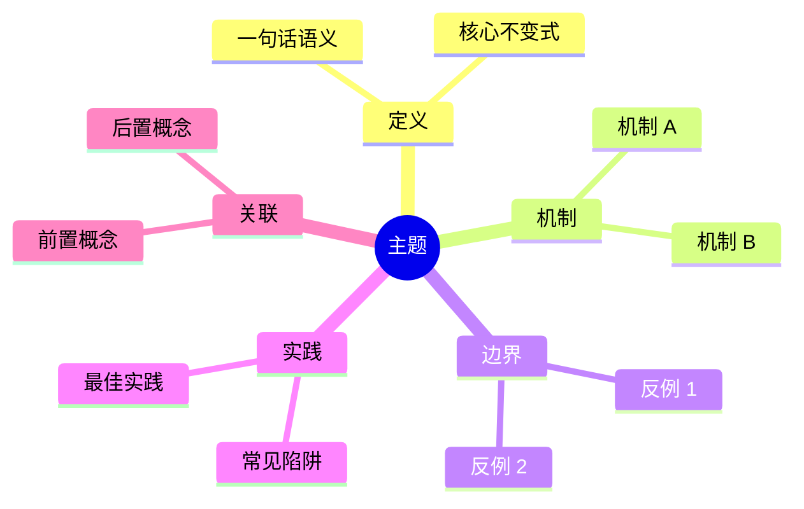
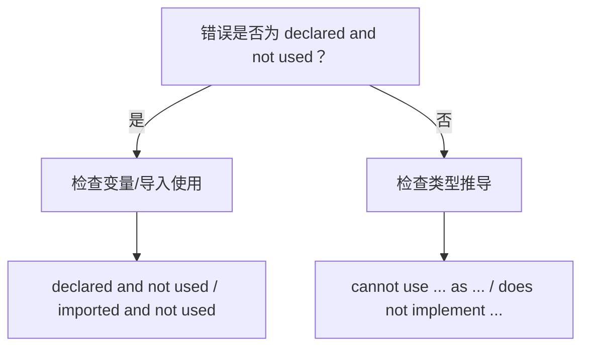
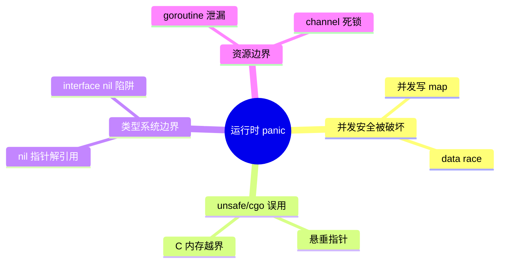

# Kimi 思维表征与语义内容要求（Go 版）

> **状态**: 可选扩展 — 本仓库 AGENTS.md 体系尚未启用该机制，从 rust-lang 项目适配保留以便未来复用；不进入质量门。

> **EN**: Kimi Thinking Representation and Semantic Content Requirements (Go)
> **Summary**: Reusable contract for the visual, structural, and semantic representations that Kimi must produce or verify when editing Go 权威页 and related pages.
> **Scope**: `E:/_src/golang`
> **Companion**: [`.kimi/kimi_content_requirements.md`](kimi_content_requirements.md) (页级格式), [`.kimi/kimi_quality_gate_checklist.md`](kimi_quality_gate_checklist.md) (命令), [`.kimi/kimi_kg_topology_requirements.md`](kimi_kg_topology_requirements.md) (KG 拓扑).

---

## 1. 适用范围

本文件规定 Kimi 在生成本仓库内容时必须使用的**思维表征方式**：

1. 思维导图（Mermaid mindmap）
2. 多维矩阵对比表
3. 概念定义-属性-关系-示例-反例 五元组
4. 决策树（Mermaid flowchart / YAML）
5. 语义关联 / KG 关系
6. 故障树 / 边界扩展树
7. 定理推理链（⟹ / ⟸）

权威页指 `go-knowledge-base/01..05-*` 五维目录下的 `{FT|LD|EC|TS|AD}-NNN-{Kebab-Title}.md` 页面。

---

## 2. 思维导图（Mermaid mindmap）

### 2.1 使用场景

- 每个权威页（六件套之一）必须包含一个 mindmap，放在「权威定义」之后或正文章节中。
- 用于概述概念的定义、机制、边界、实践与关联。

### 2.2 强制结构



### 2.3 质量要求

- 节点层级 ≥3 层（root → 一级分支 → 二级分支）。
- 每个一级分支下至少 2 个二级节点。
- 禁止使用纯文本长句作为节点；节点应为名词或短语。
- 同一页的 mindmap 必须与正文章节结构一致。

### 2.4 反模式

- ❌ 只列出 2–3 个一级分支，无细节。
- ❌ 节点是完整段落而非关键词。
- ❌ mindmap 与正文内容脱节。

---

## 3. 多维矩阵对比表

### 3.1 使用场景

- 比较两个及以上概念、版本、写法、运行时实现、包/工具链时。
- 用于展示多维度下的差异与权衡。

### 3.2 强制结构

```markdown
| 维度 | 对象 A | 对象 B | 对象 C |
|---|---|---|---|
| **语义** | ... | ... | ... |
| **语法** | ... | ... | ... |
| **性能** | ... | ... | ... |
| **安全保证** | ... | ... | ... |
| **典型场景** | ... | ... | ... |
```

### 3.3 质量要求

- 至少 4 个维度；每个维度必须可验证（语义/语法/性能/安全/生态/平台）。
- 单元格内容避免空泛形容词，必须给出具体规则或代码片段。
- 若用于版本对比，必须包含“对称差”视角：交集、仅 A 有、仅 B 有。

---

## 4. 概念五元组：定义-属性-关系-示例-反例

### 4.1 使用场景

- 每个权威页在「权威定义」节后，必须用表格或结构化块呈现概念五元组。

### 4.2 强制结构

```markdown
| 元素 | 内容 | 要求 |
|---|---|---|
| **定义** | 一句话精确语义 | 可转化为判定过程 |
| **属性** | 核心约束/不变式列表 | 不可撤销、不可破坏 |
| **关系** | 前置/后置/互斥/等价概念 | 使用具体语义谓词 |
| **示例** | `go` 可运行代码 | 展示正确用法 |
| **反例** | `go` 代码，首行 `// 编译失败: <原因>` | 展示错误原因与修复 |
```

### 4.3 关系谓词

必须使用具体语义谓词，禁止通用 `related to`：

- `dependsOn`：A 依赖 B
- `entails`：A 语义上蕴含 B
- `mutexWith`：A 与 B 不能同时成立
- `refines`：A 细化 B
- `equivalentTo`：A 与 B 等价
- `counterExample`：A 是 B 的反例

---

## 5. 决策树（Go 编译失败类别映射）

### 5.1 使用场景

- 诊断 Go 编译失败（`go build` / `go vet` 报错）的判定路径。
- 版本迁移、兼容性（`go` 指令版本）、工具链选择的决策流程。
- 若启用，可存放在 `go-knowledge-base/indices/decision-trees.yaml` 并在权威页引用。（本机制当前为可选扩展，尚未启用。）

> **说明**：Go 编译器无公开错误码体系，决策树节点关联的是**编译失败类别描述**（如 `declared and not used`、`cannot use ... as ...`、`does not implement ... (missing method ...)`），不是数字错误码。

### 5.2 YAML 结构

```yaml
trees:
  - id: GO-FAIL-01
    title: 示例判定树
    description: 判定某个 Go 编译错误的原因
    root: start
    nodes:
      start:
        type: decision
        text: 错误是否为 "declared and not used"？
        yes: unused_check
        no: type_check
      unused_check:
        type: action
        text: 检查变量/导入是否未被使用，用 _ 丢弃或删除
        go_failure_categories: ["declared and not used", "imported and not used"]
      type_check:
        type: action
        text: 检查类型推导与 interface 方法集匹配
        go_failure_categories: ["cannot use ... as ...", "does not implement ... (missing method ...)"]
```

### 5.3 质量要求

- 每个决策节点必须有明确的 `yes` / `no` 分支或固定选项。
- 行动节点必须关联具体 Go 编译失败类别（编译器错误文本的确定性片段，如 `invalid operation`、`missing return`、`loopvar ...` 捕获类问题）。
- 树必须无死端（dead_end = 0）。
- 定量节点占比 ≥50%。
- Top 30 常见 Go 编译失败类别覆盖率 ≥80%。

### 5.4 Mermaid 可视化

在权威页中可用 Mermaid flowchart 展示树的简化视图：



---

## 6. 语义关联 / KG 关系

### 6.1 使用场景

- `go-knowledge-base/indices/prerequisite-graph.md` 及 KG 导出数据中的知识图谱关系。
- 权威页正文与元数据中的前置/后置/互斥/等价声明。

### 6.2 强制谓词

核心概念周边禁止使用通用 `ex:RelationAnnotation`：

| 谓词 | 含义 | 示例 |
| --- | --- | --- |
| `dependsOn` | 依赖 | `select` dependsOn `channel` |
| `entails` | 蕴含 | `channel close 先行` entails `接收方可见已发送值` |
| `mutexWith` | 互斥 | `cgo 跨调用持有多余指针` mutexWith `cgo 调用安全` |
| `refines` | 细化 | `RWMutex` refines `Mutex`（读写锁细分互斥粒度） |
| `equivalentTo` | 等价 | `for range` over channel 与「receive 直到 close」在迭代语义上等价 |
| `counterExample` | 反例 | `data race` counterExample `goroutine 并发安全` |
| `hasPart` / `partOf` | 组成 | `GMP 调度器` hasPart `抢占式调度` |

### 6.3 质量要求

- 每个权威页至少通过前置/后置链接形成 2 条具体语义关系。
- KG 中核心概念周边的 `generic_ratio`（通用关系占比）必须为 0%。

---

## 7. 故障树 / 边界扩展树

### 7.1 使用场景

- 分析某个运行时 panic、data race、编译错误的根因。
- 展示概念边界如何被突破。

### 7.2 强制结构



或使用 fault_tree 表格：

```markdown
| 顶层事件 | 中间事件 | 基本事件 | 触发条件 | 预防措施 |
|---|---|---|---|---|
| fatal error: concurrent map write | 共享 map 无互斥保护 | 两个 goroutine 同时写同一 map | 无 sync.Mutex / 未用 sync.Map | `go test -race` 检测 + 加锁 |
```

### 7.3 质量要求

- 必须区分“顶层事件”“中间事件”“基本事件”。
- 每个基本事件必须对应具体代码模式或运行时行为。
- 必须给出预防措施或修复建议。

---

## 8. 定理推理链（⟹ / ⟸）

### 8.1 使用场景

- L3–L5 概念页的核心推理。
- 形式化页（L4，如内存模型、调度、GC）的公理/定理/证明骨架。

### 8.2 强制格式

```markdown
**T-081** 前提：...
⟹ **T-082** 不变式：...
⟹ **T-083** 结论：...
```

### 8.3 质量要求

- 每个定理编号在元数据和正文中一致。
- 推理步骤必须可验证，禁止跳跃。
- 涉及 unsafe/cgo/并发/形式化时，必须引用 P1 来源（如 Go 内存模型文档）。
- 反命题节必须引用至少一个定理编号。

---

## 9. 各表征方式与质量门对应

> 本机制为可选扩展，下表脚本是本项目真实存在的最接近对应物；启用时以实际脚本输出为准。

| 表征方式 | 检查方式 | 通过标准 |
| --- | --- | --- |
| mindmap | `scripts/check_quality.ps1` + 人工 | 权威页覆盖率 100%（六件套强制），反例节存在率 ≥40% |
| 决策树 | `scripts/check_quality.ps1` + 人工 | dead_end=0，Top30 编译失败类别覆盖率 ≥80% |
| KG 关系 | `scripts/check_quality.ps1` + 人工 | 核心概念周边 generic_ratio=0% |
| 定理链 | `scripts/check-markdown-format.ps1` + 人工 | 编号一致、正文有引用 |
| 多维矩阵/五元组/故障树 | `scripts/check-unfixed-links.ps1` + 人工 | 表格完整、链接有效 |

---

## 10. Kimi 生成前自检

对每页内容，生成前确认：

- [ ] 是否已包含 mindmap？
- [ ] 若涉及对比，是否使用多维矩阵？
- [ ] 概念五元组是否完整（定义/属性/关系/示例/反例）？
- [ ] 关系是否使用具体谓词（dependsOn/entails/mutexWith/refines/equivalentTo/counterExample）？
- [ ] 若涉及错误诊断，是否可转化为决策树节点？
- [ ] 定理链是否编号一致、推理可验证？

---

## 11. 表征空间分析专用表征

当主题为 Go 表征空间 / 语义边界 / 表达力 / 跨语言对比时，除通用表征方式外，还必须包含以下专用表征：

### 11.1 三维边界表

| 类别 | 概念 | Go 表达 | 语义保持 | 成本/痛点 | 权威来源 |
| --- | --- | --- | --- | --- | --- |
| 能且高效 | ... | ... | ... | ... | ... |
| 能但痛苦 | ... | ... | ... | ... | ... |
| 不能表达 | ... | — | ... | ... | ... |

要求：

- 「不能表达」必须引用官方决策或设计哲学（Go FAQ、被关闭的 proposal、Release Notes 的设计说明）。
- 「能但痛苦」必须说明结构性痛点，而非简单抱怨语法啰嗦。

### 11.2 等价表达谱系

使用层级缩进文本或 Mermaid flowchart 展示同一语义的不同 Go 表达，并标注：

- 观察等价
- 语义等价
- 性能等价

### 11.3 机制组合代数

将 Go 机制抽象为算子（`Goroutine`、`Channel`、`Select`、`Interface`、`Generic`、`Unsafe`、`Cgo`、`Defer`），给出：

- 合法组合规则；
- 非法组合规则（配 `// 编译失败:` 反例）；
- 组合选择决策树。

### 11.4 跨语言对比矩阵

至少 5 个维度对比 Go / C / C++ / Java / Haskell（或其他目标语言），并附包含关系图。

### 11.5 反命题决策树与定理矩阵

- 至少 3 个反命题，每个用 Mermaid graph TD，反例节点红、修正节点绿。
- 至少 8 行定理一致性矩阵：断言、前提 ⟹ 结论、反例/边界、典型场景、失效条件。

详细要求见 [`.kimi/kimi_semantic_space_analysis_requirements.md`](kimi_semantic_space_analysis_requirements.md)。

---

## 12. 语义网络与 KG 谓词表征

思维表征不仅服务于人类阅读，也必须能进入机器可消费的 KG。具体要求见 [`.kimi/kimi_kg_topology_requirements.md`](kimi_kg_topology_requirements.md)。本节只列出与表征格式直接相关的要点：

### 12.1 Atlas 符号 → KG 谓词

| Atlas 符号 | 含义 | 对应 KG 谓词 |
| --- | --- | --- |
| `⟹` | 推出 / 依赖 | `dependsOn` / `entails` |
| `⟸` | 被依赖 | `dependsOn`（反向） |
| `⊣` / `⊥` | 互斥 | `mutexWith` |
| `⟺` / `⇔` | 等价（特定 scope） | `equivalentTo` |
| `→` | 学习路径 / 前置 | `dependsOn` |
| `↛` | 不成立路径 | `mutexWith` / `counterExample` |

### 12.2 概念五元组中的“关系”列

概念五元组表格的“关系”列必须使用具体谓词，禁止写“相关”“有关”等空泛词。

### 12.3 决策树的语义锚定

每个 Mermaid 决策树节点应能在决策树 YAML 中找到对应节点，并关联 KG 实体 ID 与 Go 编译失败类别。

---

## 13. Go 前沿提案跟踪页表征

当主题属于 Go 尚未合入的**前沿设计提案**（discussion / proposal 阶段的语法或运行时特性）时，表征方式需额外满足：

1. **设计谱系图**：使用时间线或 mindmap 展示关键 proposal 讨论、被接受/拒绝的决策与相关 CL。
2. **设计空间矩阵**：≥3 个维度对比开放/封闭、显式/隐式、静态/动态等。
3. **语义影响表**：提案与现有机制的组合、冲突、替代关系（并集、排除、互斥、别名视角）。
4. **语法提案代码块**：使用 ```go 并加首行注释 `// 不可编译: 设计提案，尚未合入 Go 工具链` 与 `⚠️ 设计提案` 声明。
5. **版本语义注入标记**：在页面末尾明确列出需反向链接的权威页（若提案被接受，映射回五维概念页）。

专用模板见 [`.kimi/templates/kimi_effect_system_page_template.md`](templates/kimi_effect_system_page_template.md)。

---

## 14. 修订历史

- 2026-09-05: 初版，覆盖 7 类思维表征方式的格式、质量要求与质量门对应关系。
- 2026-09-05 (S1): 新增 §12 语义网络与 KG 谓词表征、§13 效应系统与版本预览特性表征。
- 2026-09: Go 化适配 — scope 迁移至 `E:/_src/golang`；`concept/` → 五维权威页；错误码决策树改为 Go 编译失败类别映射；效应系统表征改为 Go 前沿提案跟踪页表征；检查脚本替换为本项目真实脚本；机制算子与谓词示例重写为 Go 语义（channel happens-before、interface 方法集、sync 原语、cgo）；降级标注为可选扩展。
