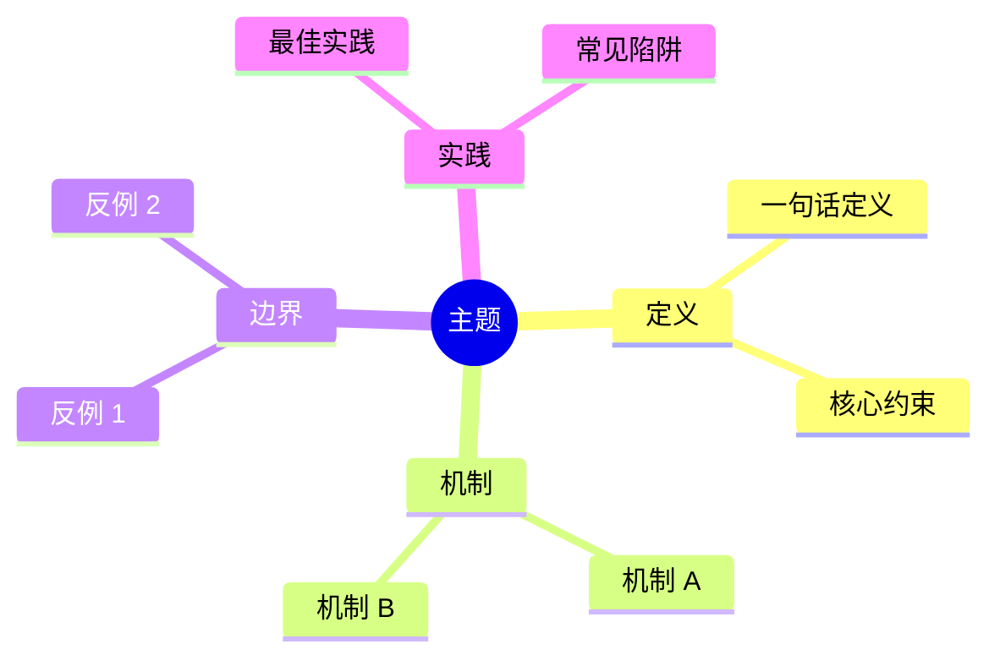

# 中文标题

> **EN**: English Title
> **Summary**: One-sentence English abstract stating the core semantic guarantee or problem.
>
> **Rust 版本**: 1.98.0+ (Edition 2024)
> **Bloom 层级**: Lx
> **权威来源**: 本文件为 `concept/` 权威页。
> **受众**: [初学者 / 进阶 / 专家 / 研究者]
> **内容分级**: [入门级 / 进阶级 / 专家级 / 综述级]
> **A/S/P 标记**: **S+A+P** — Structure + Application + Procedure
> **双维定位**: C×App
> **前置概念**: `概念A`（相对路径） · `概念B`（相对路径）
> **后置概念**: `概念C`（相对路径） · `概念D`（文件名）
> **定理链**: T-XXX [Tier 2] 前提 → T-YYY [Tier 2] 不变式 → T-ZZZ [Tier 3] 结论

---

## 1. 权威定义

一句话精确语义定义。紧接着列出核心约束/不变式。

| 约束 | 说明 |
|---|---|
| 不变式 1 | ... |
| 不变式 2 | ... |

---

## 2. 核心机制

### 2.1 子机制 A

解释 + 代码示例：

```rust
fn main() {
    // 自包含、可运行的 std-only 示例
}
```

### 2.2 子机制 B

关键推理步骤：

- 前提 ⟹ 不变式 ⟹ 结论

---

## 3. 工程实践

### 3.1 使用场景

### 3.2 最佳实践

### 3.3 常见陷阱

---

## 4. 反命题与边界分析

| 命题 | 真假 | 说明 |
|---|---|---|
| 命题 1 | ✅/❌ | 引用代码或定理 |
| 命题 2 | ✅/❌ | ... |

### 4.1 反例：故意编译失败

```rust,compile_fail
// 必须确实在当前稳定 Rust 下编译失败
// 期望错误：E0xxx
fn main() {
    // ...
}
```

**失败原因**：...

**正确写法**：...

---

## 5. 思维导图



---

## 6. 参考来源 / References

- **P0 官方**: [The Rust Reference — ...](https://doc.rust-lang.org/reference/...) · [RFC XXXX](https://rust-lang.github.io/rfcs/XXXX-...)
- **P1 学术**: [RustBelt: Securing the Foundations of Rust](https://plv.mpi-sws.org/rustbelt/popl18/) · [Paper DOI](...)
- **P2 生态**: [docs.rs](https://docs.rs/...) · [crates.io](https://crates.io/...)

---

## 7. 相关概念（双向链接）

- `概念A`（相对路径）
- `概念B`（相对路径）
