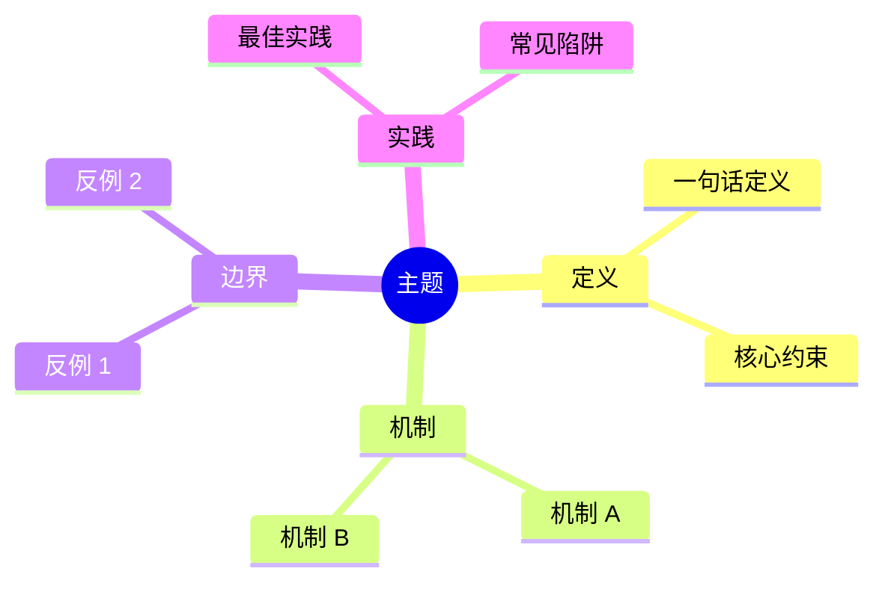

# {维度前缀}-NNN: 中文标题 (English Title)

> **维度**: Formal Theory / Language Design / Engineering & CloudNative / Technology Stack / Application Domains
> **级别**: S (16+ KB) / A / B   <!-- 按实测大小：S >16KB，A >8KB，其余 B -->
> **标签**: #tag1 #go127
> **Go 版本**: 1.27+
> **Bloom 层级**: Lx   <!-- L0 元层 … L7 未来/研究 -->
> **前置概念**: `[维度]/[LD|FT|EC|TS|AD]-0xx-…`（替换为真实相对链接） · **后置概念**: 同上
> **定理链**: Input → Operation → Output / Invariant

---

## 1. 权威定义

一句话精确语义定义。紧接着列出核心约束/不变式。

| 约束 | 说明 |
| --- | --- |
| 不变式 1 | ... |
| 不变式 2 | ... |

---

## 2. 核心机制

### 2.1 子机制 A

解释 + 可运行代码示例：

```go
package main

import "fmt"

func main() {
 // 自包含、可运行的示例（GOWORK=off go vet 可通过）
 fmt.Println("mechanism A")
}
```

### 2.2 子机制 B

关键推理步骤：

- 前提 ⟹ 不变式 ⟹ 结论

---

## 3. 工程实践

### 3.1 使用场景

### 3.2 最佳实践

### 3.3 常见陷阱

---

## 4. 反命题与边界分析

| 命题 | 真假 | 说明 |
| --- | --- | --- |
| 命题 1 | ✅/❌ | 引用代码或定理 |
| 命题 2 | ✅/❌ | ... |

### 4.1 反例：故意编译失败

```go
// 编译失败: <一句话原因>
package main

func main() {
 // ...
}
```

**期望编译器错误**：...

**失败原因**：...

**正确写法**：...

---

## 5. 思维导图



---

## 6. References

- **P0 官方**: [The Go Programming Language Specification](https://go.dev/ref/spec) · [pkg.go.dev 对应包文档](https://pkg.go.dev/...)
- **P1 学术**: [论文/形式化来源](https://...) · [经典教材]
- **P2 生态**: [Go Blog](https://go.dev/blog/...) · [知名 Go 项目](https://github.com/...)

---

## 7. 相关概念（双向链接）

- `[维度]/[前缀]-0xx-…`（替换为真实相对链接，且目标页应回链本页，保证双向可达）
