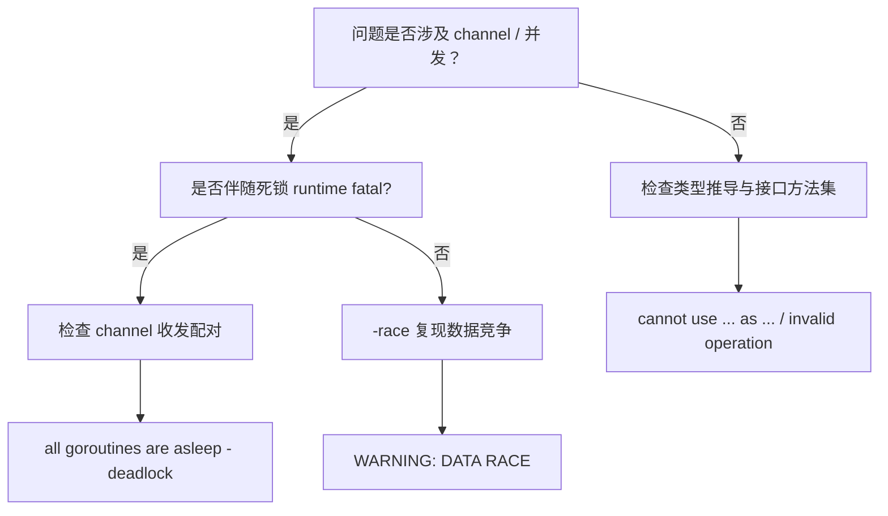

# 决策树模板

> **状态**: 可选扩展 — 本仓库 AGENTS.md 体系尚未启用该机制，从 rust-lang 项目适配保留以便未来复用；不进入质量门。
> **配套要求**：[`.kimi/kimi_thinking_representation_requirements.md`](../kimi_thinking_representation_requirements.md) §5
> **存放位置**：`go-knowledge-base/indices/knowledge_topology/decision_trees.yaml`
> **说明**：原模板基于「错误码 → 判定节点」的映射设计；Go 编译器无公开错误码体系，改写为「编译失败类别映射」。Go 编译器错误文本在版本间基本稳定，但不保证逐字一致，建议以 Go 1.27.1 工具链实测输出为准。

---

## YAML 格式

```yaml
trees:
  - id: J-EXAMPLE-01
    title: 示例判定树
    description: 判定某个编译失败 / 迁移问题的根因
    root: start
    nodes:
      start:
        type: decision
        text: 问题是否涉及 channel / 并发？
        yes: concurrency_branch
        no: type_branch
      concurrency_branch:
        type: decision
        text: 是否伴随 "all goroutines are asleep" 之类的死锁消息？
        yes: deadlock
        no: race_issue
      deadlock:
        type: action
        text: 检查 channel 收发配对与缓冲容量
        go_fail_categories: [fatal error: all goroutines are asleep - deadlock]
      race_issue:
        type: action
        text: 以 GOWORK=off go build -race ./... 复现，标记 data race
        go_fail_categories: [WARNING: DATA RACE, -race]
      type_branch:
        type: action
        text: 检查类型推导与接口方法集匹配
        go_fail_categories: [cannot use ..., as ..., invalid operation]
```

---

## Mermaid 可视化（嵌入权威页）



---

## 检查清单

- [ ] `id` 格式为 `J-XXX-NN` 或 `DF-XXX-NN` 或 `M-XXX-XXX`
- [ ] 每个 decision 节点有明确的 `yes`/`no` 分支
- [ ] 每个 action 节点关联 `go_fail_categories: [<编译失败类别描述>]`（用 Go 编译器/运行时错误文本或类别关键词描述，如 "declared and not used"、"cannot use ... as ..."、"conversions of … to … must be explicit"、"all goroutines are asleep - deadlock"）
- [ ] 引用的编译失败类别在 Go 1.27.1 工具链下实测可复现（`GOWORK=off go build ./...` / `go vet ./...` / `go build -race ./...`）
- [ ] 树无死端（dead_end = 0）
- [ ] 定量节点占比 ≥50%
