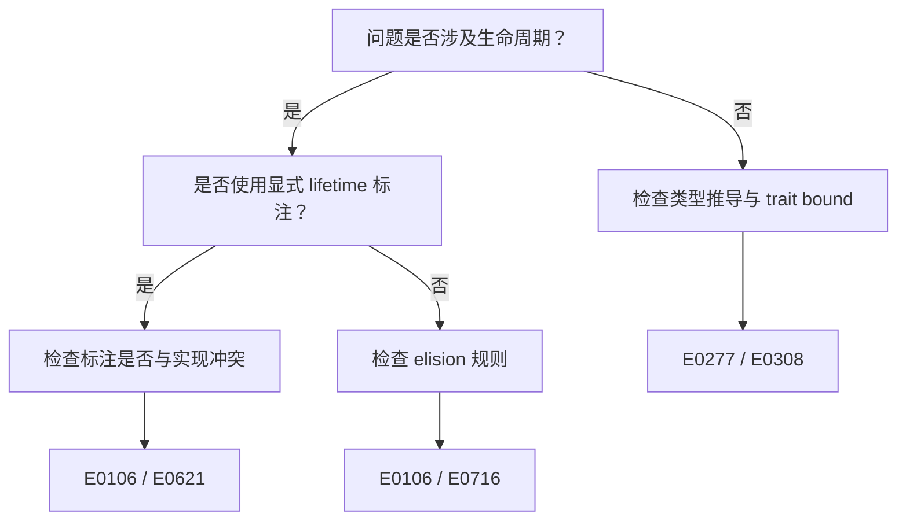

# 决策树模板

> **配套要求**：[`.kimi/kimi_thinking_representation_requirements.md`](../kimi_thinking_representation_requirements.md) §5
> **存放位置**：`concept/00_meta/knowledge_topology/decision_trees.yaml`

---

## YAML 格式

```yaml
trees:
  - id: J-EXAMPLE-01
    title: 示例判定树
    description: 判定某个编译错误/迁移问题的根因
    root: start
    nodes:
      start:
        type: decision
        text: 问题是否涉及生命周期？
        yes: lifetime_branch
        no: type_branch
      lifetime_branch:
        type: decision
        text: 是否使用了显式 lifetime 标注？
        yes: explicit_lifetime
        no: elision_issue
      explicit_lifetime:
        type: action
        text: 检查标注是否与实现冲突
        rustc_codes: [E0106, E0621]
      elision_issue:
        type: action
        text: 检查 elision 规则是否被违反
        rustc_codes: [E0106, E0716]
      type_branch:
        type: action
        text: 检查类型推导与 trait bound
        rustc_codes: [E0277, E0308]
```

---

## Mermaid 可视化（嵌入 concept 页）



---

## 检查清单

- [ ] `id` 格式为 `J-XXX-NN` 或 `DF-XXX-NN` 或 `M-XXX-XXX`
- [ ] 每个 decision 节点有明确的 `yes`/`no` 分支
- [ ] 每个 action 节点关联 `rustc_codes: [E0xxx]`
- [ ] 树无死端（dead_end = 0）
- [ ] 定量节点占比 ≥50%
