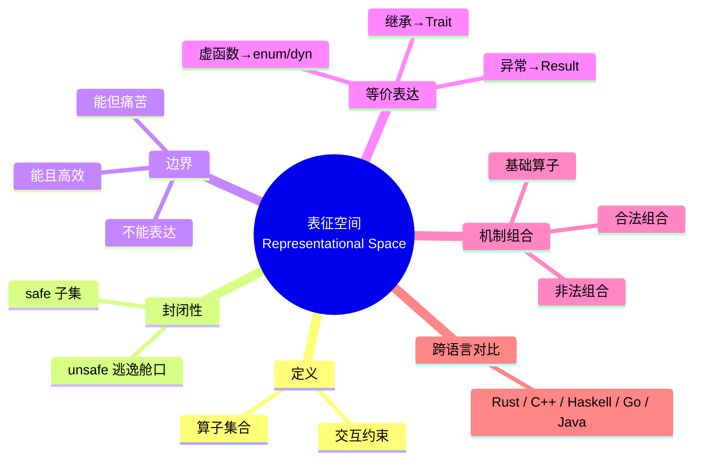
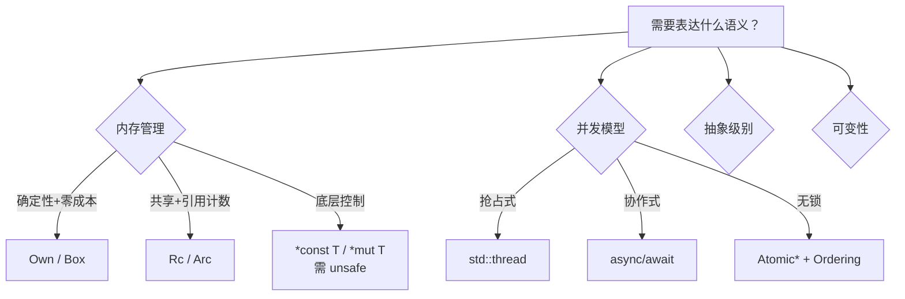
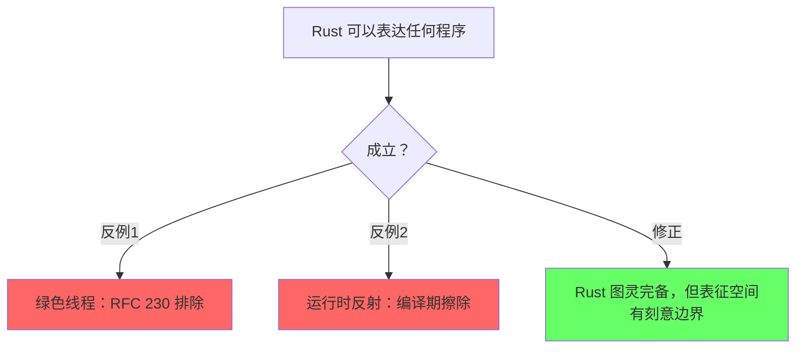
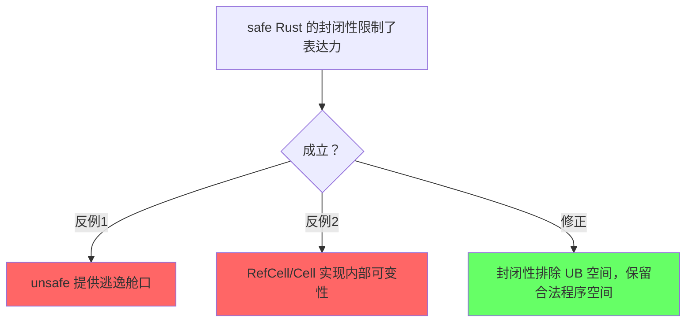
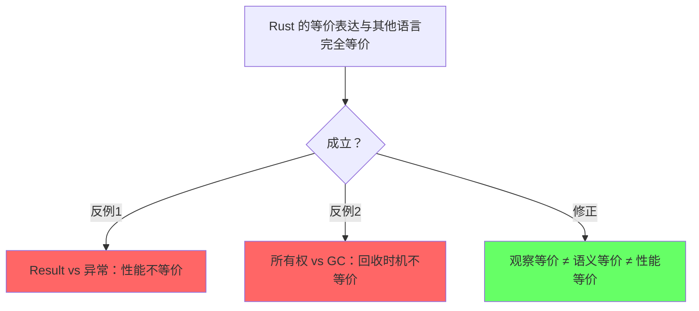

# 中文标题（如：Rust 表征空间总论）

> **EN**: English Title
> **Summary**: One-sentence abstract stating the representational-space scope, closure property, and key boundary claims.
>
> **Rust 版本**: 1.98.0+ (Edition 2024)
> **Bloom 层级**: L0-L1
> **权威来源**: 本文件为 `concept/` 权威页。
> **受众**: [进阶 / 专家 / 研究者]
> **内容分级**: [综述级]
> **A/S/P 标记**: **S+A**
> **双维定位**: Meta×Ana
> **前置概念**: [类型系统](../01_foundation/02_type_system/01_type_system.md) · [所有权](../01_foundation/01_ownership_borrow_lifetime/01_ownership.md)
> **后置概念**: [形式化语义](../04_formal/11_computational_models/README.md) · [跨语言对比](../05_comparative/01_systems_languages/01_rust_vs_cpp.md)
> **定理链**: 语义封闭性公理 → 借用检查规则 → 表达边界结论

---

## 〇、认知全景



> **认知功能**: 本 mindmap 给出全页结构概览，帮助读者建立「元层 → 机制 → 边界 → 对比」的全局坐标。

---

## 一、表征空间的定义

一句话精确语义：

> Rust 表征空间 = {类型系统, 所有权系统, 借用系统, 生命周期系统, Trait 系统, 泛型系统, 宏系统, unsafe 系统, async 系统} 在语法与类型约束下可组合出的全部程序构造集合。

### 1.1 组成算子

| 算子 | 符号 | 语义作用 | 来源 |
| --- | --- | --- | --- |
| 所有权 | `Own(T)` | affine 资源唯一控制 | Rust Reference §4 |
| 共享借用 | `Borrow(T, S)` | 多个只读引用 | Rust Reference §4.2 |
| 独占借用 | `Borrow(T, E)` | 单个读写引用 | Rust Reference §4.2 |
| 生命周期 | `Lifetime('a)` | 引用有效期限 | Rust Reference §10 |
| Trait | `Trait(B)` | 行为抽象与约束 | Rust Reference §8 |
| 泛型 | `Generic<T>` | 参数多态 | Rust Reference §6 |
| 宏 | `Macro(M)` | 语法扩展 | Rust Reference §3 |
| unsafe | `Unsafe(U)` | 手动保证不变量 | Rust Reference §19 |
| async | `Async(A)` | 协作式并发状态机 | RFC 2394 |

### 1.2 算子交互约束

```text
所有权 × 生命周期  → 借用规则
所有权 × Trait      → Drop / Send / Sync 推导
泛型 × Trait Bound  → 约束多态
unsafe × 借用      → 原始指针别名模型
async × Pin        → 自引用状态机安全
```

---

## 二、安全 Rust 的语义封闭性

### 2.1 封闭世界假设

- **公理**：所有权唯一性、借用规则、生命周期约束。
- **推理规则**：类型检查、借用检查、trait coherence。
- **封闭性**：safe 代码不能突破上述规则（除非通过 unsafe）。

### 2.2 逃逸舱口：unsafe

> unsafe 不是「关闭类型系统」，而是「将部分证明责任从编译器转移给程序员」。

```rust,ignore
// 示例：unsafe 块不会自动使 safe 代码变不安全，
// 但 SAFETY 注释必须说明为何手动条件成立。
unsafe { *raw_ptr }
```

---

## 三、能表达 vs 不能表达的边界

### 3.1 能且高效表达

| 概念 | Rust 表达 | 语义保持 | 成本 | 来源 |
| --- | --- | --- | --- | --- |
| 系统编程 | 所有权 + unsafe | 完全 | 零运行时 | Rust Reference |
| 零成本抽象 | 泛型 + 单态化 | 完全 | 编译时间 | TRPL Ch 10 |
| fearless 并发 | `Send/Sync` + 借用 | 完全 | 零运行时 | Rust Reference §13 |
| 确定性资源管理 | RAII + `Drop` | 完全（不排除泄漏） | 零运行时 | Rust Reference §11 |
| 编译期计算 | `const generics` + `const fn` | 部分 | 编译时间 | RFC 2000 |

### 3.2 能但痛苦表达

| 概念 | Rust 表达 | 痛点 | 替代/缓解 |
| --- | --- | --- | --- |
| GUI 开发 | 生命周期 + `Pin` | 自引用、回调冲突 | `Rc<RefCell>`、`Pin` |
| 动态类型 | `enum` 模拟 | 样板代码 | `dyn Any`（有限） |
| 运行时反射 | `Any::downcast` | 类型信息丢失 | 过程宏生成 |
| 复杂元编程 | 过程宏 | 调试困难、无类型信息 | `macro_rules!` + 约定 |
| 快速原型 | 编译时间 + 学习曲线 | 迭代慢 | `cargo script` |

### 3.3 不能表达（或故意排除）

| 概念 | 排除原因 | Rust 替代 | 历史证据 |
| --- | --- | --- | --- |
| 绿色线程 | FFI 成本、运行时依赖 | async/await + OS 线程 | RFC 230 |
| OOP 继承 | Orphan Rule、组合优于继承 | Trait + 组合 | 设计哲学 |
| 隐式转换 | 类型安全、意外行为 | 显式 `From`/`Into` | 设计哲学 |
| 异常控制流 | 隐藏控制流、非局部跳转 | `Result` + `?` | 设计哲学 |
| GC 自动回收 | 运行时开销、非确定性 | 所有权 + `Rc`/`Arc` | 设计哲学 |
| 运行时反射 | 编译期信息擦除 | 宏 + `Any` | 设计哲学 |
| 可变长度数组 (VLA) | 栈安全、类型系统简化 | `Vec<T>` | 设计哲学 |

---

## 四、等价表达的语义保持

### 4.1 等价谱系

```text
继承层次 ──→ Trait + 默认方法 + 组合
   │              ├─ 观察等价：多态替换
   │              └─ 性能等价：零运行时差异

异常控制流 ──→ Result<T, E> + ?
   │              ├─ 语义等价：错误路径显式化
   │              └─ 性能等价：无异常表开销

虚函数调用 ──→ enum + match  或  dyn Trait
   │              ├─ enum: 静态分发、零成本、封闭变体
   │              └─ dyn: 动态分发、vtable、开放扩展

GC 自动回收 ──→ 所有权 + Rc/Arc + Weak
   │              ├─ 语义等价：内存最终释放
   │              └─ 边界：循环引用需手动打破

模板元编程 ──→ const generics + 过程宏
   │              ├─ 语义等价：编译期计算
   │              └─ 边界：宏无类型信息
```

### 4.2 等价性判定标准

| 标准 | 含义 | Rust 示例 |
| --- | --- | --- |
| 观察等价 | 所有上下文中行为不可区分 | `Box<T>` vs `Unique<T>` |
| 语义等价 | 最终计算结果相同 | `dyn Trait` vs `impl Trait` |
| 性能等价 | 运行时开销相同 | 泛型单态化 vs 手写具体代码 |

---

## 五、机制组合的语义空间

### 5.1 基础算子

```text
Own(T)         — affine 所有权
Borrow(T, S)   — 共享借用
Borrow(T, E)   — 独占借用
Lifetime('a)   — 区域约束
Trait(B)       — 行为约束
Generic<T>     — 参数抽象
Const(N)       — 常量参数
```

### 5.2 合法组合

```text
Own(T) × Lifetime('a)       → Box<'a, T>
Borrow(T, S) × Lifetime('a) → &'a T
Borrow(T, E) × Lifetime('a) → &'a mut T
Own(T) × Trait(Drop)        → 确定性资源释放
Generic<T> × Trait(Bound)   → 约束多态
```

### 5.3 非法组合

```rust,compile_fail
// E0502: cannot borrow `x` as mutable because it is also borrowed as immutable
fn illegal_combo() {
    let mut x = 0;
    let r1 = &x;
    let r2 = &mut x; // ❌ E0502
    let _ = r1;
}
```

### 5.4 组合选择决策树



---

## 六、跨语言表征空间对比

### 6.1 五维以上对比矩阵

| 维度 | Rust | C++ | Haskell | Go | Java |
| --- | --- | --- | --- | --- | --- |
| 表征空间边界 | 编译器强制 | 程序员自律 | 类型系统 | GC 简化 | VM 抽象 |
| 封闭性 | safe 封闭，unsafe 逃逸 | 完全开放 | 纯函数封闭，IO 逃逸 | 运行时封闭 | 类型封闭 |
| 表达力等价 | 与 C++ 等价 | 基准 | 与 Rust 等价 | 与 Rust 等价 | 与 Rust 等价 |
| 有效表达差异 | 零成本安全 | 零成本但不安全 | 安全但有 GC | 简单但不零成本 | 安全但有 VM |
| 不能表达 | GC、继承、异常 | 无语言级强制安全边界 | 无 GC 的系统编程 | 零成本抽象 | 无 VM 的系统编程 |
| 错误捕获时机 | 编译期 | 编译期 + 运行时 | 编译期 | 编译期 + 运行时 | 运行时为主 |

### 6.2 包含关系

```text
C++ ⊃ Rust ⊃ safe Rust
  │       │
  │       └─ unsafe Rust 扩展 safe Rust，但破坏封闭性
  │
  └─ C++ 表征空间最宽，但零封闭性保证
```

---

## 七、认知路径

1. 什么是表征空间？（设计空间 / 算子集合）
2. Rust 的表征空间为什么是这样？（历史决策：RFC 230、borrow checker）
3. 能表达与不能表达的边界在哪？（编译器作为守门人）
4. 等价表达如何选择？（`enum` vs `dyn Trait` 决策树）
5. 机制组合受什么约束？（类型系统代数规则）
6. 表征空间如何扩展？（`const generics`、`GATs`、未来特性）

---

## 八、反命题与边界分析

### 8.1 "Rust 可以表达任何程序"



### 8.2 "safe Rust 的封闭性限制了表达力"



### 8.3 "Rust 的等价表达与其他语言完全等价"



---

## 九、定理一致性矩阵

| 断言 | 前提 ⟹ 结论 | 反例/边界条件 | 典型场景 | 失效条件 |
| --- | --- | --- | --- | --- |
| Safe Rust 语义封闭 | 借用检查 + 类型系统 ⟹ 无 UB | unsafe 块、FFI | 日常开发 | unsafe 比例过高 |
| 所有权保证确定性析构 | 唯一 owner + 作用域结束 ⟹ Drop 调用 | `mem::forget`、`Rc` 循环 | RAII | 故意跳过 Drop |
| 借用规则保证无数据竞争 | `&T` 共享 / `&mut T` 独占 ⟹ 无同时读写 | `UnsafeCell`、unsafe impl | 并发编程 | unsafe 突破 |
| 泛型单态化保持语义 | 编译期展开 ⟹ 等价手写代码 | `dyn Trait` 打破单态化 | 零成本抽象 | 过度泛化 |

---

## 十、来源与可信度

| 论断 | 来源 | 可信度 |
| --- | --- | --- |
| 表征空间定义 | Felleisen 1991 | ✅ 学术经典 |
| Rust 类型系统图灵完备 | Leffler 2017 | ✅ 技术证明 |
| 观察等价性 | Reynolds 1983 | ✅ 学术经典 |
| 安全/unsafe 边界 | Rust Reference — Unsafe Rust | ✅ 官方文档 |
| 绿色线程移除 | RFC 230 | ✅ 官方决策 |

---

## 十一、演进方向

- [ ] 补充新稳定特性（如 effects system、const trait）对表征空间的影响。
- [ ] 将边界案例下沉到对应形式化子页（并发模型、算法语义、系统语义）。
- [ ] 保持与 `concept/00_meta/kg_data_v3.json` 的 KG 实体同步。

---

> **文档版本**: 1.0.0
> **最后更新**: 2026-09-06
> **状态**: 模板骨架
