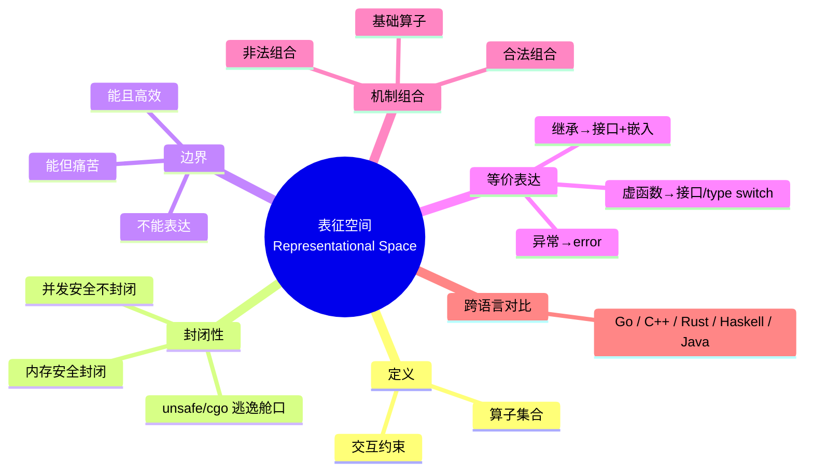
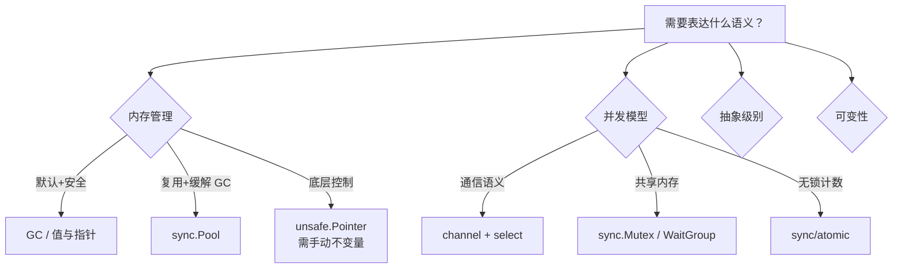
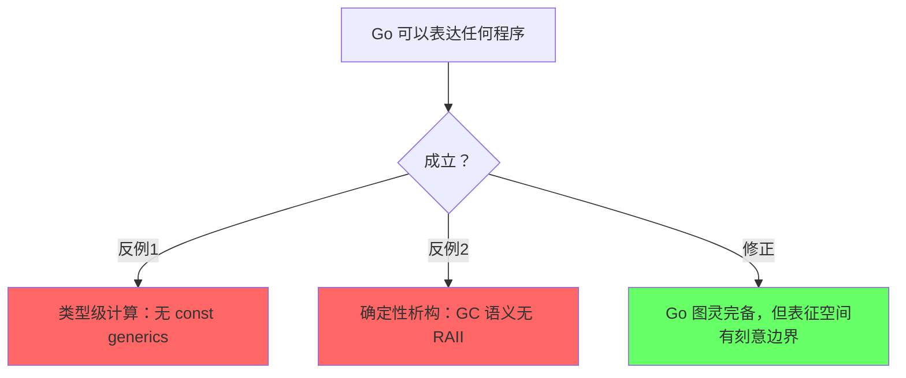
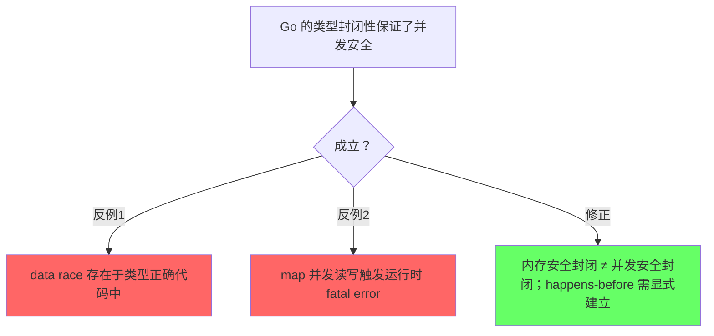
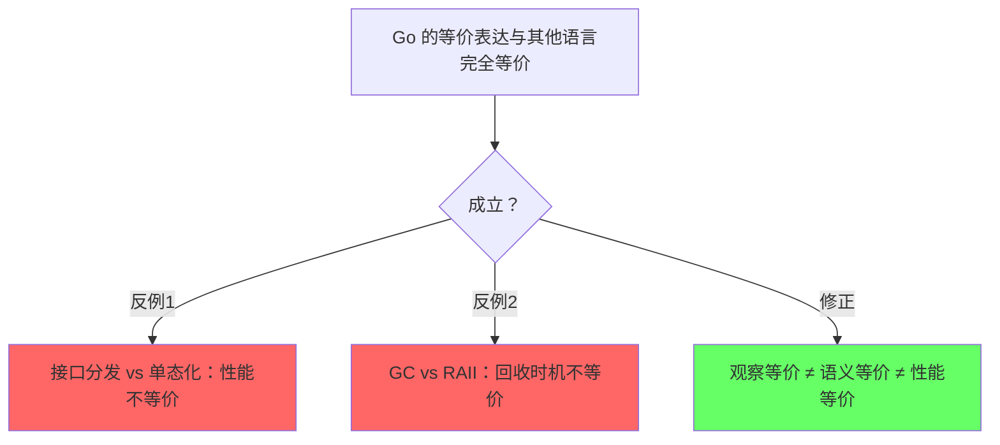

# 中文标题（如：Go 表征空间总论）

> **状态**: 可选扩展 — 本仓库 AGENTS.md 体系尚未启用该机制，从 rust-lang 项目适配保留以便未来复用；不进入质量门。
>
> **EN**: Go Representational Space Overview
> **Summary**: One-sentence abstract stating the representational-space scope, closure property, and key boundary claims.
> **Go 版本**: 1.27+（以 Go 1.27.1 工具链验证为基线）
> **Bloom 层级**: L0-L1
> **维度**: Learning Path / Meta（路径层元页；若升格为权威页需登记 `go-knowledge-base/indices/`）
> **受众**: [进阶 / 专家 / 研究者]
> **内容分级**: [综述级]
> **A/S/P 标记**: **S+A**
> **双维定位**: Meta×Ana
> **前置概念**: 类型系统（`../02-Language-Design/LD-0xx-…`，真实相对链接） · 内存模型与 happens-before（同上）
> **后置概念**: 跨语言对比（`../05-Application-Domains/AD-0xx-…`，真实相对链接） · 前沿提案跟踪（`../../docs/tracking/`，真实相对链接）
> **定理链**: 内存安全公理 → happens-before 规则 → 表达边界结论

---

## 〇、认知全景



> **认知功能**: 本 mindmap 给出全页结构概览，帮助读者建立「元层 → 机制 → 边界 → 对比」的全局坐标。

---

## 一、表征空间的定义

一句话精确语义：

> Go 表征空间 = {类型系统, 接口系统（方法集/嵌入）, 泛型系统, GC/逃逸分析, channel 与 happens-before, sync 原语, unsafe/cgo, go:generate, context} 在语法与类型约束下可组合出的全部程序构造集合。

### 1.1 组成算子

| 算子 | 符号 | 语义作用 | 来源 |
| --- | --- | --- | --- |
| 类型系统 | `Type(T)` | 命名类型、底层类型、赋值兼容 | [Go 语言规范 §Types](https://go.dev/ref/spec#Types) |
| 接口 | `Iface(I)` | 方法集定义、动态分发 | [Go 语言规范 §Interface types](https://go.dev/ref/spec#Interface_types) |
| 类型嵌入 | `Embed(E)` | 方法提升、组合式复用 | Go 语言规范 §Struct types |
| 泛型 | `Generic[T C]` | 参数多态（stenciling + GCShape） | [Go 泛型设计文档](https://go.googlesource.com/proposal/+/refs/heads/master/design/64520-structured-logging.md) 同级 proposal 体系 |
| GC/逃逸分析 | `Heap(T)` | 自动回收、堆/栈分配决策 | [Go 内存模型](https://go.dev/ref/mem) + GC 指南 |
| channel | `Chan(T, dir)` | 通信与 happens-before 建立 | Go 语言规范 §Channel types |
| sync 原语 | `Sync(M)` | 互斥、条件、等待组 | pkg.go.dev/sync |
| unsafe/cgo | `Unsafe(U)` | 手动保证不变量、FFI | cmd/cgo 文档 + unsafe 包文档 |
| go:generate | `Gen(G)` | 编译期代码生成 | `go generate` 文档 |

### 1.2 算子交互约束

```text
接口 × 类型嵌入   → 方法集代数（提升与遮蔽规则）
泛型 × 接口约束   → 类型参数约束求解
channel × select  → 非确定性接收 / happens-before 组合
GC × 逃逸分析     → 分配位置（栈 vs 堆）静态决策
unsafe × cgo      → 指针传递规则（cgo 检查）
context × goroutine → 取消与超时传播
```

---

## 二、Go 的语义封闭性：双层结构

### 2.1 封闭世界假设（内存安全层）

- **公理**：赋值兼容规则、接口方法集、nil 值行为、GC 指针安全（无悬挂指针）。
- **推理规则**：类型检查、方法集解析、逃逸分析。
- **封闭性**：类型正确的 Go 代码无 C 式未定义行为（除非经由 unsafe）。

### 2.2 不封闭的一层：并发安全

> Go 编译器**不**保证无数据竞争：data race 可以存在于完全类型正确的程序中。并发正确性依赖程序员通过 channel / `sync` 原语显式建立 happens-before 关系（见 [Go 内存模型](https://go.dev/ref/mem)）。这与所有权类语言「类型系统强制并发安全」形成根本分野。

### 2.3 逃逸舱口：unsafe 与 cgo

> unsafe 不是「关闭类型系统」，而是「将部分证明责任从编译器转移给程序员」；cgo 进一步引入调用边界成本与指针传递规则。

```go
// 不可编译: 依赖 unsafe 不变量，需配合完整可验证示例使用；
// 不变量责任已由编译器转移给程序员。
package main

import "unsafe"

func main() {
	var x int = 42
	p := unsafe.Pointer(&x)
	_ = *(*int)(p) // 边界检查被绕过；指针算术与对象存活期需手动保证
}
```

---

## 三、能表达 vs 不能表达的边界

### 3.1 能且高效表达

| 概念 | Go 表达 | 语义保持 | 成本 | 来源 |
| --- | --- | --- | --- | --- |
| 系统编程 | Go + unsafe.Pointer/cgo | 完全 | 边界检查可优化 | cmd/cgo 文档 |
| 并发编程 | goroutine + channel | 完全 | 调度器运行时成本 | Go 内存模型 |
| 内存安全 | GC + 逃逸分析 | 完全 | GC 停顿（亚毫秒级） | GC 指南（P2） |
| 零成本倾向抽象 | 内联 + 逃逸分析 + 常量折叠 | 完全 | 编译时间 | Go 编译器文档 |
| 编译期常量 | `const` + `iota` | 完全 | 无运行时 | Go 语言规范 §Constants |

### 3.2 能但痛苦表达

| 概念 | Go 表达 | 痛点 | 替代/缓解 |
| --- | --- | --- | --- |
| 无 GC 内存控制 | arena（实验）/ unsafe 手动管理 | 存活期手动跟踪、无类型系统支持 | `sync.Pool`、对象复用 |
| 泛型元编程 | `reflect` + `go:generate` | 反射丢失编译期检查、生成代码调试困难 | 代码生成 + 约定 |
| 函数式范式 | 高阶函数 + 闭包 | 无不可变数据结构内建支持、GC 压力 | 约定 + lint |
| 复杂继承层次 | 接口 + 多层嵌入 | 方法集遮蔽规则隐晦、菱形问题手动解决 | 扁平组合 |
| GUI / 自引用结构 | 指针 + 回调 + goroutine | 存活期与泄漏管理、无语言级自引用支持 | `runtime.SetFinalizer`（非确定） |

### 3.3 不能表达（或故意排除）

| 概念 | 排除原因 | Go 替代 | 历史证据 |
| --- | --- | --- | --- |
| 类型级计算 | 泛型刻意非图灵完备 | `go:generate` + `reflect` | 泛型设计文档 |
| const generics（类型形状依赖常量值） | 同上 | 生成 N 份具体类型 | 泛型设计文档 |
| 确定性析构（RAII） | GC 语义，finalizer 非确定 | `defer` + 显式 `Close()` | Go FAQ |
| 运算符重载 | 可读性设计哲学 | 显式方法（`Add` 等） | Go FAQ |
| 默认参数 / 函数重载 | API 简化哲学 | 变参、函数选项模式 | Go FAQ |
| 宏（文本替换级） | 以 go:generate 替代编译期宏 | `go:generate` + 生成工具 | go generate 文档 |

---

## 四、等价表达的语义保持

### 4.1 等价谱系

```text
类继承层次 ──→ 接口 + 默认方法 + 类型嵌入
   │              ├─ 观察等价：多态替换（方法集层面）
   │              └─ 性能等价：动态分发成本一致

异常控制流 ──→ error 返回值 + errors.Is/As + defer
   │              ├─ 语义等价：错误路径显式化
   │              └─ 性能等价：无异常表开销，纯值返回

虚函数调用 ──→ type switch  或  接口动态分发
   │              ├─ type switch: 静态分支、封闭变体、可内联
   │              └─ 接口: 动态分发、开放扩展、阻断部分内联

手动内存管理 ──→ GC + sync.Pool + arena（实验）+ finalizer
   │              ├─ 语义等价：内存最终释放（除循环引用，Go GC 可回收循环）
   │              └─ 边界：finalizer 时机非确定；arena 为实验特性

模板元编程 ──→ 泛型 stenciling + go:generate + reflect
   │              ├─ 语义等价：编译期展开的等价具体代码
   │              └─ 边界：reflect 无类型检查、generate 脱离编译器
```

### 4.2 等价性判定标准

| 标准 | 含义 | Go 示例 |
| --- | --- | --- |
| 观察等价 | 所有上下文中行为不可区分 | 值接收者 vs 指针接收者（不可变值类型） |
| 语义等价 | 最终计算结果相同 | type switch vs 接口分发 |
| 性能等价 | 运行时开销相同 | 泛型实例化 vs 手写具体类型 |

---

## 五、机制组合的语义空间

### 5.1 基础算子

```text
Type(T)          — 命名类型与底层类型
Iface(I)         — 方法集抽象
Embed(E)         — 组合与提升
Generic[T C]     — 参数抽象
Chan(T, dir)     — 通信与同步
Sync(M)          — 互斥与等待
Unsafe(U)        — 逃逸舱口
```

### 5.2 合法组合

```text
Generic[T C] × Iface(I)     → 约束类型参数（comparable 等）
Chan(T) × select            → 多路复用与超时
Embed(E) × Iface(I)         → 接口嵌入（io.ReadWriter）
Sync(M) × defer             → 锁的确定性释放
Unsafe(U) × cgo             → FFI 边界（受 cgo 指针规则约束）
```

### 5.3 非法组合

```go
// 编译失败: invalid operation: s1 == s2 (slice can only be compared to nil)
func illegalCombo() {
	s1 := []int{1}
	s2 := []int{1}
	_ = s1 == s2 // 切片不可比较；语义上需用 slices.Equal
}
```

```go
// 编译失败: invalid operation: cannot receive from send-only channel
func illegalSendRecv(ch chan<- int) {
	_ = <-ch // 方向已约束为仅发送
}
```

```go
// 编译失败: non-constant array bound n
func illegalGenericArray[T any](n int) {
	_ = make([]int, n)     // 合法：切片长度可为运行时值
	_ = new([n]int)        // 非法：数组长度必须为常量（无 const generics）
}
```

### 5.4 组合选择决策树



---

## 六、跨语言表征空间对比

### 6.1 五维以上对比矩阵

| 维度 | Go | C++ | Rust | Haskell | Java |
| --- | --- | --- | --- | --- | --- |
| 表征空间边界 | 编译器内存安全，并发靠纪律 | 程序员自律 | 编译器强制内存+并发 | 类型系统 | VM 抽象 |
| 封闭性 | 内存安全封闭，并发不封闭 | 完全开放 | safe 封闭，unsafe 逃逸 | 纯函数封闭，IO 逃逸 | 类型封闭 |
| 表达力等价 | 图灵完备 | 基准 | 图灵完备 | 图灵完备 | 图灵完备 |
| 有效表达差异 | GC 简单模型 | 零成本但不安全 | 零成本安全 | 安全但有 GC/惰性 | 安全但有 VM |
| 不能表达 | 类型级计算、RAII、宏 | 语言级安全边界 | GC、继承、异常 | 无 GC 的系统编程 | 值类型控制 |
| 错误捕获时机 | 编译期 + 运行时（race） | 编译期 + 运行时 | 编译期为主 | 编译期 | 运行时为主 |
| 内存安全保证 | GC + 逃逸分析 + unsafe 边界 | 无保证 | 所有权 + 借用检查 | GC | GC |

### 6.2 包含关系

```text
表达力（图灵完备性）: C++ ≈ Go ≈ Rust ≈ Haskell ≈ Java
内存安全封闭性:      Rust > Go ≈ Java > Haskell > C++
并发安全封闭性:      Rust > Java（监视器） > Go（纪律+工具） > C++ ≈ Haskell
```

---

## 七、认知路径

1. 什么是表征空间？（设计空间 / 算子集合）
2. Go 的表征空间为什么是这样？（历史决策：少即是多、GC 缺省、go:generate 替代宏）
3. 能表达与不能表达的边界在哪？（编译器管内存安全，不管数据竞争）
4. 等价表达如何选择？（type switch vs 接口分发决策树）
5. 机制组合受什么约束？（方法集代数、channel 方向、数组常量边界）
6. 表征空间如何扩展？（arena、泛型演进、前沿提案跟踪）

---

## 八、反命题与边界分析

### 8.1 "Go 可以表达任何程序"



### 8.2 "Go 的类型封闭性保证了并发安全"



### 8.3 "Go 的等价表达与其他语言完全等价"



---

## 九、定理一致性矩阵

| 断言 | 前提 ⟹ 结论 | 反例/边界条件 | 典型场景 | 失效条件 |
| --- | --- | --- | --- | --- |
| Go 内存安全封闭 | 类型正确 + 无 unsafe ⟹ 无悬挂指针 | unsafe.Pointer、cgo | 日常开发 | 误用 unsafe |
| channel 建立 happens-before | 发送先于对应接收完成 ⟹ 写操作对接收方可见 | 无缓冲/有缓冲方向混用 | goroutine 通信 | select 随机分支破坏预期顺序 |
| 接口方法集封闭 | 值实现方法集 = 值接收者方法 | 指针接收者方法不在值方法集中 | 接口赋值 | 取址后误传值 |
| GC 回收循环引用 | 可达性归零 ⟹ 循环引用可回收 | finalizer 复活对象 | 图结构 | KeepAlive 缺失提前回收 |
| 逃逸分析决定分配 | 局部变量无外部引用 ⟹ 栈分配 | 取址逃逸、接口装箱 | 热路径 | 误传指针导致堆逃逸 |
| defer LIFO 释放 | 多个 defer ⟹ 逆序执行 | 循环内 defer 累积到函数结束 | 锁/文件释放 | defer 在循环内误用 |
| race detector 近似完备 | 常规调度下 ⟹ 可检出实际竞争 | 罕见交错、汇编路径 | CI 检测 | 未开启 -race 的运行时 |

---

## 十、来源与可信度

| 论断 | 来源 | 可信度 |
| --- | --- | --- |
| 表征空间定义 | Felleisen 1991 | ✅ 学术经典 |
| Go 泛型非图灵完备 | [Go 泛型设计文档](https://go.googlesource.com/proposal/) | ✅ 官方设计 |
| 观察等价性 | Reynolds 1983 | ✅ 学术经典 |
| 内存/并发安全边界 | [Go 语言规范](https://go.dev/ref/spec) + [Go 内存模型](https://go.dev/ref/mem) | ✅ 官方文档 |
| GC 语义与 finalizer | [Go GC 指南](https://go.dev/doc/gc-guide) | ✅ 官方文档 |

---

## 十一、演进方向

- [ ] 补充新稳定特性（如 arena 转正、泛型演进）对表征空间的影响。
- [ ] 将边界案例下沉到对应五维权威子页（并发模型、内存模型、泛型）。
- [ ] 保持与 KG 数据（语义谓词图谱）的实体同步。

---

> **文档版本**: 1.0.0
> **最后更新**: 2026-09-06
> **状态**: 模板骨架（可选扩展，未进入质量门）
