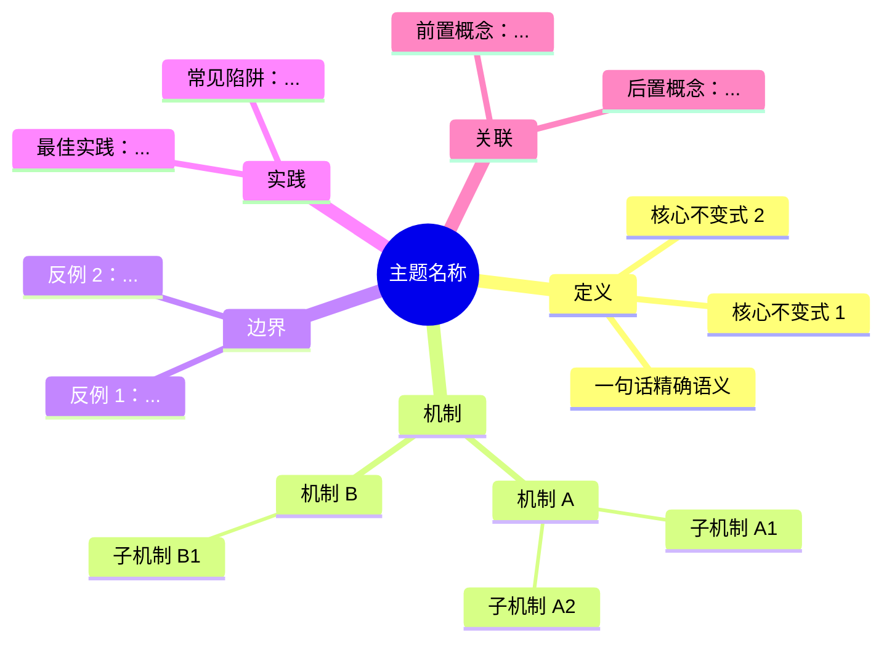

# Mindmap 模板

> **配套要求**：[`.kimi/kimi_thinking_representation_requirements.md`](../kimi_thinking_representation_requirements.md) §2

将以下内容嵌入 `concept/` 权威页，通常放在第 1.5 节或第 5 节。

---

## 检查清单

- [ ] root 节点为概念名称
- [ ] 至少 5 个一级分支（定义、机制、边界、实践、关联）
- [ ] 每个一级分支下至少 2 个二级节点
- [ ] 节点为名词/短语，非完整句子
- [ ] 与正文章节结构一致
