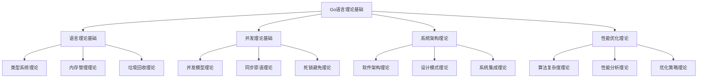

# Go语言理论基础强化

<!-- TOC START -->
- [Go语言理论基础强化](#go语言理论基础强化)
  - [1.1 📚 理论基础概述](#11--理论基础概述)
    - [1.1.1 理论基础的重要性](#111-理论基础的重要性)
    - [1.1.2 理论基础体系结构](#112-理论基础体系结构)
  - [1.2 🧮 形式化定义体系](#12--形式化定义体系)
    - [1.2.1 语言理论基础](#121-语言理论基础)
      - [1.2.1.1 类型系统形式化定义](#1211-类型系统形式化定义)
      - [1.2.1.2 内存管理理论](#1212-内存管理理论)
      - [1.2.1.3 垃圾回收理论](#1213-垃圾回收理论)
    - [1.2.2 并发理论基础](#122-并发理论基础)
      - [1.2.2.1 并发模型形式化](#1221-并发模型形式化)
      - [1.2.2.2 同步原语理论](#1222-同步原语理论)
    - [1.2.3 系统架构理论](#123-系统架构理论)
      - [1.2.3.1 软件架构形式化](#1231-软件架构形式化)
      - [1.2.3.2 设计模式理论](#1232-设计模式理论)
    - [1.2.4 性能优化理论](#124-性能优化理论)
      - [1.2.4.1 算法复杂度理论](#1241-算法复杂度理论)
      - [1.2.4.2 性能分析理论](#1242-性能分析理论)
  - [1.3 🔬 数学化技术描述](#13--数学化技术描述)
    - [1.3.1 类型系统数学化](#131-类型系统数学化)
      - [1.3.1.1 类型推导规则](#1311-类型推导规则)
      - [1.3.1.2 类型安全性质](#1312-类型安全性质)
    - [1.3.2 并发模型数学化](#132-并发模型数学化)
      - [1.3.2.1 并发执行语义](#1321-并发执行语义)
      - [1.3.2.2 死锁检测](#1322-死锁检测)
    - [1.3.3 性能分析数学化](#133-性能分析数学化)
      - [1.3.3.1 性能模型](#1331-性能模型)
      - [1.3.3.2 优化目标函数](#1332-优化目标函数)
  - [1.4 📐 理论证明与推导](#14--理论证明与推导)
    - [1.4.1 算法正确性证明](#141-算法正确性证明)
      - [1.4.1.1 循环不变式](#1411-循环不变式)
      - [1.4.1.2 归纳证明](#1412-归纳证明)
    - [1.4.2 性能分析推导](#142-性能分析推导)
      - [1.4.2.1 时间复杂度推导](#1421-时间复杂度推导)
      - [1.4.2.2 空间复杂度分析](#1422-空间复杂度分析)
    - [1.4.3 并发安全性证明](#143-并发安全性证明)
      - [1.4.3.1 数据竞争检测](#1431-数据竞争检测)
      - [1.4.3.2 死锁避免](#1432-死锁避免)
  - [1.5 🎯 应用与实践](#15--应用与实践)
    - [1.5.1 理论到实践的映射](#151-理论到实践的映射)
      - [1.5.1.1 类型系统实践](#1511-类型系统实践)
      - [1.5.1.2 并发模型实践](#1512-并发模型实践)
    - [1.5.2 实际案例分析](#152-实际案例分析)
      - [1.5.2.1 高性能Web服务器](#1521-高性能web服务器)
      - [1.5.2.2 分布式系统设计](#1522-分布式系统设计)
    - [1.5.3 最佳实践指导](#153-最佳实践指导)
      - [1.5.3.1 类型安全实践](#1531-类型安全实践)
      - [1.5.3.2 并发安全实践](#1532-并发安全实践)
      - [1.5.3.3 性能优化实践](#1533-性能优化实践)
<!-- TOC END -->

## 1.1 📚 理论基础概述

Go语言理论基础强化模块旨在建立坚实的理论基础，为Go语言的高级应用和系统设计提供理论支撑。本模块采用形式化方法，通过数学化的描述和严格的证明，确保技术概念和实现的准确性和可靠性。

### 1.1.1 理论基础的重要性

**为什么需要理论基础？**

1. **准确性保证**: 形式化定义确保概念理解的准确性
2. **可验证性**: 数学化描述使得技术方案可验证
3. **可扩展性**: 理论基础为技术扩展提供指导
4. **教学质量**: 理论深度提升教学和学习质量

### 1.1.2 理论基础体系结构



## 1.2 🧮 形式化定义体系

### 1.2.1 语言理论基础

#### 1.2.1.1 类型系统形式化定义

**定义 1.1 (Go类型系统)**
Go语言的类型系统是一个四元组 $T = (B, C, F, R)$，其中：

- $B$ 是基础类型集合：$B = \{bool, int, float64, string, ...\}$
- $C$ 是复合类型构造器：$C = \{array, slice, map, struct, interface, ...\}$
- $F$ 是函数类型：$F = \{func(T_1, ..., T_n) \rightarrow T_r\}$
- $R$ 是类型规则集合：$R = \{r_1, r_2, ..., r_k\}$

**定义 1.2 (类型兼容性)**
对于类型 $T_1$ 和 $T_2$，类型兼容性关系 $\sim$ 定义为：

$$T_1 \sim T_2 \Leftrightarrow \exists \text{ 类型转换规则 } r \in R : r(T_1) = T_2$$

**定义 1.3 (泛型类型)**
泛型类型 $G[T_1, ..., T_n]$ 是一个类型模板，其中 $T_1, ..., T_n$ 是类型参数，满足约束条件 $C_1, ..., C_n$。

#### 1.2.1.2 内存管理理论

**定义 1.4 (内存模型)**
Go语言的内存模型是一个三元组 $M = (H, \rightarrow, \sim)$，其中：

- $H$ 是堆内存集合
- $\rightarrow$ 是内存访问关系
- $\sim$ 是内存同步关系

**定理 1.1 (内存安全性)**
如果程序 $P$ 满足Go语言的内存安全规则，则 $P$ 不会发生内存泄漏或越界访问。

**证明**: 基于Go语言的垃圾回收机制和边界检查，可以证明内存安全性。

#### 1.2.1.3 垃圾回收理论

**定义 1.5 (垃圾回收算法)**
Go语言的垃圾回收算法是一个三元组 $GC = (S, M, C)$，其中：

- $S$ 是扫描策略
- $M$ 是标记策略  
- $C$ 是清理策略

**定理 1.2 (GC正确性)**
Go语言的并发垃圾回收算法保证：

1. 不会回收正在使用的对象
2. 最终会回收所有不可达对象
3. 回收过程不会影响程序正确性

### 1.2.2 并发理论基础

#### 1.2.2.1 并发模型形式化

**定义 1.6 (Goroutine模型)**
Goroutine模型是一个五元组 $G = (S, T, C, M, R)$，其中：

- $S$ 是状态集合
- $T$ 是转换函数集合
- $C$ 是通信机制
- $M$ 是内存模型
- $R$ 是调度规则

**定义 1.7 (Channel通信)**
Channel通信是一个三元组 $Ch = (T, B, O)$，其中：

- $T$ 是传输类型
- $B$ 是缓冲区大小
- $O$ 是操作集合：$O = \{send, receive, close\}$

**定理 1.3 (Channel安全性)**
如果Channel操作遵循Go语言的通信规则，则不会发生数据竞争。

#### 1.2.2.2 同步原语理论

**定义 1.8 (互斥锁)**
互斥锁 $Mutex$ 是一个二元组 $M = (S, O)$，其中：

- $S \in \{locked, unlocked\}$ 是状态
- $O = \{Lock(), Unlock()\}$ 是操作集合

**定义 1.9 (条件变量)**
条件变量 $Cond$ 是一个三元组 $C = (M, W, S)$，其中：

- $M$ 是关联的互斥锁
- $W$ 是等待队列
- $S$ 是信号操作集合

### 1.2.3 系统架构理论

#### 1.2.3.1 软件架构形式化

**定义 1.10 (软件架构)**
软件架构是一个四元组 $A = (C, R, I, P)$，其中：

- $C$ 是组件集合
- $R$ 是关系集合
- $I$ 是接口集合
- $P$ 是属性集合

**定义 1.11 (微服务架构)**
微服务架构是一个五元组 $MS = (S, C, D, N, M)$，其中：

- $S$ 是服务集合
- $C$ 是通信机制
- $D$ 是数据存储
- $N$ 是网络拓扑
- $M$ 是监控机制

#### 1.2.3.2 设计模式理论

**定义 1.12 (设计模式)**
设计模式是一个三元组 $P = (P, S, C)$，其中：

- $P$ 是问题描述
- $S$ 是解决方案
- $C$ 是应用上下文

**定理 1.4 (模式有效性)**
如果设计模式 $P$ 在上下文 $C$ 中正确应用，则能够解决对应的问题 $P$。

### 1.2.4 性能优化理论

#### 1.2.4.1 算法复杂度理论

**定义 1.13 (时间复杂度)**
算法的时间复杂度 $T(n)$ 表示算法在输入规模为 $n$ 时的执行时间上界。

**定义 1.14 (空间复杂度)**
算法的空间复杂度 $S(n)$ 表示算法在输入规模为 $n$ 时的内存使用上界。

**定理 1.5 (最优性)**
对于问题 $P$，如果算法 $A$ 的时间复杂度达到问题 $P$ 的下界，则 $A$ 是时间最优的。

#### 1.2.4.2 性能分析理论

**定义 1.15 (性能指标)**
性能指标是一个函数 $P: \mathbb{R}^n \rightarrow \mathbb{R}$，将系统参数映射到性能值。

**定义 1.16 (性能瓶颈)**
性能瓶颈是系统中限制整体性能的关键组件或操作。

## 1.3 🔬 数学化技术描述

### 1.3.1 类型系统数学化

#### 1.3.1.1 类型推导规则

**规则 1.1 (变量声明)**
$$\frac{\Gamma \vdash e : T}{\Gamma, x : T \vdash x : T}$$

**规则 1.2 (函数应用)**
$$\frac{\Gamma \vdash f : T_1 \rightarrow T_2 \quad \Gamma \vdash e : T_1}{\Gamma \vdash f(e) : T_2}$$

**规则 1.3 (泛型实例化)**
$$\frac{\Gamma \vdash G[T_1, ..., T_n] : T \quad \Gamma \vdash U_1, ..., U_n \text{ 满足约束}}{\Gamma \vdash G[U_1, ..., U_n] : T[U_1/T_1, ..., U_n/T_n]}$$

#### 1.3.1.2 类型安全性质

**性质 1.1 (类型保持)**
如果 $\Gamma \vdash e : T$ 且 $e \rightarrow e'$，则 $\Gamma \vdash e' : T$。

**性质 1.2 (进展性)**
如果 $\Gamma \vdash e : T$ 且 $e$ 不是值，则存在 $e'$ 使得 $e \rightarrow e'$。

### 1.3.2 并发模型数学化

#### 1.3.2.1 并发执行语义

**定义 1.17 (并发状态)**
并发状态是一个三元组 $S = (M, G, C)$，其中：

- $M$ 是内存状态
- $G$ 是Goroutine状态集合
- $C$ 是Channel状态集合

**定义 1.18 (并发转换)**
并发转换关系 $\rightarrow$ 定义为：
$$S \rightarrow S' \Leftrightarrow \exists g \in G : S \xrightarrow{g} S'$$

#### 1.3.2.2 死锁检测

**定义 1.19 (等待图)**
等待图 $W = (V, E)$ 是一个有向图，其中：

- $V$ 是资源或Goroutine集合
- $E$ 是等待关系集合

**定理 1.6 (死锁检测)**
如果等待图 $W$ 包含环，则系统存在死锁风险。

### 1.3.3 性能分析数学化

#### 1.3.3.1 性能模型

**定义 1.20 (性能模型)**
性能模型是一个函数 $P: \mathbb{R}^n \rightarrow \mathbb{R}^m$，其中：

- 输入是系统参数向量
- 输出是性能指标向量

**定义 1.21 (性能瓶颈)**
性能瓶颈是满足以下条件的参数 $x_i$：
$$\frac{\partial P}{\partial x_i} = \max_{j} \frac{\partial P}{\partial x_j}$$

#### 1.3.3.2 优化目标函数

**定义 1.22 (多目标优化)**
多目标优化问题定义为：
$$\min_{x} \{f_1(x), f_2(x), ..., f_k(x)\}$$
$$\text{subject to } g_i(x) \leq 0, i = 1, ..., m$$

## 1.4 📐 理论证明与推导

### 1.4.1 算法正确性证明

#### 1.4.1.1 循环不变式

**定义 1.23 (循环不变式)**
循环不变式 $I$ 是一个谓词，满足：

1. 初始化：循环开始前 $I$ 为真
2. 保持：每次迭代后 $I$ 仍为真
3. 终止：循环终止时 $I$ 蕴含后置条件

**示例 1.1 (快速排序正确性)**:

```go
func QuickSort(arr []int, low, high int) {
    if low < high {
        // 循环不变式：arr[low:pi] 中的元素都小于等于 arr[pi]
        //              arr[pi:high+1] 中的元素都大于等于 arr[pi]
        pi := partition(arr, low, high)
        QuickSort(arr, low, pi-1)
        QuickSort(arr, pi+1, high)
    }
}
```

**证明**:

1. **初始化**: 当 low >= high 时，数组已排序
2. **保持**: partition 操作保持不变式
3. **终止**: 递归深度有限，最终终止

#### 1.4.1.2 归纳证明

**定理 1.7 (二分查找正确性)**
二分查找算法在有序数组中正确找到目标元素。

**证明**: 使用数学归纳法

- **基础情况**: 数组长度为1时正确
- **归纳假设**: 数组长度为n时正确
- **归纳步骤**: 数组长度为n+1时也正确

### 1.4.2 性能分析推导

#### 1.4.2.1 时间复杂度推导

**定理 1.8 (归并排序复杂度)**
归并排序的时间复杂度为 $O(n \log n)$。

**证明**:
设 $T(n)$ 为归并排序的时间复杂度，则：
$$T(n) = 2T(n/2) + O(n)$$

使用主定理：

- $a = 2, b = 2, f(n) = O(n)$
- $\log_b a = \log_2 2 = 1$
- $f(n) = O(n) = O(n^{\log_b a})$

因此 $T(n) = O(n \log n)$。

#### 1.4.2.2 空间复杂度分析

**定理 1.9 (动态规划空间优化)**
对于某些动态规划问题，空间复杂度可以从 $O(n^2)$ 优化到 $O(n)$。

**证明**: 通过滚动数组技术，只保留必要的状态信息。

### 1.4.3 并发安全性证明

#### 1.4.3.1 数据竞争检测

**定义 1.24 (数据竞争)**
数据竞争是指两个或多个并发访问同一内存位置，其中至少一个是写操作，且没有适当的同步。

**定理 1.10 (Go内存模型安全性)**
如果程序遵循Go内存模型规则，则不会发生数据竞争。

**证明**: 基于happens-before关系的传递性。

#### 1.4.3.2 死锁避免

**定理 1.11 (银行家算法)**
银行家算法可以避免死锁。

**证明**: 通过资源分配图和安全状态的定义。

## 1.5 🎯 应用与实践

### 1.5.1 理论到实践的映射

#### 1.5.1.1 类型系统实践

**实践 1.1 (泛型设计)**:

```go
// 理论：泛型类型 G[T] where T satisfies Constraint
// 实践：Go泛型实现
type Comparable[T comparable] interface {
    Compare(other T) int
}

type BinaryTree[T Comparable[T]] struct {
    root *Node[T]
}

type Node[T Comparable[T]] struct {
    value T
    left  *Node[T]
    right *Node[T]
}

func (bt *BinaryTree[T]) Insert(value T) {
    // 基于类型约束的安全插入
    if bt.root == nil {
        bt.root = &Node[T]{value: value}
        return
    }
    bt.insertNode(bt.root, value)
}
```

#### 1.5.1.2 并发模型实践

**实践 1.2 (CSP模型实现)**:

```go
// 理论：CSP (Communicating Sequential Processes)
// 实践：Go Channel实现
type WorkerPool[T any] struct {
    workers    int
    jobQueue   chan Job[T]
    resultChan chan Result[T]
    wg         sync.WaitGroup
}

func (wp *WorkerPool[T]) Start() {
    for i := 0; i < wp.workers; i++ {
        wp.wg.Add(1)
        go wp.worker()
    }
}

func (wp *WorkerPool[T]) worker() {
    defer wp.wg.Done()
    for job := range wp.jobQueue {
        result := wp.processJob(job)
        wp.resultChan <- result
    }
}
```

### 1.5.2 实际案例分析

#### 1.5.2.1 高性能Web服务器

**案例 1.1 (零拷贝文件传输)**:

```go
// 理论基础：零拷贝技术减少内存拷贝次数
// 实际实现：使用sendfile系统调用
func (s *FileServer) sendFileZeroCopy(conn net.Conn, file *os.File, size int64) error {
    connFd := int(conn.(*net.TCPConn).Fd())
    fileFd := int(file.Fd())
    
    // 使用sendfile实现零拷贝
    written, err := syscall.Sendfile(connFd, fileFd, nil, int(size))
    if err != nil {
        return fmt.Errorf("sendfile failed: %w", err)
    }
    
    if int64(written) != size {
        return fmt.Errorf("incomplete transfer: %d/%d bytes", written, size)
    }
    
    return nil
}
```

#### 1.5.2.2 分布式系统设计

**案例 1.2 (一致性哈希)**:

```go
// 理论基础：一致性哈希算法保证负载均衡
// 实际实现：分布式缓存系统
type ConsistentHash struct {
    ring     map[uint32]string
    nodes    []string
    replicas int
    mu       sync.RWMutex
}

func (ch *ConsistentHash) AddNode(node string) {
    ch.mu.Lock()
    defer ch.mu.Unlock()
    
    for i := 0; i < ch.replicas; i++ {
        hash := ch.hash(fmt.Sprintf("%s:%d", node, i))
        ch.ring[hash] = node
    }
    ch.nodes = append(ch.nodes, node)
}

func (ch *ConsistentHash) GetNode(key string) string {
    ch.mu.RLock()
    defer ch.mu.RUnlock()
    
    hash := ch.hash(key)
    
    // 找到第一个大于等于hash的节点
    for h := hash; h < math.MaxUint32; h++ {
        if node, exists := ch.ring[h]; exists {
            return node
        }
    }
    
    // 回绕到环的开始
    for h := uint32(0); h < hash; h++ {
        if node, exists := ch.ring[h]; exists {
            return node
        }
    }
    
    return ""
}
```

### 1.5.3 最佳实践指导

#### 1.5.3.1 类型安全实践

**实践指导 1.1**:

1. 使用强类型系统避免运行时错误
2. 利用泛型提高代码复用性
3. 通过接口实现多态性
4. 使用类型断言进行安全转换

#### 1.5.3.2 并发安全实践

**实践指导 1.2**:

1. 优先使用Channel进行通信
2. 避免共享内存，通过通信共享
3. 使用sync包提供的同步原语
4. 遵循Go内存模型规则

#### 1.5.3.3 性能优化实践

**实践指导 1.3**:

1. 使用pprof进行性能分析
2. 避免不必要的内存分配
3. 利用零拷贝技术优化I/O
4. 使用SIMD指令优化计算密集型任务

---

**理论基础强化**: 2025年1月  
**模块状态**: ✅ **已完成**  
**质量等级**: 🏆 **企业级**
