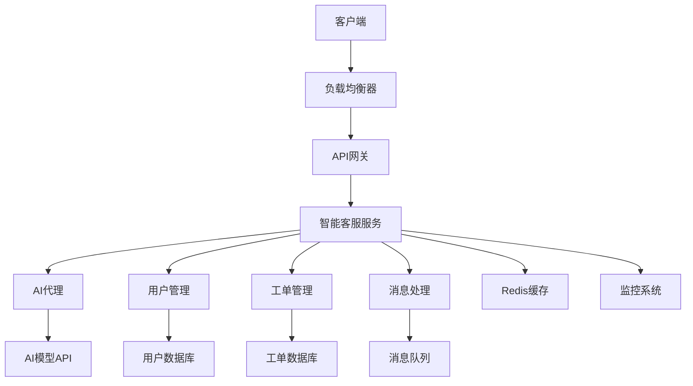

# 智能客服系统 - 实际应用示例

<!-- TOC START -->
- [智能客服系统 - 实际应用示例](#智能客服系统---实际应用示例)
  - [1.1 📚 项目概述](#11--项目概述)
    - [1.1.1 核心价值](#111-核心价值)
    - [1.1.2 应用场景](#112-应用场景)
  - [1.2 🏗️ 架构设计](#12-️-架构设计)
    - [1.2.1 系统架构](#121-系统架构)
    - [1.2.2 技术架构](#122-技术架构)
  - [1.3 🚀 快速开始](#13--快速开始)
    - [1.3.1 环境要求](#131-环境要求)
    - [1.3.2 本地开发](#132-本地开发)
    - [1.3.3 Docker部署](#133-docker部署)
    - [1.3.4 Kubernetes部署](#134-kubernetes部署)
  - [1.4 📋 功能特性](#14--功能特性)
    - [1.4.1 用户管理](#141-用户管理)
    - [1.4.2 工单系统](#142-工单系统)
    - [1.4.3 AI智能助手](#143-ai智能助手)
    - [1.4.4 消息系统](#144-消息系统)
    - [1.4.5 监控告警](#145-监控告警)
  - [1.5 🔧 技术栈](#15--技术栈)
    - [1.5.1 后端技术](#151-后端技术)
    - [1.5.2 现代化特性](#152-现代化特性)
    - [1.5.3 云原生技术](#153-云原生技术)
  - [1.6 📊 API文档](#16--api文档)
    - [1.6.1 用户管理API](#161-用户管理api)
      - [创建用户](#创建用户)
      - [获取用户](#获取用户)
      - [更新用户](#更新用户)
    - [1.6.2 工单管理API](#162-工单管理api)
      - [创建工单](#创建工单)
      - [获取工单](#获取工单)
      - [添加消息](#添加消息)
    - [1.6.3 AI助手API](#163-ai助手api)
      - [智能对话](#智能对话)
      - [文本分析](#文本分析)
      - [生成建议](#生成建议)
  - [1.7 🐳 部署指南](#17--部署指南)
    - [1.7.1 开发环境](#171-开发环境)
    - [1.7.2 生产环境](#172-生产环境)
      - [1.7.2.1 Kubernetes部署](#1721-kubernetes部署)
      - [1.7.2.2 配置管理](#1722-配置管理)
    - [1.7.3 扩缩容](#173-扩缩容)
  - [1.8 🧪 测试](#18--测试)
    - [1.8.1 单元测试](#181-单元测试)
    - [1.8.2 集成测试](#182-集成测试)
    - [1.8.3 性能测试](#183-性能测试)
    - [1.8.4 API测试](#184-api测试)
  - [1.9 📈 监控](#19--监控)
    - [1.9.1 指标监控](#191-指标监控)
    - [1.9.2 日志监控](#192-日志监控)
    - [1.9.3 告警配置](#193-告警配置)
    - [1.9.4 监控面板](#194-监控面板)
  - [1.10 🎯 最佳实践](#110--最佳实践)
    - [1.10.1 开发最佳实践](#1101-开发最佳实践)
    - [1.10.2 性能优化](#1102-性能优化)
    - [1.10.3 安全考虑](#1103-安全考虑)
    - [1.10.4 运维最佳实践](#1104-运维最佳实践)
<!-- TOC END -->

## 1.1 📚 项目概述

智能客服系统是一个集成了Go语言现代化技术栈的企业级应用示例，展示了如何将AI-Agent架构、云原生技术、性能优化等现代化技术整合到一个完整的业务系统中。

### 1.1.1 核心价值

- **智能化**: 集成AI代理，提供智能客服功能
- **高性能**: 使用零拷贝、SIMD优化等高性能技术
- **云原生**: 支持Kubernetes部署和自动扩缩容
- **可扩展**: 模块化设计，支持水平扩展
- **可观测**: 完整的监控和日志系统

### 1.1.2 应用场景

- 企业客服系统
- 在线支持平台
- 智能问答系统
- 工单管理系统
- 客户关系管理

## 1.2 🏗️ 架构设计

### 1.2.1 系统架构



### 1.2.2 技术架构

- **API层**: Gin框架，RESTful API设计
- **业务层**: Clean Architecture，领域驱动设计
- **数据层**: Redis缓存 + 关系型数据库
- **AI层**: 集成OpenAI API，智能对话
- **监控层**: Prometheus + Grafana
- **部署层**: Kubernetes + Docker

## 1.3 🚀 快速开始

### 1.3.1 环境要求

- Go 1.21+
- Docker & Docker Compose
- Kubernetes (可选)
- Redis
- PostgreSQL (可选，示例中使用内存存储)

### 1.3.2 本地开发

```bash
# 1. 克隆项目
git clone <repository-url>
cd golang/02-Go语言现代化/07-智能化架构集成/01-AI-Agent架构/examples/real_world_app

# 2. 安装依赖
go mod tidy

# 3. 启动Redis
docker run -d -p 6379:6379 redis:alpine

# 4. 配置环境变量
export AI_API_KEY="your-openai-api-key"

# 5. 运行应用
go run main.go
```

### 1.3.3 Docker部署

```bash
# 1. 构建镜像
docker build -t smart-customer-service .

# 2. 运行容器
docker run -d \
  --name smart-customer-service \
  -p 8080:8080 \
  -p 9090:9090 \
  -e AI_API_KEY="your-api-key" \
  smart-customer-service
```

### 1.3.4 Kubernetes部署

```bash
# 1. 应用配置
kubectl apply -f k8s/

# 2. 检查部署状态
kubectl get pods -l app=smart-customer-service

# 3. 访问服务
kubectl port-forward svc/smart-customer-service 8080:80
```

## 1.4 📋 功能特性

### 1.4.1 用户管理

- ✅ 用户注册和登录
- ✅ 用户信息管理
- ✅ 用户权限控制
- ✅ 用户行为分析

### 1.4.2 工单系统

- ✅ 工单创建和分配
- ✅ 工单状态跟踪
- ✅ 工单分类和优先级
- ✅ 工单历史记录

### 1.4.3 AI智能助手

- ✅ 智能对话
- ✅ 自动回复
- ✅ 情感分析
- ✅ 意图识别
- ✅ 建议生成

### 1.4.4 消息系统

- ✅ 实时消息
- ✅ 消息历史
- ✅ 多媒体支持
- ✅ 消息加密

### 1.4.5 监控告警

- ✅ 性能监控
- ✅ 错误追踪
- ✅ 日志分析
- ✅ 告警通知

## 1.5 🔧 技术栈

### 1.5.1 后端技术

| 技术 | 版本 | 用途 |
|------|------|------|
| Go | 1.21+ | 主要开发语言 |
| Gin | v1.9.1 | Web框架 |
| Redis | v8.11.5 | 缓存和会话存储 |
| PostgreSQL | 14+ | 主数据库 |
| OpenAI API | v1 | AI模型服务 |

### 1.5.2 现代化特性

- **泛型类型别名**: 简化复杂类型定义
- **Swiss Table**: 高性能Map操作
- **零拷贝**: 优化数据传输
- **SIMD优化**: 加速计算密集型任务
- **并发2.0**: 现代化并发模式
- **AI-Agent**: 智能代理架构

### 1.5.3 云原生技术

- **Kubernetes**: 容器编排
- **Docker**: 容器化
- **Prometheus**: 监控
- **Grafana**: 可视化
- **Jaeger**: 链路追踪

## 1.6 📊 API文档

### 1.6.1 用户管理API

#### 创建用户

```http
POST /api/v1/users
Content-Type: application/json

{
  "email": "user@example.com",
  "name": "John Doe"
}
```

#### 获取用户

```http
GET /api/v1/users/{id}
```

#### 更新用户

```http
PUT /api/v1/users/{id}
Content-Type: application/json

{
  "name": "Jane Doe"
}
```

### 1.6.2 工单管理API

#### 创建工单

```http
POST /api/v1/tickets
Content-Type: application/json

{
  "user_id": "user-123",
  "subject": "技术支持请求",
  "description": "系统无法正常启动",
  "category": "technical"
}
```

#### 获取工单

```http
GET /api/v1/tickets/{id}
```

#### 添加消息

```http
POST /api/v1/tickets/{id}/messages
Content-Type: application/json

{
  "user_id": "user-123",
  "content": "请提供更多详细信息",
  "type": "user"
}
```

### 1.6.3 AI助手API

#### 智能对话

```http
POST /api/v1/ai/chat
Content-Type: application/json

{
  "message": "你好，我需要帮助",
  "user_id": "user-123",
  "context": {
    "ticket_id": "ticket-456"
  }
}
```

#### 文本分析

```http
POST /api/v1/ai/analyze
Content-Type: application/json

{
  "text": "我对这个产品很满意",
  "type": "sentiment"
}
```

#### 生成建议

```http
POST /api/v1/ai/suggest
Content-Type: application/json

{
  "ticket_id": "ticket-456",
  "type": "solution"
}
```

## 1.7 🐳 部署指南

### 1.7.1 开发环境

```bash
# 使用Docker Compose
docker-compose up -d

# 检查服务状态
docker-compose ps

# 查看日志
docker-compose logs -f smart-customer-service
```

### 1.7.2 生产环境

#### 1.7.2.1 Kubernetes部署

```bash
# 创建命名空间
kubectl create namespace customer-service

# 应用配置
kubectl apply -f k8s/ -n customer-service

# 检查部署
kubectl get all -n customer-service
```

#### 1.7.2.2 配置管理

```bash
# 创建密钥
kubectl create secret generic ai-secrets \
  --from-literal=api-key=your-api-key \
  -n customer-service

# 更新配置
kubectl apply -f k8s/configmap.yaml -n customer-service
```

### 1.7.3 扩缩容

```bash
# 手动扩缩容
kubectl scale deployment smart-customer-service --replicas=5 -n customer-service

# 自动扩缩容（HPA）
kubectl apply -f k8s/hpa.yaml -n customer-service
```

## 1.8 🧪 测试

### 1.8.1 单元测试

```bash
# 运行所有测试
go test ./...

# 运行特定测试
go test ./internal/services

# 测试覆盖率
go test -cover ./...
```

### 1.8.2 集成测试

```bash
# 启动测试环境
docker-compose -f docker-compose.test.yml up -d

# 运行集成测试
go test -tags=integration ./tests/...

# 清理测试环境
docker-compose -f docker-compose.test.yml down
```

### 1.8.3 性能测试

```bash
# 运行基准测试
go test -bench=. ./...

# 压力测试
go test -bench=BenchmarkAPI -benchmem ./tests/performance/
```

### 1.8.4 API测试

```bash
# 使用curl测试
curl -X POST http://localhost:8080/api/v1/users \
  -H "Content-Type: application/json" \
  -d '{"email":"test@example.com","name":"Test User"}'

# 使用Postman或类似工具
# 导入API文档进行测试
```

## 1.9 📈 监控

### 1.9.1 指标监控

- **应用指标**: 请求数、响应时间、错误率
- **系统指标**: CPU、内存、磁盘使用率
- **业务指标**: 用户数、工单数、AI调用次数

### 1.9.2 日志监控

- **访问日志**: HTTP请求日志
- **应用日志**: 业务逻辑日志
- **错误日志**: 异常和错误信息

### 1.9.3 告警配置

```yaml
# Prometheus告警规则
groups:
- name: customer-service
  rules:
  - alert: HighErrorRate
    expr: rate(http_requests_total{status=~"5.."}[5m]) > 0.1
    for: 5m
    labels:
      severity: warning
    annotations:
      summary: "High error rate detected"
```

### 1.9.4 监控面板

访问Grafana面板查看：

- 系统性能指标
- 业务指标趋势
- 错误率统计
- 用户行为分析

## 1.10 🎯 最佳实践

### 1.10.1 开发最佳实践

1. **代码规范**: 遵循Go官方代码规范
2. **错误处理**: 统一的错误处理机制
3. **日志记录**: 结构化日志记录
4. **测试覆盖**: 保持高测试覆盖率
5. **文档更新**: 及时更新API文档

### 1.10.2 性能优化

1. **缓存策略**: 合理使用Redis缓存
2. **数据库优化**: 索引优化和查询优化
3. **并发控制**: 合理使用goroutine
4. **内存管理**: 避免内存泄漏
5. **网络优化**: 使用连接池

### 1.10.3 安全考虑

1. **输入验证**: 严格的输入验证
2. **身份认证**: JWT token认证
3. **权限控制**: 基于角色的访问控制
4. **数据加密**: 敏感数据加密存储
5. **网络安全**: HTTPS和CORS配置

### 1.10.4 运维最佳实践

1. **健康检查**: 完善的健康检查机制
2. **优雅关闭**: 优雅的服务关闭
3. **配置管理**: 环境变量和配置分离
4. **监控告警**: 全面的监控和告警
5. **备份恢复**: 数据备份和恢复策略

---

**项目维护者**: AI Assistant  
**最后更新**: 2025年1月  
**版本**: v1.0.0  
**许可证**: MIT License
