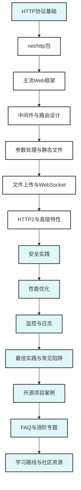

# 2.1.1 HTTP服务开发

<!-- TOC START -->
- [2.1.1 HTTP服务开发](#211-http服务开发)
  - [2.1.1.1 📚 **模块概述**](#2111--模块概述)
  - [2.1.1.2 🎯 **学习目标**](#2112--学习目标)
  - [2.1.1.3 📋 **学习内容**](#2113--学习内容)
    - [2.1.1.3.1 **1. HTTP基础**](#21131-1-http基础)
    - [2.1.1.3.2 **2. Web框架**](#21132-2-web框架)
    - [2.1.1.3.3 **3. 中间件和路由**](#21133-3-中间件和路由)
    - [2.1.1.3.4 **4. 高级特性**](#21134-4-高级特性)
    - [2.1.1.3.5 **5. 安全和性能**](#21135-5-安全和性能)
  - [2.1.1.4 🚀 **快速开始**](#2114--快速开始)
    - [2.1.1.4.1 **第一个HTTP服务器**](#21141-第一个http服务器)
    - [2.1.1.4.2 **使用Gin框架**](#21142-使用gin框架)
  - [2.1.1.5 📊 **学习进度**](#2115--学习进度)
  - [2.1.1.6 🎯 **实践项目**](#2116--实践项目)
    - [2.1.1.6.1 **项目1: RESTful API服务**](#21161-项目1-restful-api服务)
    - [2.1.1.6.2 **项目2: 文件上传服务**](#21162-项目2-文件上传服务)
    - [2.1.1.6.3 **项目3: 实时聊天API**](#21163-项目3-实时聊天api)
  - [2.1.1.7 📚 **参考资料**](#2117--参考资料)
    - [2.1.1.7.1 **官方文档**](#21171-官方文档)
    - [2.1.1.7.2 **书籍推荐**](#21172-书籍推荐)
    - [2.1.1.7.3 **在线资源**](#21173-在线资源)
  - [2.1.1.8 🔧 **工具推荐**](#2118--工具推荐)
    - [2.1.1.8.1 **开发工具**](#21181-开发工具)
    - [2.1.1.8.2 **监控工具**](#21182-监控工具)
  - [2.1.1.9 🎯 **学习建议**](#2119--学习建议)
    - [2.1.1.9.1 **理论结合实践**](#21191-理论结合实践)
    - [2.1.1.9.2 **循序渐进**](#21192-循序渐进)
    - [2.1.1.9.3 **最佳实践**](#21193-最佳实践)
  - [2.1.1.10 📝 **重要概念**](#21110--重要概念)
    - [2.1.1.10.1 **HTTP协议**](#211101-http协议)
    - [2.1.1.10.2 **Web框架特点**](#211102-web框架特点)
    - [2.1.1.10.3 **中间件模式**](#211103-中间件模式)
    - [2.1.1.10.4 **路由设计**](#211104-路由设计)
  - [2.1.1.11 🔍 **性能考虑**](#21111--性能考虑)
    - [2.1.1.11.1 **并发处理**](#211111-并发处理)
    - [2.1.1.11.2 **内存管理**](#211112-内存管理)
    - [2.1.1.11.3 **网络优化**](#211113-网络优化)
  - [2.1.1.12 🛡️ **安全考虑**](#21112-️-安全考虑)
    - [2.1.1.12.1 **常见攻击防护**](#211121-常见攻击防护)
    - [2.1.1.12.2 **认证授权**](#211122-认证授权)
    - [2.1.1.12.3 **数据验证**](#211123-数据验证)
  - [2.1.1.13 📊 **HTTP服务开发知识体系图谱**](#21113--http服务开发知识体系图谱)
  - [2.1.1.14 ❓ **常见FAQ与工程问题解决方案**](#21114--常见faq与工程问题解决方案)
    - [2.1.1.14.1 **开发与部署**](#211141-开发与部署)
    - [2.1.1.14.2 **测试与CI/CD**](#211142-测试与cicd)
    - [2.1.1.14.3 **性能与安全**](#211143-性能与安全)
    - [2.1.1.14.4 **工程最佳实践**](#211144-工程最佳实践)
    - [2.1.1.14.5 **参考资料**](#211145-参考资料)
<!-- TOC END -->

## 2.1.1.1 📚 **模块概述**

本模块介绍Go语言中HTTP服务的开发，从基础的net/http包使用到高级的Web框架应用。通过理论分析与实际代码相结合的方式，帮助学习者掌握Go语言的Web开发技术。

## 2.1.1.2 🎯 **学习目标**

- 理解HTTP协议和Web服务架构
- 掌握Go语言net/http包的使用
- 学会使用主流Web框架（Gin、Echo、Fiber）
- 理解中间件和路由的设计模式
- 掌握Web服务的最佳实践和性能优化

## 2.1.1.3 📋 **学习内容**

### 2.1.1.3.1 **1. HTTP基础**

- [01-HTTP协议.md](./01-HTTP协议.md) - HTTP协议基础
- [02-net-http包.md](./02-net-http包.md) - 标准库HTTP包
- [03-HTTP服务器.md](./03-HTTP服务器.md) - HTTP服务器实现

### 2.1.1.3.2 **2. Web框架**

- [04-Gin框架.md](./04-Gin框架.md) - Gin框架使用
- [05-Echo框架.md](./05-Echo框架.md) - Echo框架使用
- [06-Fiber框架.md](./06-Fiber框架.md) - Fiber框架使用

### 2.1.1.3.3 **3. 中间件和路由**

- [07-中间件模式.md](./07-中间件模式.md) - 中间件设计模式
- [08-路由设计.md](./08-路由设计.md) - 路由系统设计
- [09-参数处理.md](./09-参数处理.md) - 请求参数处理

### 2.1.1.3.4 **4. 高级特性**

- [10-静态文件服务.md](./10-静态文件服务.md) - 静态文件处理
- [11-文件上传.md](./11-文件上传.md) - 文件上传处理
- [12-WebSocket.md](./12-WebSocket.md) - WebSocket支持
- [13-HTTP2支持.md](./13-HTTP2支持.md) - HTTP/2特性

### 2.1.1.3.5 **5. 安全和性能**

- [14-安全实践.md](./14-安全实践.md) - Web安全最佳实践
- [15-性能优化.md](./15-性能优化.md) - 性能优化技巧
- [16-监控和日志.md](./16-监控和日志.md) - 监控和日志系统

## 2.1.1.4 🚀 **快速开始**

### 2.1.1.4.1 **第一个HTTP服务器**

```go
// simple_server.go
package main

import (
    "fmt"
    "net/http"
)

func main() {
    http.HandleFunc("/", func(w http.ResponseWriter, r *http.Request) {
        fmt.Fprintf(w, "Hello, World!")
    })
    
    fmt.Println("Server starting on :8080")
    http.ListenAndServe(":8080", nil)
}
```

### 2.1.1.4.2 **使用Gin框架**

```go
// gin_example.go
package main

import (
    "github.com/gin-gonic/gin"
    "net/http"
)

func main() {
    r := gin.Default()
    
    r.GET("/", func(c *gin.Context) {
        c.JSON(http.StatusOK, gin.H{
            "message": "Hello, Gin!",
        })
    })
    
    r.Run(":8080")
}
```

## 2.1.1.5 📊 **学习进度**

| 主题 | 状态 | 完成度 | 预计时间 |
|------|------|--------|----------|
| HTTP基础 | 🔄 进行中 | 0% | 2-3天 |
| Web框架 | ⏳ 待开始 | 0% | 3-4天 |
| 中间件和路由 | ⏳ 待开始 | 0% | 2-3天 |
| 高级特性 | ⏳ 待开始 | 0% | 3-4天 |
| 安全和性能 | ⏳ 待开始 | 0% | 2-3天 |

## 2.1.1.6 🎯 **实践项目**

### 2.1.1.6.1 **项目1: RESTful API服务**

- 实现完整的CRUD操作
- 使用Gin框架和GORM
- 实现认证和授权

### 2.1.1.6.2 **项目2: 文件上传服务**

- 支持多文件上传
- 实现进度显示
- 文件类型验证

### 2.1.1.6.3 **项目3: 实时聊天API**

- WebSocket支持
- 消息广播
- 用户管理

## 2.1.1.7 📚 **参考资料**

### 2.1.1.7.1 **官方文档**

- [Go net/http包](https://golang.org/pkg/net/http/)
- [Gin框架文档](https://gin-gonic.com/docs/)
- [Echo框架文档](https://echo.labstack.com/)

### 2.1.1.7.2 **书籍推荐**

- 《Go Web编程》
- 《Building Web Applications with Go》
- 《Go语言实战》第8章

### 2.1.1.7.3 **在线资源**

- [Go by Example: HTTP Servers](https://gobyexample.com/http-servers)
- [Go Web Examples](https://gowebexamples.com/)

## 2.1.1.8 🔧 **工具推荐**

### 2.1.1.8.1 **开发工具**

- **Postman**: API测试
- **curl**: 命令行HTTP客户端
- **httpie**: 用户友好的HTTP客户端

### 2.1.1.8.2 **监控工具**

- **Prometheus**: 指标收集
- **Grafana**: 可视化
- **Jaeger**: 链路追踪

## 2.1.1.9 🎯 **学习建议**

### 2.1.1.9.1 **理论结合实践**

- 理解HTTP协议的工作原理
- 多写Web服务代码
- 关注性能和安全

### 2.1.1.9.2 **循序渐进**

- 从net/http包开始
- 逐步学习Web框架
- 最后学习高级特性

### 2.1.1.9.3 **最佳实践**

- 使用HTTPS
- 实现适当的错误处理
- 添加监控和日志

## 2.1.1.10 📝 **重要概念**

### 2.1.1.10.1 **HTTP协议**

- 请求-响应模型
- 无状态协议
- 支持多种方法（GET、POST等）

### 2.1.1.10.2 **Web框架特点**

- **Gin**: 高性能、功能丰富
- **Echo**: 简洁、易用
- **Fiber**: Express风格、高性能

### 2.1.1.10.3 **中间件模式**

- 洋葱模型
- 链式调用
- 可组合性

### 2.1.1.10.4 **路由设计**

- RESTful设计
- 参数绑定
- 中间件集成

## 2.1.1.11 🔍 **性能考虑**

### 2.1.1.11.1 **并发处理**

- Go的并发模型适合Web服务
- 每个请求一个Goroutine
- 连接池管理

### 2.1.1.11.2 **内存管理**

- 对象池复用
- 减少内存分配
- GC优化

### 2.1.1.11.3 **网络优化**

- HTTP/2支持
- 连接复用
- 压缩传输

## 2.1.1.12 🛡️ **安全考虑**

### 2.1.1.12.1 **常见攻击防护**

- SQL注入防护
- XSS攻击防护
- CSRF攻击防护

### 2.1.1.12.2 **认证授权**

- JWT令牌
- OAuth2集成
- RBAC权限控制

### 2.1.1.12.3 **数据验证**

- 输入验证
- 输出编码
- 敏感数据保护

## 2.1.1.13 📊 **HTTP服务开发知识体系图谱**



## 2.1.1.14 ❓ **常见FAQ与工程问题解决方案**

### 2.1.1.14.1 **开发与部署**

- Q: 如何本地快速启动HTTP服务？
  A: go run main.go 或 docker-compose up，确保端口和依赖服务可用。
- Q: 如何配置多环境变量？
  A: 使用Viper等库加载不同配置文件，结合环境变量覆盖。
- Q: 如何优雅关闭HTTP服务？
  A: 使用context+信号监听，优雅释放资源。

### 2.1.1.14.2 **测试与CI/CD**

- Q: 如何做单元与集成测试？
  A: go test ./...，mock依赖，集成测试用docker-compose。
- Q: 如何保证接口测试覆盖率？
  A: go test -cover，结合Postman/Newman自动化。
- Q: 如何实现CI/CD自动化？
  A: 用GitHub Actions/GitLab CI，集成构建、测试、部署、回滚。

### 2.1.1.14.3 **性能与安全**

- Q: 如何定位Web服务性能瓶颈？
  A: pprof/trace分析，关注慢SQL、Goroutine泄漏、I/O阻塞。
- Q: 如何防止SQL注入和XSS？
  A: ORM参数绑定、输入校验、HTML转义。
- Q: 如何实现接口限流与防刷？
  A: Gin/Echo中间件+令牌桶/滑动窗口算法。

### 2.1.1.14.4 **工程最佳实践**

- 统一错误处理与日志
- 配置分离与环境隔离
- 自动化测试与回归
- 持续集成与自动化部署
- 关注安全与性能基线

### 2.1.1.14.5 **参考资料**

- Go官方文档：<https://golang.org/doc/>
- Gin文档：<https://gin-gonic.com/docs/>
- Echo文档：<https://echo.labstack.com/docs/>
- Go夜读项目实战：<https://github.com/developer-learning/night-reading-go>

---

**模块维护者**: AI Assistant  
**最后更新**: 2024年6月27日  
**模块状态**: 开发中
