# HTTP服务开发

## 📚 **模块概述**

本模块介绍Go语言中HTTP服务的开发，从基础的net/http包使用到高级的Web框架应用。通过理论分析与实际代码相结合的方式，帮助学习者掌握Go语言的Web开发技术。

## 🎯 **学习目标**

- 理解HTTP协议和Web服务架构
- 掌握Go语言net/http包的使用
- 学会使用主流Web框架（Gin、Echo、Fiber）
- 理解中间件和路由的设计模式
- 掌握Web服务的最佳实践和性能优化

## 📋 **学习内容**

### **1. HTTP基础**

- [01-HTTP协议.md](./01-HTTP协议.md) - HTTP协议基础
- [02-net-http包.md](./02-net-http包.md) - 标准库HTTP包
- [03-HTTP服务器.md](./03-HTTP服务器.md) - HTTP服务器实现

### **2. Web框架**

- [04-Gin框架.md](./04-Gin框架.md) - Gin框架使用
- [05-Echo框架.md](./05-Echo框架.md) - Echo框架使用
- [06-Fiber框架.md](./06-Fiber框架.md) - Fiber框架使用

### **3. 中间件和路由**

- [07-中间件模式.md](./07-中间件模式.md) - 中间件设计模式
- [08-路由设计.md](./08-路由设计.md) - 路由系统设计
- [09-参数处理.md](./09-参数处理.md) - 请求参数处理

### **4. 高级特性**

- [10-静态文件服务.md](./10-静态文件服务.md) - 静态文件处理
- [11-文件上传.md](./11-文件上传.md) - 文件上传处理
- [12-WebSocket.md](./12-WebSocket.md) - WebSocket支持
- [13-HTTP2支持.md](./13-HTTP2支持.md) - HTTP/2特性

### **5. 安全和性能**

- [14-安全实践.md](./14-安全实践.md) - Web安全最佳实践
- [15-性能优化.md](./15-性能优化.md) - 性能优化技巧
- [16-监控和日志.md](./16-监控和日志.md) - 监控和日志系统

## 🚀 **快速开始**

### **第一个HTTP服务器**

```go
// simple_server.go
package main

import (
    "fmt"
    "net/http"
)

func main() {
    http.HandleFunc("/", func(w http.ResponseWriter, r *http.Request) {
        fmt.Fprintf(w, "Hello, World!")
    })
    
    fmt.Println("Server starting on :8080")
    http.ListenAndServe(":8080", nil)
}
```

### **使用Gin框架**

```go
// gin_example.go
package main

import (
    "github.com/gin-gonic/gin"
    "net/http"
)

func main() {
    r := gin.Default()
    
    r.GET("/", func(c *gin.Context) {
        c.JSON(http.StatusOK, gin.H{
            "message": "Hello, Gin!",
        })
    })
    
    r.Run(":8080")
}
```

## 📊 **学习进度**

| 主题 | 状态 | 完成度 | 预计时间 |
|------|------|--------|----------|
| HTTP基础 | 🔄 进行中 | 0% | 2-3天 |
| Web框架 | ⏳ 待开始 | 0% | 3-4天 |
| 中间件和路由 | ⏳ 待开始 | 0% | 2-3天 |
| 高级特性 | ⏳ 待开始 | 0% | 3-4天 |
| 安全和性能 | ⏳ 待开始 | 0% | 2-3天 |

## 🎯 **实践项目**

### **项目1: RESTful API服务**

- 实现完整的CRUD操作
- 使用Gin框架和GORM
- 实现认证和授权

### **项目2: 文件上传服务**

- 支持多文件上传
- 实现进度显示
- 文件类型验证

### **项目3: 实时聊天API**

- WebSocket支持
- 消息广播
- 用户管理

## 📚 **参考资料**

### **官方文档**

- [Go net/http包](https://golang.org/pkg/net/http/)
- [Gin框架文档](https://gin-gonic.com/docs/)
- [Echo框架文档](https://echo.labstack.com/)

### **书籍推荐**

- 《Go Web编程》
- 《Building Web Applications with Go》
- 《Go语言实战》第8章

### **在线资源**

- [Go by Example: HTTP Servers](https://gobyexample.com/http-servers)
- [Go Web Examples](https://gowebexamples.com/)

## 🔧 **工具推荐**

### **开发工具**

- **Postman**: API测试
- **curl**: 命令行HTTP客户端
- **httpie**: 用户友好的HTTP客户端

### **监控工具**

- **Prometheus**: 指标收集
- **Grafana**: 可视化
- **Jaeger**: 链路追踪

## 🎯 **学习建议**

### **理论结合实践**

- 理解HTTP协议的工作原理
- 多写Web服务代码
- 关注性能和安全

### **循序渐进**

- 从net/http包开始
- 逐步学习Web框架
- 最后学习高级特性

### **最佳实践**

- 使用HTTPS
- 实现适当的错误处理
- 添加监控和日志

## 📝 **重要概念**

### **HTTP协议**

- 请求-响应模型
- 无状态协议
- 支持多种方法（GET、POST等）

### **Web框架特点**

- **Gin**: 高性能、功能丰富
- **Echo**: 简洁、易用
- **Fiber**: Express风格、高性能

### **中间件模式**

- 洋葱模型
- 链式调用
- 可组合性

### **路由设计**

- RESTful设计
- 参数绑定
- 中间件集成

## 🔍 **性能考虑**

### **并发处理**

- Go的并发模型适合Web服务
- 每个请求一个Goroutine
- 连接池管理

### **内存管理**

- 对象池复用
- 减少内存分配
- GC优化

### **网络优化**

- HTTP/2支持
- 连接复用
- 压缩传输

## 🛡️ **安全考虑**

### **常见攻击防护**

- SQL注入防护
- XSS攻击防护
- CSRF攻击防护

### **认证授权**

- JWT令牌
- OAuth2集成
- RBAC权限控制

### **数据验证**

- 输入验证
- 输出编码
- 敏感数据保护

## 8. HTTP服务开发知识体系图谱

```mermaid
flowchart TD
  A[HTTP协议基础] --> B[net/http包]
  B --> C[主流Web框架]
  C --> D[中间件与路由设计]
  D --> E[参数处理与静态文件]
  E --> F[文件上传与WebSocket]
  F --> G[HTTP2与高级特性]
  G --> H[安全实践]
  H --> I[性能优化]
  I --> J[监控与日志]
  J --> K[最佳实践与常见陷阱]
  K --> L[开源项目案例]
  L --> M[FAQ与进阶专题]
  M --> N[学习路线与社区资源]
  style A fill:#e0f7fa,stroke:#333,stroke-width:2px
  style B fill:#fff,stroke:#333,stroke-width:2px
  style C fill:#fff,stroke:#333,stroke-width:2px
  style D fill:#fff,stroke:#333,stroke-width:2px
  style E fill:#fff,stroke:#333,stroke-width:2px
  style F fill:#fff,stroke:#333,stroke-width:2px
  style G fill:#fff,stroke:#333,stroke-width:2px
  style H fill:#e0f7fa,stroke:#333,stroke-width:2px
  style I fill:#e0f7fa,stroke:#333,stroke-width:2px
  style J fill:#e0f7fa,stroke:#333,stroke-width:2px
  style K fill:#e0f7fa,stroke:#333,stroke-width:2px
  style L fill:#e0f7fa,stroke:#333,stroke-width:2px
  style M fill:#e0f7fa,stroke:#333,stroke-width:2px
  style N fill:#e0f7fa,stroke:#333,stroke-width:2px
```



## 9. 常见FAQ与工程问题解决方案

### 1. 开发与部署

- Q: 如何本地快速启动HTTP服务？
  A: go run main.go 或 docker-compose up，确保端口和依赖服务可用。
- Q: 如何配置多环境变量？
  A: 使用Viper等库加载不同配置文件，结合环境变量覆盖。
- Q: 如何优雅关闭HTTP服务？
  A: 使用context+信号监听，优雅释放资源。

### 2. 测试与CI/CD

- Q: 如何做单元与集成测试？
  A: go test ./...，mock依赖，集成测试用docker-compose。
- Q: 如何保证接口测试覆盖率？
  A: go test -cover，结合Postman/Newman自动化。
- Q: 如何实现CI/CD自动化？
  A: 用GitHub Actions/GitLab CI，集成构建、测试、部署、回滚。

### 3. 性能与安全

- Q: 如何定位Web服务性能瓶颈？
  A: pprof/trace分析，关注慢SQL、Goroutine泄漏、I/O阻塞。
- Q: 如何防止SQL注入和XSS？
  A: ORM参数绑定、输入校验、HTML转义。
- Q: 如何实现接口限流与防刷？
  A: Gin/Echo中间件+令牌桶/滑动窗口算法。

### 4. 工程最佳实践

- 统一错误处理与日志
- 配置分离与环境隔离
- 自动化测试与回归
- 持续集成与自动化部署
- 关注安全与性能基线

### 5. 参考资料

- Go官方文档：<https://golang.org/doc/>
- Gin文档：<https://gin-gonic.com/docs/>
- Echo文档：<https://echo.labstack.com/docs/>
- Go夜读项目实战：<https://github.com/developer-learning/night-reading-go>

---

**模块维护者**: AI Assistant  
**最后更新**: 2024年6月27日  
**模块状态**: 开发中
