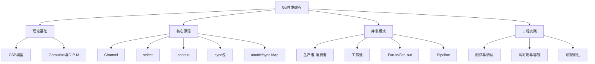

# Go并发编程内容总结与知识体系图谱

## 1. 内容总结

本系列系统梳理了Go并发编程的理论基础、核心原语、工程模式与最佳实践，涵盖：

- 并发理论与CSP模型
- Goroutine、调度器G-P-M模型
- Channel通信机制
- select与context高级用法
- sync包与并发安全模式
- 原子操作与并发安全容器
- 常见并发模式与工程案例

每一部分均配有理论、代码、工程分析、测试建议与参考文献，兼顾理论深度与实用性。

---

## 2. 知识体系图谱

---

## 3. 学习建议与进阶路线

- 建议先掌握Goroutine、Channel、select等基础原语，再深入sync、atomic等底层机制。
- 多实践常见并发模式，结合实际业务场景设计高效并发方案。
- 善用-race、pprof等工具进行并发调试与性能分析。
- 关注Go官方博客、社区最佳实践，持续学习新特性（如Go 1.22调度器优化等）。
- 进阶可学习分布式系统、微服务、云原生等更高层次并发与工程实践。

---

## 4. 参考文献

- Go官方文档：<https://golang.org/doc/>
- Go Blog: <https://blog.golang.org/>
- 《Go语言高级编程》
