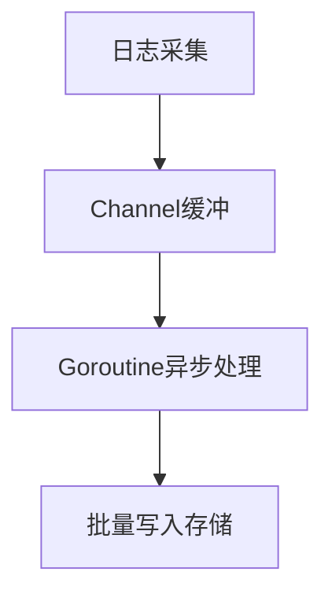
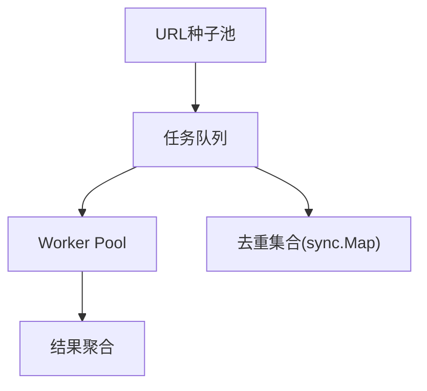
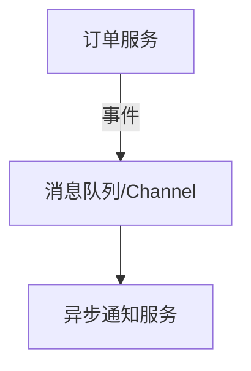

# 2.1 Go并发编程实战案例与开源项目分析

<!-- TOC START -->
- [2.1 Go并发编程实战案例与开源项目分析](#21-go并发编程实战案例与开源项目分析)
  - [2.1.1 1. 实战案例集锦](#211-1-实战案例集锦)
    - [2.1.1.1 案例1：高并发日志处理系统](#2111-案例1高并发日志处理系统)
    - [2.1.1.2 案例2：爬虫任务调度与去重](#2112-案例2爬虫任务调度与去重)
    - [2.1.1.3 案例3：微服务异步任务分发](#2113-案例3微服务异步任务分发)
  - [2.1.2 2. 典型开源项目并发设计分析](#212-2-典型开源项目并发设计分析)
    - [2.1.2.1 1. etcd](#2121-1-etcd)
    - [2.1.2.2 2. gRPC-Go](#2122-2-grpc-go)
    - [2.1.2.3 3. Go kit](#2123-3-go-kit)
  - [2.1.3 3. 工程总结](#213-3-工程总结)
  - [2.1.4 4. 参考文献](#214-4-参考文献)
<!-- TOC END -->

## 2.1.1 1. 实战案例集锦

### 2.1.1.1 案例1：高并发日志处理系统

- **业务场景**：日志采集、过滤、异步写入。
- **架构图**：



- **关键代码**：

```go
logCh := make(chan Log, 1000)
// 采集
func collect(log Log) { logCh <- log }
// 异步处理
for i := 0; i < 8; i++ {
    go func() {
        for l := range logCh {
            // 过滤、写入
        }
    }()
}
```

- **工程启示**：合理设置缓冲区与worker数，防止阻塞与丢失。

---

### 2.1.1.2 案例2：爬虫任务调度与去重

- **业务场景**：高并发URL抓取、去重、结果聚合。
- **架构图**：



- **关键代码**：

```go
var seen sync.Map
func worker(jobs <-chan string, results chan<- string) {
    for url := range jobs {
        if _, ok := seen.LoadOrStore(url, true); ok {
            continue // 已抓取
        }
        // 抓取与处理
        results <- url
    }
}
```

- **工程启示**：sync.Map高效去重，worker pool提升吞吐。

---

### 2.1.1.3 案例3：微服务异步任务分发

- **业务场景**：订单创建后异步通知、发邮件、写审计日志。
- **架构图**：



- **关键代码**：

```go
type Event struct{Type, Data string}
eventCh := make(chan Event, 100)
func notifyWorker() {
    for e := range eventCh {
        switch e.Type {
        case "email": /* ... */
        case "audit": /* ... */
        }
    }
}
```

- **工程启示**：事件驱动+channel解耦主流程与异步任务。

---

## 2.1.2 2. 典型开源项目并发设计分析

### 2.1.2.1 1. [etcd](https://github.com/etcd-io/etcd)

- **并发点**：raft协议、watch机制、并发存储。
- **设计亮点**：大量用channel、context、sync原语实现高可靠分布式一致性。
- **启示**：并发原语+工程抽象，支撑大规模分布式系统。

### 2.1.2.2 2. [gRPC-Go](https://github.com/grpc/grpc-go)

- **并发点**：连接池、流式处理、异步回调。
- **设计亮点**：Goroutine池、channel、sync.Map高效管理并发连接。
- **启示**：合理分层、解耦并发与业务逻辑。

### 2.1.2.3 3. [Go kit](https://github.com/go-kit/kit)

- **并发点**：中间件链、服务发现、限流熔断。
- **设计亮点**：context、channel、sync原语广泛应用，支持微服务高并发。
- **启示**：并发与可观测性、容错等工程能力深度结合。

---

## 2.1.3 3. 工程总结

- 结合业务场景选用合适并发模式。
- 关注缓冲区、worker数、Goroutine生命周期管理。
- 善用Go并发原语与context，提升系统健壮性与可维护性。

---

## 2.1.4 4. 参考文献

- Go官方文档：<https://golang.org/doc/>
- etcd源码：<https://github.com/etcd-io/etcd>
- gRPC-Go源码：<https://github.com/grpc/grpc-go>
- Go kit源码：<https://github.com/go-kit/kit>
- 《Go语言高级编程》
