# Go设计模式内容总结与知识体系图谱

## 1. 内容总结

本模块系统梳理了Go设计模式六大类：

- 创建型（单例、工厂、抽象工厂、建造者、原型）
- 结构型（适配器、桥接、组合、装饰器、外观、享元、代理）
- 行为型（策略、观察者、责任链、命令、状态、模板方法、访问者、备忘录、解释器、中介者）
- 并发型（Future、Worker Pool、生产者-消费者、Actor、CSP）
- 分布式型（服务注册发现、熔断器、分布式锁、幂等、Saga等）
- 工作流型（Petri网、事件驱动、补偿事务等）

每类模式均配有理论基础、Go idiomatic实现、工程分析、最佳实践与常见陷阱，兼顾理论深度与工程实用。

---

## 2. 知识体系图谱

```mermaid
graph TD
    A["Go设计模式体系"]
    A --> B1["创建型"]
    B1 --> C1["单例"]
    B1 --> C2["工厂"]
    B1 --> C3["抽象工厂"]
    B1 --> C4["建造者"]
    B1 --> C5["原型"]
    A --> B2["结构型"]
    B2 --> D1["适配器"]
    B2 --> D2["桥接"]
    B2 --> D3["组合"]
    B2 --> D4["装饰器"]
    B2 --> D5["外观"]
    B2 --> D6["享元"]
    B2 --> D7["代理"]
    A --> B3["行为型"]
    B3 --> E1["策略"]
    B3 --> E2["观察者"]
    B3 --> E3["责任链"]
    B3 --> E4["命令"]
    B3 --> E5["状态"]
    B3 --> E6["模板方法"]
    B3 --> E7["访问者"]
    B3 --> E8["备忘录"]
    B3 --> E9["解释器"]
    B3 --> E10["中介者"]
    A --> B4["并发型"]
    B4 --> F1["Future"]
    B4 --> F2["Worker Pool"]
    B4 --> F3["生产者-消费者"]
    B4 --> F4["Actor"]
    B4 --> F5["CSP"]
    A --> B5["分布式型"]
    B5 --> G1["服务注册发现"]
    B5 --> G2["熔断器"]
    B5 --> G3["分布式锁"]
    B5 --> G4["幂等"]
    B5 --> G5["Saga"]
    A --> B6["工作流型"]
    B6 --> H1["Petri网"]
    B6 --> H2["事件驱动"]
    B6 --> H3["补偿事务"]
```

---

## 3. 学习建议与进阶路线

- 建议先掌握Go基础与接口、组合、并发原语
- 按分类逐步学习各类模式，结合实际项目实践
- 关注Go社区与开源项目中的模式应用
- 进阶可学习分布式、并发、云原生等高级模式

---

## 4. 参考文献与资源

- Go官方文档：<https://golang.org/doc/>
- GoF《设计模式》、Head First Design Patterns
- Go设计模式实战：<https://github.com/senghoo/golang-design-pattern>
- Go开源项目导航：<https://github.com/avelino/awesome-go>
