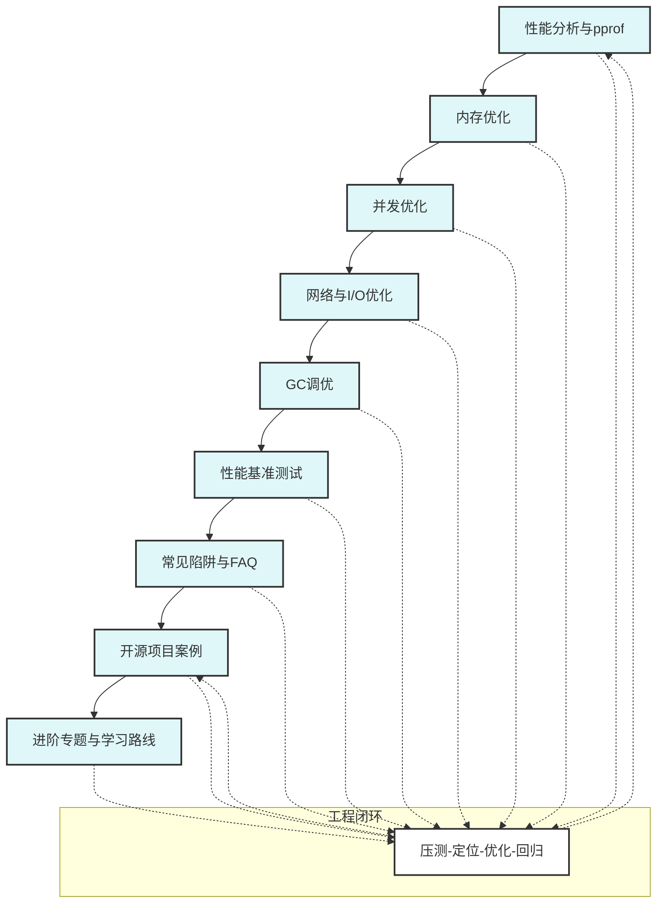

# 5.1 Go性能优化模块总览

<!-- TOC START -->
- [5.1 Go性能优化模块总览](#go性能优化模块总览)
  - [5.1.1 1. 模块定位与目标](#1-模块定位与目标)
  - [5.1.2 2. 内容结构](#2-内容结构)
  - [5.1.3 3. 理论基础与工程价值](#3-理论基础与工程价值)
  - [5.1.4 4. 学习路径建议](#4-学习路径建议)
  - [5.1.5 5. 参考文献与资源](#5-参考文献与资源)
  - [5.1.6 6. 进阶专题与学习路线](#6-进阶专题与学习路线)
  - [5.1.7 7. 性能优化知识体系图谱](#7-性能优化知识体系图谱)
<!-- TOC END -->

## 5.1.1 1. 模块定位与目标

本模块系统梳理Go性能优化的理论基础、工具方法、工程实践与最佳实践，兼顾理论深度与实战落地，助力开发者构建高性能、可扩展、易维护的Go系统。

## 5.1.2 2. 内容结构

- 性能分析与pprof
- 内存优化
- 并发优化
- I/O与网络优化
- GC调优
- 性能基准测试
- 常见陷阱与FAQ
- 开源项目案例
- 进阶专题与学习路线

## 5.1.3 3. 理论基础与工程价值

- 性能优化以"度量-分析-定位-优化-验证"为核心闭环
- 强调数据驱动、工具辅助、工程可观测性
- 结合Go原生工具（pprof、trace、bench、race等）与主流开源实践
- 关注现代工程需求：高并发、低延迟、云原生、微服务

## 5.1.4 4. 学习路径建议

- 建议先掌握Go基础与并发原语、内存模型
- 按主题逐步学习性能分析、内存、并发、I/O、GC等优化方法
- 结合实际项目与开源案例实践性能调优
- 进阶可关注云原生、分布式、服务网格等场景下的性能优化

## 5.1.5 5. 参考文献与资源

- Go官方文档：<https://golang.org/doc/>
- Go性能优化实战：<https://github.com/dominikh/go-tools>
- Go pprof官方文档：<https://github.com/google/pprof>
- Go夜读性能优化专栏：<https://github.com/developer-learning/night-reading-go>
- Go开源项目导航：<https://github.com/avelino/awesome-go>

## 5.1.6 6. 进阶专题与学习路线

- 云原生与分布式场景下的性能优化
- 服务网格与可观测性优化
- 自动化性能基线与回归测试
- 推荐书籍：《Go性能优化实战》《Go语言高级编程》《深入理解计算机系统》
- 推荐社区：Go夜读、Awesome Go、Go官方论坛
- 实战项目：Gin、etcd、Go kit、grpc-go、prometheus等
- 建议结合开源项目源码与实际业务场景，持续实践与总结

## 5.1.7 7. 性能优化知识体系图谱

---

**模块维护者**: AI Assistant  
**最后更新**: 2024年6月27日  
**模块状态**: 开发中
