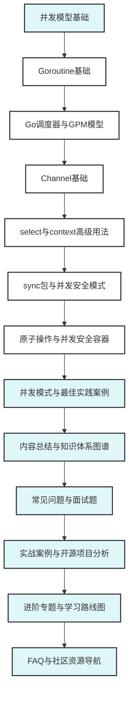

# 12.1 Go并发编程模块总览

<!-- TOC START -->
- [12.1 Go并发编程模块总览](#121-go并发编程模块总览)
  - [12.1.1 📚 模块定位与目标](#1211--模块定位与目标)
  - [12.1.2 📋 内容结构](#1212--内容结构)
  - [12.1.3 🎯 理论基础与工程价值](#1213--理论基础与工程价值)
  - [12.1.4 🚀 学习路径建议](#1214--学习路径建议)
  - [12.1.5 📚 参考文献与资源](#1215--参考文献与资源)
  - [12.1.6 📊 并发编程知识体系图谱](#1216--并发编程知识体系图谱)
<!-- TOC END -->

## 12.1.1 📚 模块定位与目标

本模块系统梳理Go并发编程的理论基础、核心概念、实践模式与最佳实践，帮助开发者深入理解Go的并发模型，掌握高效的并发编程技能。

## 12.1.2 📋 内容结构

- **01-并发模型基础** - Go并发模型概述
- **02-Goroutine基础** - Goroutine创建、管理和生命周期
- **03-Go调度器与GPM模型** - 深入理解Go调度器
- **04-Channel基础** - Channel通信机制
- **05-select与context高级用法** - 高级并发控制
- **06-sync包与并发安全模式** - 同步原语和并发安全
- **07-原子操作与并发安全容器** - 无锁编程
- **08-并发模式与最佳实践案例** - 实际应用模式
- **09-内容总结与知识体系图谱** - 知识体系总结
- **10-常见问题与面试题** - 问题解答
- **11-实战案例与开源项目分析** - 实际案例分析
- **12-进阶专题与学习路线图** - 进阶学习
- **13-FAQ与社区资源导航** - 资源导航

## 12.1.3 🎯 理论基础与工程价值

- **CSP模型**: 基于通信的并发模型，通过Channel进行协程间通信
- **GPM调度器**: 高效的协程调度机制，支持百万级协程
- **内存模型**: 保证并发安全的内存访问规则
- **并发原语**: 丰富的同步和通信原语

## 12.1.4 🚀 学习路径建议

1. **基础阶段**: 理解Goroutine和Channel基本概念
2. **进阶阶段**: 掌握调度器原理和高级并发模式
3. **实践阶段**: 学习并发安全模式和最佳实践
4. **专家阶段**: 深入理解内存模型和无锁编程

## 12.1.5 📚 参考文献与资源

- [Go官方并发教程](https://golang.org/doc/effective_go.html#concurrency)
- [Go内存模型](https://golang.org/ref/mem)
- [Go并发模式](https://blog.golang.org/pipelines)
- [Go调度器设计](https://morsmachine.dk/go-scheduler)

## 12.1.6 📊 并发编程知识体系图谱

---

**模块维护者**: AI Assistant  
**最后更新**: 2025年1月  
**模块状态**: 持续更新中
