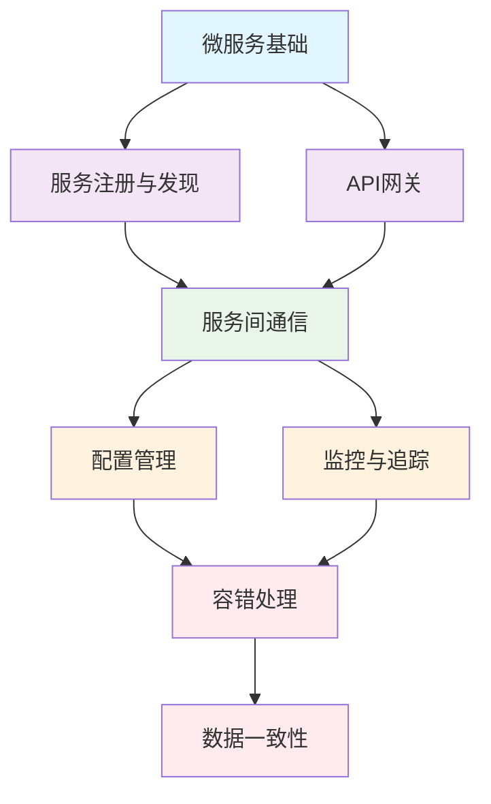

# 13. 微服务架构

## 📚 概述

微服务架构是一种将单一应用程序开发为一组小型服务的方法，每个服务运行在自己的进程中，并通过轻量级机制（通常是HTTP资源API）进行通信。本目录涵盖了Go语言微服务架构的完整知识体系。

## 🗂️ 目录结构

### 核心基础
- [01-微服务基础](./01-微服务基础.md) - 微服务概念、架构演进、拆分原则
- [02-服务注册与发现](./02-服务注册与发现.md) - Consul、etcd等注册中心的使用
- [03-API网关](./03-API网关.md) - 统一入口、路由、认证、限流

### 通信与治理
- [04-服务间通信](./04-服务间通信.md) - HTTP、gRPC、消息队列通信模式
- [05-配置管理](./05-配置管理.md) - 配置中心、热更新、加密管理
- [06-监控与追踪](./06-监控与追踪.md) - Prometheus、Jaeger、结构化日志

### 可靠性保障
- [07-容错处理与熔断](./07-容错处理与熔断.md) - 熔断器、重试、超时、降级
- [08-数据一致性与事务](./08-数据一致性与事务.md) - 分布式事务、Saga、事件溯源

## 🎯 学习路径

### 初学者路径
1. **微服务基础** - 理解微服务概念和架构演进
2. **服务注册与发现** - 掌握服务治理基础
3. **API网关** - 学习统一入口设计
4. **服务间通信** - 了解不同通信模式

### 进阶路径
1. **配置管理** - 掌握配置中心使用
2. **监控与追踪** - 建立可观测性体系
3. **容错处理** - 实现系统可靠性
4. **数据一致性** - 处理分布式事务

## 🛠️ 技术栈

### 核心框架
- **Web框架**: Gin、Echo、Fiber
- **gRPC**: google.golang.org/grpc
- **消息队列**: NATS、Kafka、RabbitMQ

### 服务治理
- **注册中心**: Consul、etcd、Nacos
- **配置中心**: Consul KV、etcd、Apollo
- **API网关**: Kong、Traefik、自研

### 监控追踪
- **指标监控**: Prometheus、Grafana
- **分布式追踪**: Jaeger、Zipkin
- **日志管理**: Zap、ELK Stack

### 容错处理
- **熔断器**: Hystrix、Sentinel
- **重试**: 指数退避、抖动
- **降级**: 功能降级、数据降级

## 📋 实践清单

### 基础实践
- [ ] 搭建微服务基础架构
- [ ] 实现服务注册与发现
- [ ] 配置API网关
- [ ] 建立服务间通信

### 进阶实践
- [ ] 配置中心集成
- [ ] 监控体系搭建
- [ ] 容错机制实现
- [ ] 数据一致性处理

### 生产实践
- [ ] 性能优化
- [ ] 安全加固
- [ ] 自动化部署
- [ ] 故障演练

## 🔗 相关资源

### 官方文档
- [Go官方文档](https://golang.org/doc/)
- [gRPC官方文档](https://grpc.io/docs/)
- [Consul官方文档](https://www.consul.io/docs)

### 开源项目
- [go-micro](https://github.com/asim/go-micro) - 微服务框架
- [kratos](https://github.com/go-kratos/kratos) - 字节跳动微服务框架
- [kit](https://github.com/go-kit/kit) - 微服务工具包

### 最佳实践
- [微服务架构模式](https://microservices.io/)
- [12-Factor App](https://12factor.net/)
- [云原生应用](https://www.cncf.io/)

## 📊 知识图谱

## 🎓 学习建议

1. **理论与实践结合** - 每个概念都要通过代码实践
2. **循序渐进** - 从基础概念开始，逐步深入
3. **项目驱动** - 通过实际项目巩固知识
4. **持续学习** - 关注微服务领域的最新发展

## 📝 贡献指南

欢迎贡献代码示例、文档改进或新的章节：

1. Fork 本仓库
2. 创建特性分支
3. 提交更改
4. 发起 Pull Request

## 📄 许可证

本项目采用 MIT 许可证 - 查看 [LICENSE](../LICENSE) 文件了解详情。

---

**文档维护者**: AI Assistant  
**最后更新**: 2025年1月11日  
**文档状态**: 持续更新中
