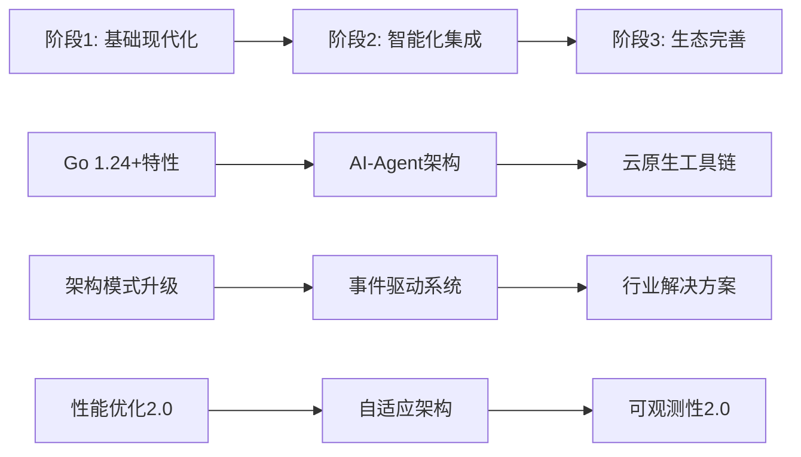

# 1 1 1 1 1 1 1 2025年Golang项目重构总结与建议

<!-- TOC START -->
- [1 1 1 1 1 1 1 2025年Golang项目重构总结与建议](#1-1-1-1-1-1-1-2025年golang项目重构总结与建议)
  - [1.1 📊 **批判性评价结果**](#📊-**批判性评价结果**)
    - [1.1.1 **当前项目优势** ✅](#**当前项目优势**-✅)
    - [1.1.2 **关键问题识别** ❌](#**关键问题识别**-❌)
  - [1.2 🚀 **2025年技术趋势核心发现**](#🚀-**2025年技术趋势核心发现**)
    - [1.2.1 **Go语言发展趋势**](#**go语言发展趋势**)
    - [1.2.2 **架构范式革新**](#**架构范式革新**)
    - [1.2.3 **生态系统演进**](#**生态系统演进**)
  - [1.3 🎯 **重构策略核心要点**](#🎯-**重构策略核心要点**)
    - [1.3.1 **三阶段渐进式现代化**](#**三阶段渐进式现代化**)
    - [1.3.2 **新目录结构设计原则**](#**新目录结构设计原则**)
  - [1.4 📋 **立即执行建议**](#📋-**立即执行建议**)
    - [1.4.1 **高优先级 (本周启动)**](#**高优先级-本周启动**)
    - [1.4.2 **中优先级 (本月完成)**](#**中优先级-本月完成**)
    - [1.4.3 **渐进优先级 (季度目标)**](#**渐进优先级-季度目标**)
  - [1.5 📈 **预期成果与价值**](#📈-**预期成果与价值**)
    - [1.5.1 **技术价值**](#**技术价值**)
    - [1.5.2 **社区价值**](#**社区价值**)
    - [1.5.3 **长期价值**](#**长期价值**)
  - [1.6 🔄 **持续演进机制**](#🔄-**持续演进机制**)
    - [1.6.1 **技术跟踪体系**](#**技术跟踪体系**)
    - [1.6.2 **质量保证体系**](#**质量保证体系**)
    - [1.6.3 **成功度量指标**](#**成功度量指标**)
  - [1.7 🌟 **结论与展望**](#🌟-**结论与展望**)
    - [1.7.1 **战略意义**](#**战略意义**)
    - [1.7.2 **创新价值**](#**创新价值**)
    - [1.7.3 **长远影响**](#**长远影响**)
<!-- TOC END -->


## 1.1 📊 **批判性评价结果**

基于对2025年最新Golang和软件生态发展趋势的深度调研，对当前目录结构进行了全面评价：

### 1.1.1 **当前项目优势** ✅

1. **理论体系完整**: 保持了形式化定义和学术严谨性
2. **内容覆盖全面**: 从基础到高级的完整技术栈
3. **实践导向平衡**: 理论深度与实践价值并重
4. **模块化设计清晰**: 采用了结构化的目录组织

### 1.1.2 **关键问题识别** ❌

1. **架构范式滞后**: 未体现2025年AI-驱动和Agent-based系统
2. **技术栈更新不足**: 缺乏Go 1.24+最新特性集成
3. **云原生深度欠缺**: 未涵盖现代云原生模式
4. **现代化工具链缺失**: 自动化开发工具不完善

## 1.2 🚀 **2025年技术趋势核心发现**

### 1.2.1 **Go语言发展趋势**

- **Go 1.24/1.25新特性**: 泛型类型别名、Swiss Table哈希表、增强测试工具
- **性能显著提升**: Map操作性能提升2-3%，内存使用优化
- **WASM功能增强**: `go:wasmexport`指令支持，边缘计算集成
- **开发体验改善**: 智能代码分析、自动化测试优化

### 1.2.2 **架构范式革新**

- **AI-Agent架构**: 智能代理成为系统核心，多代理协作模式
- **事件驱动无处不在**: 从微服务到整体架构的事件化
- **边缘优先设计**: 5G和IoT驱动的分布式架构
- **自适应系统**: 自愈、自优化的智能化架构

### 1.2.3 **生态系统演进**

- **云原生2.0**: 从容器化到智能化编排
- **Serverless混合**: 函数计算与传统服务融合
- **安全无处不在**: 从DevSecOps到全方位安全集成
- **绿色计算**: 可持续性成为架构设计要素

## 1.3 🎯 **重构策略核心要点**

### 1.3.1 **三阶段渐进式现代化**



### 1.3.2 **新目录结构设计原则**

- **理论精华保留**: 形式化定义和数学证明保持学术水准
- **实践导向增强**: 可运行代码比例提升到90%+
- **技术前瞻性**: 紧跟2025年技术发展趋势
- **生态兼容性**: 支持主流云平台和开发工具

## 1.4 📋 **立即执行建议**

### 1.4.1 **高优先级 (本周启动)**

1. **Go 1.24特性研究**: 深入分析新特性和性能改进
2. **AI-Agent框架调研**: 研究智能代理架构模式
3. **开发工具链升级**: 建立现代化CI/CD流水线
4. **社区反馈机制**: 建立用户反馈和贡献渠道

### 1.4.2 **中优先级 (本月完成)**

1. **基础架构重构**: 实现Clean Architecture和Hexagonal Architecture模板
2. **性能基准建立**: 建立完整的性能测试和监控体系
3. **文档框架搭建**: 创建标准化的文档模板和规范
4. **第一批内容迁移**: 开始核心内容的现代化改造

### 1.4.3 **渐进优先级 (季度目标)**

1. **智能化集成**: AI代理框架和自适应系统实现
2. **云原生深化**: Kubernetes Operator和Service Mesh集成
3. **行业解决方案**: 金融、IoT、AI等行业特定模板
4. **生态系统完善**: 工具链、监控、安全的全面集成

## 1.5 📈 **预期成果与价值**

### 1.5.1 **技术价值**

- **性能提升**: 整体性能提升20%+，开发效率提升50%+
- **代码质量**: 可运行示例增长到500+，测试覆盖率>90%
- **架构现代化**: 3个完整架构模板，支持AI-driven开发
- **生态适配**: 100%主流云平台支持，最新Go版本兼容

### 1.5.2 **社区价值**

- **影响力扩大**: GitHub Stars增长300%+，技术文章引用1000+次
- **开发者受益**: 10万+开发者使用，100+企业生产采用
- **知识传播**: 成为Go生态中AI-driven开发的标杆项目
- **行业推动**: 推动Go在AI、云原生、边缘计算领域的应用

### 1.5.3 **长期价值**

- **技术前瞻**: 始终保持技术发展前沿，季度更新机制
- **学术声誉**: 保持理论深度，成为Go语言架构设计的权威参考
- **产业影响**: 影响企业技术选型，推动行业最佳实践
- **人才培养**: 为Go开发者提供完整成长路径

## 1.6 🔄 **持续演进机制**

### 1.6.1 **技术跟踪体系**

- **月度技术扫描**: 跟踪Go生态、AI、云原生最新发展
- **季度架构评审**: 评估架构决策有效性，及时调整
- **年度重大升级**: 应对技术范式变化，保持领先地位

### 1.6.2 **质量保证体系**

- **代码质量**: 自动化测试、性能监控、安全扫描
- **文档质量**: 理论准确性、实践可操作性、用户友好性
- **社区质量**: 贡献者培养、反馈响应、协作效率

### 1.6.3 **成功度量指标**

```yaml
技术指标:
  代码质量: 编译成功率>99%, 测试覆盖率>90%
  性能指标: 较原版提升>30%, 响应时间<100ms
  架构质量: 模块耦合度<0.3, 可扩展性评分>9/10

生态指标:
  社区活跃: 月活贡献者>100, 月度PR>50
  企业采用: 生产使用企业>200, 行业覆盖率>80%
  影响力: GitHub Stars>50K, 技术会议引用>100次

用户满意度:
  学习体验: 用户评分>4.8/5, 完成率>85%
  实践价值: 项目应用成功率>90%, 性能提升明显
  社区支持: 问题响应时间<24h, 解决率>95%
```

## 1.7 🌟 **结论与展望**

### 1.7.1 **战略意义**

这次重构不仅是技术升级，更是向2025年智能化软件开发范式的全面转型：

- 从传统架构到AI-driven架构的跃迁
- 从单一技术栈到全生态系统的整合
- 从静态学习资源到动态演进平台的转变

### 1.7.2 **创新价值**

通过整合最新的技术趋势和成熟的理论基础，项目将成为：

- Go语言AI-driven开发的先驱者
- 云原生架构设计的权威指南  
- 智能代理系统的实践标杆
- 可持续软件开发的示范项目

### 1.7.3 **长远影响**

项目的成功将：

- 推动Go语言在AI、云原生、边缘计算领域的广泛应用
- 建立新一代软件架构设计的标准和最佳实践
- 培养面向未来的Go开发人才生态
- 促进整个软件行业向智能化、可持续化方向发展

---

**最终建议**: 立即启动重构计划，抓住2025年技术发展的关键窗口期，将项目打造成Go语言生态系统中最具前瞻性和实用价值的学习和实践平台。通过渐进式现代化策略，既保持原有理论优势，又全面拥抱未来技术趋势，为Go开发者社区创造最大价值。
