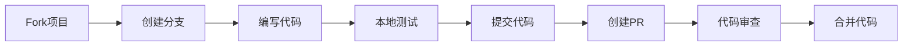

# 🤝 贡献指南

> **欢迎加入 Golang 知识体系项目！**  
> 感谢您对项目的关注！我们欢迎所有形式的贡献。

<div align="center">


**[快速开始](#-快速开始) • [开发流程](#-开发流程) • [代码规范](#-代码规范) • [测试要求](#-测试要求) • [获取帮助](#-获取帮助)**

</div>

---

## 🎯 贡献方式

我们欢迎以下类型的贡献：

<table>
<tr>
<td width="50%">

### 💻 代码贡献

- ✅ 添加代码示例
- ✅ 修复Bug
- ✅ 性能优化
- ✅ 新功能开发
- ✅ 测试用例

</td>
<td width="50%">

### 📝 文档贡献

- ✅ 修正错误
- ✅ 补充内容
- ✅ 改进结构
- ✅ 翻译工作
- ✅ 示例说明

</td>
</tr>
<tr>
<td width="50%">

### 🐛 问题反馈

- ✅ Bug报告
- ✅ 功能建议
- ✅ 使用反馈
- ✅ 性能问题
- ✅ 文档问题

</td>
<td width="50%">

### 🌟 社区贡献

- ✅ 项目推广
- ✅ 问题解答
- ✅ 案例分享
- ✅ 博客文章
- ✅ 视频教程

</td>
</tr>
</table>

---

## 🚀 快速开始

### 前置要求

```text
✅ Go 1.23+ (推荐1.25)
✅ Git 2.x
✅ 代码编辑器 (VS Code推荐)
✅ golangci-lint (可选但推荐)
```

### 5分钟上手贡献

```bash
# 1. Fork项目
# 在GitHub上点击Fork按钮

# 2. 克隆你的Fork
git clone https://github.com/YOUR_USERNAME/golang.git
cd golang

# 3. 添加上游仓库
git remote add upstream https://github.com/ORIGINAL_OWNER/golang.git

# 4. 创建功能分支
git checkout -b feature/amazing-feature

# 5. 验证环境
go version
go test -v ./...

# 🎉 环境就绪！开始贡献吧！
```

---

## 🔧 本地开发设置

### 完整开发环境

```bash
# 1. 安装依赖
go mod download

# 2. 安装开发工具
go install github.com/golangci/golangci-lint/cmd/golangci-lint@latest
go install golang.org/x/tools/cmd/goimports@latest
go install golang.org/x/vuln/cmd/govulncheck@latest

# 3. 验证安装
golangci-lint --version
goimports --version
govulncheck -h

# 4. 配置Git Hooks (可选)
cat > .git/hooks/pre-commit << 'EOF'
#!/bin/sh
echo "Running pre-commit checks..."
go fmt ./...
go vet ./...
go test ./...
EOF
chmod +x .git/hooks/pre-commit
```

### 项目结构理解

```text
golang/
├── .github/          # CI/CD和模板
├── docs/             # 核心文档和代码
│   └── 02-Go语言现代化/
│       ├── 08-智能化架构集成/  # AI-Agent
│       ├── 14-Go-1.23并发/     # 并发特性
│       └── ...
├── examples/         # 示例代码
│   ├── concurrency/  # 并发模式
│   └── ...
├── scripts/          # 工具脚本
├── EXAMPLES.md       # 示例展示页
└── README.md         # 项目首页
```

### 运行示例

```bash
# Go 1.23+现代特性
cd docs/02-Go语言现代化/14-Go-1.23并发和网络/examples/waitgroup_go
go test -v .

# 并发模式
cd examples/concurrency
go test -v .

# AI-Agent
cd docs/02-Go语言现代化/08-智能化架构集成/01-AI-Agent架构
go test -v ./core/...

# 所有测试
powershell -ExecutionPolicy Bypass -File scripts/test_summary.ps1
```

---

## 💻 开发流程

### 标准工作流



### 详细步骤

#### 1. 同步上游代码

```bash
# 定期同步上游更新
git fetch upstream
git checkout main
git merge upstream/main
git push origin main
```

#### 2. 创建功能分支

```bash
# 从最新的main分支创建
git checkout main
git pull upstream main
git checkout -b feature/your-feature-name

# 分支命名规范
# feature/功能名称  - 新功能
# fix/问题描述     - Bug修复
# docs/文档类型    - 文档更新
# refactor/描述    - 代码重构
# test/测试描述    - 测试相关
```

#### 3. 编写代码

```go
// 示例：添加新的并发模式
package concurrency

import (
    "context"
    "sync"
)

// RateLimiter 速率限制器示例
type RateLimiter struct {
    rate     int
    interval time.Duration
    tokens   chan struct{}
    done     chan struct{}
}

// NewRateLimiter 创建速率限制器
func NewRateLimiter(rate int, interval time.Duration) *RateLimiter {
    rl := &RateLimiter{
        rate:     rate,
        interval: interval,
        tokens:   make(chan struct{}, rate),
        done:     make(chan struct{}),
    }
    
    // 初始化令牌
    for i := 0; i < rate; i++ {
        rl.tokens <- struct{}{}
    }
    
    return rl
}

// Wait 等待获取令牌
func (rl *RateLimiter) Wait(ctx context.Context) error {
    select {
    case <-ctx.Done():
        return ctx.Err()
    case <-rl.tokens:
        return nil
    }
}
```

#### 4. 编写测试

```go
// rate_limiter_test.go
package concurrency

import (
    "context"
    "testing"
    "time"
)

func TestRateLimiter(t *testing.T) {
    rl := NewRateLimiter(10, time.Second)
    
    start := time.Now()
    for i := 0; i < 10; i++ {
        if err := rl.Wait(context.Background()); err != nil {
            t.Fatalf("Wait failed: %v", err)
        }
    }
    
    elapsed := time.Since(start)
    if elapsed > 100*time.Millisecond {
        t.Errorf("Expected fast completion, got %v", elapsed)
    }
}

func BenchmarkRateLimiter(b *testing.B) {
    rl := NewRateLimiter(1000, time.Second)
    ctx := context.Background()
    
    b.ResetTimer()
    for i := 0; i < b.N; i++ {
        rl.Wait(ctx)
    }
}
```

#### 5. 运行质量检查

```bash
# 格式化代码
go fmt ./...
goimports -w .

# 静态分析
go vet ./...
golangci-lint run

# 运行测试
go test -v ./...
go test -race ./...
go test -cover ./...

# 安全扫描
govulncheck ./...

# 使用项目脚本（Windows）
powershell -ExecutionPolicy Bypass -File scripts/scan_code_quality.ps1
```

#### 6. 提交代码

```bash
# 添加更改
git add .

# 提交（遵循Conventional Commits）
git commit -m "feat(concurrency): add rate limiter pattern

- Implement token bucket rate limiter
- Add comprehensive tests
- Include usage examples in EXAMPLES.md"

# 推送到你的Fork
git push origin feature/your-feature-name
```

#### 7. 创建Pull Request

1. 访问你的Fork页面
2. 点击 "New Pull Request"
3. 选择正确的分支
4. 填写PR模板：
   - 清晰的标题
   - 详细的描述
   - 相关的Issue编号
   - 测试结果截图（如适用）
5. 提交PR

---

## 📝 代码规范

### Go代码风格

**必须遵守**:

```go
// ✅ 好的示例
package mypackage

import (
    "context"
    "fmt"
    "time"
)

// ProcessData 处理数据并返回结果
// 参数:
//   - ctx: 上下文
//   - data: 要处理的数据
// 返回:
//   - result: 处理结果
//   - error: 错误信息
func ProcessData(ctx context.Context, data []byte) (result string, err error) {
    if len(data) == 0 {
        return "", fmt.Errorf("data cannot be empty")
    }
    
    // 使用defer确保资源清理
    defer func() {
        if r := recover(); r != nil {
            err = fmt.Errorf("panic: %v", r)
        }
    }()
    
    // 实际处理逻辑
    result = string(data)
    return result, nil
}
```

**避免这样**:

```go
// ❌ 不好的示例
func processData(d []byte) string {  // 未导出函数应小写，但导出的应大写
    return string(d)  // 缺少错误处理
}  // 缺少注释
```

### 提交信息规范

**格式**: `<type>(<scope>): <subject>`

**类型**:

- `feat`: 新功能
- `fix`: Bug修复
- `docs`: 文档更新
- `style`: 代码格式（不影响功能）
- `refactor`: 重构
- `test`: 测试相关
- `chore`: 构建/工具链
- `perf`: 性能优化

**示例**:

```bash
# 好的提交信息
feat(agent): add decision consensus mechanism

- Implement multi-agent voting
- Add confidence calculation
- Include comprehensive tests

Closes #123

# 坏的提交信息
fix bug        # 太简略
Update code    # 不明确
```

### 命名规范

```go
// 包名：小写，单个单词
package ratelimiter

// 常量：大写，下划线分隔
const MAX_RETRIES = 3

// 变量：驼峰命名
var maxConnections int
var defaultTimeout = 30 * time.Second

// 函数：驼峰命名，导出的首字母大写
func NewClient() *Client
func processRequest() error

// 接口：通常以-er结尾
type Reader interface
type Processor interface

// 结构体：驼峰命名，导出的首字母大写
type HTTPClient struct
type requestConfig struct
```

---

## 🧪 测试要求

### 测试覆盖率

- **最低要求**: 80%
- **推荐目标**: 90%+
- **当前项目**: 45-50%

```bash
# 生成覆盖率报告
go test -coverprofile=coverage.out ./...
go tool cover -html=coverage.out

# 查看覆盖率
go test -cover ./...
```

### 测试类型

#### 1. 单元测试

```go
func TestUserValidation(t *testing.T) {
    tests := []struct {
        name    string
        input   User
        wantErr bool
    }{
        {
            name:    "valid user",
            input:   User{Name: "John", Age: 25},
            wantErr: false,
        },
        {
            name:    "empty name",
            input:   User{Name: "", Age: 25},
            wantErr: true,
        },
    }
    
    for _, tt := range tests {
        t.Run(tt.name, func(t *testing.T) {
            err := tt.input.Validate()
            if (err != nil) != tt.wantErr {
                t.Errorf("Validate() error = %v, wantErr %v", err, tt.wantErr)
            }
        })
    }
}
```

#### 2. 并发测试

```go
func TestConcurrentAccess(t *testing.T) {
    cache := NewCache()
    
    var wg sync.WaitGroup
    for i := 0; i < 100; i++ {
        wg.Add(1)
        go func(id int) {
            defer wg.Done()
            cache.Set(fmt.Sprintf("key-%d", id), id)
            cache.Get(fmt.Sprintf("key-%d", id))
        }(i)
    }
    
    wg.Wait()
}
```

#### 3. 基准测试

```go
func BenchmarkCacheSet(b *testing.B) {
    cache := NewCache()
    
    b.ResetTimer()
    for i := 0; i < b.N; i++ {
        cache.Set("key", i)
    }
}

func BenchmarkCacheGet(b *testing.B) {
    cache := NewCache()
    cache.Set("key", 123)
    
    b.ResetTimer()
    for i := 0; i < b.N; i++ {
        cache.Get("key")
    }
}
```

#### 4. 示例测试

```go
func ExampleRateLimiter() {
    rl := NewRateLimiter(10, time.Second)
    ctx := context.Background()
    
    for i := 0; i < 10; i++ {
        if err := rl.Wait(ctx); err != nil {
            fmt.Printf("Error: %v\n", err)
            return
        }
        fmt.Printf("Request %d processed\n", i+1)
    }
    // Output:
    // Request 1 processed
    // Request 2 processed
    // ...
}
```

### 测试命令

```bash
# 运行所有测试
go test -v ./...

# 竞态检测
go test -race ./...

# 覆盖率
go test -cover ./...

# 基准测试
go test -bench=. -benchmem ./...

# 特定测试
go test -v ./... -run TestName

# 使用项目脚本
powershell -ExecutionPolicy Bypass -File scripts/test_summary.ps1
```

---

## 📚 文档要求

### 代码注释

```go
// Package concurrency 提供常见的并发模式实现
//
// 本包包含以下模式:
//   - Pipeline: 流水线模式
//   - Worker Pool: 工作池模式
//   - Rate Limiter: 速率限制模式
package concurrency

// RateLimiter 实现令牌桶算法的速率限制器
//
// 使用示例:
//   rl := NewRateLimiter(100, time.Second) // 每秒100个请求
//   err := rl.Wait(ctx)
type RateLimiter struct {
    // 未导出字段无需注释（除非很复杂）
    tokens chan struct{}
}

// NewRateLimiter 创建新的速率限制器
//
// 参数:
//   - rate: 每个时间间隔的最大请求数
//   - interval: 时间间隔
//
// 返回:
//   - *RateLimiter: 速率限制器实例
func NewRateLimiter(rate int, interval time.Duration) *RateLimiter {
    // 实现...
}
```

### README模板

```markdown
# 模块名称

> 简短描述（一句话）

## 功能特性

- 特性1
- 特性2

## 安装

\`\`\`bash
go get github.com/yourrepo/module
\`\`\`

## 快速开始

\`\`\`go
// 代码示例
\`\`\`

## API文档

### 函数名

描述...

## 测试

\`\`\`bash
go test -v .
\`\`\`

## 许可证

MIT
```

---

## 🔄 Pull Request流程

### PR检查清单

提交PR前确保：

- [ ] ✅ 代码通过 `go fmt`
- [ ] ✅ 代码通过 `go vet`
- [ ] ✅ 代码通过 `golangci-lint`
- [ ] ✅ 所有测试通过
- [ ] ✅ 新代码有测试覆盖
- [ ] ✅ 更新了相关文档
- [ ] ✅ 提交信息符合规范
- [ ] ✅ PR描述清晰完整
- [ ] ✅ 关联了相关Issue

### PR模板

PR会自动使用项目模板，包含：

1. **变更类型**: 功能/修复/文档等
2. **变更描述**: 详细说明
3. **测试情况**: 测试方法和结果
4. **检查清单**: 自检项目
5. **相关Issue**: 关联的问题

### 代码审查

**审查关注点**:

- 代码质量和可读性
- 测试覆盖是否充分
- 文档是否完整
- 是否遵循项目规范
- 性能是否有影响

**审查响应**:

- 及时回复审查意见
- 修改后推送更新
- 感谢审查者的反馈

---

## 🏷️ 版本发布

### 语义化版本

格式: `MAJOR.MINOR.PATCH`

- **MAJOR**: 不兼容的API变更
- **MINOR**: 向后兼容的功能新增
- **PATCH**: 向后兼容的问题修复

### 发布流程

维护者负责发布，贡献者无需担心。

---

## 🎯 贡献者指南

### 首次贡献

**推荐起点**:

1. 查看 [good first issue](../../labels/good%20first%20issue) 标签
2. 改进文档或注释
3. 添加测试用例
4. 修复明显的Bug

### 高级贡献

**适合有经验的贡献者**:

1. 新功能开发
2. 性能优化
3. 架构改进
4. 复杂Bug修复

---

## 📞 获取帮助

### 社区资源

- 💬 [GitHub Discussions](../../discussions) - 提问和讨论
- 🐛 [GitHub Issues](../../issues) - Bug报告和功能请求
- 📖 [项目文档](README.md) - 完整文档
- 📚 [示例展示](EXAMPLES.md) - 代码示例

### 提问指南

**好的问题**:

```text
标题: [模块名] 具体问题描述

内容:
1. 问题描述：详细说明遇到的问题
2. 环境信息：Go版本、操作系统等
3. 复现步骤：如何重现问题
4. 期望行为：期望的结果
5. 实际行为：实际的结果
6. 错误日志：相关错误信息
```

**寻求帮助的方式**:

1. 先搜索已有Issues
2. 查看文档和FAQ
3. 创建新Issue并详细描述
4. 在Discussions中讨论

---

## 🌟 贡献者名单

感谢所有贡献者！

<!-- ALL-CONTRIBUTORS-LIST:START -->
<!-- 贡献者列表将自动生成 -->
<!-- ALL-CONTRIBUTORS-LIST:END -->

### 如何加入

完成首次PR合并后，您的名字将被添加到贡献者列表！

---

## 📜 行为准则

### 我们的承诺

- 尊重所有贡献者
- 接纳不同观点
- 提供建设性反馈
- 关注社区利益

详见 [CODE_OF_CONDUCT.md](CODE_OF_CONDUCT.md)

---

## 📄 许可证

贡献代码即表示您同意在 [MIT License](LICENSE) 下授权您的贡献。

---

<div align="center">

## 🎉 开始贡献

**感谢您考虑为项目做贡献！**

每一个贡献都让项目变得更好 💚

[Fork项目](../../fork) • [创建Issue](../../issues/new) • [查看示例](EXAMPLES.md)

---

**有问题？** [提问](../../discussions/new) | **发现Bug？** [报告](../../issues/new?template=bug_report.md) | **有想法？** [建议](../../issues/new?template=feature_request.md)

---

Made with ❤️ by the Community

</div>
