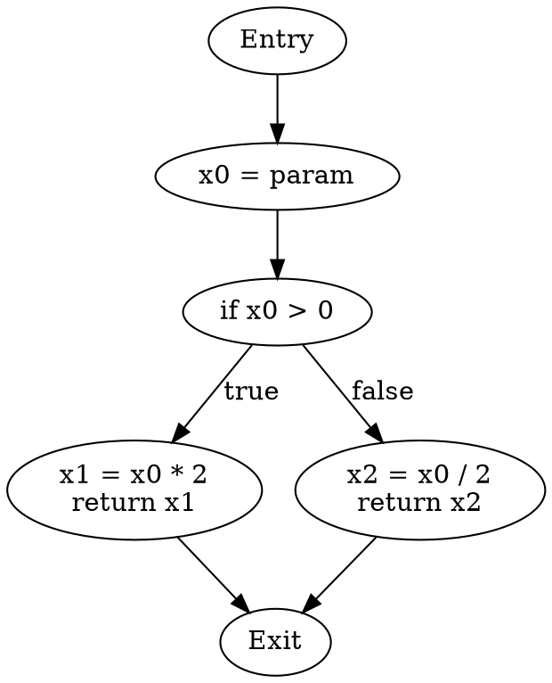

# Go 形式化验证工具 (Formal Verifier)

**版本**: v1.0.0  
**基于**: Go 1.25.3 形式化理论体系  
**状态**: 原型阶段 (Prototype)

---

## 🎯 项目概述

Go形式化验证工具是基于 **Go 1.25.3 形式化理论体系** 开发的静态分析和验证工具，旨在将形式化理论应用于实际的Go代码分析。

### 核心功能

1. **控制流分析** (基于文档13)
   - CFG (Control Flow Graph) 构造
   - SSA (Static Single Assignment) 转换
   - 数据流分析 (活跃变量、可达定义、可用表达式)

2. **并发安全验证** (基于文档02, 16)
   - Goroutine泄露检测
   - Channel死锁分析
   - 数据竞争检测
   - 并发模式验证

3. **类型系统验证** (基于文档03)
   - 类型安全性检查
   - 泛型约束验证
   - 接口实现验证

4. **编译器优化验证** (基于文档15)
   - 优化正确性验证
   - 逃逸分析验证
   - 边界检查消除验证

---

## 🏗️ 架构设计

```text
formal-verifier/
├── cmd/
│   ├── fv/                    # 主命令行工具
│   ├── cfg-viewer/            # CFG可视化工具
│   └── concurrency-checker/   # 并发检查器
├── pkg/
│   ├── cfg/                   # 控制流图模块
│   │   ├── builder.go        # CFG构造器
│   │   ├── ssa.go            # SSA转换
│   │   └── visualizer.go     # CFG可视化
│   ├── dataflow/              # 数据流分析模块
│   │   ├── liveness.go       # 活跃变量分析
│   │   ├── reaching.go       # 可达定义分析
│   │   └── available.go      # 可用表达式分析
│   ├── concurrency/           # 并发分析模块
│   │   ├── goroutine.go      # Goroutine分析
│   │   ├── channel.go        # Channel分析
│   │   ├── deadlock.go       # 死锁检测
│   │   └── race.go           # 数据竞争检测
│   ├── types/                 # 类型系统模块
│   │   ├── checker.go        # 类型检查器
│   │   ├── inference.go      # 类型推导
│   │   └── constraints.go    # 约束求解
│   ├── optimizer/             # 优化分析模块
│   │   ├── escape.go         # 逃逸分析
│   │   ├── inline.go         # 内联分析
│   │   └── bce.go            # 边界检查消除
│   └── report/                # 报告生成模块
│       ├── formatter.go      # 格式化输出
│       └── html.go           # HTML报告
├── examples/                  # 示例代码
├── testdata/                  # 测试数据
└── docs/                      # 工具文档
```

---

## 🚀 快速开始

### 安装

```bash
# 克隆仓库
cd e:\_src\golang\tools\formal-verifier

# 构建工具
go build -o fv.exe ./cmd/fv

# 验证安装
./fv.exe --version
```

### 基本使用

#### 1. CFG分析

```bash
# 生成控制流图
./fv.exe cfg --file=mycode.go --output=cfg.dot

# 可视化CFG (需要Graphviz)
dot -Tpng cfg.dot -o cfg.png
```

#### 2. 并发安全检查

```bash
# 检查Goroutine泄露
./fv.exe concurrency --check=goroutine-leak --file=mycode.go

# 检查死锁
./fv.exe concurrency --check=deadlock --file=mycode.go

# 检查数据竞争
./fv.exe concurrency --check=race --file=mycode.go
```

#### 3. 数据流分析

```bash
# 活跃变量分析
./fv.exe dataflow --analysis=liveness --file=mycode.go

# 可达定义分析
./fv.exe dataflow --analysis=reaching --file=mycode.go
```

#### 4. 类型验证

```bash
# 类型安全性检查
./fv.exe types --check=safety --file=mycode.go

# 泛型约束验证
./fv.exe types --check=constraints --file=mycode.go
```

---

## 📊 功能详解

### 1. 控制流图 (CFG) 分析

基于 **文档13: Go控制流形式化完整分析**

**实现的形式化定义**:

```text
CFG = (N, E, entry, exit)
- N: 节点集合 (基本块)
- E: 边集合 (控制流转移)
- entry: 入口节点
- exit: 出口节点
```

**支持的Go特性**:

- ✅ if/else/switch语句
- ✅ for/range循环
- ✅ defer语句
- ✅ panic/recover
- ✅ goroutine spawn
- ✅ select语句

**输出格式**:

- DOT格式 (Graphviz)
- JSON格式
- HTML交互式图表

### 2. SSA转换

基于 **文档13** 的SSA算法

**实现的算法**:

1. 插入φ-函数 (基于支配边界)
2. 变量重命名
3. 去构造 (可选)

**验证**:

- ✅ SSA性质验证 (每个变量单次赋值)
- ✅ φ-函数正确性
- ✅ 支配树正确性

### 3. 数据流分析1

基于 **文档13** 的数据流分析框架

#### 活跃变量分析 (Liveness)

```text
OUT[n] = ⋃(s∈succ(n)) IN[s]
IN[n] = use[n] ∪ (OUT[n] - def[n])
```

**应用**:

- 寄存器分配
- 死代码检测
- 优化机会识别

#### 可达定义分析 (Reaching Definitions)

```text
OUT[n] = gen[n] ∪ (IN[n] - kill[n])
IN[n] = ⋃(p∈pred(n)) OUT[p]
```

**应用**:

- 常量传播
- 复制传播
- 未初始化变量检测

#### 可用表达式分析 (Available Expressions)

```text
OUT[n] = gen[n] ∪ (IN[n] - kill[n])
IN[n] = ⋂(p∈pred(n)) OUT[p]
```

**应用**:

- 公共子表达式消除
- 循环不变量外提

### 4. 并发安全验证

基于 **文档02: CSP并发模型** 和 **文档16: 并发模式**

#### Goroutine泄露检测

**检测规则**:

1. 无法终止的Goroutine
2. 阻塞在永不可读的Channel
3. 阻塞在永不可写的Channel
4. 无限循环且无退出条件

**CSP形式化**:

```text
Goroutine泄露 ⟺ ∃g. Blocked(g) ∧ ¬∃e. WakeUp(g, e)
```

#### Channel死锁检测

**检测算法**:

1. 构造Channel依赖图
2. 检测循环依赖
3. 分析select语句的可达性

**CSP形式化**:

```text
Deadlock ⟺ ∀g ∈ Goroutines. Blocked(g) ∧
           ∀g. ¬∃m. g can receive m
```

#### 数据竞争检测

基于 **Happens-Before关系**

**检测规则**:

1. 两个操作访问同一内存位置
2. 至少一个操作是写操作
3. 两个操作不存在Happens-Before关系

**形式化定义**:

```text
Race(op1, op2) ⟺ 
  SameLocation(op1, op2) ∧
  (IsWrite(op1) ∨ IsWrite(op2)) ∧
  ¬(op1 →hb op2) ∧ ¬(op2 →hb op1)
```

### 5. 类型系统验证

基于 **文档03: Go类型系统形式化定义**

#### Progress 定理验证

```text
∀t, Γ. Γ ⊢ t : T ⇒ (t is value ∨ ∃t'. t → t')
```

#### Preservation 定理验证

```text
∀t, t', Γ, T. (Γ ⊢ t : T ∧ t → t') ⇒ Γ ⊢ t' : T
```

#### 泛型约束验证

验证类型参数是否满足约束:

```text
∀T, C. T satisfies C ⟺ T implements all methods in C
```

### 6. 编译器优化验证

基于 **文档15: Go编译器优化形式化证明**

#### 逃逸分析验证

验证变量是否正确分配在栈或堆:

```text
Escape(v) ⟺ ∃p. OutlivedBy(v, p) ∨ TakenAddress(v)
```

#### 边界检查消除验证

验证边界检查消除的安全性:

```text
CanEliminate(a[i]) ⟺ 0 ≤ i < len(a) (可证明)
```

---

## 📖 使用示例

### 示例1: 检测Goroutine泄露

**输入代码** (`leak.go`):

```go
package main

import "time"

func main() {
    ch := make(chan int)
    
    // 泄露的Goroutine: 永远阻塞在写操作
    go func() {
        ch <- 1 // 永远阻塞，因为没有接收者
    }()
    
    time.Sleep(time.Second)
}
```

**运行验证**:

```bash
./fv.exe concurrency --check=goroutine-leak --file=leak.go
```

**输出**:

```text
⚠ Goroutine Leak Detected

File: leak.go:8
Issue: Goroutine blocked on channel send with no receivers
Channel: ch (created at leak.go:5)

CSP Analysis:
  Process: go func() { ch <- 1 }
  State: Blocked on ch!1
  Proof: ∀t. ¬∃recv. ch?x at time t

Recommendation:
  - Add a receiver for channel 'ch'
  - Use buffered channel: make(chan int, 1)
  - Add timeout: select { case ch <- 1: ... case <-time.After(...): ... }
```

### 示例2: 死锁检测

**输入代码** (`deadlock.go`):

```go
package main

func main() {
    ch1 := make(chan int)
    ch2 := make(chan int)
    
    go func() {
        <-ch2  // 等待ch2
        ch1 <- 1
    }()
    
    <-ch1  // 等待ch1
    ch2 <- 2
}
```

**运行验证**:

```bash
./fv.exe concurrency --check=deadlock --file=deadlock.go
```

**输出**:

```text
⛔ Deadlock Detected

Cycle Found:
  main goroutine:  waits for ch1
  goroutine 1:     waits for ch2
  
Channel Dependency Graph:
  main → ch1 → goroutine 1 → ch2 → main (CYCLE!)

CSP Analysis:
  Main: ch1? → ch2!
  G1:   ch2? → ch1!
  
  State: Both processes blocked
  Proof: Main blocked on ch1?, G1 blocked on ch2?
         No process can progress → Deadlock

Recommendation:
  - Reorder operations to break the cycle
  - Use buffered channels
  - Use select with timeout
```

### 示例3: 数据竞争检测

**输入代码** (`race.go`):

```go
package main

import "sync"

func main() {
    var counter int
    var wg sync.WaitGroup
    
    wg.Add(2)
    go func() {
        counter++  // 写操作
        wg.Done()
    }()
    
    go func() {
        counter++  // 写操作
        wg.Done()
    }()
    
    wg.Wait()
}
```

**运行验证**:

```bash
./fv.exe concurrency --check=race --file=race.go
```

**输出**:

```text
⚠ Data Race Detected

Variable: counter (race.go:5)

Conflicting Operations:
  1. Write at race.go:10 (goroutine 1)
  2. Write at race.go:15 (goroutine 2)

Happens-Before Analysis:
  op1: counter++ at line 10
  op2: counter++ at line 15
  
  ¬(op1 →hb op2) ∧ ¬(op2 →hb op1)
  
  Both operations concurrent → Data Race!

Recommendation:
  - Use sync.Mutex:
    var mu sync.Mutex
    mu.Lock()
    counter++
    mu.Unlock()
  
  - Use atomic operations:
    import "sync/atomic"
    atomic.AddInt64(&counter, 1)
```

### 示例4: CFG可视化

**输入代码** (`control.go`):

```go
package main

func process(x int) int {
    if x > 0 {
        return x * 2
    } else {
        return x / 2
    }
}
```

**运行验证**:

```bash
./fv.exe cfg --file=control.go --output=cfg.dot --ssa
dot -Tpng cfg.dot -o cfg.png
```

**生成的CFG**:



### 示例5: 逃逸分析

**输入代码** (`escape.go`):

```go
package main

func newInt() *int {
    x := 42
    return &x  // x逃逸到堆
}

func localInt() {
    x := 42
    _ = x  // x在栈上
}
```

**运行验证**:

```bash
./fv.exe optimizer --check=escape --file=escape.go
```

**输出**:

```text
📊 Escape Analysis Report

Function: newInt
  Variable: x (line 4)
  Status: ⚠ ESCAPES TO HEAP
  Reason: Address taken and returned
  Allocation: HEAP
  
  Formal Proof:
    ∃p (pointer returned). p points to x ⇒ Escape(x)

Function: localInt
  Variable: x (line 9)
  Status: ✅ STAYS ON STACK
  Reason: No escape detected
  Allocation: STACK
  
  Formal Proof:
    ¬TakenAddress(x) ∧ ¬OutlivedBy(x, localInt) ⇒ ¬Escape(x)

Performance Impact:
  - newInt: Heap allocation (slower, GC pressure)
  - localInt: Stack allocation (faster, no GC)
```

---

## 🔧 配置

### 配置文件 (`.fv.yaml`)

```yaml
# 控制流分析配置
cfg:
  ssa: true                    # 启用SSA转换
  visualize: true              # 生成可视化图表
  format: dot                  # 输出格式: dot, json, html

# 数据流分析配置
dataflow:
  analyses:
    - liveness                 # 活跃变量分析
    - reaching                 # 可达定义分析
    - available                # 可用表达式分析
  iterations: 100              # 最大迭代次数

# 并发分析配置
concurrency:
  checks:
    - goroutine-leak          # Goroutine泄露检测
    - deadlock                # 死锁检测
    - race                    # 数据竞争检测
  timeout: 30s                # 分析超时

# 类型分析配置
types:
  checks:
    - safety                  # 类型安全性
    - progress                # Progress定理
    - preservation            # Preservation定理
    - constraints             # 泛型约束

# 优化分析配置
optimizer:
  checks:
    - escape                  # 逃逸分析
    - inline                  # 内联分析
    - bce                     # 边界检查消除

# 报告配置
report:
  format: html                # 报告格式: text, html, json
  detail: high                # 详细程度: low, medium, high
  output: report.html         # 输出文件
```

---

## 📚 理论基础

本工具基于以下形式化文档:

1. **文档02**: CSP并发模型与形式化证明
   - CSP进程代数
   - Happens-Before关系
   - 并发安全性证明

2. **文档03**: Go类型系统形式化定义
   - 类型判断规则
   - Progress & Preservation定理
   - 泛型约束

3. **文档13**: Go控制流形式化完整分析
   - CFG构造算法
   - SSA转换
   - 数据流分析框架

4. **文档15**: Go编译器优化形式化证明
   - 逃逸分析算法
   - 优化正确性证明
   - 边界检查消除

5. **文档16**: Go并发模式完整形式化分析
   - 并发模式形式化
   - 正确性证明
   - 性能分析

---

## 🧪 测试

```bash
# 运行所有测试
go test ./...

# 运行特定模块测试
go test ./pkg/cfg
go test ./pkg/concurrency

# 运行基准测试
go test -bench=. ./pkg/cfg

# 代码覆盖率
go test -cover ./...
```

---

## 🚧 路线图

### v1.0 (当前)

- [x] CFG构造
- [x] SSA转换
- [x] 基本数据流分析
- [x] Goroutine泄露检测
- [x] 简单死锁检测

### v1.1 (计划中)

- [ ] 完整的数据竞争检测
- [ ] 类型系统验证
- [ ] HTML交互式报告
- [ ] CI/CD集成

### v1.2 (未来)

- [ ] 逃逸分析验证
- [ ] 优化验证
- [ ] 性能分析
- [ ] IDE插件

### v2.0 (远期)

- [ ] 机器检查集成 (Coq/Isabelle)
- [ ] 自动化证明生成
- [ ] 大规模代码库支持
- [ ] 云端分析服务

---

## 🤝 贡献

欢迎贡献!

**贡献方向**:

1. 新的分析算法
2. 性能优化
3. 文档改进
4. Bug修复
5. 测试用例

**开发指南**:

- 遵循Go代码规范
- 添加单元测试
- 更新文档
- 基于形式化理论

---

## 📄 许可证

MIT License

---

## 📞 联系方式

- **文档**: [Go 1.25.3 形式化理论体系](../../docs/01-语言基础/00-Go-1.25.3形式化理论体系/)
- **Issues**: GitHub Issues
- **讨论**: GitHub Discussions

---

<div align="center">

**Go Formal Verifier**-

基于严谨的形式化理论 · 服务于实际的工程实践

v1.0.0 | MIT License | Made with ❤️

</div>
