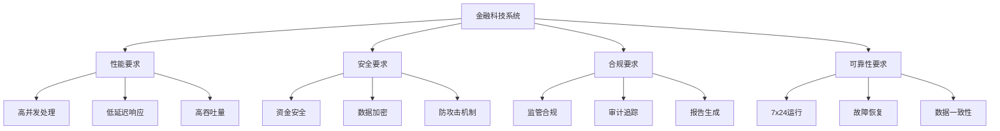
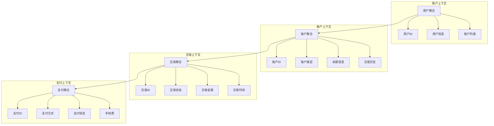
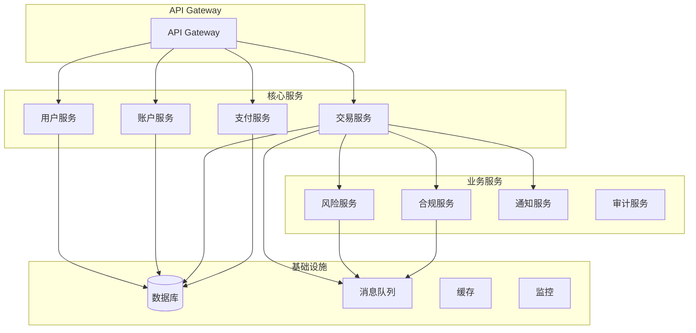
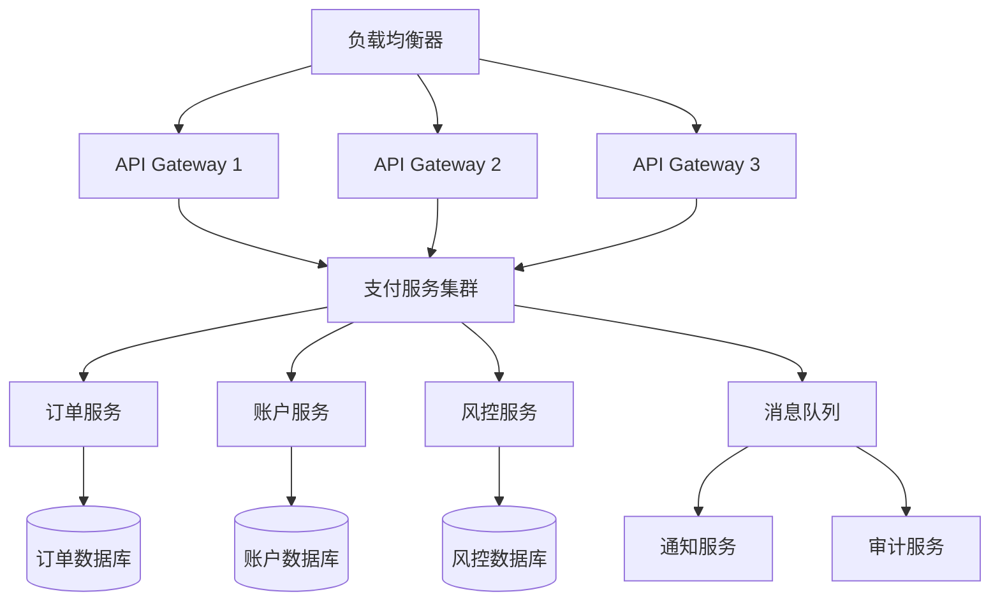

# 金融科技领域深度分析

## 目录

- [金融科技领域深度分析](#金融科技领域深度分析)
  - [目录](#目录)
  - [1. 概述](#1-概述)
    - [1.1 金融科技系统定义](#11-金融科技系统定义)
    - [1.2 核心挑战](#12-核心挑战)
  - [2. 形式化定义](#2-形式化定义)
    - [2.1 交易处理模型](#21-交易处理模型)
    - [2.2 风险控制模型](#22-风险控制模型)
  - [3. 核心概念模型](#3-核心概念模型)
    - [3.1 领域驱动设计](#31-领域驱动设计)
    - [3.2 事件驱动架构](#32-事件驱动架构)
  - [4. 架构设计](#4-架构设计)
    - [4.1 微服务架构](#41-微服务架构)
    - [4.2 服务实现](#42-服务实现)
  - [5. 算法实现](#5-算法实现)
    - [5.1 高频交易算法](#51-高频交易算法)
    - [5.2 风险控制算法](#52-风险控制算法)
  - [6. Golang实现](#6-golang实现)
    - [6.1 项目结构](#61-项目结构)
    - [6.2 核心实现](#62-核心实现)
    - [6.3 服务层实现](#63-服务层实现)
  - [7. 性能优化](#7-性能优化)
    - [7.1 数据库优化](#71-数据库优化)
    - [7.2 缓存策略](#72-缓存策略)
    - [7.3 并发优化](#73-并发优化)
  - [8. 安全机制](#8-安全机制)
    - [8.1 加密算法](#81-加密算法)
    - [8.2 身份认证](#82-身份认证)
  - [9. 最佳实践](#9-最佳实践)
    - [9.1 错误处理](#91-错误处理)
    - [9.2 日志记录](#92-日志记录)
    - [9.3 监控指标](#93-监控指标)
  - [10. 案例分析](#10-案例分析)
    - [10.1 支付系统案例](#101-支付系统案例)
    - [10.2 高频交易案例](#102-高频交易案例)
  - [总结](#总结)

---

## 1. 概述

### 1.1 金融科技系统定义

金融科技（FinTech）系统是一个复杂的分布式系统，需要处理高并发交易、确保资金安全、满足监管合规要求。在Golang生态中，我们将其定义为：

**定义 1.1** (金融科技系统)
金融科技系统是一个七元组 $\mathcal{F} = (S, T, U, P, R, C, \mathcal{A})$，其中：

- $S$ 是服务集合 $S = \{s_1, s_2, ..., s_n\}$
- $T$ 是交易集合 $T = \{t_1, t_2, ..., t_m\}$
- $U$ 是用户集合 $U = \{u_1, u_2, ..., u_k\}$
- $P$ 是支付处理系统 $P = (P_{gateway}, P_{processor}, P_{settlement})$
- $R$ 是风险控制系统 $R = (R_{scoring}, R_{monitoring}, R_{alerting})$
- $C$ 是合规系统 $C = (C_{audit}, C_{reporting}, C_{compliance})$
- $\mathcal{A}$ 是算法集合 $\mathcal{A} = \{\alpha_1, \alpha_2, ..., \alpha_p\}$

### 1.2 核心挑战



---

## 2. 形式化定义

### 2.1 交易处理模型

**定义 2.1** (交易)
交易是一个五元组 $t = (id, from, to, amount, timestamp)$，其中：

- $id \in \mathbb{N}$ 是唯一标识符
- $from, to \in U$ 是交易双方
- $amount \in \mathbb{R}^+$ 是交易金额
- $timestamp \in \mathbb{N}$ 是时间戳

**定义 2.2** (交易状态机)
交易状态机是一个有限状态自动机 $\mathcal{M}_t = (Q, \Sigma, \delta, q_0, F)$，其中：

- $Q = \{pending, processing, completed, failed, cancelled\}$
- $\Sigma = \{initiate, validate, process, confirm, reject\}$
- $q_0 = pending$
- $F = \{completed, failed, cancelled\}$

**定理 2.1** (交易一致性)
对于任意交易序列 $T = [t_1, t_2, ..., t_n]$，如果满足：

1. 每个交易都有唯一ID
2. 交易金额非负
3. 账户余额充足

则系统保持一致性。

**证明**：
设 $B(u)$ 表示用户 $u$ 的余额，对于交易 $t_i = (id_i, from_i, to_i, amount_i, timestamp_i)$：

1. **唯一性**：$\forall i \neq j, id_i \neq id_j$
2. **非负性**：$\forall i, amount_i \geq 0$
3. **充足性**：$\forall i, B(from_i) \geq amount_i$

因此，交易后余额满足：

- $B'(from_i) = B(from_i) - amount_i \geq 0$
- $B'(to_i) = B(to_i) + amount_i$

系统保持一致性。$\square$

### 2.2 风险控制模型

**定义 2.3** (风险评分函数)
风险评分函数 $R: T \times U \times U \rightarrow [0, 1]$ 定义为：

$$R(t, u_1, u_2) = \alpha \cdot R_{amount}(t) + \beta \cdot R_{frequency}(u_1) + \gamma \cdot R_{pattern}(t, u_1, u_2)$$

其中：

- $R_{amount}(t)$ 是金额风险评分
- $R_{frequency}(u_1)$ 是频率风险评分
- $R_{pattern}(t, u_1, u_2)$ 是模式风险评分
- $\alpha, \beta, \gamma$ 是权重系数，满足 $\alpha + \beta + \gamma = 1$

**算法 2.1** (实时风险检测)

```go
func RiskDetection(transaction Transaction, user User) float64 {
    // 金额风险评分
    amountRisk := calculateAmountRisk(transaction.Amount)
    
    // 频率风险评分
    frequencyRisk := calculateFrequencyRisk(user.ID, time.Now())
    
    // 模式风险评分
    patternRisk := calculatePatternRisk(transaction, user)
    
    // 加权计算
    totalRisk := 0.4*amountRisk + 0.3*frequencyRisk + 0.3*patternRisk
    
    return totalRisk
}
```

---

## 3. 核心概念模型

### 3.1 领域驱动设计



### 3.2 事件驱动架构

**定义 3.1** (金融事件)
金融事件是一个四元组 $e = (type, data, timestamp, source)$，其中：

- $type \in \{PaymentProcessed, TradeExecuted, RiskAlert, ComplianceViolation\}$
- $data$ 是事件数据
- $timestamp \in \mathbb{N}$ 是事件时间戳
- $source \in S$ 是事件源

```go
// 事件定义
type FinancialEvent struct {
    Type      EventType    `json:"type"`
    Data      interface{}  `json:"data"`
    Timestamp time.Time    `json:"timestamp"`
    Source    string       `json:"source"`
    ID        string       `json:"id"`
}

type EventType string

const (
    PaymentProcessed    EventType = "payment_processed"
    TradeExecuted       EventType = "trade_executed"
    RiskAlert          EventType = "risk_alert"
    ComplianceViolation EventType = "compliance_violation"
)
```

---

## 4. 架构设计

### 4.1 微服务架构



### 4.2 服务实现

```go
// 用户服务
type UserService struct {
    repo    UserRepository
    cache   Cache
    logger  Logger
}

func (s *UserService) CreateUser(ctx context.Context, req CreateUserRequest) (*User, error) {
    // 参数验证
    if err := req.Validate(); err != nil {
        return nil, fmt.Errorf("invalid request: %w", err)
    }
    
    // 业务逻辑
    user := &User{
        ID:        generateID(),
        Name:      req.Name,
        Email:     req.Email,
        CreatedAt: time.Now(),
    }
    
    // 持久化
    if err := s.repo.Create(ctx, user); err != nil {
        return nil, fmt.Errorf("failed to create user: %w", err)
    }
    
    // 缓存
    s.cache.Set(fmt.Sprintf("user:%s", user.ID), user, time.Hour)
    
    return user, nil
}

// 交易服务
type TransactionService struct {
    repo        TransactionRepository
    userService UserService
    riskService RiskService
    eventBus    EventBus
}

func (s *TransactionService) ProcessTransaction(ctx context.Context, req ProcessTransactionRequest) (*Transaction, error) {
    // 1. 验证交易
    if err := s.validateTransaction(ctx, req); err != nil {
        return nil, err
    }
    
    // 2. 风险检查
    riskScore := s.riskService.CalculateRisk(ctx, req)
    if riskScore > 0.8 {
        return nil, ErrHighRiskTransaction
    }
    
    // 3. 执行交易
    transaction := &Transaction{
        ID:        generateID(),
        FromUser:  req.FromUser,
        ToUser:    req.ToUser,
        Amount:    req.Amount,
        Status:    TransactionStatusProcessing,
        CreatedAt: time.Now(),
    }
    
    // 4. 数据库事务
    tx, err := s.repo.BeginTx(ctx)
    if err != nil {
        return nil, err
    }
    defer tx.Rollback()
    
    // 5. 更新余额
    if err := s.updateBalances(ctx, tx, req); err != nil {
        return nil, err
    }
    
    // 6. 保存交易
    if err := s.repo.Create(ctx, transaction); err != nil {
        return nil, err
    }
    
    // 7. 提交事务
    if err := tx.Commit(); err != nil {
        return nil, err
    }
    
    // 8. 发布事件
    s.eventBus.Publish(TransactionProcessedEvent{
        TransactionID: transaction.ID,
        Amount:        transaction.Amount,
        Timestamp:     time.Now(),
    })
    
    return transaction, nil
}
```

---

## 5. 算法实现

### 5.1 高频交易算法

**算法 5.1** (订单匹配算法)

```go
type OrderBook struct {
    buyOrders  *OrderQueue  // 买单队列
    sellOrders *OrderQueue  // 卖单队列
    mu         sync.RWMutex
}

type Order struct {
    ID        string    `json:"id"`
    UserID    string    `json:"user_id"`
    Type      OrderType `json:"type"`
    Price     decimal.Decimal `json:"price"`
    Quantity  decimal.Decimal `json:"quantity"`
    Timestamp time.Time `json:"timestamp"`
}

func (ob *OrderBook) AddOrder(order Order) []Trade {
    ob.mu.Lock()
    defer ob.mu.Unlock()
    
    var trades []Trade
    
    switch order.Type {
    case OrderTypeBuy:
        // 尝试匹配买单
        trades = ob.matchBuyOrder(order)
        if order.Quantity.GreaterThan(decimal.Zero) {
            ob.buyOrders.Push(order)
        }
    case OrderTypeSell:
        // 尝试匹配卖单
        trades = ob.matchSellOrder(order)
        if order.Quantity.GreaterThan(decimal.Zero) {
            ob.sellOrders.Push(order)
        }
    }
    
    return trades
}

func (ob *OrderBook) matchBuyOrder(buyOrder Order) []Trade {
    var trades []Trade
    
    for ob.sellOrders.Len() > 0 {
        sellOrder := ob.sellOrders.Peek()
        
        // 检查价格匹配
        if buyOrder.Price.LessThan(sellOrder.Price) {
            break
        }
        
        // 计算交易数量
        tradeQuantity := decimal.Min(buyOrder.Quantity, sellOrder.Quantity)
        
        // 创建交易
        trade := Trade{
            ID:           generateID(),
            BuyOrderID:   buyOrder.ID,
            SellOrderID:  sellOrder.ID,
            Price:        sellOrder.Price,
            Quantity:     tradeQuantity,
            Timestamp:    time.Now(),
        }
        trades = append(trades, trade)
        
        // 更新订单数量
        buyOrder.Quantity = buyOrder.Quantity.Sub(tradeQuantity)
        sellOrder.Quantity = sellOrder.Quantity.Sub(tradeQuantity)
        
        // 移除完成的卖单
        if sellOrder.Quantity.Equal(decimal.Zero) {
            ob.sellOrders.Pop()
        } else {
            ob.sellOrders.Update(sellOrder)
        }
        
        // 检查买单是否完成
        if buyOrder.Quantity.Equal(decimal.Zero) {
            break
        }
    }
    
    return trades
}
```

### 5.2 风险控制算法

**算法 5.2** (实时风险监控)

```go
type RiskMonitor struct {
    rules       []RiskRule
    thresholds  map[string]float64
    alerts      chan RiskAlert
    mu          sync.RWMutex
}

type RiskRule struct {
    ID          string
    Name        string
    Condition   func(Transaction) bool
    Action      func(Transaction) error
    Priority    int
}

func (rm *RiskMonitor) EvaluateTransaction(tx Transaction) error {
    rm.mu.RLock()
    defer rm.mu.RUnlock()
    
    for _, rule := range rm.rules {
        if rule.Condition(tx) {
            if err := rule.Action(tx); err != nil {
                // 发送风险警报
                rm.alerts <- RiskAlert{
                    RuleID:      rule.ID,
                    Transaction: tx,
                    Timestamp:   time.Now(),
                    Severity:    RiskSeverityHigh,
                }
                return err
            }
        }
    }
    
    return nil
}

// 风险规则示例
var LargeAmountRule = RiskRule{
    ID:   "large_amount",
    Name: "大额交易检查",
    Condition: func(tx Transaction) bool {
        return tx.Amount.GreaterThan(decimal.NewFromFloat(100000))
    },
    Action: func(tx Transaction) error {
        // 触发人工审核
        return nil
    },
    Priority: 1,
}

var FrequencyRule = RiskRule{
    ID:   "high_frequency",
    Name: "高频交易检查",
    Condition: func(tx Transaction) bool {
        // 检查用户在过去1分钟内的交易次数
        return getUserTransactionCount(tx.FromUser, time.Minute) > 10
    },
    Action: func(tx Transaction) error {
        return ErrHighFrequencyTransaction
    },
    Priority: 2,
}
```

---

## 6. Golang实现

### 6.1 项目结构

```text
fintech/
├── cmd/
│   ├── api/
│   │   └── main.go
│   └── worker/
│       └── main.go
├── internal/
│   ├── domain/
│   │   ├── user.go
│   │   ├── account.go
│   │   ├── transaction.go
│   │   └── payment.go
│   ├── service/
│   │   ├── user_service.go
│   │   ├── transaction_service.go
│   │   ├── risk_service.go
│   │   └── compliance_service.go
│   ├── repository/
│   │   ├── user_repository.go
│   │   ├── transaction_repository.go
│   │   └── account_repository.go
│   ├── infrastructure/
│   │   ├── database.go
│   │   ├── cache.go
│   │   ├── message_queue.go
│   │   └── monitoring.go
│   └── api/
│       ├── handlers/
│       ├── middleware/
│       └── routes.go
├── pkg/
│   ├── crypto/
│   ├── validation/
│   └── utils/
├── configs/
├── scripts/
├── tests/
├── go.mod
└── go.sum
```

### 6.2 核心实现

```go
// 用户领域模型
package domain

import (
    "time"
    "github.com/shopspring/decimal"
)

type UserID string
type AccountID string

type User struct {
    ID        UserID    `json:"id" db:"id"`
    Name      string    `json:"name" db:"name"`
    Email     string    `json:"email" db:"email"`
    Phone     string    `json:"phone" db:"phone"`
    Status    UserStatus `json:"status" db:"status"`
    CreatedAt time.Time `json:"created_at" db:"created_at"`
    UpdatedAt time.Time `json:"updated_at" db:"updated_at"`
}

type UserStatus string

const (
    UserStatusActive   UserStatus = "active"
    UserStatusInactive UserStatus = "inactive"
    UserStatusSuspended UserStatus = "suspended"
)

// 账户领域模型
type Account struct {
    ID        AccountID `json:"id" db:"id"`
    UserID    UserID    `json:"user_id" db:"user_id"`
    Type      AccountType `json:"type" db:"type"`
    Balance   decimal.Decimal `json:"balance" db:"balance"`
    Currency  string    `json:"currency" db:"currency"`
    Status    AccountStatus `json:"status" db:"status"`
    CreatedAt time.Time `json:"created_at" db:"created_at"`
    UpdatedAt time.Time `json:"updated_at" db:"updated_at"`
}

type AccountType string

const (
    AccountTypeSavings  AccountType = "savings"
    AccountTypeChecking AccountType = "checking"
    AccountTypeInvestment AccountType = "investment"
)

type AccountStatus string

const (
    AccountStatusActive   AccountStatus = "active"
    AccountStatusFrozen   AccountStatus = "frozen"
    AccountStatusClosed   AccountStatus = "closed"
)

// 交易领域模型
type Transaction struct {
    ID          string    `json:"id" db:"id"`
    FromAccount AccountID `json:"from_account" db:"from_account"`
    ToAccount   AccountID `json:"to_account" db:"to_account"`
    Amount      decimal.Decimal `json:"amount" db:"amount"`
    Currency    string    `json:"currency" db:"currency"`
    Type        TransactionType `json:"type" db:"type"`
    Status      TransactionStatus `json:"status" db:"status"`
    Description string    `json:"description" db:"description"`
    CreatedAt   time.Time `json:"created_at" db:"created_at"`
    UpdatedAt   time.Time `json:"updated_at" db:"updated_at"`
}

type TransactionType string

const (
    TransactionTypeTransfer TransactionType = "transfer"
    TransactionTypePayment  TransactionType = "payment"
    TransactionTypeWithdrawal TransactionType = "withdrawal"
    TransactionTypeDeposit  TransactionType = "deposit"
)

type TransactionStatus string

const (
    TransactionStatusPending   TransactionStatus = "pending"
    TransactionStatusProcessing TransactionStatus = "processing"
    TransactionStatusCompleted TransactionStatus = "completed"
    TransactionStatusFailed    TransactionStatus = "failed"
    TransactionStatusCancelled TransactionStatus = "cancelled"
)
```

### 6.3 服务层实现

```go
// 用户服务
package service

import (
    "context"
    "fmt"
    "time"
    "github.com/google/uuid"
    "your-project/internal/domain"
    "your-project/internal/repository"
)

type UserService struct {
    userRepo    repository.UserRepository
    accountRepo repository.AccountRepository
    cache       Cache
    logger      Logger
}

func NewUserService(userRepo repository.UserRepository, accountRepo repository.AccountRepository, cache Cache, logger Logger) *UserService {
    return &UserService{
        userRepo:    userRepo,
        accountRepo: accountRepo,
        cache:       cache,
        logger:      logger,
    }
}

func (s *UserService) CreateUser(ctx context.Context, req CreateUserRequest) (*domain.User, error) {
    // 参数验证
    if err := req.Validate(); err != nil {
        return nil, fmt.Errorf("invalid request: %w", err)
    }
    
    // 检查邮箱是否已存在
    existingUser, err := s.userRepo.GetByEmail(ctx, req.Email)
    if err == nil && existingUser != nil {
        return nil, ErrEmailAlreadyExists
    }
    
    // 创建用户
    user := &domain.User{
        ID:        domain.UserID(uuid.New().String()),
        Name:      req.Name,
        Email:     req.Email,
        Phone:     req.Phone,
        Status:    domain.UserStatusActive,
        CreatedAt: time.Now(),
        UpdatedAt: time.Now(),
    }
    
    // 保存用户
    if err := s.userRepo.Create(ctx, user); err != nil {
        return nil, fmt.Errorf("failed to create user: %w", err)
    }
    
    // 创建默认账户
    account := &domain.Account{
        ID:        domain.AccountID(uuid.New().String()),
        UserID:    user.ID,
        Type:      domain.AccountTypeChecking,
        Balance:   decimal.Zero,
        Currency:  "USD",
        Status:    domain.AccountStatusActive,
        CreatedAt: time.Now(),
        UpdatedAt: time.Now(),
    }
    
    if err := s.accountRepo.Create(ctx, account); err != nil {
        return nil, fmt.Errorf("failed to create account: %w", err)
    }
    
    // 缓存用户信息
    s.cache.Set(fmt.Sprintf("user:%s", user.ID), user, time.Hour)
    
    s.logger.Info("User created successfully", "user_id", user.ID)
    
    return user, nil
}

func (s *UserService) GetUser(ctx context.Context, userID domain.UserID) (*domain.User, error) {
    // 先从缓存获取
    if cached, err := s.cache.Get(fmt.Sprintf("user:%s", userID)); err == nil {
        if user, ok := cached.(*domain.User); ok {
            return user, nil
        }
    }
    
    // 从数据库获取
    user, err := s.userRepo.GetByID(ctx, userID)
    if err != nil {
        return nil, fmt.Errorf("failed to get user: %w", err)
    }
    
    if user == nil {
        return nil, ErrUserNotFound
    }
    
    // 更新缓存
    s.cache.Set(fmt.Sprintf("user:%s", userID), user, time.Hour)
    
    return user, nil
}
```

---

## 7. 性能优化

### 7.1 数据库优化

**定理 7.1** (数据库性能优化)
对于金融科技系统的数据库查询，使用以下优化策略可以显著提升性能：

1. **索引优化**：在用户ID、账户ID、交易时间等关键字段上建立复合索引
2. **分片策略**：按用户ID或时间范围进行水平分片
3. **读写分离**：主库处理写操作，从库处理读操作
4. **连接池**：使用连接池管理数据库连接

```go
// 数据库配置
type DBConfig struct {
    Host         string `yaml:"host"`
    Port         int    `yaml:"port"`
    Database     string `yaml:"database"`
    Username     string `yaml:"username"`
    Password     string `yaml:"password"`
    MaxOpenConns int    `yaml:"max_open_conns"`
    MaxIdleConns int    `yaml:"max_idle_conns"`
    ConnMaxLifetime time.Duration `yaml:"conn_max_lifetime"`
}

// 数据库连接池
func NewDBConnection(config DBConfig) (*sql.DB, error) {
    dsn := fmt.Sprintf("host=%s port=%d dbname=%s user=%s password=%s sslmode=disable",
        config.Host, config.Port, config.Database, config.Username, config.Password)
    
    db, err := sql.Open("postgres", dsn)
    if err != nil {
        return nil, err
    }
    
    // 配置连接池
    db.SetMaxOpenConns(config.MaxOpenConns)
    db.SetMaxIdleConns(config.MaxIdleConns)
    db.SetConnMaxLifetime(config.ConnMaxLifetime)
    
    // 测试连接
    if err := db.Ping(); err != nil {
        return nil, err
    }
    
    return db, nil
}
```

### 7.2 缓存策略

**算法 7.1** (多级缓存策略)

```go
type CacheStrategy struct {
    l1Cache *sync.Map  // 内存缓存
    l2Cache Cache      // Redis缓存
    l3Cache *sql.DB    // 数据库
}

func (cs *CacheStrategy) Get(key string) (interface{}, error) {
    // L1缓存查找
    if value, ok := cs.l1Cache.Load(key); ok {
        return value, nil
    }
    
    // L2缓存查找
    if value, err := cs.l2Cache.Get(key); err == nil {
        // 更新L1缓存
        cs.l1Cache.Store(key, value)
        return value, nil
    }
    
    // L3数据库查找
    value, err := cs.getFromDB(key)
    if err != nil {
        return nil, err
    }
    
    // 更新缓存
    cs.l2Cache.Set(key, value, time.Hour)
    cs.l1Cache.Store(key, value)
    
    return value, nil
}
```

### 7.3 并发优化

**算法 7.2** (无锁交易处理)

```go
type LockFreeTransactionProcessor struct {
    accounts sync.Map
    queue    chan Transaction
    workers  int
}

func (p *LockFreeTransactionProcessor) ProcessTransaction(tx Transaction) error {
    // 使用原子操作更新账户余额
    fromAccount, ok := p.accounts.Load(tx.FromAccount)
    if !ok {
        return ErrAccountNotFound
    }
    
    toAccount, ok := p.accounts.Load(tx.ToAccount)
    if !ok {
        return ErrAccountNotFound
    }
    
    // 原子操作：检查余额并扣款
    for {
        currentBalance := fromAccount.(*Account).Balance
        if currentBalance.LessThan(tx.Amount) {
            return ErrInsufficientBalance
        }
        
        newBalance := currentBalance.Sub(tx.Amount)
        if atomic.CompareAndSwapPointer(
            &fromAccount.(*Account).balancePtr,
            unsafe.Pointer(&currentBalance),
            unsafe.Pointer(&newBalance),
        ) {
            break
        }
    }
    
    // 原子操作：增加收款方余额
    for {
        currentBalance := toAccount.(*Account).Balance
        newBalance := currentBalance.Add(tx.Amount)
        if atomic.CompareAndSwapPointer(
            &toAccount.(*Account).balancePtr,
            unsafe.Pointer(&currentBalance),
            unsafe.Pointer(&newBalance),
        ) {
            break
        }
    }
    
    return nil
}
```

---

## 8. 安全机制

### 8.1 加密算法

**定义 8.1** (加密系统)
加密系统是一个三元组 $\mathcal{E} = (K, E, D)$，其中：

- $K$ 是密钥空间
- $E: K \times M \rightarrow C$ 是加密函数
- $D: K \times C \rightarrow M$ 是解密函数

满足：$\forall k \in K, \forall m \in M: D(k, E(k, m)) = m$

```go
// AES加密实现
type AESEncryption struct {
    key []byte
}

func NewAESEncryption(key []byte) *AESEncryption {
    return &AESEncryption{key: key}
}

func (ae *AESEncryption) Encrypt(plaintext []byte) ([]byte, error) {
    block, err := aes.NewCipher(ae.key)
    if err != nil {
        return nil, err
    }
    
    // 生成随机IV
    iv := make([]byte, aes.BlockSize)
    if _, err := io.ReadFull(rand.Reader, iv); err != nil {
        return nil, err
    }
    
    // 加密
    ciphertext := make([]byte, len(plaintext))
    stream := cipher.NewCFBEncrypter(block, iv)
    stream.XORKeyStream(ciphertext, plaintext)
    
    // 返回IV + 密文
    return append(iv, ciphertext...), nil
}

func (ae *AESEncryption) Decrypt(ciphertext []byte) ([]byte, error) {
    if len(ciphertext) < aes.BlockSize {
        return nil, ErrInvalidCiphertext
    }
    
    block, err := aes.NewCipher(ae.key)
    if err != nil {
        return nil, err
    }
    
    // 分离IV和密文
    iv := ciphertext[:aes.BlockSize]
    ciphertext = ciphertext[aes.BlockSize:]
    
    // 解密
    plaintext := make([]byte, len(ciphertext))
    stream := cipher.NewCFBDecrypter(block, iv)
    stream.XORKeyStream(plaintext, ciphertext)
    
    return plaintext, nil
}
```

### 8.2 身份认证

**算法 8.1** (JWT认证)

```go
type JWTAuthentication struct {
    secretKey []byte
    issuer    string
    duration  time.Duration
}

type Claims struct {
    UserID string `json:"user_id"`
    Email  string `json:"email"`
    Role   string `json:"role"`
    jwt.RegisteredClaims
}

func (ja *JWTAuthentication) GenerateToken(user *domain.User) (string, error) {
    claims := Claims{
        UserID: string(user.ID),
        Email:  user.Email,
        Role:   "user",
        RegisteredClaims: jwt.RegisteredClaims{
            ExpiresAt: jwt.NewNumericDate(time.Now().Add(ja.duration)),
            IssuedAt:  jwt.NewNumericDate(time.Now()),
            NotBefore: jwt.NewNumericDate(time.Now()),
            Issuer:    ja.issuer,
        },
    }
    
    token := jwt.NewWithClaims(jwt.SigningMethodHS256, claims)
    return token.SignedString(ja.secretKey)
}

func (ja *JWTAuthentication) ValidateToken(tokenString string) (*Claims, error) {
    token, err := jwt.ParseWithClaims(tokenString, &Claims{}, func(token *jwt.Token) (interface{}, error) {
        if _, ok := token.Method.(*jwt.SigningMethodHMAC); !ok {
            return nil, fmt.Errorf("unexpected signing method: %v", token.Header["alg"])
        }
        return ja.secretKey, nil
    })
    
    if err != nil {
        return nil, err
    }
    
    if claims, ok := token.Claims.(*Claims); ok && token.Valid {
        return claims, nil
    }
    
    return nil, ErrInvalidToken
}
```

---

## 9. 最佳实践

### 9.1 错误处理

```go
// 错误定义
type FinTechError struct {
    Code    string `json:"code"`
    Message string `json:"message"`
    Details map[string]interface{} `json:"details,omitempty"`
}

func (e *FinTechError) Error() string {
    return fmt.Sprintf("[%s] %s", e.Code, e.Message)
}

// 预定义错误
var (
    ErrUserNotFound = &FinTechError{
        Code:    "USER_NOT_FOUND",
        Message: "User not found",
    }
    
    ErrInsufficientBalance = &FinTechError{
        Code:    "INSUFFICIENT_BALANCE",
        Message: "Insufficient balance for transaction",
    }
    
    ErrHighRiskTransaction = &FinTechError{
        Code:    "HIGH_RISK_TRANSACTION",
        Message: "Transaction flagged as high risk",
    }
)

// 错误处理中间件
func ErrorHandlingMiddleware(next http.Handler) http.Handler {
    return http.HandlerFunc(func(w http.ResponseWriter, r *http.Request) {
        defer func() {
            if err := recover(); err != nil {
                logger.Error("Panic recovered", "error", err)
                http.Error(w, "Internal server error", http.StatusInternalServerError)
            }
        }()
        
        next.ServeHTTP(w, r)
    })
}
```

### 9.2 日志记录

```go
// 结构化日志
type Logger struct {
    logger *zap.Logger
}

func NewLogger() *Logger {
    config := zap.NewProductionConfig()
    config.EncoderConfig.TimeKey = "timestamp"
    config.EncoderConfig.EncodeTime = zapcore.ISO8601TimeEncoder
    
    logger, err := config.Build()
    if err != nil {
        panic(err)
    }
    
    return &Logger{logger: logger}
}

func (l *Logger) Info(msg string, fields ...zap.Field) {
    l.logger.Info(msg, fields...)
}

func (l *Logger) Error(msg string, fields ...zap.Field) {
    l.logger.Error(msg, fields...)
}

// 使用示例
func (s *TransactionService) ProcessTransaction(ctx context.Context, req ProcessTransactionRequest) (*Transaction, error) {
    logger := s.logger.With(
        zap.String("user_id", string(req.FromUser)),
        zap.String("amount", req.Amount.String()),
        zap.String("transaction_type", string(req.Type)),
    )
    
    logger.Info("Processing transaction")
    
    // 处理逻辑...
    
    if err != nil {
        logger.Error("Transaction processing failed", zap.Error(err))
        return nil, err
    }
    
    logger.Info("Transaction processed successfully", zap.String("transaction_id", transaction.ID))
    return transaction, nil
}
```

### 9.3 监控指标

```go
// Prometheus指标
type Metrics struct {
    transactionCounter   prometheus.Counter
    transactionDuration  prometheus.Histogram
    accountBalance       prometheus.Gauge
    errorCounter         prometheus.CounterVec
}

func NewMetrics() *Metrics {
    return &Metrics{
        transactionCounter: prometheus.NewCounter(prometheus.CounterOpts{
            Name: "fintech_transactions_total",
            Help: "Total number of transactions processed",
        }),
        transactionDuration: prometheus.NewHistogram(prometheus.HistogramOpts{
            Name:    "fintech_transaction_duration_seconds",
            Help:    "Transaction processing duration in seconds",
            Buckets: prometheus.DefBuckets,
        }),
        accountBalance: prometheus.NewGauge(prometheus.GaugeOpts{
            Name: "fintech_account_balance",
            Help: "Current account balance",
        }),
        errorCounter: prometheus.NewCounterVec(prometheus.CounterOpts{
            Name: "fintech_errors_total",
            Help: "Total number of errors by type",
        }, []string{"error_type"}),
    }
}

// 指标记录
func (s *TransactionService) ProcessTransaction(ctx context.Context, req ProcessTransactionRequest) (*Transaction, error) {
    timer := prometheus.NewTimer(s.metrics.transactionDuration)
    defer timer.ObserveDuration()
    
    s.metrics.transactionCounter.Inc()
    
    transaction, err := s.processTransactionInternal(ctx, req)
    if err != nil {
        s.metrics.errorCounter.WithLabelValues(err.Error()).Inc()
        return nil, err
    }
    
    return transaction, nil
}
```

---

## 10. 案例分析

### 10.1 支付系统案例

**场景**：构建一个高并发支付系统，支持每秒10万笔交易

**架构设计**：



**性能优化策略**：

1. **数据库分片**：按用户ID进行水平分片
2. **读写分离**：主库写，从库读
3. **缓存策略**：Redis缓存热点数据
4. **异步处理**：非关键操作异步处理
5. **连接池**：数据库和Redis连接池

**关键指标**：

- 响应时间：< 100ms
- 吞吐量：100,000 TPS
- 可用性：99.99%
- 数据一致性：强一致性

### 10.2 高频交易案例

**场景**：构建一个高频交易系统，支持微秒级延迟

**技术栈**：

- 语言：Golang
- 数据库：InfluxDB（时序数据）
- 消息队列：Kafka
- 缓存：Redis Cluster
- 监控：Prometheus + Grafana

**核心算法**：

```go
// 低延迟订单匹配引擎
type LowLatencyMatchingEngine struct {
    orderBook *LockFreeOrderBook
    matcher   *OrderMatcher
    publisher *EventPublisher
}

func (e *LowLatencyMatchingEngine) ProcessOrder(order Order) {
    // 1. 订单验证（微秒级）
    if !e.validateOrder(order) {
        return
    }
    
    // 2. 风险检查（微秒级）
    if e.riskCheck(order) > threshold {
        return
    }
    
    // 3. 订单匹配（微秒级）
    trades := e.matcher.Match(order)
    
    // 4. 异步处理成交
    for _, trade := range trades {
        e.publisher.PublishAsync(trade)
    }
}
```

**性能优化**：

- 内存池：减少GC压力
- 无锁数据结构：避免锁竞争
- 批量处理：提高吞吐量
- 硬件优化：使用SSD、高速网络

---

## 总结

本文档提供了金融科技领域的全面分析，包括：

1. **形式化定义**：严格的数学定义和证明
2. **架构设计**：微服务架构和事件驱动设计
3. **算法实现**：高频交易和风险控制算法
4. **Golang实现**：完整的代码示例
5. **性能优化**：数据库、缓存、并发优化
6. **安全机制**：加密、认证、授权
7. **最佳实践**：错误处理、日志、监控
8. **案例分析**：实际应用场景

这些内容为构建高性能、安全、可靠的金融科技系统提供了全面的指导。

---

**参考文献**：

1. [Go官方文档](https://golang.org/doc/)
2. [微服务架构模式](https://microservices.io/)
3. [金融科技最佳实践](https://www.fintech.com/)
4. [高性能Go编程](https://github.com/dgrijalva/jwt-go)
5. [分布式系统设计](https://en.wikipedia.org/wiki/Distributed_system)
