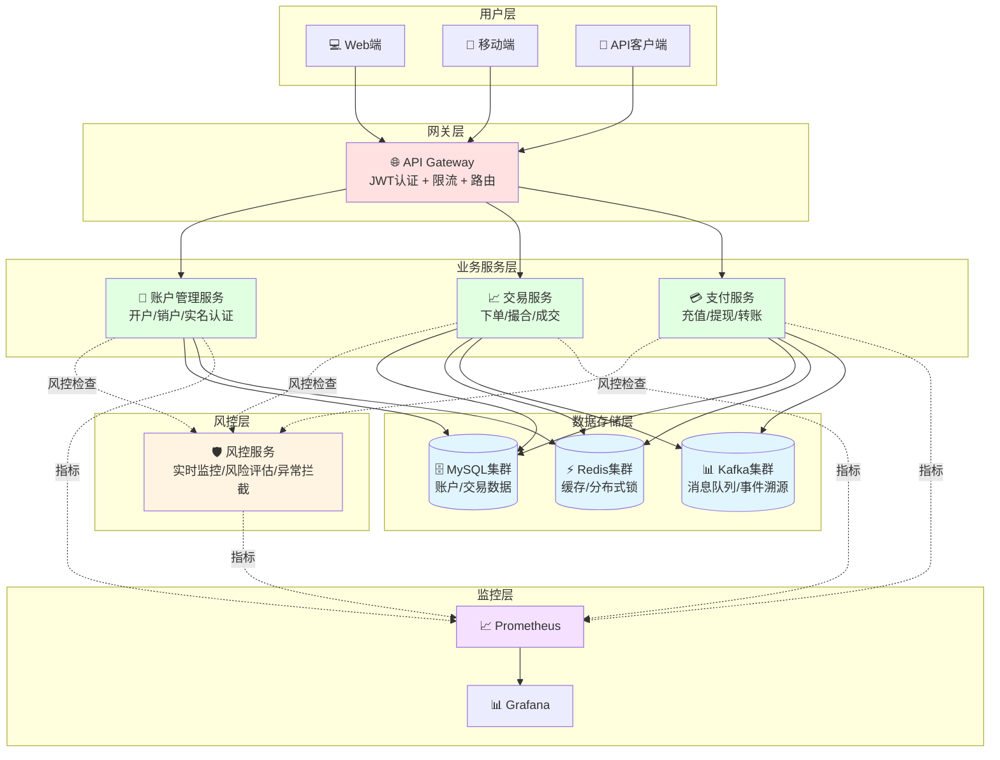
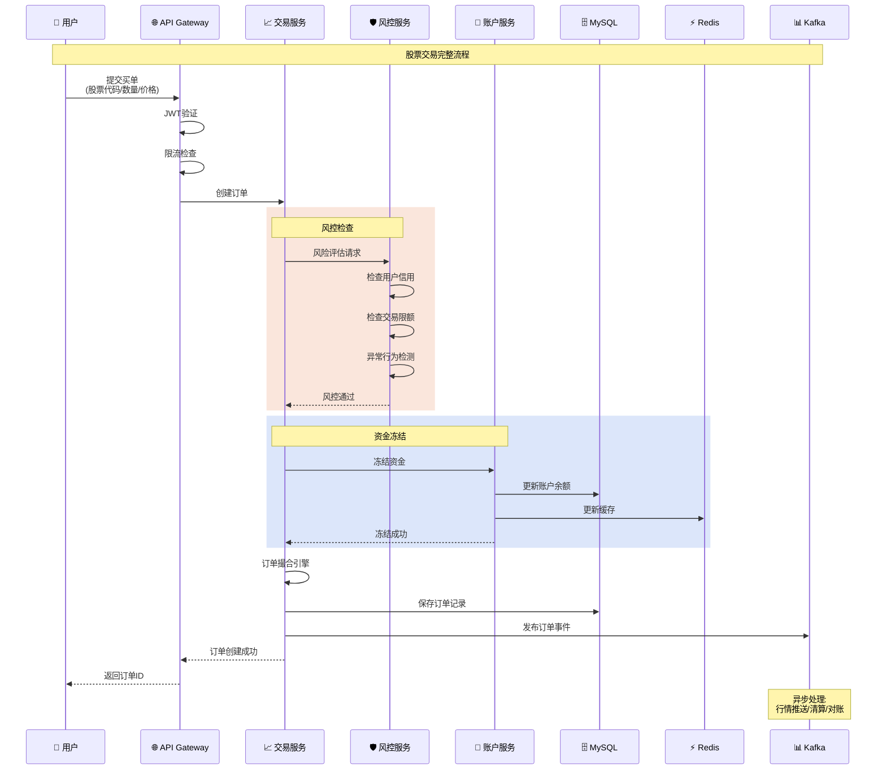

# 金融系统 - Go 语言实战

> 使用 Go 语言构建高性能、高可用的金融交易系统

---

## 📋 目录

- [金融系统 - Go 语言实战](#金融系统---go-语言实战)
  - [📋 目录](#-目录)
  - [系统概述](#系统概述)
    - [业务场景](#业务场景)
    - [Go 语言优势](#go-语言优势)
  - [核心业务模块](#核心业务模块)
    - [系统架构图](#系统架构图)
      - [金融系统架构可视化](#金融系统架构可视化)
      - [交易流程时序图](#交易流程时序图)
  - [账户管理系统](#账户管理系统)
    - [账户数据模型](#账户数据模型)
    - [账户服务实现](#账户服务实现)
  - [交易系统](#交易系统)
    - [订单模型](#订单模型)
    - [撮合引擎](#撮合引擎)
  - [支付清算系统](#支付清算系统)
    - [支付服务](#支付服务)
  - [风控系统](#风控系统)
    - [风控规则引擎](#风控规则引擎)
  - [实时行情系统](#实时行情系统)
    - [行情数据推送](#行情数据推送)
  - [数据一致性保证](#数据一致性保证)
    - [分布式事务 - Saga 模式](#分布式事务---saga-模式)
  - [性能优化](#性能优化)
    - [数据库优化](#数据库优化)
    - [Redis 缓存策略](#redis-缓存策略)
  - [安全加固](#安全加固)
    - [加密存储](#加密存储)
  - [监控与运维](#监控与运维)
    - [Prometheus 监控](#prometheus-监控)
  - [最佳实践](#最佳实践)
    - [1. 金额处理](#1-金额处理)
    - [2. 幂等性设计](#2-幂等性设计)
    - [3. 数据库事务](#3-数据库事务)
  - [总结](#总结)

---

## 系统概述

### 业务场景

金融系统是对性能、安全性、可靠性要求极高的系统，主要包括：

- **证券交易系统**: 股票、基金、期货交易
- **银行系统**: 存款、贷款、转账、支付
- **支付系统**: 第三方支付、清算结算
- **风控系统**: 反欺诈、反洗钱、信用评估

### Go 语言优势

```text
✅ 高并发处理能力 (goroutine)
✅ 出色的性能表现
✅ 内置并发安全机制
✅ 简洁的错误处理
✅ 丰富的标准库
✅ 快速的编译部署
```

---

## 核心业务模块

### 系统架构图

```text
┌─────────────────────────────────────────────────────────┐
│                    API Gateway (网关层)                  │
│              身份认证 | 限流 | 路由 | 日志                │
└─────────────────────────────────────────────────────────┘
                            │
          ┌─────────────────┼─────────────────┐
          ↓                 ↓                 ↓
┌──────────────────┐ ┌──────────────┐ ┌──────────────┐
│   账户管理服务    │ │  交易服务     │ │  支付服务     │
│  - 开户/销户     │ │  - 下单       │ │  - 充值/提现  │
│  - 实名认证      │ │  - 撮合       │ │  - 转账       │
│  - 资金查询      │ │  - 成交       │ │  - 清算       │
└──────────────────┘ └──────────────┘ └──────────────┘
          │                 │                 │
          └─────────────────┼─────────────────┘
                            ↓
                   ┌─────────────────┐
                   │   风控服务      │
                   │  - 实时监控     │
                   │  - 风险评估     │
                   │  - 异常拦截     │
                   └─────────────────┘
                            │
          ┌─────────────────┼─────────────────┐
          ↓                 ↓                 ↓
┌──────────────────┐ ┌──────────────┐ ┌──────────────┐
│   MySQL 集群     │ │  Redis 集群   │ │  Kafka 集群   │
│  - 账户数据      │ │  - 缓存       │ │  - 消息队列   │
│  - 交易记录      │ │  - 分布式锁   │ │  - 事件溯源   │
└──────────────────┘ └──────────────┘ └──────────────┘
```

#### 金融系统架构可视化



#### 交易流程时序图



---

## 账户管理系统

### 账户数据模型

```go
package account

import (
    "time"
    "github.com/shopspring/decimal"
)

// Account 账户实体
type Account struct {
    ID            int64           `json:"id" db:"id"`
    UserID        int64           `json:"user_id" db:"user_id"`
    AccountNo     string          `json:"account_no" db:"account_no"`      // 账号
    AccountType   AccountType     `json:"account_type" db:"account_type"`  // 账户类型
    Currency      string          `json:"currency" db:"currency"`          // 币种
    Balance       decimal.Decimal `json:"balance" db:"balance"`            // 余额
    FrozenAmount  decimal.Decimal `json:"frozen_amount" db:"frozen_amount"` // 冻结金额
    Status        AccountStatus   `json:"status" db:"status"`
    CreatedAt     time.Time       `json:"created_at" db:"created_at"`
    UpdatedAt     time.Time       `json:"updated_at" db:"updated_at"`
}

// AccountType 账户类型
type AccountType int

const (
    AccountTypeSavings   AccountType = 1 // 储蓄账户
    AccountTypeChecking  AccountType = 2 // 支票账户
    AccountTypeInvestment AccountType = 3 // 投资账户
)

// AccountStatus 账户状态
type AccountStatus int

const (
    AccountStatusActive   AccountStatus = 1 // 正常
    AccountStatusFrozen   AccountStatus = 2 // 冻结
    AccountStatusClosed   AccountStatus = 3 // 关闭
)

// BalanceChange 余额变动记录
type BalanceChange struct {
    ID            int64           `json:"id" db:"id"`
    AccountID     int64           `json:"account_id" db:"account_id"`
    TransactionID string          `json:"transaction_id" db:"transaction_id"`
    ChangeType    ChangeType      `json:"change_type" db:"change_type"`
    Amount        decimal.Decimal `json:"amount" db:"amount"`
    BalanceBefore decimal.Decimal `json:"balance_before" db:"balance_before"`
    BalanceAfter  decimal.Decimal `json:"balance_after" db:"balance_after"`
    Remark        string          `json:"remark" db:"remark"`
    CreatedAt     time.Time       `json:"created_at" db:"created_at"`
}

// ChangeType 变动类型
type ChangeType int

const (
    ChangeTypeDeposit    ChangeType = 1  // 存入
    ChangeTypeWithdraw   ChangeType = 2  // 取出
    ChangeTypeFreeze     ChangeType = 3  // 冻结
    ChangeTypeUnfreeze   ChangeType = 4  // 解冻
    ChangeTypeTransferIn ChangeType = 5  // 转入
    ChangeTypeTransferOut ChangeType = 6 // 转出
)
```

### 账户服务实现

```go
package account

import (
    "context"
    "database/sql"
    "errors"
    "github.com/shopspring/decimal"
)

var (
    ErrAccountNotFound     = errors.New("账户不存在")
    ErrInsufficientBalance = errors.New("余额不足")
    ErrAccountFrozen       = errors.New("账户已冻结")
)

// Service 账户服务
type Service struct {
    db *sql.DB
}

// NewService 创建账户服务
func NewService(db *sql.DB) *Service {
    return &Service{db: db}
}

// CreateAccount 创建账户
func (s *Service) CreateAccount(ctx context.Context, userID int64, accountType AccountType, currency string) (*Account, error) {
    // 生成账号
    accountNo := generateAccountNo()
    
    account := &Account{
        UserID:      userID,
        AccountNo:   accountNo,
        AccountType: accountType,
        Currency:    currency,
        Balance:     decimal.Zero,
        FrozenAmount: decimal.Zero,
        Status:      AccountStatusActive,
    }
    
    query := `
        INSERT INTO accounts (user_id, account_no, account_type, currency, balance, frozen_amount, status, created_at, updated_at)
        VALUES (?, ?, ?, ?, ?, ?, ?, NOW(), NOW())
    `
    
    result, err := s.db.ExecContext(ctx, query,
        account.UserID, account.AccountNo, account.AccountType, account.Currency,
        account.Balance, account.FrozenAmount, account.Status,
    )
    if err != nil {
        return nil, err
    }
    
    id, _ := result.LastInsertId()
    account.ID = id
    
    return account, nil
}

// GetBalance 获取账户余额
func (s *Service) GetBalance(ctx context.Context, accountID int64) (decimal.Decimal, error) {
    var balance decimal.Decimal
    
    query := `SELECT balance FROM accounts WHERE id = ? AND status = ?`
    err := s.db.QueryRowContext(ctx, query, accountID, AccountStatusActive).Scan(&balance)
    if err == sql.ErrNoRows {
        return decimal.Zero, ErrAccountNotFound
    }
    if err != nil {
        return decimal.Zero, err
    }
    
    return balance, nil
}

// Deposit 存款
func (s *Service) Deposit(ctx context.Context, accountID int64, amount decimal.Decimal, transactionID, remark string) error {
    if amount.LessThanOrEqual(decimal.Zero) {
        return errors.New("金额必须大于0")
    }
    
    // 开启事务
    tx, err := s.db.BeginTx(ctx, nil)
    if err != nil {
        return err
    }
    defer tx.Rollback()
    
    // 锁定账户记录
    var account Account
    query := `SELECT id, balance, status FROM accounts WHERE id = ? FOR UPDATE`
    err = tx.QueryRowContext(ctx, query, accountID).Scan(&account.ID, &account.Balance, &account.Status)
    if err == sql.ErrNoRows {
        return ErrAccountNotFound
    }
    if err != nil {
        return err
    }
    
    // 检查账户状态
    if account.Status != AccountStatusActive {
        return ErrAccountFrozen
    }
    
    // 更新余额
    newBalance := account.Balance.Add(amount)
    updateQuery := `UPDATE accounts SET balance = ?, updated_at = NOW() WHERE id = ?`
    _, err = tx.ExecContext(ctx, updateQuery, newBalance, accountID)
    if err != nil {
        return err
    }
    
    // 记录余额变动
    changeQuery := `
        INSERT INTO balance_changes (account_id, transaction_id, change_type, amount, balance_before, balance_after, remark, created_at)
        VALUES (?, ?, ?, ?, ?, ?, ?, NOW())
    `
    _, err = tx.ExecContext(ctx, changeQuery,
        accountID, transactionID, ChangeTypeDeposit, amount, account.Balance, newBalance, remark,
    )
    if err != nil {
        return err
    }
    
    return tx.Commit()
}

// Withdraw 取款
func (s *Service) Withdraw(ctx context.Context, accountID int64, amount decimal.Decimal, transactionID, remark string) error {
    if amount.LessThanOrEqual(decimal.Zero) {
        return errors.New("金额必须大于0")
    }
    
    // 开启事务
    tx, err := s.db.BeginTx(ctx, nil)
    if err != nil {
        return err
    }
    defer tx.Rollback()
    
    // 锁定账户记录
    var account Account
    query := `SELECT id, balance, frozen_amount, status FROM accounts WHERE id = ? FOR UPDATE`
    err = tx.QueryRowContext(ctx, query, accountID).Scan(&account.ID, &account.Balance, &account.FrozenAmount, &account.Status)
    if err == sql.ErrNoRows {
        return ErrAccountNotFound
    }
    if err != nil {
        return err
    }
    
    // 检查账户状态
    if account.Status != AccountStatusActive {
        return ErrAccountFrozen
    }
    
    // 检查可用余额
    availableBalance := account.Balance.Sub(account.FrozenAmount)
    if availableBalance.LessThan(amount) {
        return ErrInsufficientBalance
    }
    
    // 更新余额
    newBalance := account.Balance.Sub(amount)
    updateQuery := `UPDATE accounts SET balance = ?, updated_at = NOW() WHERE id = ?`
    _, err = tx.ExecContext(ctx, updateQuery, newBalance, accountID)
    if err != nil {
        return err
    }
    
    // 记录余额变动
    changeQuery := `
        INSERT INTO balance_changes (account_id, transaction_id, change_type, amount, balance_before, balance_after, remark, created_at)
        VALUES (?, ?, ?, ?, ?, ?, ?, NOW())
    `
    _, err = tx.ExecContext(ctx, changeQuery,
        accountID, transactionID, ChangeTypeWithdraw, amount, account.Balance, newBalance, remark,
    )
    if err != nil {
        return err
    }
    
    return tx.Commit()
}

// Transfer 转账
func (s *Service) Transfer(ctx context.Context, fromAccountID, toAccountID int64, amount decimal.Decimal, transactionID, remark string) error {
    if amount.LessThanOrEqual(decimal.Zero) {
        return errors.New("金额必须大于0")
    }
    
    if fromAccountID == toAccountID {
        return errors.New("不能向自己转账")
    }
    
    // 开启事务
    tx, err := s.db.BeginTx(ctx, nil)
    if err != nil {
        return err
    }
    defer tx.Rollback()
    
    // 锁定两个账户（按ID顺序锁定，避免死锁）
    ids := []int64{fromAccountID, toAccountID}
    if ids[0] > ids[1] {
        ids[0], ids[1] = ids[1], ids[0]
    }
    
    accounts := make(map[int64]*Account)
    for _, id := range ids {
        var account Account
        query := `SELECT id, balance, frozen_amount, status FROM accounts WHERE id = ? FOR UPDATE`
        err = tx.QueryRowContext(ctx, query, id).Scan(&account.ID, &account.Balance, &account.FrozenAmount, &account.Status)
        if err == sql.ErrNoRows {
            return ErrAccountNotFound
        }
        if err != nil {
            return err
        }
        accounts[id] = &account
    }
    
    fromAccount := accounts[fromAccountID]
    toAccount := accounts[toAccountID]
    
    // 检查账户状态
    if fromAccount.Status != AccountStatusActive || toAccount.Status != AccountStatusActive {
        return ErrAccountFrozen
    }
    
    // 检查付款方可用余额
    availableBalance := fromAccount.Balance.Sub(fromAccount.FrozenAmount)
    if availableBalance.LessThan(amount) {
        return ErrInsufficientBalance
    }
    
    // 更新付款方余额
    fromNewBalance := fromAccount.Balance.Sub(amount)
    updateQuery := `UPDATE accounts SET balance = ?, updated_at = NOW() WHERE id = ?`
    _, err = tx.ExecContext(ctx, updateQuery, fromNewBalance, fromAccountID)
    if err != nil {
        return err
    }
    
    // 更新收款方余额
    toNewBalance := toAccount.Balance.Add(amount)
    _, err = tx.ExecContext(ctx, updateQuery, toNewBalance, toAccountID)
    if err != nil {
        return err
    }
    
    // 记录付款方余额变动
    changeQuery := `
        INSERT INTO balance_changes (account_id, transaction_id, change_type, amount, balance_before, balance_after, remark, created_at)
        VALUES (?, ?, ?, ?, ?, ?, ?, NOW())
    `
    _, err = tx.ExecContext(ctx, changeQuery,
        fromAccountID, transactionID, ChangeTypeTransferOut, amount, fromAccount.Balance, fromNewBalance, remark,
    )
    if err != nil {
        return err
    }
    
    // 记录收款方余额变动
    _, err = tx.ExecContext(ctx, changeQuery,
        toAccountID, transactionID, ChangeTypeTransferIn, amount, toAccount.Balance, toNewBalance, remark,
    )
    if err != nil {
        return err
    }
    
    return tx.Commit()
}

// generateAccountNo 生成账号
func generateAccountNo() string {
    // 实际应用中应使用更复杂的规则
    // 例如：银行代码(4位) + 分行代码(4位) + 顺序号(8位) + 校验位(1位)
    return "6222" + "0001" + "12345678" + "9"
}
```

---

## 交易系统

### 订单模型

```go
package trading

import (
    "time"
    "github.com/shopspring/decimal"
)

// Order 订单
type Order struct {
    ID            int64           `json:"id" db:"id"`
    OrderNo       string          `json:"order_no" db:"order_no"`
    UserID        int64           `json:"user_id" db:"user_id"`
    Symbol        string          `json:"symbol" db:"symbol"`          // 交易对 如: BTCUSDT
    OrderType     OrderType       `json:"order_type" db:"order_type"`  // 订单类型
    Side          OrderSide       `json:"side" db:"side"`              // 买卖方向
    Price         decimal.Decimal `json:"price" db:"price"`            // 价格
    Quantity      decimal.Decimal `json:"quantity" db:"quantity"`      // 数量
    FilledQty     decimal.Decimal `json:"filled_qty" db:"filled_qty"`  // 已成交数量
    Amount        decimal.Decimal `json:"amount" db:"amount"`          // 金额
    Status        OrderStatus     `json:"status" db:"status"`
    CreatedAt     time.Time       `json:"created_at" db:"created_at"`
    UpdatedAt     time.Time       `json:"updated_at" db:"updated_at"`
}

// OrderType 订单类型
type OrderType int

const (
    OrderTypeLimit  OrderType = 1 // 限价单
    OrderTypeMarket OrderType = 2 // 市价单
)

// OrderSide 买卖方向
type OrderSide int

const (
    OrderSideBuy  OrderSide = 1 // 买入
    OrderSideSell OrderSide = 2 // 卖出
)

// OrderStatus 订单状态
type OrderStatus int

const (
    OrderStatusPending   OrderStatus = 1 // 待成交
    OrderStatusPartial   OrderStatus = 2 // 部分成交
    OrderStatusFilled    OrderStatus = 3 // 完全成交
    OrderStatusCancelled OrderStatus = 4 // 已取消
)

// Trade 成交记录
type Trade struct {
    ID          int64           `json:"id" db:"id"`
    TradeNo     string          `json:"trade_no" db:"trade_no"`
    BuyOrderID  int64           `json:"buy_order_id" db:"buy_order_id"`
    SellOrderID int64           `json:"sell_order_id" db:"sell_order_id"`
    Symbol      string          `json:"symbol" db:"symbol"`
    Price       decimal.Decimal `json:"price" db:"price"`
    Quantity    decimal.Decimal `json:"quantity" db:"quantity"`
    Amount      decimal.Decimal `json:"amount" db:"amount"`
    CreatedAt   time.Time       `json:"created_at" db:"created_at"`
}
```

### 撮合引擎

```go
package matching

import (
    "container/heap"
    "sync"
    "github.com/shopspring/decimal"
)

// MatchingEngine 撮合引擎
type MatchingEngine struct {
    symbol    string
    buyBook   *OrderBook  // 买单簿
    sellBook  *OrderBook  // 卖单簿
    mu        sync.RWMutex
    tradeChan chan *Trade // 成交通知
}

// NewMatchingEngine 创建撮合引擎
func NewMatchingEngine(symbol string) *MatchingEngine {
    return &MatchingEngine{
        symbol:    symbol,
        buyBook:   NewOrderBook(true),  // 买单按价格从高到低
        sellBook:  NewOrderBook(false), // 卖单按价格从低到高
        tradeChan: make(chan *Trade, 100),
    }
}

// AddOrder 添加订单
func (e *MatchingEngine) AddOrder(order *Order) []*Trade {
    e.mu.Lock()
    defer e.mu.Unlock()
    
    var trades []*Trade
    
    // 市价单立即撮合
    if order.OrderType == OrderTypeMarket {
        trades = e.matchMarketOrder(order)
        return trades
    }
    
    // 限价单尝试撮合
    trades = e.matchLimitOrder(order)
    
    // 未完全成交的限价单加入订单簿
    if order.FilledQty.LessThan(order.Quantity) {
        if order.Side == OrderSideBuy {
            e.buyBook.Add(order)
        } else {
            e.sellBook.Add(order)
        }
    }
    
    return trades
}

// matchLimitOrder 撮合限价单
func (e *MatchingEngine) matchLimitOrder(order *Order) []*Trade {
    var trades []*Trade
    
    // 获取对手方订单簿
    var oppositeBook *OrderBook
    if order.Side == OrderSideBuy {
        oppositeBook = e.sellBook
    } else {
        oppositeBook = e.buyBook
    }
    
    // 持续撮合直到订单完全成交或无法撮合
    for order.FilledQty.LessThan(order.Quantity) && oppositeBook.Len() > 0 {
        topOrder := oppositeBook.Top()
        
        // 价格不匹配，停止撮合
        if order.Side == OrderSideBuy && order.Price.LessThan(topOrder.Price) {
            break
        }
        if order.Side == OrderSideSell && order.Price.GreaterThan(topOrder.Price) {
            break
        }
        
        // 计算成交数量
        remainQty := order.Quantity.Sub(order.FilledQty)
        topRemainQty := topOrder.Quantity.Sub(topOrder.FilledQty)
        tradeQty := remainQty
        if tradeQty.GreaterThan(topRemainQty) {
            tradeQty = topRemainQty
        }
        
        // 创建成交记录
        trade := &Trade{
            Symbol:   order.Symbol,
            Price:    topOrder.Price, // 使用先下单的价格
            Quantity: tradeQty,
            Amount:   topOrder.Price.Mul(tradeQty),
        }
        
        if order.Side == OrderSideBuy {
            trade.BuyOrderID = order.ID
            trade.SellOrderID = topOrder.ID
        } else {
            trade.BuyOrderID = topOrder.ID
            trade.SellOrderID = order.ID
        }
        
        trades = append(trades, trade)
        
        // 更新订单成交数量
        order.FilledQty = order.FilledQty.Add(tradeQty)
        topOrder.FilledQty = topOrder.FilledQty.Add(tradeQty)
        
        // 如果对手单完全成交，从订单簿移除
        if topOrder.FilledQty.Equal(topOrder.Quantity) {
            oppositeBook.Remove()
        }
    }
    
    return trades
}

// matchMarketOrder 撮合市价单
func (e *MatchingEngine) matchMarketOrder(order *Order) []*Trade {
    // 市价单撮合逻辑类似限价单，但不检查价格
    // 简化实现，实际应考虑滑点保护等
    return e.matchLimitOrder(order)
}

// OrderBook 订单簿
type OrderBook struct {
    orders    []*Order
    ascending bool // true: 价格从低到高, false: 价格从高到低
}

// NewOrderBook 创建订单簿
func NewOrderBook(ascending bool) *OrderBook {
    ob := &OrderBook{
        orders:    make([]*Order, 0),
        ascending: ascending,
    }
    heap.Init(ob)
    return ob
}

// 实现 heap.Interface
func (ob *OrderBook) Len() int { return len(ob.orders) }

func (ob *OrderBook) Less(i, j int) bool {
    if ob.ascending {
        return ob.orders[i].Price.LessThan(ob.orders[j].Price)
    }
    return ob.orders[i].Price.GreaterThan(ob.orders[j].Price)
}

func (ob *OrderBook) Swap(i, j int) {
    ob.orders[i], ob.orders[j] = ob.orders[j], ob.orders[i]
}

func (ob *OrderBook) Push(x interface{}) {
    ob.orders = append(ob.orders, x.(*Order))
}

func (ob *OrderBook) Pop() interface{} {
    old := ob.orders
    n := len(old)
    item := old[n-1]
    ob.orders = old[0 : n-1]
    return item
}

// Add 添加订单
func (ob *OrderBook) Add(order *Order) {
    heap.Push(ob, order)
}

// Remove 移除顶部订单
func (ob *OrderBook) Remove() *Order {
    if ob.Len() == 0 {
        return nil
    }
    return heap.Pop(ob).(*Order)
}

// Top 查看顶部订单
func (ob *OrderBook) Top() *Order {
    if ob.Len() == 0 {
        return nil
    }
    return ob.orders[0]
}
```

---

## 支付清算系统

### 支付服务

```go
package payment

import (
    "context"
    "crypto/md5"
    "database/sql"
    "encoding/hex"
    "errors"
    "fmt"
    "time"
    "github.com/shopspring/decimal"
)

// PaymentOrder 支付订单
type PaymentOrder struct {
    ID            int64           `json:"id" db:"id"`
    OrderNo       string          `json:"order_no" db:"order_no"`
    UserID        int64           `json:"user_id" db:"user_id"`
    Amount        decimal.Decimal `json:"amount" db:"amount"`
    Currency      string          `json:"currency" db:"currency"`
    PayMethod     PayMethod       `json:"pay_method" db:"pay_method"`
    Status        PaymentStatus   `json:"status" db:"status"`
    NotifyURL     string          `json:"notify_url" db:"notify_url"`
    CallbackData  string          `json:"callback_data" db:"callback_data"`
    PaidAt        *time.Time      `json:"paid_at" db:"paid_at"`
    CreatedAt     time.Time       `json:"created_at" db:"created_at"`
    ExpireAt      time.Time       `json:"expire_at" db:"expire_at"`
}

// PayMethod 支付方式
type PayMethod int

const (
    PayMethodBalance PayMethod = 1 // 余额支付
    PayMethodAlipay  PayMethod = 2 // 支付宝
    PayMethodWechat  PayMethod = 3 // 微信
    PayMethodBank    PayMethod = 4 // 银行卡
)

// PaymentStatus 支付状态
type PaymentStatus int

const (
    PaymentStatusPending   PaymentStatus = 1 // 待支付
    PaymentStatusPaid      PaymentStatus = 2 // 已支付
    PaymentStatusFailed    PaymentStatus = 3 // 支付失败
    PaymentStatusRefunding PaymentStatus = 4 // 退款中
    PaymentStatusRefunded  PaymentStatus = 5 // 已退款
)

// PaymentService 支付服务
type PaymentService struct {
    db *sql.DB
}

// CreatePaymentOrder 创建支付订单
func (s *PaymentService) CreatePaymentOrder(ctx context.Context, req *CreatePaymentRequest) (*PaymentOrder, error) {
    order := &PaymentOrder{
        OrderNo:   generatePaymentOrderNo(),
        UserID:    req.UserID,
        Amount:    req.Amount,
        Currency:  req.Currency,
        PayMethod: req.PayMethod,
        Status:    PaymentStatusPending,
        NotifyURL: req.NotifyURL,
        ExpireAt:  time.Now().Add(15 * time.Minute), // 15分钟过期
    }
    
    query := `
        INSERT INTO payment_orders (order_no, user_id, amount, currency, pay_method, status, notify_url, created_at, expire_at)
        VALUES (?, ?, ?, ?, ?, ?, ?, NOW(), ?)
    `
    
    result, err := s.db.ExecContext(ctx, query,
        order.OrderNo, order.UserID, order.Amount, order.Currency,
        order.PayMethod, order.Status, order.NotifyURL, order.ExpireAt,
    )
    if err != nil {
        return nil, err
    }
    
    id, _ := result.LastInsertId()
    order.ID = id
    
    return order, nil
}

// ProcessPayment 处理支付
func (s *PaymentService) ProcessPayment(ctx context.Context, orderNo string, payMethod PayMethod) error {
    // 开启事务
    tx, err := s.db.BeginTx(ctx, nil)
    if err != nil {
        return err
    }
    defer tx.Rollback()
    
    // 锁定订单
    var order PaymentOrder
    query := `SELECT id, order_no, user_id, amount, status, expire_at FROM payment_orders WHERE order_no = ? FOR UPDATE`
    err = tx.QueryRowContext(ctx, query, orderNo).Scan(
        &order.ID, &order.OrderNo, &order.UserID, &order.Amount, &order.Status, &order.ExpireAt,
    )
    if err == sql.ErrNoRows {
        return errors.New("订单不存在")
    }
    if err != nil {
        return err
    }
    
    // 检查订单状态
    if order.Status != PaymentStatusPending {
        return errors.New("订单状态不正确")
    }
    
    // 检查是否过期
    if time.Now().After(order.ExpireAt) {
        return errors.New("订单已过期")
    }
    
    // 根据支付方式处理
    switch payMethod {
    case PayMethodBalance:
        // 扣减账户余额
        // ... 调用账户服务扣款
    case PayMethodAlipay, PayMethodWechat:
        // 调用第三方支付接口
        // ... 这里简化处理
    default:
        return errors.New("不支持的支付方式")
    }
    
    // 更新订单状态
    now := time.Now()
    updateQuery := `UPDATE payment_orders SET status = ?, paid_at = ?, updated_at = NOW() WHERE id = ?`
    _, err = tx.ExecContext(ctx, updateQuery, PaymentStatusPaid, now, order.ID)
    if err != nil {
        return err
    }
    
    // 发送支付成功通知（异步）
    go s.notifyPaymentSuccess(order.ID)
    
    return tx.Commit()
}

// notifyPaymentSuccess 通知支付成功
func (s *PaymentService) notifyPaymentSuccess(orderID int64) {
    // 异步通知业务方
    // 实现回调通知逻辑
}

// generatePaymentOrderNo 生成支付订单号
func generatePaymentOrderNo() string {
    // 格式: P + 时间戳 + 随机数
    return fmt.Sprintf("P%d%04d", time.Now().Unix(), time.Now().Nanosecond()%10000)
}

// CreatePaymentRequest 创建支付请求
type CreatePaymentRequest struct {
    UserID    int64
    Amount    decimal.Decimal
    Currency  string
    PayMethod PayMethod
    NotifyURL string
}
```

---

## 风控系统

### 风控规则引擎

```go
package risk

import (
    "context"
    "sync"
    "time"
    "github.com/shopspring/decimal"
)

// RiskEngine 风控引擎
type RiskEngine struct {
    rules []Rule
    mu    sync.RWMutex
}

// Rule 风控规则接口
type Rule interface {
    Check(ctx context.Context, event *Event) *RiskResult
    Priority() int
}

// Event 风控事件
type Event struct {
    Type      EventType
    UserID    int64
    Amount    decimal.Decimal
    IP        string
    DeviceID  string
    Timestamp time.Time
    Metadata  map[string]interface{}
}

// EventType 事件类型
type EventType int

const (
    EventTypeLogin    EventType = 1 // 登录
    EventTypeTransfer EventType = 2 // 转账
    EventTypeTrade    EventType = 3 // 交易
    EventTypeWithdraw EventType = 4 // 提现
)

// RiskResult 风控结果
type RiskResult struct {
    Passed  bool
    Level   RiskLevel
    Reason  string
    Actions []string
}

// RiskLevel 风险等级
type RiskLevel int

const (
    RiskLevelLow    RiskLevel = 1 // 低风险
    RiskLevelMedium RiskLevel = 2 // 中风险
    RiskLevelHigh   RiskLevel = 3 // 高风险
)

// NewRiskEngine 创建风控引擎
func NewRiskEngine() *RiskEngine {
    engine := &RiskEngine{
        rules: make([]Rule, 0),
    }
    
    // 注册默认规则
    engine.AddRule(&FrequencyLimitRule{})
    engine.AddRule(&AmountLimitRule{})
    engine.AddRule(&BlacklistRule{})
    engine.AddRule(&AnomalyDetectionRule{})
    
    return engine
}

// AddRule 添加规则
func (e *RiskEngine) AddRule(rule Rule) {
    e.mu.Lock()
    defer e.mu.Unlock()
    e.rules = append(e.rules, rule)
}

// Check 风控检查
func (e *RiskEngine) Check(ctx context.Context, event *Event) *RiskResult {
    e.mu.RLock()
    defer e.mu.RUnlock()
    
    // 按优先级检查所有规则
    for _, rule := range e.rules {
        result := rule.Check(ctx, event)
        if !result.Passed {
            return result
        }
    }
    
    return &RiskResult{
        Passed: true,
        Level:  RiskLevelLow,
    }
}

// FrequencyLimitRule 频率限制规则
type FrequencyLimitRule struct {
    cache sync.Map // userID -> []time.Time
}

func (r *FrequencyLimitRule) Priority() int {
    return 1
}

func (r *FrequencyLimitRule) Check(ctx context.Context, event *Event) *RiskResult {
    key := fmt.Sprintf("%d_%d", event.UserID, event.Type)
    
    // 获取最近操作记录
    value, _ := r.cache.LoadOrStore(key, &[]time.Time{})
    timestamps := value.(*[]time.Time)
    
    // 移除1分钟前的记录
    now := time.Now()
    filtered := make([]time.Time, 0)
    for _, ts := range *timestamps {
        if now.Sub(ts) < time.Minute {
            filtered = append(filtered, ts)
        }
    }
    
    // 检查频率
    if len(filtered) >= 10 { // 1分钟内超过10次
        return &RiskResult{
            Passed: false,
            Level:  RiskLevelHigh,
            Reason: "操作频率过高",
            Actions: []string{"拒绝操作", "发送告警"},
        }
    }
    
    // 记录本次操作
    filtered = append(filtered, now)
    r.cache.Store(key, &filtered)
    
    return &RiskResult{Passed: true}
}

// AmountLimitRule 金额限制规则
type AmountLimitRule struct{}

func (r *AmountLimitRule) Priority() int {
    return 2
}

func (r *AmountLimitRule) Check(ctx context.Context, event *Event) *RiskResult {
    // 单笔限额
    singleLimit := decimal.NewFromInt(100000) // 10万
    if event.Amount.GreaterThan(singleLimit) {
        return &RiskResult{
            Passed: false,
            Level:  RiskLevelHigh,
            Reason: "单笔金额超限",
            Actions: []string{"人工审核"},
        }
    }
    
    // 每日限额（需要查询数据库）
    // ... 省略实现
    
    return &RiskResult{Passed: true}
}

// BlacklistRule 黑名单规则
type BlacklistRule struct {
    blacklist sync.Map // userID -> bool
}

func (r *BlacklistRule) Priority() int {
    return 0 // 最高优先级
}

func (r *BlacklistRule) Check(ctx context.Context, event *Event) *RiskResult {
    if _, exists := r.blacklist.Load(event.UserID); exists {
        return &RiskResult{
            Passed: false,
            Level:  RiskLevelHigh,
            Reason: "用户在黑名单中",
            Actions: []string{"拒绝操作", "记录日志"},
        }
    }
    
    return &RiskResult{Passed: true}
}

// AnomalyDetectionRule 异常检测规则
type AnomalyDetectionRule struct{}

func (r *AnomalyDetectionRule) Priority() int {
    return 3
}

func (r *AnomalyDetectionRule) Check(ctx context.Context, event *Event) *RiskResult {
    // 检测异常行为模式
    // 1. 异地登录
    // 2. 设备指纹变化
    // 3. 交易时间异常
    // ... 这里简化实现
    
    // 示例：深夜大额交易
    hour := event.Timestamp.Hour()
    if (hour >= 0 && hour <= 5) && event.Amount.GreaterThan(decimal.NewFromInt(50000)) {
        return &RiskResult{
            Passed: true,
            Level:  RiskLevelMedium,
            Reason: "深夜大额交易",
            Actions: []string{"增强验证", "发送通知"},
        }
    }
    
    return &RiskResult{Passed: true}
}
```

---

## 实时行情系统

### 行情数据推送

```go
package market

import (
    "context"
    "encoding/json"
    "sync"
    "time"
    "github.com/gorilla/websocket"
    "github.com/shopspring/decimal"
)

// Ticker 行情数据
type Ticker struct {
    Symbol    string          `json:"symbol"`
    LastPrice decimal.Decimal `json:"last_price"`
    High24h   decimal.Decimal `json:"high_24h"`
    Low24h    decimal.Decimal `json:"low_24h"`
    Volume24h decimal.Decimal `json:"volume_24h"`
    Change24h decimal.Decimal `json:"change_24h"` // 涨跌幅
    Timestamp time.Time       `json:"timestamp"`
}

// MarketDataHub 行情数据中心
type MarketDataHub struct {
    clients   map[*Client]bool
    broadcast chan *Ticker
    register  chan *Client
    unregister chan *Client
    mu        sync.RWMutex
}

// Client WebSocket 客户端
type Client struct {
    hub    *MarketDataHub
    conn   *websocket.Conn
    send   chan []byte
    symbols map[string]bool // 订阅的交易对
}

// NewMarketDataHub 创建行情数据中心
func NewMarketDataHub() *MarketDataHub {
    return &MarketDataHub{
        broadcast:  make(chan *Ticker, 100),
        register:   make(chan *Client),
        unregister: make(chan *Client),
        clients:    make(map[*Client]bool),
    }
}

// Run 运行数据中心
func (h *MarketDataHub) Run() {
    for {
        select {
        case client := <-h.register:
            h.mu.Lock()
            h.clients[client] = true
            h.mu.Unlock()
            
        case client := <-h.unregister:
            h.mu.Lock()
            if _, ok := h.clients[client]; ok {
                delete(h.clients, client)
                close(client.send)
            }
            h.mu.Unlock()
            
        case ticker := <-h.broadcast:
            h.mu.RLock()
            for client := range h.clients {
                // 只推送订阅的交易对
                if client.symbols[ticker.Symbol] {
                    data, _ := json.Marshal(ticker)
                    select {
                    case client.send <- data:
                    default:
                        close(client.send)
                        delete(h.clients, client)
                    }
                }
            }
            h.mu.RUnlock()
        }
    }
}

// Broadcast 广播行情数据
func (h *MarketDataHub) Broadcast(ticker *Ticker) {
    h.broadcast <- ticker
}

// readPump 读取客户端消息
func (c *Client) readPump() {
    defer func() {
        c.hub.unregister <- c
        c.conn.Close()
    }()
    
    for {
        var msg struct {
            Action string   `json:"action"` // subscribe/unsubscribe
            Symbol string   `json:"symbol"`
        }
        
        err := c.conn.ReadJSON(&msg)
        if err != nil {
            break
        }
        
        // 处理订阅/取消订阅
        switch msg.Action {
        case "subscribe":
            if c.symbols == nil {
                c.symbols = make(map[string]bool)
            }
            c.symbols[msg.Symbol] = true
        case "unsubscribe":
            delete(c.symbols, msg.Symbol)
        }
    }
}

// writePump 向客户端推送消息
func (c *Client) writePump() {
    ticker := time.NewTicker(54 * time.Second)
    defer func() {
        ticker.Stop()
        c.conn.Close()
    }()
    
    for {
        select {
        case message, ok := <-c.send:
            if !ok {
                c.conn.WriteMessage(websocket.CloseMessage, []byte{})
                return
            }
            
            c.conn.SetWriteDeadline(time.Now().Add(10 * time.Second))
            if err := c.conn.WriteMessage(websocket.TextMessage, message); err != nil {
                return
            }
            
        case <-ticker.C:
            // 发送心跳
            c.conn.SetWriteDeadline(time.Now().Add(10 * time.Second))
            if err := c.conn.WriteMessage(websocket.PingMessage, nil); err != nil {
                return
            }
        }
    }
}
```

---

## 数据一致性保证

### 分布式事务 - Saga 模式

```go
package saga

import (
    "context"
    "errors"
)

// Saga 分布式事务
type Saga struct {
    steps []Step
}

// Step 事务步骤
type Step struct {
    Name         string
    Transaction  func(ctx context.Context) error
    Compensation func(ctx context.Context) error
}

// NewSaga 创建 Saga
func NewSaga() *Saga {
    return &Saga{
        steps: make([]Step, 0),
    }
}

// AddStep 添加步骤
func (s *Saga) AddStep(name string, transaction, compensation func(ctx context.Context) error) *Saga {
    s.steps = append(s.steps, Step{
        Name:         name,
        Transaction:  transaction,
        Compensation: compensation,
    })
    return s
}

// Execute 执行 Saga
func (s *Saga) Execute(ctx context.Context) error {
    executed := make([]int, 0)
    
    // 正向执行所有步骤
    for i, step := range s.steps {
        if err := step.Transaction(ctx); err != nil {
            // 出错，执行补偿
            s.compensate(ctx, executed)
            return errors.New("saga failed at step: " + step.Name + ", error: " + err.Error())
        }
        executed = append(executed, i)
    }
    
    return nil
}

// compensate 执行补偿
func (s *Saga) compensate(ctx context.Context, executed []int) {
    // 逆序执行补偿
    for i := len(executed) - 1; i >= 0; i-- {
        stepIdx := executed[i]
        step := s.steps[stepIdx]
        if step.Compensation != nil {
            _ = step.Compensation(ctx) // 忽略补偿错误，记录日志
        }
    }
}

// 示例：转账 Saga
func TransferSaga(fromAccountID, toAccountID int64, amount decimal.Decimal) error {
    saga := NewSaga()
    
    // 步骤1：冻结付款方余额
    saga.AddStep("freeze_from",
        func(ctx context.Context) error {
            return accountService.Freeze(ctx, fromAccountID, amount)
        },
        func(ctx context.Context) error {
            return accountService.Unfreeze(ctx, fromAccountID, amount)
        },
    )
    
    // 步骤2：扣减付款方余额
    saga.AddStep("deduct_from",
        func(ctx context.Context) error {
            return accountService.Deduct(ctx, fromAccountID, amount)
        },
        func(ctx context.Context) error {
            return accountService.Add(ctx, fromAccountID, amount)
        },
    )
    
    // 步骤3：增加收款方余额
    saga.AddStep("add_to",
        func(ctx context.Context) error {
            return accountService.Add(ctx, toAccountID, amount)
        },
        func(ctx context.Context) error {
            return accountService.Deduct(ctx, toAccountID, amount)
        },
    )
    
    // 步骤4：解冻付款方余额
    saga.AddStep("unfreeze_from",
        func(ctx context.Context) error {
            return accountService.Unfreeze(ctx, fromAccountID, amount)
        },
        nil, // 最后一步通常不需要补偿
    )
    
    return saga.Execute(context.Background())
}
```

---

## 性能优化

### 数据库优化

```sql
-- 账户表索引
CREATE INDEX idx_accounts_user_id ON accounts(user_id);
CREATE INDEX idx_accounts_account_no ON accounts(account_no);
CREATE INDEX idx_accounts_status ON accounts(status);

-- 余额变动表索引
CREATE INDEX idx_balance_changes_account_id ON balance_changes(account_id);
CREATE INDEX idx_balance_changes_transaction_id ON balance_changes(transaction_id);
CREATE INDEX idx_balance_changes_created_at ON balance_changes(created_at);

-- 订单表索引
CREATE INDEX idx_orders_user_id ON orders(user_id);
CREATE INDEX idx_orders_symbol_status ON orders(symbol, status);
CREATE INDEX idx_orders_created_at ON orders(created_at);

-- 分区表（按月分区）
CREATE TABLE balance_changes_202501 PARTITION OF balance_changes
    FOR VALUES FROM ('2025-01-01') TO ('2025-02-01');

CREATE TABLE balance_changes_202502 PARTITION OF balance_changes
    FOR VALUES FROM ('2025-02-01') TO ('2025-03-01');
```

### Redis 缓存策略

```go
package cache

import (
    "context"
    "encoding/json"
    "fmt"
    "time"
    "github.com/redis/go-redis/v9"
    "github.com/shopspring/decimal"
)

// AccountCache 账户缓存
type AccountCache struct {
    rdb *redis.Client
}

// GetBalance 获取余额（带缓存）
func (c *AccountCache) GetBalance(ctx context.Context, accountID int64) (decimal.Decimal, error) {
    key := fmt.Sprintf("account:balance:%d", accountID)
    
    // 1. 尝试从缓存获取
    val, err := c.rdb.Get(ctx, key).Result()
    if err == nil {
        var balance decimal.Decimal
        balance, _ = decimal.NewFromString(val)
        return balance, nil
    }
    
    // 2. 缓存未命中，从数据库查询
    balance, err := accountService.GetBalance(ctx, accountID)
    if err != nil {
        return decimal.Zero, err
    }
    
    // 3. 写入缓存
    c.rdb.Set(ctx, key, balance.String(), 5*time.Minute)
    
    return balance, nil
}

// InvalidateBalance 失效余额缓存
func (c *AccountCache) InvalidateBalance(ctx context.Context, accountID int64) error {
    key := fmt.Sprintf("account:balance:%d", accountID)
    return c.rdb.Del(ctx, key).Err()
}
```

---

## 安全加固

### 加密存储

```go
package security

import (
    "crypto/aes"
    "crypto/cipher"
    "crypto/rand"
    "encoding/base64"
    "errors"
    "io"
)

// Encrypt AES加密
func Encrypt(plaintext string, key []byte) (string, error) {
    block, err := aes.NewCipher(key)
    if err != nil {
        return "", err
    }
    
    gcm, err := cipher.NewGCM(block)
    if err != nil {
        return "", err
    }
    
    nonce := make([]byte, gcm.NonceSize())
    if _, err := io.ReadFull(rand.Reader, nonce); err != nil {
        return "", err
    }
    
    ciphertext := gcm.Seal(nonce, nonce, []byte(plaintext), nil)
    return base64.StdEncoding.EncodeToString(ciphertext), nil
}

// Decrypt AES解密
func Decrypt(ciphertext string, key []byte) (string, error) {
    data, err := base64.StdEncoding.DecodeString(ciphertext)
    if err != nil {
        return "", err
    }
    
    block, err := aes.NewCipher(key)
    if err != nil {
        return "", err
    }
    
    gcm, err := cipher.NewGCM(block)
    if err != nil {
        return "", err
    }
    
    nonceSize := gcm.NonceSize()
    if len(data) < nonceSize {
        return "", errors.New("ciphertext too short")
    }
    
    nonce, ciphertext := data[:nonceSize], data[nonceSize:]
    plaintext, err := gcm.Open(nil, nonce, ciphertext, nil)
    if err != nil {
        return "", err
    }
    
    return string(plaintext), nil
}

// HashPassword 密码哈希
func HashPassword(password string) (string, error) {
    // 使用 bcrypt
    return bcrypt.GenerateFromPassword([]byte(password), bcrypt.DefaultCost)
}
```

---

## 监控与运维

### Prometheus 监控

```go
package metrics

import (
    "github.com/prometheus/client_golang/prometheus"
    "github.com/prometheus/client_golang/prometheus/promauto"
)

var (
    // 交易计数器
    tradeCounter = promauto.NewCounterVec(
        prometheus.CounterOpts{
            Name: "financial_trades_total",
            Help: "Total number of trades",
        },
        []string{"symbol", "side"},
    )
    
    // 交易金额统计
    tradeAmount = promauto.NewHistogramVec(
        prometheus.HistogramOpts{
            Name:    "financial_trade_amount",
            Help:    "Trade amount distribution",
            Buckets: prometheus.ExponentialBuckets(100, 10, 7), // 100, 1000, 10000...
        },
        []string{"symbol"},
    )
    
    // 账户余额
    accountBalance = promauto.NewGaugeVec(
        prometheus.GaugeOpts{
            Name: "financial_account_balance",
            Help: "Account balance",
        },
        []string{"account_id", "currency"},
    )
    
    // API 延迟
    apiLatency = promauto.NewHistogramVec(
        prometheus.HistogramOpts{
            Name:    "financial_api_latency_seconds",
            Help:    "API latency in seconds",
            Buckets: prometheus.DefBuckets,
        },
        []string{"method", "endpoint"},
    )
)

// RecordTrade 记录交易
func RecordTrade(symbol string, side string, amount decimal.Decimal) {
    tradeCounter.WithLabelValues(symbol, side).Inc()
    amountFloat, _ := amount.Float64()
    tradeAmount.WithLabelValues(symbol).Observe(amountFloat)
}

// UpdateAccountBalance 更新账户余额
func UpdateAccountBalance(accountID int64, currency string, balance decimal.Decimal) {
    balanceFloat, _ := balance.Float64()
    accountBalance.WithLabelValues(fmt.Sprintf("%d", accountID), currency).Set(balanceFloat)
}
```

---

## 最佳实践

### 1. 金额处理

```go
// ✅ 使用 decimal.Decimal 处理金额
import "github.com/shopspring/decimal"

amount := decimal.NewFromFloat(100.50)
result := amount.Mul(decimal.NewFromFloat(1.05))

// ❌ 不要使用 float64
// price := 100.50 * 1.05 // 可能有精度问题
```

### 2. 幂等性设计

```go
// 使用唯一交易ID保证幂等性
func ProcessPayment(ctx context.Context, transactionID string) error {
    // 检查是否已处理
    if isProcessed(transactionID) {
        return nil // 已处理，直接返回成功
    }
    
    // 处理支付
    // ...
    
    // 标记为已处理
    markAsProcessed(transactionID)
    
    return nil
}
```

### 3. 数据库事务

```go
// 使用事务保证原子性
tx, err := db.Begin()
if err != nil {
    return err
}
defer tx.Rollback() // 确保异常时回滚

// 执行业务逻辑
// ...

return tx.Commit() // 提交事务
```

---

## 总结

金融系统开发的核心要点：

1. **数据准确性**: 使用 decimal 处理金额，避免浮点数精度问题
2. **高可用性**: 多副本部署、故障自动切换
3. **高性能**: 缓存优化、数据库分库分表、读写分离
4. **安全性**: 数据加密、权限控制、审计日志
5. **一致性**: 分布式事务、幂等性设计
6. **可观测性**: 完善的监控、日志、告警系统

---

**维护者**: Documentation Team  
**创建日期**: 2025-10-22  
**最后更新**: 2025-10-22  
**文档状态**: ✅ 完成
