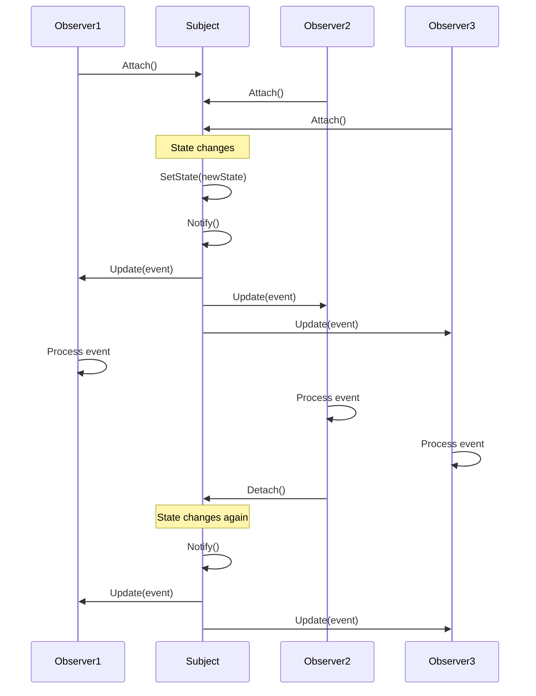
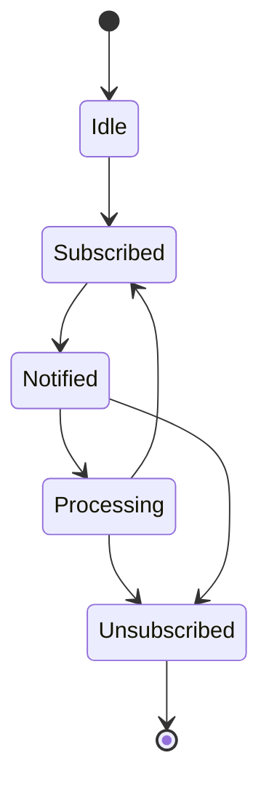

# 3.3.1 观察者模式 (Observer Pattern)

## 3.3.1.1 目录

## 3.3.1.2 1. 概述

### 3.3.1.2.1 模式定义

观察者模式定义对象间的一种一对多的依赖关系，当一个对象的状态发生改变时，所有依赖于它的对象都得到通知并被自动更新。在Golang中，观察者模式充分利用通道和并发特性，实现高效的事件通知机制。

### 3.3.1.2.2 核心思想

- **松耦合**：主题和观察者之间松耦合
- **自动通知**：状态变化时自动通知所有观察者
- **一对多关系**：一个主题可以有多个观察者
- **动态订阅**：观察者可以动态订阅和取消订阅
- **并发安全**：支持并发环境下的安全操作

## 3.3.1.3 2. 形式化定义

### 3.3.1.3.1 数学定义

设 $S$ 为主题集合，$O$ 为观察者集合，$E$ 为事件集合，定义观察者系统：

$$\mathcal{O} = (S, O, E, \rightarrow, \phi, \psi, \theta)$$

其中：

- $\rightarrow \subseteq S \times O$ 为订阅关系
- $\phi: S \times E \rightarrow \{true, false\}$ 为事件触发函数
- $\psi: O \times E \rightarrow O$ 为观察者更新函数
- $\theta: S \times O \rightarrow \{true, false\}$ 为订阅状态函数

### 3.3.1.3.2 观察者代数

定义观察者代数：

$$(O, \oplus, \otimes, \circ, \preceq)$$

其中：

- $\oplus$ 为观察者组合：$o_1 \oplus o_2$ 表示组合观察者
- $\otimes$ 为观察者变换：$o_1 \otimes o_2$ 表示观察者变换
- $\circ$ 为观察者应用：$o_1 \circ o_2$ 表示观察者应用
- $\preceq$ 为优先级关系：$o_1 \preceq o_2$ 表示 $o_1$ 优先级不高于 $o_2$

### 3.3.1.3.3 事件传播公理

**公理1（订阅传递性）**：
$$\forall s \in S, o_1, o_2 \in O: s \rightarrow o_1 \land o_1 \rightarrow o_2 \Rightarrow s \rightarrow o_2$$

**公理2（事件传播）**：
$$\forall s \in S, o \in O, e \in E: s \rightarrow o \land \phi(s, e) \Rightarrow \psi(o, e) \in O$$

**公理3（订阅一致性）**：
$$\forall s \in S, o \in O: \theta(s, o) \iff s \rightarrow o$$

### 3.3.1.3.4 事件系统

定义事件系统：

$$\mathcal{E} = (E, T, \prec, \rightarrow)$$

其中：

- $T$ 为时间域
- $\prec \subseteq E \times E$ 为事件优先级关系
- $\rightarrow \subseteq E \times E$ 为事件依赖关系

## 3.3.1.4 3. 结构分析

### 3.3.1.4.1 UML类图

```mermaid
classDiagram
    class Subject {
        <<interface>>
        +Attach(Observer)
        +Detach(Observer)
        +Notify()
    }
    
    class Observer {
        <<interface>>
        +Update(Event)
        +GetID() string
    }
    
    class ConcreteSubject {
        -observers []Observer
        -state interface{}
        +Attach(Observer)
        +Detach(Observer)
        +Notify()
        +SetState(interface{})
        +GetState() interface{}
    }
    
    class ConcreteObserver {
        -id string
        -subject Subject
        +Update(Event)
        +GetID() string
    }
    
    class Event {
        +Type string
        +Data interface{}
        +Timestamp time.Time
        +Source Subject
    }
    
    Subject <|.. ConcreteSubject
    Observer <|.. ConcreteObserver
    Subject --> Observer
    Subject --> Event
    Observer --> Event

```

### 3.3.1.4.2 时序图



### 3.3.1.4.3 状态转换图



## 3.3.1.5 4. Golang实现

### 3.3.1.5.1 核心接口设计

```go
// Event 事件接口
type Event interface {
    GetType() string
    GetData() interface{}
    GetTimestamp() time.Time
    GetSource() Subject
    GetID() string
}

// Subject 主题接口
type Subject interface {
    Attach(observer Observer) error
    Detach(observer Observer) error
    Notify(event Event) error
    GetObservers() []Observer
    GetState() interface{}
    SetState(state interface{}) error
}

// Observer 观察者接口
type Observer interface {
    Update(event Event) error
    GetID() string
    GetPriority() int
    CanHandle(event Event) bool
}

// EventBus 事件总线接口
type EventBus interface {
    Subscribe(eventType string, observer Observer) error
    Unsubscribe(eventType string, observer Observer) error
    Publish(event Event) error
    GetSubscribers(eventType string) []Observer
}

```

### 3.3.1.5.2 基础事件实现

```go
// BaseEvent 基础事件
type BaseEvent struct {
    id        string
    eventType string
    data      interface{}
    timestamp time.Time
    source    Subject
}

func NewBaseEvent(eventType string, data interface{}, source Subject) *BaseEvent {
    return &BaseEvent{
        id:        generateID(),
        eventType: eventType,
        data:      data,
        timestamp: time.Now(),
        source:    source,
    }
}

func (e *BaseEvent) GetID() string {
    return e.id
}

func (e *BaseEvent) GetType() string {
    return e.eventType
}

func (e *BaseEvent) GetData() interface{} {
    return e.data
}

func (e *BaseEvent) GetTimestamp() time.Time {
    return e.timestamp
}

func (e *BaseEvent) GetSource() Subject {
    return e.source
}

// ConcreteEvent 具体事件
type ConcreteEvent struct {
    BaseEvent
    metadata map[string]interface{}
}

func NewConcreteEvent(eventType string, data interface{}, source Subject, metadata map[string]interface{}) *ConcreteEvent {
    return &ConcreteEvent{
        BaseEvent: *NewBaseEvent(eventType, data, source),
        metadata:  metadata,
    }
}

func (e *ConcreteEvent) GetMetadata() map[string]interface{} {
    return e.metadata
}

```

### 3.3.1.5.3 主题实现

```go
// BaseSubject 基础主题
type BaseSubject struct {
    observers map[string]Observer
    state     interface{}
    mu        sync.RWMutex
    eventBus  EventBus
}

func NewBaseSubject() *BaseSubject {
    return &BaseSubject{
        observers: make(map[string]Observer),
        eventBus:  NewEventBus(),
    }
}

func (s *BaseSubject) Attach(observer Observer) error {
    s.mu.Lock()
    defer s.mu.Unlock()
    
    if observer == nil {
        return fmt.Errorf("observer cannot be nil")
    }
    
    observerID := observer.GetID()
    if _, exists := s.observers[observerID]; exists {
        return fmt.Errorf("observer %s already attached", observerID)
    }
    
    s.observers[observerID] = observer
    return nil
}

func (s *BaseSubject) Detach(observer Observer) error {
    s.mu.Lock()
    defer s.mu.Unlock()
    
    if observer == nil {
        return fmt.Errorf("observer cannot be nil")
    }
    
    observerID := observer.GetID()
    if _, exists := s.observers[observerID]; !exists {
        return fmt.Errorf("observer %s not found", observerID)
    }
    
    delete(s.observers, observerID)
    return nil
}

func (s *BaseSubject) Notify(event Event) error {
    s.mu.RLock()
    defer s.mu.RUnlock()
    
    if event == nil {
        return fmt.Errorf("event cannot be nil")
    }
    
    // 创建通知事件
    notifyEvent := NewBaseEvent("notify", event, s)
    
    // 通知所有观察者
    for _, observer := range s.observers {
        if observer.CanHandle(event) {
            go func(o Observer, e Event) {
                if err := o.Update(e); err != nil {
                    log.Printf("Observer %s failed to update: %v", o.GetID(), err)
                }
            }(observer, notifyEvent)
        }
    }
    
    return nil
}

func (s *BaseSubject) GetObservers() []Observer {
    s.mu.RLock()
    defer s.mu.RUnlock()
    
    observers := make([]Observer, 0, len(s.observers))
    for _, observer := range s.observers {
        observers = append(observers, observer)
    }
    
    return observers
}

func (s *BaseSubject) GetState() interface{} {
    s.mu.RLock()
    defer s.mu.RUnlock()
    return s.state
}

func (s *BaseSubject) SetState(state interface{}) error {
    s.mu.Lock()
    defer s.mu.Unlock()
    
    oldState := s.state
    s.state = state
    
    // 创建状态变化事件
    event := NewBaseEvent("state_changed", map[string]interface{}{
        "oldState": oldState,
        "newState": state,
    }, s)
    
    // 异步通知观察者
    go s.Notify(event)
    
    return nil
}

// ConcreteSubject 具体主题
type ConcreteSubject struct {
    BaseSubject
    name string
}

func NewConcreteSubject(name string) *ConcreteSubject {
    return &ConcreteSubject{
        BaseSubject: *NewBaseSubject(),
        name:        name,
    }
}

func (s *ConcreteSubject) GetName() string {
    return s.name
}

```

### 3.3.1.5.4 观察者实现

```go
// BaseObserver 基础观察者
type BaseObserver struct {
    id       string
    priority int
    subject  Subject
}

func NewBaseObserver(id string, priority int) *BaseObserver {
    return &BaseObserver{
        id:       id,
        priority: priority,
    }
}

func (o *BaseObserver) GetID() string {
    return o.id
}

func (o *BaseObserver) GetPriority() int {
    return o.priority
}

func (o *BaseObserver) CanHandle(event Event) bool {
    return true // 默认处理所有事件
}

// ConcreteObserver 具体观察者
type ConcreteObserver struct {
    BaseObserver
    handler func(Event) error
    filters map[string]bool
}

func NewConcreteObserver(id string, priority int, handler func(Event) error) *ConcreteObserver {
    return &ConcreteObserver{
        BaseObserver: *NewBaseObserver(id, priority),
        handler:      handler,
        filters:      make(map[string]bool),
    }
}

func (o *ConcreteObserver) Update(event Event) error {
    if !o.CanHandle(event) {
        return nil
    }
    
    if o.handler != nil {
        return o.handler(event)
    }
    
    return nil
}

func (o *ConcreteObserver) CanHandle(event Event) bool {
    if len(o.filters) == 0 {
        return true
    }
    
    eventType := event.GetType()
    return o.filters[eventType]
}

func (o *ConcreteObserver) AddFilter(eventType string) {
    o.filters[eventType] = true
}

func (o *ConcreteObserver) RemoveFilter(eventType string) {
    delete(o.filters, eventType)
}

// AsyncObserver 异步观察者
type AsyncObserver struct {
    BaseObserver
    eventChan chan Event
    done      chan struct{}
    handler   func(Event) error
}

func NewAsyncObserver(id string, priority int, handler func(Event) error, bufferSize int) *AsyncObserver {
    observer := &AsyncObserver{
        BaseObserver: *NewBaseObserver(id, priority),
        eventChan:    make(chan Event, bufferSize),
        done:         make(chan struct{}),
        handler:      handler,
    }
    
    go observer.processEvents()
    return observer
}

func (o *AsyncObserver) Update(event Event) error {
    select {
    case o.eventChan <- event:
        return nil
    case <-o.done:
        return fmt.Errorf("observer is shutting down")
    default:
        return fmt.Errorf("event channel is full")
    }
}

func (o *AsyncObserver) processEvents() {
    for {
        select {
        case event := <-o.eventChan:
            if err := o.handler(event); err != nil {
                log.Printf("Async observer %s failed to process event: %v", o.GetID(), err)
            }
        case <-o.done:
            return
        }
    }
}

func (o *AsyncObserver) Stop() {
    close(o.done)
}

```

### 3.3.1.5.5 事件总线实现

```go
// EventBus 事件总线
type EventBus struct {
    subscribers map[string][]Observer
    mu          sync.RWMutex
    eventChan   chan Event
    done        chan struct{}
}

func NewEventBus() *EventBus {
    bus := &EventBus{
        subscribers: make(map[string][]Observer),
        eventChan:   make(chan Event, 1000),
        done:        make(chan struct{}),
    }
    
    go bus.processEvents()
    return bus
}

func (b *EventBus) Subscribe(eventType string, observer Observer) error {
    b.mu.Lock()
    defer b.mu.Unlock()
    
    if observer == nil {
        return fmt.Errorf("observer cannot be nil")
    }
    
    if b.subscribers[eventType] == nil {
        b.subscribers[eventType] = make([]Observer, 0)
    }
    
    // 检查是否已订阅
    for _, existingObserver := range b.subscribers[eventType] {
        if existingObserver.GetID() == observer.GetID() {
            return fmt.Errorf("observer %s already subscribed to %s", observer.GetID(), eventType)
        }
    }
    
    b.subscribers[eventType] = append(b.subscribers[eventType], observer)
    
    // 按优先级排序
    sort.Slice(b.subscribers[eventType], func(i, j int) bool {
        return b.subscribers[eventType][i].GetPriority() > b.subscribers[eventType][j].GetPriority()
    })
    
    return nil
}

func (b *EventBus) Unsubscribe(eventType string, observer Observer) error {
    b.mu.Lock()
    defer b.mu.Unlock()
    
    if observer == nil {
        return fmt.Errorf("observer cannot be nil")
    }
    
    subscribers, exists := b.subscribers[eventType]
    if !exists {
        return fmt.Errorf("no subscribers for event type: %s", eventType)
    }
    
    observerID := observer.GetID()
    for i, existingObserver := range subscribers {
        if existingObserver.GetID() == observerID {
            b.subscribers[eventType] = append(subscribers[:i], subscribers[i+1:]...)
            return nil
        }
    }
    
    return fmt.Errorf("observer %s not found for event type: %s", observerID, eventType)
}

func (b *EventBus) Publish(event Event) error {
    if event == nil {
        return fmt.Errorf("event cannot be nil")
    }
    
    select {
    case b.eventChan <- event:
        return nil
    case <-b.done:
        return fmt.Errorf("event bus is shutting down")
    default:
        return fmt.Errorf("event bus is full")
    }
}

func (b *EventBus) GetSubscribers(eventType string) []Observer {
    b.mu.RLock()
    defer b.mu.RUnlock()
    
    subscribers, exists := b.subscribers[eventType]
    if !exists {
        return make([]Observer, 0)
    }
    
    result := make([]Observer, len(subscribers))
    copy(result, subscribers)
    return result
}

func (b *EventBus) processEvents() {
    for {
        select {
        case event := <-b.eventChan:
            b.notifySubscribers(event)
        case <-b.done:
            return
        }
    }
}

func (b *EventBus) notifySubscribers(event Event) {
    b.mu.RLock()
    subscribers, exists := b.subscribers[event.GetType()]
    if !exists {
        b.mu.RUnlock()
        return
    }
    
    // 创建副本以避免死锁
    observerList := make([]Observer, len(subscribers))
    copy(observerList, subscribers)
    b.mu.RUnlock()
    
    // 并发通知观察者
    var wg sync.WaitGroup
    for _, observer := range observerList {
        if observer.CanHandle(event) {
            wg.Add(1)
            go func(o Observer, e Event) {
                defer wg.Done()
                if err := o.Update(e); err != nil {
                    log.Printf("Observer %s failed to update: %v", o.GetID(), err)
                }
            }(observer, event)
        }
    }
    
    wg.Wait()
}

func (b *EventBus) Stop() {
    close(b.done)
}

```

### 3.3.1.5.6 具体应用实现

```go
// StockPriceSubject 股票价格主题
type StockPriceSubject struct {
    BaseSubject
    symbol string
    price  float64
}

func NewStockPriceSubject(symbol string) *StockPriceSubject {
    return &StockPriceSubject{
        BaseSubject: *NewBaseSubject(),
        symbol:      symbol,
        price:       0.0,
    }
}

func (s *StockPriceSubject) SetPrice(price float64) error {
    if price < 0 {
        return fmt.Errorf("price cannot be negative")
    }
    
    oldPrice := s.price
    s.price = price
    
    // 创建价格变化事件
    event := NewBaseEvent("price_changed", map[string]interface{}{
        "symbol":    s.symbol,
        "oldPrice":  oldPrice,
        "newPrice":  price,
        "change":    price - oldPrice,
        "changePct": (price - oldPrice) / oldPrice * 100,
    }, s)
    
    // 通知观察者
    return s.Notify(event)
}

func (s *StockPriceSubject) GetSymbol() string {
    return s.symbol
}

func (s *StockPriceSubject) GetPrice() float64 {
    s.mu.RLock()
    defer s.mu.RUnlock()
    return s.price
}

// StockPriceObserver 股票价格观察者
type StockPriceObserver struct {
    BaseObserver
    alertThreshold float64
    alertHandler   func(string, float64, float64) error
}

func NewStockPriceObserver(id string, priority int, threshold float64, handler func(string, float64, float64) error) *StockPriceObserver {
    observer := &StockPriceObserver{
        BaseObserver:   *NewBaseObserver(id, priority),
        alertThreshold: threshold,
        alertHandler:   handler,
    }
    
    // 只处理价格变化事件
    observer.AddFilter("price_changed")
    
    return observer
}

func (o *StockPriceObserver) Update(event Event) error {
    if event.GetType() != "price_changed" {
        return nil
    }
    
    data, ok := event.GetData().(map[string]interface{})
    if !ok {
        return fmt.Errorf("invalid event data")
    }
    
    symbol, ok := data["symbol"].(string)
    if !ok {
        return fmt.Errorf("symbol not found in event data")
    }
    
    newPrice, ok := data["newPrice"].(float64)
    if !ok {
        return fmt.Errorf("newPrice not found in event data")
    }
    
    change, ok := data["change"].(float64)
    if !ok {
        return fmt.Errorf("change not found in event data")
    }
    
    // 检查是否超过阈值
    if math.Abs(change) >= o.alertThreshold {
        if o.alertHandler != nil {
            return o.alertHandler(symbol, newPrice, change)
        }
    }
    
    return nil
}

```

## 3.3.1.6 5. 性能分析

### 3.3.1.6.1 时间复杂度分析

#### 3.3.1.6.1.1 订阅操作

订阅操作的时间复杂度：

$$T(n) = O(n)$$

其中 $n$ 为当前订阅者数量。

**证明**：

- 需要检查是否已订阅
- 最坏情况下需要遍历所有订阅者
- 时间复杂度为 $O(n)$

#### 3.3.1.6.1.2 通知操作

通知操作的时间复杂度：

$$T(n) = O(n)$$

其中 $n$ 为订阅者数量。

**证明**：

- 需要通知所有订阅者
- 每个订阅者的处理时间为常数
- 总时间复杂度为 $O(n)$

#### 3.3.1.6.1.3 并发通知

并发通知的时间复杂度：

$$T(n, m) = O(\frac{n}{m})$$

其中：

- $n$ 为订阅者数量
- $m$ 为并发度

**证明**：

- 使用goroutine并发处理
- 每个goroutine处理 $\frac{n}{m}$ 个订阅者
- 时间复杂度为 $O(\frac{n}{m})$

### 3.3.1.6.2 空间复杂度分析

#### 3.3.1.6.2.1 内存使用

空间复杂度为：

$$S(n) = O(n)$$

其中 $n$ 为订阅者数量。

**分析**：

- 每个订阅者占用常数空间
- 订阅关系占用 $O(n)$ 空间
- 事件队列占用 $O(e)$ 空间，其中 $e$ 为事件数量

#### 3.3.1.6.2.2 内存优化

```go
// 观察者池优化
type ObserverPool struct {
    pool sync.Pool
}

func NewObserverPool() *ObserverPool {
    return &ObserverPool{
        pool: sync.Pool{
            New: func() interface{} {
                return &BaseObserver{}
            },
        },
    }
}

func (p *ObserverPool) Get() *BaseObserver {
    return p.pool.Get().(*BaseObserver)
}

func (p *ObserverPool) Put(observer *BaseObserver) {
    observer.subject = nil
    p.pool.Put(observer)
}

```

### 3.3.1.6.3 并发性能分析

#### 3.3.1.6.3.1 吞吐量分析

定义吞吐量函数：

$$T(n, m) = \frac{n \cdot m}{t_{avg}}$$

其中：

- $n$ 为并发数
- $m$ 为事件数
- $t_{avg}$ 为平均处理时间

#### 3.3.1.6.3.2 延迟分析

定义延迟函数：

$$L(n) = t_{queue} + t_{process} + t_{notify}$$

其中：

- $t_{queue}$ 为队列等待时间
- $t_{process}$ 为事件处理时间
- $t_{notify}$ 为通知时间

### 3.3.1.6.4 基准测试

```go
func BenchmarkObserverNotification(b *testing.B) {
    subject := NewStockPriceSubject("AAPL")
    
    // 创建观察者
    for i := 0; i < 100; i++ {
        observer := NewStockPriceObserver(
            fmt.Sprintf("observer-%d", i),
            i,
            1.0,
            func(symbol string, price, change float64) error {
                return nil
            },
        )
        subject.Attach(observer)
    }
    
    b.ResetTimer()
    for i := 0; i < b.N; i++ {
        subject.SetPrice(float64(i))
    }
}

func BenchmarkEventBusPublish(b *testing.B) {
    bus := NewEventBus()
    
    // 创建订阅者
    for i := 0; i < 100; i++ {
        observer := NewConcreteObserver(
            fmt.Sprintf("observer-%d", i),
            i,
            func(event Event) error {
                return nil
            },
        )
        bus.Subscribe("test_event", observer)
    }
    
    b.ResetTimer()
    b.RunParallel(func(pb *testing.PB) {
        for pb.Next() {
            event := NewBaseEvent("test_event", "test data", nil)
            bus.Publish(event)
        }
    })
}

func BenchmarkAsyncObserver(b *testing.B) {
    observer := NewAsyncObserver(
        "async-observer",
        1,
        func(event Event) error {
            time.Sleep(1 * time.Millisecond) // 模拟处理时间
            return nil
        },
        1000,
    )
    
    b.ResetTimer()
    b.RunParallel(func(pb *testing.PB) {
        for pb.Next() {
            event := NewBaseEvent("test_event", "test data", nil)
            observer.Update(event)
        }
    })
    
    observer.Stop()
}

```

## 3.3.1.7 6. 应用场景

### 3.3.1.7.1 用户界面系统

```go
// UI组件观察者模式
type UIComponent struct {
    BaseSubject
    name     string
    visible  bool
    enabled  bool
    children []*UIComponent
}

func NewUIComponent(name string) *UIComponent {
    return &UIComponent{
        BaseSubject: *NewBaseSubject(),
        name:        name,
        visible:     true,
        enabled:     true,
        children:    make([]*UIComponent, 0),
    }
}

func (c *UIComponent) SetVisible(visible bool) error {
    if c.visible == visible {
        return nil
    }
    
    c.visible = visible
    
    event := NewBaseEvent("visibility_changed", map[string]interface{}{
        "component": c.name,
        "visible":   visible,
    }, c)
    
    return c.Notify(event)
}

func (c *UIComponent) SetEnabled(enabled bool) error {
    if c.enabled == enabled {
        return nil
    }
    
    c.enabled = enabled
    
    event := NewBaseEvent("enabled_changed", map[string]interface{}{
        "component": c.name,
        "enabled":   enabled,
    }, c)
    
    return c.Notify(event)
}

// UI观察者
type UIObserver struct {
    BaseObserver
    renderer func(string, map[string]interface{}) error
}

func NewUIObserver(id string, renderer func(string, map[string]interface{}) error) *UIObserver {
    observer := &UIObserver{
        BaseObserver: *NewBaseObserver(id, 1),
        renderer:     renderer,
    }
    
    observer.AddFilter("visibility_changed")
    observer.AddFilter("enabled_changed")
    
    return observer
}

func (o *UIObserver) Update(event Event) error {
    if o.renderer == nil {
        return nil
    }
    
    data, ok := event.GetData().(map[string]interface{})
    if !ok {
        return fmt.Errorf("invalid event data")
    }
    
    return o.renderer(event.GetType(), data)
}

```

### 3.3.1.7.2 配置管理系统

```go
// 配置管理器
type ConfigManager struct {
    BaseSubject
    config map[string]interface{}
    file   string
}

func NewConfigManager(file string) *ConfigManager {
    return &ConfigManager{
        BaseSubject: *NewBaseSubject(),
        config:      make(map[string]interface{}),
        file:        file,
    }
}

func (c *ConfigManager) SetValue(key string, value interface{}) error {
    oldValue := c.config[key]
    c.config[key] = value
    
    event := NewBaseEvent("config_changed", map[string]interface{}{
        "key":      key,
        "oldValue": oldValue,
        "newValue": value,
    }, c)
    
    return c.Notify(event)
}

func (c *ConfigManager) GetValue(key string) (interface{}, bool) {
    value, exists := c.config[key]
    return value, exists
}

// 配置观察者
type ConfigObserver struct {
    BaseObserver
    watchers map[string]func(interface{}, interface{}) error
}

func NewConfigObserver(id string) *ConfigObserver {
    return &ConfigObserver{
        BaseObserver: *NewBaseObserver(id, 1),
        watchers:     make(map[string]func(interface{}, interface{}) error),
    }
}

func (o *ConfigObserver) Watch(key string, handler func(interface{}, interface{}) error) {
    o.watchers[key] = handler
}

func (o *ConfigObserver) Update(event Event) error {
    if event.GetType() != "config_changed" {
        return nil
    }
    
    data, ok := event.GetData().(map[string]interface{})
    if !ok {
        return fmt.Errorf("invalid event data")
    }
    
    key, ok := data["key"].(string)
    if !ok {
        return fmt.Errorf("key not found in event data")
    }
    
    handler, exists := o.watchers[key]
    if !exists {
        return nil
    }
    
    oldValue := data["oldValue"]
    newValue := data["newValue"]
    
    return handler(oldValue, newValue)
}

```

### 3.3.1.7.3 日志系统

```go
// 日志管理器
type LogManager struct {
    BaseSubject
    level    string
    handlers []LogHandler
}

func NewLogManager() *LogManager {
    return &LogManager{
        BaseSubject: *NewBaseSubject(),
        level:       "INFO",
        handlers:    make([]LogHandler, 0),
    }
}

func (l *LogManager) Log(level, message string, fields map[string]interface{}) error {
    logEntry := map[string]interface{}{
        "level":     level,
        "message":   message,
        "fields":    fields,
        "timestamp": time.Now(),
    }
    
    event := NewBaseEvent("log_entry", logEntry, l)
    return l.Notify(event)
}

// 日志处理器
type LogHandler struct {
    BaseObserver
    level    string
    writer   io.Writer
    formatter func(map[string]interface{}) (string, error)
}

func NewLogHandler(id, level string, writer io.Writer, formatter func(map[string]interface{}) (string, error)) *LogHandler {
    handler := &LogHandler{
        BaseObserver: *NewBaseObserver(id, 1),
        level:        level,
        writer:       writer,
        formatter:    formatter,
    }
    
    handler.AddFilter("log_entry")
    
    return handler
}

func (h *LogHandler) Update(event Event) error {
    if event.GetType() != "log_entry" {
        return nil
    }
    
    data, ok := event.GetData().(map[string]interface{})
    if !ok {
        return fmt.Errorf("invalid event data")
    }
    
    level, ok := data["level"].(string)
    if !ok {
        return fmt.Errorf("level not found in event data")
    }
    
    // 检查日志级别
    if !h.shouldLog(level) {
        return nil
    }
    
    if h.formatter != nil {
        formatted, err := h.formatter(data)
        if err != nil {
            return err
        }
        
        _, err = h.writer.Write([]byte(formatted + "\n"))
        return err
    }
    
    return nil
}

func (h *LogHandler) shouldLog(level string) bool {
    levels := map[string]int{
        "DEBUG": 0,
        "INFO":  1,
        "WARN":  2,
        "ERROR": 3,
        "FATAL": 4,
    }
    
    currentLevel, exists := levels[h.level]
    if !exists {
        currentLevel = 1
    }
    
    messageLevel, exists := levels[level]
    if !exists {
        messageLevel = 1
    }
    
    return messageLevel >= currentLevel
}

```

## 3.3.1.8 7. 最佳实践

### 3.3.1.8.1 设计原则

1. **松耦合**：主题和观察者之间保持松耦合
2. **单一职责**：每个观察者只负责一种类型的通知
3. **开闭原则**：新增观察者不需要修改主题
4. **接口隔离**：使用小而精确的接口

### 3.3.1.8.2 实现建议

1. **使用接口**：定义清晰的Subject和Observer接口
2. **并发安全**：考虑并发访问的安全性
3. **错误处理**：统一的错误处理机制
4. **性能优化**：使用异步通知、对象池等技术
5. **测试覆盖**：完整的单元测试

### 3.3.1.8.3 常见陷阱

1. **内存泄漏**：避免观察者对象的内存泄漏
2. **性能问题**：避免过多的观察者影响性能
3. **循环依赖**：避免主题和观察者之间的循环依赖
4. **通知顺序**：注意观察者的通知顺序

## 3.3.1.9 8. 案例分析

### 3.3.1.9.1 股票监控系统

```go
// 完整的股票监控系统示例
func StockMonitoringSystem() {
    // 创建股票主题
    aapl := NewStockPriceSubject("AAPL")
    googl := NewStockPriceSubject("GOOGL")
    
    // 创建观察者
    alertObserver := NewStockPriceObserver(
        "alert-observer",
        1,
        5.0, // 5% 变化阈值
        func(symbol string, price, change float64) error {
            fmt.Printf("ALERT: %s price changed by %.2f%% to $%.2f\n", symbol, change, price)
            return nil
        },
    )
    
    logObserver := NewStockPriceObserver(
        "log-observer",
        2,
        0.0, // 记录所有变化
        func(symbol string, price, change float64) error {
            fmt.Printf("LOG: %s price changed by %.2f%% to $%.2f\n", symbol, change, price)
            return nil
        },
    )
    
    // 订阅观察者
    aapl.Attach(alertObserver)
    aapl.Attach(logObserver)
    googl.Attach(alertObserver)
    googl.Attach(logObserver)
    
    // 模拟价格变化
    prices := []float64{150.0, 155.0, 160.0, 158.0, 165.0}
    for _, price := range prices {
        aapl.SetPrice(price)
        time.Sleep(1 * time.Second)
    }
    
    // 模拟Google价格变化
    googl.SetPrice(2800.0)
}

```

### 3.3.1.9.2 事件驱动架构

```go
// 事件驱动架构示例
func EventDrivenArchitecture() {
    // 创建事件总线
    bus := NewEventBus()
    
    // 创建服务
    userService := NewUserService(bus)
    emailService := NewEmailService(bus)
    auditService := NewAuditService(bus)
    
    // 注册事件处理器
    bus.Subscribe("user_registered", emailService.GetObserver())
    bus.Subscribe("user_registered", auditService.GetObserver())
    bus.Subscribe("user_updated", auditService.GetObserver())
    
    // 模拟用户注册
    user := &User{
        ID:    "user-001",
        Email: "user@example.com",
        Name:  "John Doe",
    }
    
    userService.RegisterUser(user)
    
    // 模拟用户更新
    user.Name = "John Smith"
    userService.UpdateUser(user)
}

// User 用户模型
type User struct {
    ID    string
    Email string
    Name  string
}

// UserService 用户服务
type UserService struct {
    bus *EventBus
}

func NewUserService(bus *EventBus) *UserService {
    return &UserService{bus: bus}
}

func (s *UserService) RegisterUser(user *User) error {
    // 保存用户到数据库
    fmt.Printf("User registered: %s\n", user.ID)
    
    // 发布事件
    event := NewBaseEvent("user_registered", user, s)
    return s.bus.Publish(event)
}

func (s *UserService) UpdateUser(user *User) error {
    // 更新用户到数据库
    fmt.Printf("User updated: %s\n", user.ID)
    
    // 发布事件
    event := NewBaseEvent("user_updated", user, s)
    return s.bus.Publish(event)
}

// EmailService 邮件服务
type EmailService struct {
    bus *EventBus
}

func NewEmailService(bus *EventBus) *EmailService {
    return &EmailService{bus: bus}
}

func (s *EmailService) GetObserver() Observer {
    return NewConcreteObserver(
        "email-service",
        1,
        func(event Event) error {
            if event.GetType() == "user_registered" {
                user, ok := event.GetData().(*User)
                if ok {
                    fmt.Printf("Sending welcome email to: %s\n", user.Email)
                }
            }
            return nil
        },
    )
}

// AuditService 审计服务
type AuditService struct {
    bus *EventBus
}

func NewAuditService(bus *EventBus) *AuditService {
    return &AuditService{bus: bus}
}

func (s *AuditService) GetObserver() Observer {
    return NewConcreteObserver(
        "audit-service",
        2,
        func(event Event) error {
            fmt.Printf("Audit log: %s event for user\n", event.GetType())
            return nil
        },
    )
}

```

---

**参考文献**：

1. Gamma, E., Helm, R., Johnson, R., & Vlissides, J. (1994). Design Patterns: Elements of Reusable Object-Oriented Software
2. Go Language Specification. <https://golang.org/ref/spec>
3. Go Concurrency Patterns. <https://golang.org/doc/effective_go.html#concurrency>
4. Effective Go. <https://golang.org/doc/effective_go.html>
