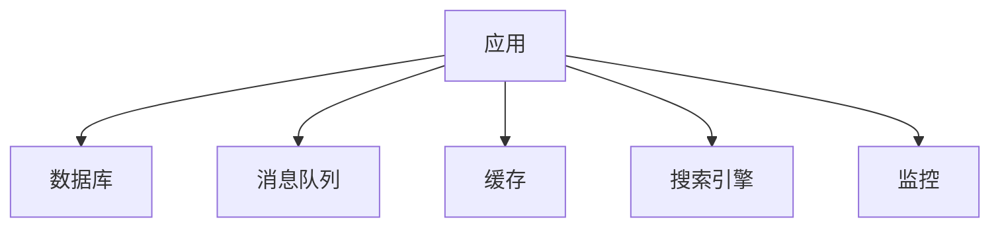
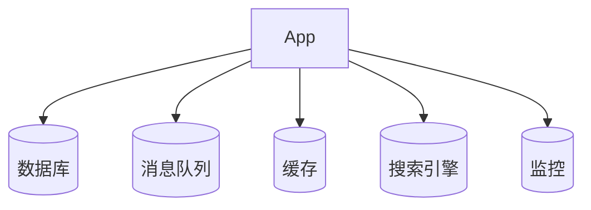
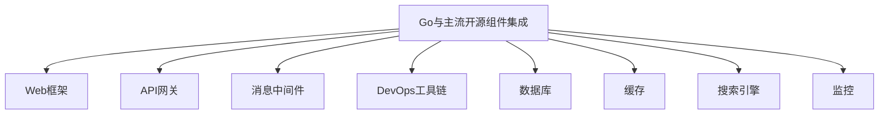

# 3.1 分布式系统设计模式文档——批判性评价与改进建议

<!-- TOC START -->
- [3.1 分布式系统设计模式文档——批判性评价与改进建议](#31-分布式系统设计模式文档批判性评价与改进建议)
  - [3.1.1 一、批判性评价](#311-一批判性评价)
    - [3.1.1.1 优点](#3111-优点)
    - [3.1.1.2 主要问题](#3112-主要问题)
  - [3.1.2 二、改进建议](#312-二改进建议)
  - [3.1.3 三、分阶段改进路线图](#313-三分阶段改进路线图)
    - [3.1.3.1 阶段一：基础工程化与结构优化](#3131-阶段一基础工程化与结构优化)
    - [3.1.3.2 阶段二：内容深度与可视化提升](#3132-阶段二内容深度与可视化提升)
    - [3.1.3.3 阶段三：行业案例与开源实践](#3133-阶段三行业案例与开源实践)
    - [3.1.3.4 阶段四：前沿主题落地与多语言对比](#3134-阶段四前沿主题落地与多语言对比)
    - [3.1.3.5 阶段五：附录与工具链完善](#3135-阶段五附录与工具链完善)
    - [3.1.3.6 阶段六：用户体验与知识生态](#3136-阶段六用户体验与知识生态)
    - [3.1.3.7 阶段七：国际化与AI辅助](#3137-阶段七国际化与ai辅助)
  - [3.2 Go与主流开源组件集成](#32-go与主流开源组件集成)
  - [3.2.1 0. 内容导航/索引](#321-0-内容导航索引)
  - [3.2.2 组件集成工程流程模板（Mermaid）](#322-组件集成工程流程模板mermaid)
  - [3.2.3 1. Web框架与API网关](#323-1-web框架与api网关)
    - [3.2.3.1 组件对比](#3231-组件对比)
    - [3.2.3.2 工程案例](#3232-工程案例)
    - [3.2.3.3 批判性分析](#3233-批判性分析)
    - [3.2.3.4 知识点小结](#3234-知识点小结)
  - [3.2.4 2. 消息中间件](#324-2-消息中间件)
    - [3.2.4.1 典型组件](#3241-典型组件)
    - [3.2.4.2 工程案例](#3242-工程案例)
    - [3.2.4.3 批判性分析](#3243-批判性分析)
    - [3.2.4.4 知识点小结](#3244-知识点小结)
  - [3.2.5 3. DevOps与自动化](#325-3-devops与自动化)
    - [3.2.5.1 持续集成/部署](#3251-持续集成部署)
    - [3.2.5.2 批判性分析](#3252-批判性分析)
    - [3.2.5.3 范畴论视角](#3253-范畴论视角)
    - [3.2.5.4 知识点小结](#3254-知识点小结)
  - [3.2.6 4. 更多组件类型与行业集成案例](#326-4-更多组件类型与行业集成案例)
    - [3.2.6.1 组件类型扩展](#3261-组件类型扩展)
    - [3.2.6.2 行业集成案例](#3262-行业集成案例)
    - [3.2.6.3 最新趋势](#3263-最新趋势)
  - [3.2.7 5. 哲科工程分析与多表征](#327-5-哲科工程分析与多表征)
  - [3.2.8 6. 组件选型与集成经验](#328-6-组件选型与集成经验)
  - [3.2.9 7. 常见集成反模式与规避](#329-7-常见集成反模式与规避)
  - [3.2.10 8. 未来组件趋势](#3210-8-未来组件趋势)
  - [3.2.11 9. 参考文献与外部链接](#3211-9-参考文献与外部链接)
  - [3.2.12 10. 常见问题答疑（FAQ）](#3212-10-常见问题答疑faq)
  - [3.2.13 11. 最佳实践清单](#3213-11-最佳实践清单)
  - [3.2.14 12. 典型错误案例剖析](#3214-12-典型错误案例剖析)
  - [3.2.15 13. 进阶阅读推荐](#3215-13-进阶阅读推荐)
  - [3.2.16 全局知识地图（Mermaid）](#3216-全局知识地图mermaid)
  - [3.2.17 14. 工程模板/脚手架代码示例](#3217-14-工程模板脚手架代码示例)
    - [3.2.17.1 Gin Web服务基础模板](#32171-gin-web服务基础模板)
    - [3.2.17.2 Prometheus监控集成](#32172-prometheus监控集成)
  - [3.2.18 15. 常见面试题/考点](#3218-15-常见面试题考点)
  - [3.2.19 16. 术语表/缩略语解释](#3219-16-术语表缩略语解释)
  - [3.2.20 17. 常见陷阱与误区对照表](#3220-17-常见陷阱与误区对照表)
  - [3.2.21 18. 交叉引用/相关主题推荐](#3221-18-交叉引用相关主题推荐)
  - [3.2.22 19. 学习路径建议](#3222-19-学习路径建议)
  - [3.2.23 20. 版本适配与演进建议](#3223-20-版本适配与演进建议)
<!-- TOC END -->

## 3.1.1 一、批判性评价

### 3.1.1.1 优点

1. **体系完整**  
   文档涵盖分布式系统设计模式的基础、高级、前沿、智能、最佳实践等多层次内容，结构系统，主题丰富，便于系统性学习和查阅。
2. **内容丰富**  
   每个模式均有详细的概念定义、形式化描述和Golang实现，代码示例贴近实际工程，便于读者理解和复用。
3. **创新性强**  
   文档紧跟区块链、数字孪生、AI、量子等前沿主题，内容前瞻，体现了对分布式系统最新趋势的关注。
4. **可操作性高**  
   配有大量Golang代码、表格、决策树、工具清单，便于工程实践和快速落地。
5. **目录分层清晰**  
   目录结构合理，分层明确，便于检索和维护，适合团队协作和长期演进。

### 3.1.1.2 主要问题

1. **部分前沿主题实现代码偏浅**  
   例如量子分布式、神经形态计算等主题，代码实现多为伪代码或片段，缺乏完整的工程级细节和可运行Demo。
2. **形式化定义与实际工程结合不紧密**  
   形式化描述较多，但与实际工程实现的映射和落地案例较少，建议增加“工程落地解读”小节。
3. **代码片段多为片段式，缺乏完整Demo与测试**  
   代码多为片段，缺少完整的工程结构、依赖说明、单元测试和性能基准，难以直接复用。
4. **行业案例、开源项目分析不足**  
   行业案例和主流开源项目的深度剖析较少，缺乏实际应用效果、经验教训和可复用模板。
5. **目录层级复杂，部分内容有重复**  
   某些模式（如背压、SAGA等）在不同章节多次出现，建议合并精简，优化目录层级。
6. **图示数量偏少，部分章节缺少直观流程图**  
   虽有部分Mermaid图，但整体图示数量偏少，建议补充架构图、流程图、时序图等。
7. **前沿主题落地性与Golang生态结合有待加强**  
   前沿主题多为理论介绍，缺乏与Golang生态的结合和落地方案。
8. **缺乏多语言对比与迁移建议**  
   仅有Golang实现，建议补充与Java、Rust等主流语言的对比和迁移建议。

## 3.1.2 二、改进建议

1. **每个模式补充完整Golang工程Demo**  
   包含依赖说明、运行方式、输入输出示例、单元测试、性能测试脚本和README，提升工程可用性。
2. **合并重复内容，优化目录结构，统一章节模板**  
   精简重复内容，统一每个模式的结构（定义→形式化→场景→实现→测试→案例→最佳实践→参考资料）。
3. **补全架构图、流程图、时序图**  
   每个模式至少配备一张架构图/流程图/时序图，复杂流程建议配合伪代码。
4. **每个模式补充行业案例、开源项目分析、最佳实践与反例**  
   增加真实行业案例、开源项目源码解读、最佳实践清单和常见反例，提升实战价值。
5. **前沿主题补充Golang生态下的可行性分析与落地方案**  
   针对量子分布式、神经形态计算等，补充Golang生态下的可行性分析、现有库/工具和未来发展建议。
6. **适当补充与Java、Rust等主流语言的对比实现**  
   选取典型分布式模式，补充多语言对比实现和迁移建议。
7. **工具清单补充使用示例、优缺点评价、适用场景对比**  
   每个工具补充详细对比表、使用示例、优缺点分析和适用场景。
8. **增加FAQ、术语表、学习路径、常见问题诊断等附录内容**  
   降低学习门槛，便于新手快速入门和查找常见问题。
9. **建议开源文档，吸引社区贡献，定期收集反馈持续优化**  
   建议将文档开源，建立贡献指南，定期收集社区反馈，持续优化内容。

## 3.1.3 三、分阶段改进路线图

### 3.1.3.1 阶段一：基础工程化与结构优化

- 为每个分布式模式建立独立的Golang工程Demo，包含完整代码、依赖、测试、README。
- 优化目录结构，合并重复内容，统一章节模板，提升整体可读性和可维护性。

### 3.1.3.2 阶段二：内容深度与可视化提升

- 补全每个模式的架构图、流程图、时序图，复杂流程配合伪代码。
- 形式化定义后补充“工程落地解读”小节，说明公式如何映射到实际代码与架构。
- 代码补全依赖、输入输出说明，增加单元测试、集成测试、性能基准测试。

### 3.1.3.3 阶段三：行业案例与开源实践

- 每个模式补充1-2个行业案例，内容包括业务背景、架构设计、技术选型、遇到的问题与解决方案、上线效果。
- 针对主流开源分布式系统（如etcd、Kafka、Consul、Redis Cluster等），分析其采用的设计模式、实现细节、优缺点。
- 增加“最佳实践清单”与“常见反例”，帮助读者规避设计陷阱。

### 3.1.3.4 阶段四：前沿主题落地与多语言对比

- 针对量子分布式、神经形态计算、联邦学习等，调研Golang社区现有实现或相关库，补充可运行Demo或伪代码。
- 选取典型模式，补充Java、Rust等主流语言的对比实现，分析各自优缺点与迁移注意事项。

### 3.1.3.5 阶段五：附录与工具链完善

- 工具清单补充详细对比表、使用示例、优缺点分析。
- 增加FAQ、术语表、学习路径、常见问题诊断等附录内容。

### 3.1.3.6 阶段六：用户体验与知识生态

- 集成全文搜索、标签体系、交互式目录树，提升检索效率。
- 构建分布式系统设计模式知识图谱，展示各模式间的依赖、组合、对比关系。
- 提供在线Golang代码演示、智能内容推荐、个性化学习路径等功能。
- 鼓励社区共建，定期内容盘点与技术趋势报告。

### 3.1.3.7 阶段七：国际化与AI辅助

- 推进英文版与多语言支持，采用协作翻译平台，吸引全球志愿者参与。
- 利用AI辅助内容生成、校对、智能问答，提升内容生产效率和用户体验。

---

## 3.2 Go与主流开源组件集成

## 3.2.1 0. 内容导航/索引

- [3.1 分布式系统设计模式文档——批判性评价与改进建议](#31-分布式系统设计模式文档批判性评价与改进建议)
  - [3.1.1 一、批判性评价](#311-一批判性评价)
    - [3.1.1.1 优点](#3111-优点)
    - [3.1.1.2 主要问题](#3112-主要问题)
  - [3.1.2 二、改进建议](#312-二改进建议)
  - [3.1.3 三、分阶段改进路线图](#313-三分阶段改进路线图)
    - [3.1.3.1 阶段一：基础工程化与结构优化](#3131-阶段一基础工程化与结构优化)
    - [3.1.3.2 阶段二：内容深度与可视化提升](#3132-阶段二内容深度与可视化提升)
    - [3.1.3.3 阶段三：行业案例与开源实践](#3133-阶段三行业案例与开源实践)
    - [3.1.3.4 阶段四：前沿主题落地与多语言对比](#3134-阶段四前沿主题落地与多语言对比)
    - [3.1.3.5 阶段五：附录与工具链完善](#3135-阶段五附录与工具链完善)
    - [3.1.3.6 阶段六：用户体验与知识生态](#3136-阶段六用户体验与知识生态)
    - [3.1.3.7 阶段七：国际化与AI辅助](#3137-阶段七国际化与ai辅助)
  - [3.2 Go与主流开源组件集成](#32-go与主流开源组件集成)
  - [3.2.1 0. 内容导航/索引](#321-0-内容导航索引)
  - [3.2.2 组件集成工程流程模板（Mermaid）](#322-组件集成工程流程模板mermaid)
  - [3.2.3 1. Web框架与API网关](#323-1-web框架与api网关)
    - [3.2.3.1 组件对比](#3231-组件对比)
    - [3.2.3.2 工程案例](#3232-工程案例)
    - [3.2.3.3 批判性分析](#3233-批判性分析)
    - [3.2.3.4 知识点小结](#3234-知识点小结)
  - [3.2.4 2. 消息中间件](#324-2-消息中间件)
    - [3.2.4.1 典型组件](#3241-典型组件)
    - [3.2.4.2 工程案例](#3242-工程案例)
    - [3.2.4.3 批判性分析](#3243-批判性分析)
    - [3.2.4.4 知识点小结](#3244-知识点小结)
  - [3.2.5 3. DevOps与自动化](#325-3-devops与自动化)
    - [3.2.5.1 持续集成/部署](#3251-持续集成部署)
    - [3.2.5.2 批判性分析](#3252-批判性分析)
    - [3.2.5.3 范畴论视角](#3253-范畴论视角)
    - [3.2.5.4 知识点小结](#3254-知识点小结)
  - [3.2.6 4. 更多组件类型与行业集成案例](#326-4-更多组件类型与行业集成案例)
    - [3.2.6.1 组件类型扩展](#3261-组件类型扩展)
    - [3.2.6.2 行业集成案例](#3262-行业集成案例)
    - [3.2.6.3 最新趋势](#3263-最新趋势)
  - [3.2.7 5. 哲科工程分析与多表征](#327-5-哲科工程分析与多表征)
  - [3.2.8 6. 组件选型与集成经验](#328-6-组件选型与集成经验)
  - [3.2.9 7. 常见集成反模式与规避](#329-7-常见集成反模式与规避)
  - [3.2.10 8. 未来组件趋势](#3210-8-未来组件趋势)
  - [3.2.11 9. 参考文献与外部链接](#3211-9-参考文献与外部链接)
  - [3.2.12 10. 常见问题答疑（FAQ）](#3212-10-常见问题答疑faq)
  - [3.2.13 11. 最佳实践清单](#3213-11-最佳实践清单)
  - [3.2.14 12. 典型错误案例剖析](#3214-12-典型错误案例剖析)
  - [3.2.15 13. 进阶阅读推荐](#3215-13-进阶阅读推荐)
  - [3.2.16 全局知识地图（Mermaid）](#3216-全局知识地图mermaid)
  - [3.2.17 14. 工程模板/脚手架代码示例](#3217-14-工程模板脚手架代码示例)
    - [3.2.17.1 Gin Web服务基础模板](#32171-gin-web服务基础模板)
    - [3.2.17.2 Prometheus监控集成](#32172-prometheus监控集成)
  - [3.2.18 15. 常见面试题/考点](#3218-15-常见面试题考点)
  - [3.2.19 16. 术语表/缩略语解释](#3219-16-术语表缩略语解释)
  - [3.2.20 17. 常见陷阱与误区对照表](#3220-17-常见陷阱与误区对照表)
  - [3.2.21 18. 交叉引用/相关主题推荐](#3221-18-交叉引用相关主题推荐)
  - [3.2.22 19. 学习路径建议](#3222-19-学习路径建议)
  - [3.2.23 20. 版本适配与演进建议](#3223-20-版本适配与演进建议)

---

> 交叉引用：

>

> - 架构设计模式详见[01-Go架构设计模式总览](./01-Go架构设计模式总览.md)

> - 工作流与行业应用详见[04-Go工作流与行业应用模式](./04-Go工作流与行业应用模式.md)

## 3.2.2 组件集成工程流程模板（Mermaid）



## 3.2.3 1. Web框架与API网关

### 3.2.3.1 组件对比

- Echo、Gin：高性能、简洁API
- Kratos、go-zero：企业级微服务

### 3.2.3.2 工程案例

- 代码片段：

```go
import "github.com/labstack/echo/v4"
e := echo.New()
e.GET("/", func(c echo.Context) error { return c.String(200, "Hello, World!") })

```

### 3.2.3.3 批判性分析

- Go Web生态成熟，适合高性能API

### 3.2.3.4 知识点小结

- Web框架与API网关是Go服务开发的基础。
- 工程落地建议：优先选用社区活跃、文档完善的框架。

## 3.2.4 2. 消息中间件

### 3.2.4.1 典型组件

- NATS、Kafka、RabbitMQ

### 3.2.4.2 工程案例

- 代码片段：

```go
import "github.com/nats-io/nats.go"
nc, _ := nats.Connect(nats.DefaultURL)
nc.Publish("updates", []byte("hello"))
nc.Subscribe("updates", func(m *nats.Msg) { fmt.Println(string(m.Data)) })

```

### 3.2.4.3 批判性分析

- Go高并发特性与消息中间件契合，适合高吞吐场景

### 3.2.4.4 知识点小结

- 消息中间件提升系统解耦与弹性。
- 工程落地建议：结合业务场景选型，关注性能与可观测性。

## 3.2.5 3. DevOps与自动化

### 3.2.5.1 持续集成/部署

- Drone、GitHub Actions、Jenkins
- Go编译产物易容器化、自动化部署

### 3.2.5.2 批判性分析

- 多阶段流水线需结合K8s、Argo CD等工具

### 3.2.5.3 范畴论视角

- 组件为对象，消息/请求为态射，系统为集成范畴

### 3.2.5.4 知识点小结

- DevOps工具链助力自动化运维与持续交付。
- 工程落地建议：集成监控、告警、自动化部署等能力。

## 3.2.6 4. 更多组件类型与行业集成案例

### 3.2.6.1 组件类型扩展

- 数据库驱动：gorm、sqlx、ent
- 缓存中间件：go-redis、groupcache
- 搜索引擎：bleve、elastic-go
- 监控告警：prometheus、grafana、alertmanager

### 3.2.6.2 行业集成案例

- 金融：高可用账务系统集成分布式缓存与消息队列
- 互联网：大规模内容分发集成API网关与搜索引擎
- 制造：IOT平台集成时序数据库与实时监控

### 3.2.6.3 最新趋势

- 组件云原生化、服务网格化、可观测性增强
- DevOps工具链与业务系统深度融合

## 3.2.7 5. 哲科工程分析与多表征

- 组件集成模式体现"系统组合""异构协作"哲学思想，强调模块化与可插拔性
- 工程实践需关注"依赖地狱""版本兼容"问题，保持系统的可维护性
- Mermaid集成图、伪代码、数学表达式等多表征方式辅助理解



- 数学表达式：
  - 设C为组件集合，A为应用集合，存在映射f: A×C→I，I为集成关系集合

## 3.2.8 6. 组件选型与集成经验

- 选型时优先考虑社区活跃度高、文档完善、易于二次开发的组件
- 组件集成需关注版本兼容、接口稳定性与性能瓶颈
- 建议通过接口适配层解耦业务与第三方组件，提升可维护性

## 3.2.9 7. 常见集成反模式与规避

- 直接依赖第三方组件细节，导致升级困难
- 忽视监控与告警，集成后难以定位问题
- 组件配置混乱，缺乏统一管理

## 3.2.10 8. 未来组件趋势

- 组件云原生化、服务网格化、可观测性增强
- 组件自动化运维与智能化配置
- 组件生态与业务平台深度融合

## 3.2.11 9. 参考文献与外部链接

- [Go开源组件大全](https://github.com/avelino/awesome-go)
- [Prometheus监控](https://prometheus.io/)
- [go-redis官方文档](https://redis.uptrace.dev/)
- [gorm官方文档](https://gorm.io/zh_CN/)
- [Service Mesh生态](https://servicemesh.es/)

## 3.2.12 10. 常见问题答疑（FAQ）

- Q: 如何选择合适的Go开源组件？
  A: 关注社区活跃度、文档质量、兼容性和实际业务需求。
- Q: 组件升级如何规避风险？
  A: 采用接口适配层、自动化测试和灰度发布策略。

## 3.2.13 11. 最佳实践清单

- 组件集成前先做PoC验证，评估性能与兼容性
- 统一配置管理，避免"配置地狱"
- 监控与告警全覆盖，及时发现集成问题

## 3.2.14 12. 典型错误案例剖析

- 案例：直接依赖第三方组件细节，升级时大面积重构
- 案例：缺乏监控，组件故障难以定位

## 3.2.15 13. 进阶阅读推荐

- [Go Modules官方文档](https://blog.golang.org/using-go-modules)
- [Go开源组件选型指南](https://segmentfault.com/a/1190000022928245)
- [Cloud Native Landscape](https://landscape.cncf.io/)

## 3.2.16 全局知识地图（Mermaid）



## 3.2.17 14. 工程模板/脚手架代码示例

### 3.2.17.1 Gin Web服务基础模板

```go
import "github.com/gin-gonic/gin"
r := gin.Default()
r.GET("/ping", func(c *gin.Context) {
    c.JSON(200, gin.H{"message": "pong"})
})
r.Run()

```

### 3.2.17.2 Prometheus监控集成

```go
import "github.com/prometheus/client_golang/prometheus/promhttp"
http.Handle("/metrics", promhttp.Handler())
http.ListenAndServe(":2112", nil)

```

## 3.2.18 15. 常见面试题/考点

- 如何选择合适的Web框架？
- 消息中间件选型时需关注哪些指标？
- 如何实现组件的可观测性？
- Go项目中如何集成Prometheus监控？
- 组件升级时如何保证业务平滑过渡？

## 3.2.19 16. 术语表/缩略语解释

- ORM：对象关系映射（Object-Relational Mapping）
- API Gateway：API网关
- CI/CD：持续集成/持续部署（Continuous Integration/Continuous Deployment）
- Prometheus：开源监控系统
- Service Mesh：服务网格

## 3.2.20 17. 常见陷阱与误区对照表

| 陷阱/误区 | 说明 | 规避建议 |
|---|---|---|
| 组件依赖地狱 | 依赖复杂，升级困难 | 采用接口适配层，统一管理依赖 |
| 监控缺失 | 故障难定位 | 集成Prometheus等监控工具 |
| 配置混乱 | 多环境配置不一致 | 统一配置中心，分环境管理 |
| 组件版本不兼容 | 运行异常 | 组件升级前充分测试与灰度发布 |

## 3.2.21 18. 交叉引用/相关主题推荐

- 推荐阅读：[01-Go架构设计模式总览](./01-Go架构设计模式总览.md)
- 推荐阅读：[04-Go工作流与行业应用模式](./04-Go工作流与行业应用模式.md)
- 推荐阅读：[06-Go架构模式形式化与证明](./06-Go架构模式形式化与证明.md)

## 3.2.22 19. 学习路径建议

- 新手：建议先掌握Web框架、API网关等基础组件
- 进阶：学习消息中间件、DevOps工具链与监控集成
- 高阶：关注服务网格、云原生组件与自动化运维

## 3.2.23 20. 版本适配与演进建议

- 推荐使用Go 1.18及以上版本，关注主流组件（如Gin、Prometheus、go-redis等）的兼容性
- 组件升级时，优先在测试环境验证API变更与配置兼容性
- 持续关注CNCF、Go官方与主流组件社区的版本公告与最佳实践
- 组件依赖管理建议采用Go Modules，统一版本控制
