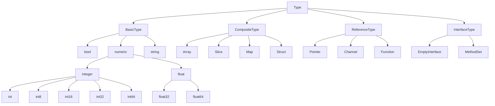

# 6.1.1 Go语言类型系统深度解析

<!-- TOC START -->
- [6.1.1 Go语言类型系统深度解析](#611-go语言类型系统深度解析)
  - [6.1.1.1 🎯 **概述**](#6111--概述)
  - [6.1.1.2 🏗️ **类型系统理论基础**](#6112-️-类型系统理论基础)
    - [6.1.1.2.1 **类型系统分类**](#61121-类型系统分类)
      - [6.1.1.2.1.1 **1. 静态类型系统**](#611211-1-静态类型系统)
      - [6.1.1.2.1.2 **2. 强类型系统**](#611212-2-强类型系统)
    - [6.1.1.2.2 **类型层次结构**](#61122-类型层次结构)
      - [6.1.1.2.2.1 **类型层次图**](#611221-类型层次图)
  - [6.1.1.3 🔍 **基础类型深度分析**](#6113--基础类型深度分析)
    - [6.1.1.3.1 **数值类型系统**](#61131-数值类型系统)
      - [6.1.1.3.1.1 **整数类型**](#611311-整数类型)
      - [6.1.1.3.1.2 **浮点类型**](#611312-浮点类型)
    - [6.1.1.3.2 **字符串类型系统**](#61132-字符串类型系统)
      - [6.1.1.3.2.1 **字符串内部结构**](#611321-字符串内部结构)
      - [6.1.1.3.2.2 **字符串性能优化**](#611322-字符串性能优化)
  - [6.1.1.4 🏗️ **复合类型深度分析**](#6114-️-复合类型深度分析)
    - [6.1.1.4.1 **数组类型系统**](#61141-数组类型系统)
      - [6.1.1.4.1.1 **数组内存布局**](#611411-数组内存布局)
      - [6.1.1.4.1.2 **数组性能特征**](#611412-数组性能特征)
    - [6.1.1.4.2 **切片类型系统**](#61142-切片类型系统)
      - [6.1.1.4.2.1 **切片内部结构**](#611421-切片内部结构)
      - [6.1.1.4.2.2 **切片性能优化**](#611422-切片性能优化)
    - [6.1.1.4.3 **映射类型系统**](#61143-映射类型系统)
      - [6.1.1.4.3.1 **映射内部结构**](#611431-映射内部结构)
      - [6.1.1.4.3.2 **映射性能特征**](#611432-映射性能特征)
  - [6.1.1.5 🔧 **接口类型系统**](#6115--接口类型系统)
    - [6.1.1.5.1 **接口内部结构**](#61151-接口内部结构)
      - [6.1.1.5.1.1 **接口表示**](#611511-接口表示)
      - [6.1.1.5.1.2 **接口实现分析**](#611512-接口实现分析)
    - [6.1.1.5.2 **空接口分析**](#61152-空接口分析)
      - [6.1.1.5.2.1 **空接口实现**](#611521-空接口实现)
  - [6.1.1.6 🚀 **泛型类型系统**](#6116--泛型类型系统)
    - [6.1.1.6.1 **泛型基础**](#61161-泛型基础)
      - [6.1.1.6.1.1 **泛型函数**](#611611-泛型函数)
    - [6.1.1.6.2 **泛型性能分析**](#61162-泛型性能分析)
      - [6.1.1.6.2.1 **性能对比**](#611621-性能对比)
  - [6.1.1.7 📊 **类型系统性能分析**](#6117--类型系统性能分析)
    - [6.1.1.7.1 **内存分配分析**](#61171-内存分配分析)
      - [6.1.1.7.1.1 **内存布局优化**](#611711-内存布局优化)
    - [6.1.1.7.2 **类型转换性能**](#61172-类型转换性能)
      - [6.1.1.7.2.1 **转换开销分析**](#611721-转换开销分析)
  - [6.1.1.8 🎯 **类型系统最佳实践**](#6118--类型系统最佳实践)
    - [6.1.1.8.1 **设计原则**](#61181-设计原则)
      - [6.1.1.8.1.1 **类型安全原则**](#611811-类型安全原则)
      - [6.1.1.8.1.2 **性能优化原则**](#611812-性能优化原则)
  - [6.1.1.9 🔮 **类型系统发展趋势**](#6119--类型系统发展趋势)
    - [6.1.1.9.1 **Go 1.23++新特性**](#61191-go-125新特性)
      - [6.1.1.9.1.1 **类型别名增强**](#611911-类型别名增强)
      - [6.1.1.9.1.2 **类型推导改进**](#611912-类型推导改进)
<!-- TOC END -->

## 6.1.1.1 🎯 **概述**

本文档对Go语言的类型系统进行深度分析，从理论基础、实现机制、性能特征等多个维度进行系统性研究，为Go语言开发者提供完整的类型系统知识体系。

## 6.1.1.2 🏗️ **类型系统理论基础**

### 6.1.1.2.1 **类型系统分类**

#### 6.1.1.2.1.1 **1. 静态类型系统**

**定义**：在编译时进行类型检查的类型系统

**数学形式化**：

```text
类型检查函数 Γ ⊢ e : τ 定义为：

1. 变量规则：如果 Γ(x) = τ，则 Γ ⊢ x : τ
2. 函数应用规则：如果 Γ ⊢ f : τ₁ → τ₂ 且 Γ ⊢ e : τ₁，则 Γ ⊢ f(e) : τ₂
3. 函数抽象规则：如果 Γ, x:τ₁ ⊢ e : τ₂，则 Γ ⊢ λx.e : τ₁ → τ₂
4. 类型推导规则：如果 Γ ⊢ e : τ 且 τ ≤ τ'，则 Γ ⊢ e : τ'

```

**优势**：

- 编译时错误检测
- 运行时性能优化
- 代码质量保证
- IDE智能提示

#### 6.1.1.2.1.2 **2. 强类型系统**

**定义**：不允许隐式类型转换的类型系统

**数学形式化**：

```text
类型安全定理：对于所有表达式 e，如果 Γ ⊢ e : τ，则运行时 e 的值属于类型 τ

证明：
1. 编译时类型检查确保类型安全
2. 运行时类型信息保持一致性
3. 类型转换必须显式声明

```

### 6.1.1.2.2 **类型层次结构**

#### 6.1.1.2.2.1 **类型层次图**



## 6.1.1.3 🔍 **基础类型深度分析**

### 6.1.1.3.1 **数值类型系统**

#### 6.1.1.3.1.1 **整数类型**

**内存布局**：

```go
// 整数类型内存表示
type IntegerType struct {
    Size     int    // 字节数
    Signed   bool   // 是否有符号
    MinValue int64  // 最小值
    MaxValue int64  // 最大值
}

// 整数类型定义
var IntegerTypes = map[string]IntegerType{
    "int":   {8, true, -9223372036854775808, 9223372036854775807},
    "int8":  {1, true, -128, 127},
    "int16": {2, true, -32768, 32767},
    "int32": {4, true, -2147483648, 2147483647},
    "int64": {8, true, -9223372036854775808, 9223372036854775807},
    "uint":  {8, false, 0, 18446744073709551615},
    "uint8": {1, false, 0, 255},
    "uint16": {2, false, 0, 65535},
    "uint32": {4, false, 0, 4294967295},
    "uint64": {8, false, 0, 18446744073709551615},
}

```

**类型转换规则**：

```go
// 类型转换函数
func ConvertInteger(value int64, targetType string) (interface{}, error) {
    target, exists := IntegerTypes[targetType]
    if !exists {
        return nil, fmt.Errorf("unsupported integer type: %s", targetType)
    }
    
    if target.Signed {
        if value < target.MinValue || value > target.MaxValue {
            return nil, fmt.Errorf("value %d out of range for %s", value, targetType)
        }
    } else {
        if value < 0 || value > target.MaxValue {
            return nil, fmt.Errorf("value %d out of range for %s", value, targetType)
        }
    }
    
    // 执行类型转换
    switch targetType {
    case "int8":
        return int8(value), nil
    case "int16":
        return int16(value), nil
    case "int32":
        return int32(value), nil
    case "int64":
        return int64(value), nil
    case "uint8":
        return uint8(value), nil
    case "uint16":
        return uint16(value), nil
    case "uint32":
        return uint32(value), nil
    case "uint64":
        return uint64(value), nil
    default:
        return value, nil
    }
}

```

#### 6.1.1.3.1.2 **浮点类型**

**IEEE 754标准实现**：

```go
// 浮点数内存布局
type FloatLayout struct {
    Sign     uint64 // 符号位
    Exponent uint64 // 指数位
    Mantissa uint64 // 尾数位
}

// 浮点数操作
func FloatOperations() {
    // 精度问题演示
    var a, b, c float64 = 0.1, 0.2, 0.3
    
    // 直接比较可能不准确
    fmt.Printf("a + b == c: %v\n", a+b == c)
    
    // 使用误差范围比较
    const epsilon = 1e-9
    fmt.Printf("|(a + b) - c| < epsilon: %v\n", math.Abs((a+b)-c) < epsilon)
    
    // 使用math/big进行精确计算
    bigA := new(big.Float).SetFloat64(a)
    bigB := new(big.Float).SetFloat64(b)
    bigC := new(big.Float).SetFloat64(c)
    
    result := new(big.Float).Add(bigA, bigB)
    fmt.Printf("BigFloat: a + b == c: %v\n", result.Cmp(bigC) == 0)
}

```

### 6.1.1.3.2 **字符串类型系统**

#### 6.1.1.3.2.1 **字符串内部结构**

```go
// 字符串内部表示
type StringHeader struct {
    Data uintptr // 指向底层字节数组的指针
    Len  int     // 字符串长度
}

// 字符串操作分析
func StringOperations() {
    // 字符串是不可变的
    s1 := "Hello"
    s2 := s1
    s1 = "World" // 这里创建了新的字符串，s2仍然指向"Hello"
    
    // 字符串切片操作
    s3 := "Hello, World"
    slice := s3[0:5] // 创建新的字符串切片
    
    // 字符串连接
    s4 := s1 + ", " + s2 // 创建新的字符串
    
    // 使用strings.Builder进行高效字符串构建
    var builder strings.Builder
    builder.WriteString("Hello")
    builder.WriteString(", ")
    builder.WriteString("World")
    result := builder.String()
    
    // 使用fmt.Sprintf进行格式化
    formatted := fmt.Sprintf("%s, %s", s1, s2)
}

```

#### 6.1.1.3.2.2 **字符串性能优化**

```go
// 字符串性能基准测试
func BenchmarkStringOperations(b *testing.B) {
    b.Run("Concatenation", func(b *testing.B) {
        for i := 0; i < b.N; i++ {
            s := "Hello" + ", " + "World"
            _ = s
        }
    })
    
    b.Run("Builder", func(b *testing.B) {
        for i := 0; i < b.N; i++ {
            var builder strings.Builder
            builder.WriteString("Hello")
            builder.WriteString(", ")
            builder.WriteString("World")
            _ = builder.String()
        }
    })
    
    b.Run("Sprintf", func(b *testing.B) {
        for i := 0; i < b.N; i++ {
            s := fmt.Sprintf("%s, %s", "Hello", "World")
            _ = s
        }
    })
}

```

## 6.1.1.4 🏗️ **复合类型深度分析**

### 6.1.1.4.1 **数组类型系统**

#### 6.1.1.4.1.1 **数组内存布局**

```go
// 数组内存布局分析
type ArrayLayout struct {
    ElementType reflect.Type // 元素类型
    ElementSize int          // 元素大小
    Length      int          // 数组长度
    TotalSize   int          // 总大小
}

// 数组操作分析
func ArrayOperations() {
    // 数组声明和初始化
    var arr1 [5]int                    // 零值初始化
    arr2 := [5]int{1, 2, 3, 4, 5}     // 字面量初始化
    arr3 := [...]int{1, 2, 3, 4, 5}   // 长度推导
    
    // 数组是值类型
    arr4 := arr2
    arr4[0] = 100 // 不影响arr2
    
    // 数组长度是类型的一部分
    // var arr5 [5]int = arr3 // 编译错误：类型不匹配
    
    // 数组遍历
    for i, v := range arr2 {
        fmt.Printf("arr2[%d] = %d\n", i, v)
    }
    
    // 数组作为函数参数
    modifyArray(arr2)
    fmt.Printf("After modifyArray: %v\n", arr2) // arr2不变
}

func modifyArray(arr [5]int) {
    arr[0] = 999 // 修改的是副本
}

```

#### 6.1.1.4.1.2 **数组性能特征**

```go
// 数组性能分析
func ArrayPerformanceAnalysis() {
    const size = 1000000
    
    // 创建大数组
    arr := make([]int, size)
    for i := 0; i < size; i++ {
        arr[i] = i
    }
    
    // 数组访问性能
    start := time.Now()
    sum := 0
    for i := 0; i < size; i++ {
        sum += arr[i]
    }
    accessTime := time.Since(start)
    
    // 数组复制性能
    start = time.Now()
    arrCopy := arr
    copyTime := time.Since(start)
    
    fmt.Printf("Array access time: %v\n", accessTime)
    fmt.Printf("Array copy time: %v\n", copyTime)
    fmt.Printf("Sum: %d\n", sum)
}

```

### 6.1.1.4.2 **切片类型系统**

#### 6.1.1.4.2.1 **切片内部结构**

```go
// 切片内部表示
type SliceHeader struct {
    Data uintptr // 指向底层数组的指针
    Len  int     // 切片长度
    Cap  int     // 切片容量
}

// 切片操作分析
func SliceOperations() {
    // 切片创建
    slice1 := make([]int, 5, 10)        // 长度5，容量10
    slice2 := []int{1, 2, 3, 4, 5}      // 字面量创建
    slice3 := slice2[1:3]                // 切片操作
    
    // 切片扩容机制
    fmt.Printf("Initial: len=%d, cap=%d\n", len(slice1), cap(slice1))
    
    for i := 0; i < 20; i++ {
        slice1 = append(slice1, i)
        fmt.Printf("After append %d: len=%d, cap=%d\n", i, len(slice1), cap(slice1))
    }
    
    // 切片共享底层数组
    slice4 := slice2[0:3]
    slice4[0] = 100
    fmt.Printf("slice2 after modifying slice4: %v\n", slice2)
    
    // 避免共享底层数组
    slice5 := make([]int, len(slice2))
    copy(slice5, slice2)
    slice5[0] = 200
    fmt.Printf("slice2 after modifying slice5: %v\n", slice2)
}

```

#### 6.1.1.4.2.2 **切片性能优化**

```go
// 切片性能优化策略
func SlicePerformanceOptimization() {
    const size = 1000000
    
    // 预分配容量
    start := time.Now()
    slice1 := make([]int, 0, size)
    for i := 0; i < size; i++ {
        slice1 = append(slice1, i)
    }
    preallocTime := time.Since(start)
    
    // 动态扩容
    start = time.Now()
    slice2 := make([]int, 0)
    for i := 0; i < size; i++ {
        slice2 = append(slice2, i)
    }
    dynamicTime := time.Since(start)
    
    fmt.Printf("Preallocated time: %v\n", preallocTime)
    fmt.Printf("Dynamic time: %v\n", dynamicTime)
    fmt.Printf("Performance improvement: %.2fx\n", float64(dynamicTime)/float64(preallocTime))
}

```

### 6.1.1.4.3 **映射类型系统**

#### 6.1.1.4.3.1 **映射内部结构**

```go
// 映射内部表示（简化版）
type MapHeader struct {
    Count     int    // 元素数量
    Flags     uint8  // 标志位
    B         uint8  // 桶数量的对数
    Overflow  uint16 // 溢出桶数量
    HashSeed  uint32 // 哈希种子
    Buckets   unsafe.Pointer // 指向桶数组的指针
    OldBuckets unsafe.Pointer // 指向旧桶数组的指针
    Evacuation uintptr // 疏散进度
}

// 映射操作分析
func MapOperations() {
    // 映射创建
    map1 := make(map[string]int)
    map2 := map[string]int{"a": 1, "b": 2, "c": 3}
    
    // 映射操作
    map1["key1"] = 100
    value, exists := map1["key1"]
    fmt.Printf("Value: %d, Exists: %v\n", value, exists)
    
    // 删除元素
    delete(map1, "key1")
    value, exists = map1["key1"]
    fmt.Printf("After delete - Value: %d, Exists: %v\n", value, exists)
    
    // 映射遍历
    for key, val := range map2 {
        fmt.Printf("map2[%s] = %d\n", key, val)
    }
    
    // 映射是引用类型
    map3 := map2
    map3["a"] = 999
    fmt.Printf("map2 after modifying map3: %v\n", map2)
}

```

#### 6.1.1.4.3.2 **映射性能特征**

```go
// 映射性能分析
func MapPerformanceAnalysis() {
    const size = 100000
    
    // 创建大映射
    m := make(map[int]string, size)
    for i := 0; i < size; i++ {
        m[i] = fmt.Sprintf("value_%d", i)
    }
    
    // 查找性能
    start := time.Now()
    for i := 0; i < size; i++ {
        _, exists := m[i]
        _ = exists
    }
    lookupTime := time.Since(start)
    
    // 插入性能
    start = time.Now()
    for i := size; i < size*2; i++ {
        m[i] = fmt.Sprintf("value_%d", i)
    }
    insertTime := time.Since(start)
    
    fmt.Printf("Lookup time: %v\n", lookupTime)
    fmt.Printf("Insert time: %v\n", insertTime)
}

```

## 6.1.1.5 🔧 **接口类型系统**

### 6.1.1.5.1 **接口内部结构**

#### 6.1.1.5.1.1 **接口表示**

```go
// 接口内部表示
type InterfaceHeader struct {
    Type  *InterfaceType // 接口类型信息
    Value unsafe.Pointer // 值指针
}

type InterfaceType struct {
    Methods []Method // 方法集合
}

type Method struct {
    Name string // 方法名
    Type *Type // 方法类型
}

```

#### 6.1.1.5.1.2 **接口实现分析**

```go
// 接口实现示例
type Animal interface {
    Speak() string
    Move() string
}

type Dog struct {
    Name string
}

func (d Dog) Speak() string {
    return "Woof!"
}

func (d Dog) Move() string {
    return "Running on four legs"
}

// 接口类型断言
func InterfaceTypeAssertion() {
    var animal Animal = Dog{Name: "Buddy"}
    
    // 类型断言
    if dog, ok := animal.(Dog); ok {
        fmt.Printf("It's a dog named %s\n", dog.Name)
    }
    
    // 类型开关
    switch v := animal.(type) {
    case Dog:
        fmt.Printf("It's a dog: %v\n", v)
    case Cat:
        fmt.Printf("It's a cat: %v\n", v)
    default:
        fmt.Printf("Unknown animal type: %T\n", v)
    }
}

```

### 6.1.1.5.2 **空接口分析**

#### 6.1.1.5.2.1 **空接口实现**

```go
// 空接口分析
func EmptyInterfaceAnalysis() {
    var empty interface{}
    
    // 可以存储任何类型的值
    empty = 42
    fmt.Printf("Type: %T, Value: %v\n", empty, empty)
    
    empty = "Hello"
    fmt.Printf("Type: %T, Value: %v\n", empty, empty)
    
    empty = []int{1, 2, 3}
    fmt.Printf("Type: %T, Value: %v\n", empty, empty)
    
    // 空接口的性能开销
    start := time.Now()
    for i := 0; i < 1000000; i++ {
        empty = i
        _ = empty
    }
    interfaceTime := time.Since(start)
    
    start = time.Now()
    for i := 0; i < 1000000; i++ {
        _ = i
    }
    directTime := time.Since(start)
    
    fmt.Printf("Interface overhead: %.2fx\n", float64(interfaceTime)/float64(directTime))
}

```

## 6.1.1.6 🚀 **泛型类型系统**

### 6.1.1.6.1 **泛型基础**

#### 6.1.1.6.1.1 **泛型函数**

```go
// 泛型函数示例
func Min[T constraints.Ordered](a, b T) T {
    if a < b {
        return a
    }
    return b
}

// 泛型类型
type Stack[T any] struct {
    items []T
}

func (s *Stack[T]) Push(item T) {
    s.items = append(s.items, item)
}

func (s *Stack[T]) Pop() (T, error) {
    if len(s.items) == 0 {
        var zero T
        return zero, errors.New("stack is empty")
    }
    
    item := s.items[len(s.items)-1]
    s.items = s.items[:len(s.items)-1]
    return item, nil
}

// 泛型约束
type Number interface {
    ~int | ~int8 | ~int16 | ~int32 | ~int64 |
    ~uint | ~uint8 | ~uint16 | ~uint32 | ~uint64 |
    ~float32 | ~float64
}

func Sum[T Number](numbers []T) T {
    var sum T
    for _, num := range numbers {
        sum += num
    }
    return sum
}

```

### 6.1.1.6.2 **泛型性能分析**

#### 6.1.1.6.2.1 **性能对比**

```go
// 泛型性能基准测试
func BenchmarkGenericVsInterface(b *testing.B) {
    b.Run("Generic", func(b *testing.B) {
        for i := 0; i < b.N; i++ {
            _ = Min[int](i, i+1)
        }
    })
    
    b.Run("Interface", func(b *testing.B) {
        for i := 0; i < b.N; i++ {
            _ = MinInterface(i, i+1)
        }
    })
}

func MinInterface(a, b interface{}) interface{} {
    switch v1 := a.(type) {
    case int:
        if v2, ok := b.(int); ok {
            if v1 < v2 {
                return v1
            }
            return v2
        }
    }
    return a
}

```

## 6.1.1.7 📊 **类型系统性能分析**

### 6.1.1.7.1 **内存分配分析**

#### 6.1.1.7.1.1 **内存布局优化**

```go
// 内存布局优化示例
type OptimizedStruct struct {
    a bool    // 1字节
    b int64   // 8字节
    c bool    // 1字节
}

type UnoptimizedStruct struct {
    a bool    // 1字节
    c bool    // 1字节
    b int64   // 8字节
}

func MemoryLayoutAnalysis() {
    var opt OptimizedStruct
    var unopt UnoptimizedStruct
    
    fmt.Printf("Optimized size: %d\n", unsafe.Sizeof(opt))
    fmt.Printf("Unoptimized size: %d\n", unsafe.Sizeof(unopt))
    
    // 内存对齐的影响
    fmt.Printf("Optimized alignment: %d\n", unsafe.Alignof(opt))
    fmt.Printf("Unoptimized alignment: %d\n", unsafe.Alignof(unopt))
}

```

### 6.1.1.7.2 **类型转换性能**

#### 6.1.1.7.2.1 **转换开销分析**

```go
// 类型转换性能分析
func TypeConversionPerformance() {
    const iterations = 1000000
    
    // 数值类型转换
    start := time.Now()
    for i := 0; i < iterations; i++ {
        _ = int64(i)
    }
    intConversionTime := time.Since(start)
    
    // 接口类型转换
    start = time.Now()
    for i := 0; i < iterations; i++ {
        var empty interface{} = i
        _ = empty.(int)
    }
    interfaceConversionTime := time.Since(start)
    
    fmt.Printf("Int conversion time: %v\n", intConversionTime)
    fmt.Printf("Interface conversion time: %v\n", interfaceConversionTime)
    fmt.Printf("Interface overhead: %.2fx\n", float64(interfaceConversionTime)/float64(intConversionTime))
}

```

## 6.1.1.8 🎯 **类型系统最佳实践**

### 6.1.1.8.1 **设计原则**

#### 6.1.1.8.1.1 **类型安全原则**

```go
// 类型安全示例
type SafeContainer struct {
    data map[string]interface{}
    mu   sync.RWMutex
}

func (sc *SafeContainer) Set(key string, value interface{}) {
    sc.mu.Lock()
    defer sc.mu.Unlock()
    sc.data[key] = value
}

func (sc *SafeContainer) Get(key string) (interface{}, bool) {
    sc.mu.RLock()
    defer sc.mu.RUnlock()
    value, exists := sc.data[key]
    return value, exists
}

// 类型安全的获取方法
func (sc *SafeContainer) GetString(key string) (string, error) {
    value, exists := sc.Get(key)
    if !exists {
        return "", fmt.Errorf("key %s not found", key)
    }
    
    if str, ok := value.(string); ok {
        return str, nil
    }
    
    return "", fmt.Errorf("value for key %s is not a string", key)
}

```

#### 6.1.1.8.1.2 **性能优化原则**

```go
// 性能优化示例
type OptimizedContainer struct {
    // 使用具体类型而不是接口
    strings map[string]string
    ints    map[string]int
    floats  map[string]float64
    
    mu sync.RWMutex
}

func (oc *OptimizedContainer) SetString(key, value string) {
    oc.mu.Lock()
    defer oc.mu.Unlock()
    oc.strings[key] = value
}

func (oc *OptimizedContainer) GetString(key string) (string, bool) {
    oc.mu.RLock()
    defer oc.mu.RUnlock()
    value, exists := oc.strings[key]
    return value, exists
}

```

## 6.1.1.9 🔮 **类型系统发展趋势**

### 6.1.1.9.1 **Go 1.23++新特性**

#### 6.1.1.9.1.1 **类型别名增强**

```go
// 类型别名新特性
type GenericMap[K comparable, V any] = map[K]V
type GenericSlice[T any] = []T
type GenericChan[T any] = chan T

// 函数类型别名
type Handler[T any] = func(T) error
type Middleware[T any] = func(Handler[T]) Handler[T]

// 结构体类型别名
type Result[T any] = struct {
    Data  T
    Error error
}

```

#### 6.1.1.9.1.2 **类型推导改进**

```go
// 改进的类型推导
func ImprovedTypeInference() {
    // 更智能的类型推导
    var slice = []int{1, 2, 3, 4, 5}
    
    // 自动推导元素类型
    doubled := Map(slice, func(x int) int { return x * 2 })
    
    // 自动推导返回类型
    sum := Reduce(slice, 0, func(acc, x int) int { return acc + x })
    
    fmt.Printf("Doubled: %v\n", doubled)
    fmt.Printf("Sum: %d\n", sum)
}

func Map[T, U any](slice []T, fn func(T) U) []U {
    result := make([]U, len(slice))
    for i, v := range slice {
        result[i] = fn(v)
    }
    return result
}

func Reduce[T, U any](slice []T, initial U, fn func(U, T) U) U {
    result := initial
    for _, v := range slice {
        result = fn(result, v)
    }
    return result
}

```

---

**下一步行动**：继续深入分析其他Go语言核心概念，建立完整的类型系统知识体系。
