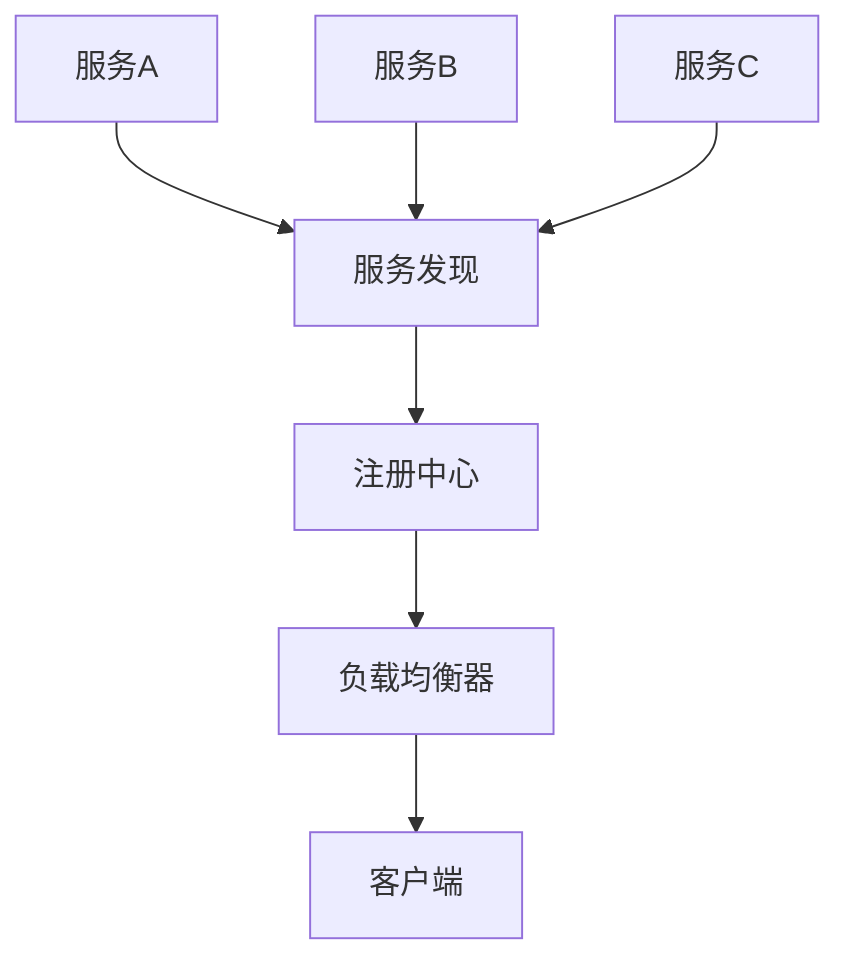
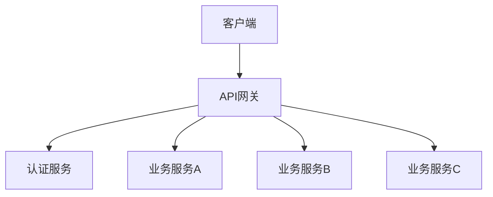
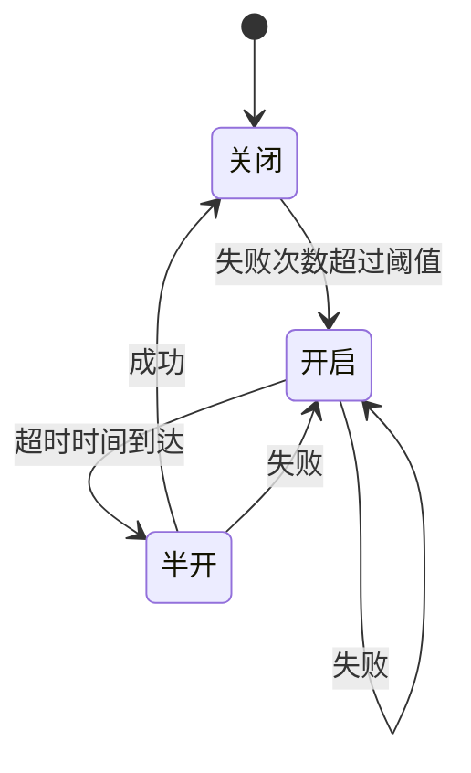
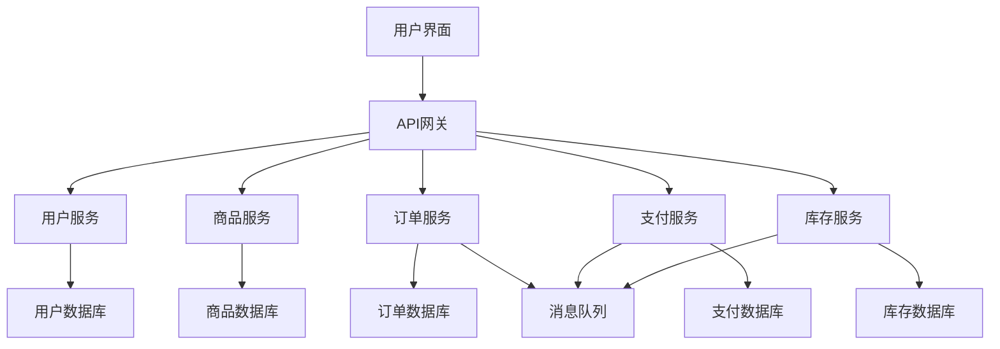
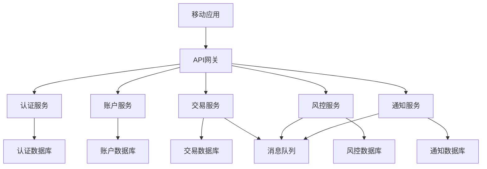

# 11.1.1 微服务架构分析

## 11.1.1.1 概述

本文档基于 `/model` 目录中的微服务相关内容，对微服务架构进行深入的形式化分析和Golang实现。微服务架构是一种将应用程序构建为一组小型自治服务的架构风格，每个服务运行在自己的进程中，通过轻量级机制进行通信。

## 11.1.1.2 目录

## 11.1.1.3 理论基础

### 11.1.1.3.1 1. 微服务架构概念

微服务架构是一种分布式系统架构，具有以下核心特征：

- **服务自治**: 每个服务独立部署、运行和扩展
- **技术多样性**: 不同服务可以使用不同的技术栈
- **数据隔离**: 每个服务管理自己的数据
- **故障隔离**: 单个服务故障不影响整个系统
- **团队自治**: 不同团队可以独立开发和维护服务

### 11.1.1.3.2 2. 微服务架构的优势

- **可扩展性**: 可以独立扩展单个服务
- **可维护性**: 代码库更小，更容易理解和维护
- **技术灵活性**: 可以为不同服务选择最适合的技术
- **部署灵活性**: 可以独立部署和更新服务
- **团队效率**: 团队可以独立工作，减少协调成本

## 11.1.1.4 形式化定义

### 11.1.1.4.1 1. 微服务系统定义

```latex
\textbf{定义 1.1} (微服务系统): 微服务系统是一个七元组 $\mathcal{MS} = (S, I, C, D, N, M, T)$，其中：

\begin{itemize}
    \item $S = \{s_1, s_2, \ldots, s_n\}$ 是服务集合
    \item $I = \{i_1, i_2, \ldots, i_m\}$ 是接口集合
    \item $C = \{c_1, c_2, \ldots, c_k\}$ 是通信协议集合
    \item $D = \{d_1, d_2, \ldots, d_l\}$ 是数据存储集合
    \item $N = \{n_1, n_2, \ldots, n_p\}$ 是网络节点集合
    \item $M = \{m_1, m_2, \ldots, m_q\}$ 是消息集合
    \item $T = \{t_1, t_2, \ldots, t_r\}$ 是时间戳集合
\end{itemize}

```

### 11.1.1.4.2 2. 服务定义

```latex
\textbf{定义 1.2} (微服务): 微服务是一个五元组 $s = (id, api, state, behavior, config)$，其中：

\begin{itemize}
    \item $id$ 是服务的唯一标识符
    \item $api$ 是服务的API接口定义
    \item $state$ 是服务的状态集合
    \item $behavior$ 是服务的行为函数
    \item $config$ 是服务的配置参数
\end{itemize}

```

### 11.1.1.4.3 3. 服务通信定义

```latex
\textbf{定义 1.3} (服务通信): 服务通信是一个三元组 $comm = (sender, receiver, message)$，其中：

\begin{itemize}
    \item $sender \in S$ 是发送方服务
    \item $receiver \in S$ 是接收方服务
    \item $message \in M$ 是通信消息
\end{itemize}

```

### 11.1.1.4.4 4. 系统一致性定理

```latex
\textbf{定理 1.1} (微服务系统一致性): 如果微服务系统 $\mathcal{MS}$ 满足以下条件：

\begin{enumerate}
    \item 所有服务都有明确的接口定义：$\forall s \in S, api(s) \neq \emptyset$
    \item 所有通信都有明确的协议：$\forall comm \in C, protocol(comm) \neq \emptyset$
    \item 所有状态转换都是可追踪的：$\forall s \in S, traceable(state(s))$
    \item 所有故障都有明确的处理策略：$\forall s \in S, fault\_handler(s) \neq \emptyset$
\end{enumerate}

则微服务系统 $\mathcal{MS}$ 是一致的。

```

**证明**: 通过归纳法证明每个条件都保证了系统的一致性。

## 11.1.1.5 架构模式

### 11.1.1.5.1 1. 服务发现模式



**形式化定义**:

```latex
\textbf{定义 1.4} (服务发现): 服务发现是一个四元组 $SD = (registry, lookup, health, update)$，其中：

\begin{itemize}
    \item $registry: S \rightarrow N$ 是服务注册函数
    \item $lookup: S \rightarrow 2^N$ 是服务查找函数
    \item $health: S \rightarrow \{healthy, unhealthy\}$ 是健康检查函数
    \item $update: S \times N \rightarrow N$ 是服务更新函数
\end{itemize}

```

### 11.1.1.5.2 2. API网关模式



**形式化定义**:

```latex
\textbf{定义 1.5} (API网关): API网关是一个五元组 $AG = (routes, auth, rate\_limit, transform, monitor)$，其中：

\begin{itemize}
    \item $routes: Request \rightarrow Service$ 是路由函数
    \item $auth: Request \rightarrow \{valid, invalid\}$ 是认证函数
    \item $rate\_limit: Request \rightarrow \{allowed, denied\}$ 是限流函数
    \item $transform: Request \rightarrow Request$ 是请求转换函数
    \item $monitor: Request \rightarrow Metrics$ 是监控函数
\end{itemize}

```

### 11.1.1.5.3 3. 熔断器模式



**形式化定义**:

```latex
\textbf{定义 1.6} (熔断器): 熔断器是一个四元组 $CB = (state, threshold, timeout, counter)$，其中：

\begin{itemize}
    \item $state \in \{closed, open, half\_open\}$ 是熔断器状态
    \item $threshold \in \mathbb{N}$ 是失败阈值
    \item $timeout \in \mathbb{R}^+$ 是超时时间
    \item $counter: \mathbb{N} \rightarrow \mathbb{N}$ 是失败计数器
\end{itemize}

```

## 11.1.1.6 Golang实现

### 11.1.1.6.1 1. 微服务基础框架

```go
package microservice

import (
    "context"
    "fmt"
    "log"
    "net/http"
    "sync"
    "time"
)

// Service 微服务接口
type Service interface {
    ID() string
    Start(ctx context.Context) error
    Stop(ctx context.Context) error
    Health() HealthStatus
    API() []Endpoint
}

// HealthStatus 健康状态
type HealthStatus struct {
    Status    string    `json:"status"`
    Timestamp time.Time `json:"timestamp"`
    Details   string    `json:"details,omitempty"`
}

// Endpoint API端点
type Endpoint struct {
    Path    string            `json:"path"`
    Method  string            `json:"method"`
    Handler http.HandlerFunc  `json:"-"`
}

// BaseService 基础服务实现
type BaseService struct {
    id       string
    server   *http.Server
    health   HealthStatus
    mutex    sync.RWMutex
    endpoints []Endpoint
}

// NewBaseService 创建基础服务
func NewBaseService(id string, port int) *BaseService {
    return &BaseService{
        id: id,
        server: &http.Server{
            Addr: fmt.Sprintf(":%d", port),
        },
        health: HealthStatus{
            Status:    "healthy",
            Timestamp: time.Now(),
        },
    }
}

// ID 返回服务ID
func (s *BaseService) ID() string {
    return s.id
}

// Start 启动服务
func (s *BaseService) Start(ctx context.Context) error {
    log.Printf("Starting service %s on %s", s.id, s.server.Addr)
    
    // 设置路由
    mux := http.NewServeMux()
    for _, endpoint := range s.endpoints {
        mux.HandleFunc(endpoint.Path, endpoint.Handler)
    }
    
    // 添加健康检查端点
    mux.HandleFunc("/health", s.healthHandler)
    
    s.server.Handler = mux
    
    // 启动服务器
    go func() {
        if err := s.server.ListenAndServe(); err != nil && err != http.ErrServerClosed {
            log.Printf("Server error: %v", err)
        }
    }()
    
    return nil
}

// Stop 停止服务
func (s *BaseService) Stop(ctx context.Context) error {
    log.Printf("Stopping service %s", s.id)
    
    s.mutex.Lock()
    s.health.Status = "stopping"
    s.mutex.Unlock()
    
    return s.server.Shutdown(ctx)
}

// Health 返回健康状态
func (s *BaseService) Health() HealthStatus {
    s.mutex.RLock()
    defer s.mutex.RUnlock()
    return s.health
}

// API 返回API端点
func (s *BaseService) API() []Endpoint {
    return s.endpoints
}

// healthHandler 健康检查处理器
func (s *BaseService) healthHandler(w http.ResponseWriter, r *http.Request) {
    health := s.Health()
    w.Header().Set("Content-Type", "application/json")
    w.WriteHeader(http.StatusOK)
    fmt.Fprintf(w, `{"status":"%s","timestamp":"%s"}`, health.Status, health.Timestamp.Format(time.RFC3339))
}

// AddEndpoint 添加API端点
func (s *BaseService) AddEndpoint(endpoint Endpoint) {
    s.endpoints = append(s.endpoints, endpoint)
}

```

### 11.1.1.6.2 2. 服务发现实现

```go
package discovery

import (
    "context"
    "encoding/json"
    "fmt"
    "log"
    "sync"
    "time"
)

// ServiceRegistry 服务注册中心
type ServiceRegistry struct {
    services map[string]*ServiceInfo
    mutex    sync.RWMutex
    ttl      time.Duration
}

// ServiceInfo 服务信息
type ServiceInfo struct {
    ID        string    `json:"id"`
    Name      string    `json:"name"`
    Address   string    `json:"address"`
    Port      int       `json:"port"`
    Health    string    `json:"health"`
    Metadata  map[string]string `json:"metadata"`
    LastSeen  time.Time `json:"last_seen"`
}

// NewServiceRegistry 创建服务注册中心
func NewServiceRegistry(ttl time.Duration) *ServiceRegistry {
    registry := &ServiceRegistry{
        services: make(map[string]*ServiceInfo),
        ttl:      ttl,
    }
    
    // 启动清理过期服务的goroutine
    go registry.cleanupExpiredServices()
    
    return registry
}

// Register 注册服务
func (r *ServiceRegistry) Register(service *ServiceInfo) error {
    r.mutex.Lock()
    defer r.mutex.Unlock()
    
    service.LastSeen = time.Now()
    r.services[service.ID] = service
    
    log.Printf("Service registered: %s at %s:%d", service.Name, service.Address, service.Port)
    return nil
}

// Deregister 注销服务
func (r *ServiceRegistry) Deregister(serviceID string) error {
    r.mutex.Lock()
    defer r.mutex.Unlock()
    
    if _, exists := r.services[serviceID]; exists {
        delete(r.services, serviceID)
        log.Printf("Service deregistered: %s", serviceID)
    }
    
    return nil
}

// GetService 获取服务信息
func (r *ServiceRegistry) GetService(serviceID string) (*ServiceInfo, error) {
    r.mutex.RLock()
    defer r.mutex.RUnlock()
    
    service, exists := r.services[serviceID]
    if !exists {
        return nil, fmt.Errorf("service not found: %s", serviceID)
    }
    
    return service, nil
}

// ListServices 列出所有服务
func (r *ServiceRegistry) ListServices() []*ServiceInfo {
    r.mutex.RLock()
    defer r.mutex.RUnlock()
    
    services := make([]*ServiceInfo, 0, len(r.services))
    for _, service := range r.services {
        services = append(services, service)
    }
    
    return services
}

// UpdateHealth 更新服务健康状态
func (r *ServiceRegistry) UpdateHealth(serviceID string, health string) error {
    r.mutex.Lock()
    defer r.mutex.Unlock()
    
    service, exists := r.services[serviceID]
    if !exists {
        return fmt.Errorf("service not found: %s", serviceID)
    }
    
    service.Health = health
    service.LastSeen = time.Now()
    
    return nil
}

// cleanupExpiredServices 清理过期服务
func (r *ServiceRegistry) cleanupExpiredServices() {
    ticker := time.NewTicker(r.ttl / 2)
    defer ticker.Stop()
    
    for range ticker.C {
        r.mutex.Lock()
        now := time.Now()
        for id, service := range r.services {
            if now.Sub(service.LastSeen) > r.ttl {
                delete(r.services, id)
                log.Printf("Service expired and removed: %s", id)
            }
        }
        r.mutex.Unlock()
    }
}

```

### 11.1.1.6.3 3. API网关实现

```go
package gateway

import (
    "context"
    "encoding/json"
    "fmt"
    "log"
    "net/http"
    "net/http/httputil"
    "net/url"
    "strings"
    "sync"
    "time"
)

// Gateway API网关
type Gateway struct {
    routes     map[string]*Route
    auth       Authenticator
    rateLimiter RateLimiter
    monitor    Monitor
    mutex      sync.RWMutex
}

// Route 路由配置
type Route struct {
    Path        string            `json:"path"`
    Method      string            `json:"method"`
    Service     string            `json:"service"`
    Auth        bool              `json:"auth"`
    RateLimit   int               `json:"rate_limit"`
    Transform   bool              `json:"transform"`
    Headers     map[string]string `json:"headers"`
}

// Authenticator 认证接口
type Authenticator interface {
    Authenticate(token string) (bool, error)
}

// RateLimiter 限流接口
type RateLimiter interface {
    Allow(key string) bool
}

// Monitor 监控接口
type Monitor interface {
    RecordRequest(method, path string, status int, duration time.Duration)
}

// NewGateway 创建API网关
func NewGateway(auth Authenticator, rateLimiter RateLimiter, monitor Monitor) *Gateway {
    return &Gateway{
        routes:      make(map[string]*Route),
        auth:        auth,
        rateLimiter: rateLimiter,
        monitor:     monitor,
    }
}

// AddRoute 添加路由
func (g *Gateway) AddRoute(route *Route) {
    g.mutex.Lock()
    defer g.mutex.Unlock()
    
    key := fmt.Sprintf("%s:%s", route.Method, route.Path)
    g.routes[key] = route
}

// ServeHTTP 处理HTTP请求
func (g *Gateway) ServeHTTP(w http.ResponseWriter, r *http.Request) {
    start := time.Now()
    
    // 查找路由
    route := g.findRoute(r.Method, r.URL.Path)
    if route == nil {
        http.NotFound(w, r)
        return
    }
    
    // 认证检查
    if route.Auth {
        if !g.authenticateRequest(r) {
            http.Error(w, "Unauthorized", http.StatusUnauthorized)
            return
        }
    }
    
    // 限流检查
    if !g.rateLimiter.Allow(route.Path) {
        http.Error(w, "Rate limit exceeded", http.StatusTooManyRequests)
        return
    }
    
    // 转发请求
    status := g.forwardRequest(w, r, route)
    
    // 记录监控数据
    duration := time.Since(start)
    g.monitor.RecordRequest(r.Method, r.URL.Path, status, duration)
}

// findRoute 查找路由
func (g *Gateway) findRoute(method, path string) *Route {
    g.mutex.RLock()
    defer g.mutex.RUnlock()
    
    key := fmt.Sprintf("%s:%s", method, path)
    return g.routes[key]
}

// authenticateRequest 认证请求
func (g *Gateway) authenticateRequest(r *http.Request) bool {
    token := r.Header.Get("Authorization")
    if token == "" {
        return false
    }
    
    // 移除Bearer前缀
    if strings.HasPrefix(token, "Bearer ") {
        token = token[7:]
    }
    
    valid, err := g.auth.Authenticate(token)
    if err != nil {
        log.Printf("Authentication error: %v", err)
        return false
    }
    
    return valid
}

// forwardRequest 转发请求
func (g *Gateway) forwardRequest(w http.ResponseWriter, r *http.Request, route *Route) int {
    // 创建目标URL
    targetURL, err := url.Parse(fmt.Sprintf("http://%s%s", route.Service, r.URL.Path))
    if err != nil {
        log.Printf("Error parsing target URL: %v", err)
        return http.StatusInternalServerError
    }
    
    // 创建反向代理
    proxy := httputil.NewSingleHostReverseProxy(targetURL)
    
    // 修改请求
    r.URL.Host = targetURL.Host
    r.URL.Scheme = targetURL.Scheme
    r.Header.Set("X-Forwarded-Host", r.Header.Get("Host"))
    r.Host = targetURL.Host
    
    // 添加自定义头部
    for key, value := range route.Headers {
        r.Header.Set(key, value)
    }
    
    // 转发请求
    proxy.ServeHTTP(w, r)
    
    return http.StatusOK
}

```

### 11.1.1.6.4 4. 熔断器实现

```go
package circuitbreaker

import (
    "context"
    "fmt"
    "sync"
    "time"
)

// State 熔断器状态
type State int

const (
    StateClosed State = iota
    StateOpen
    StateHalfOpen
)

// CircuitBreaker 熔断器
type CircuitBreaker struct {
    state       State
    failureCount int
    threshold   int
    timeout     time.Duration
    lastFailure time.Time
    mutex       sync.RWMutex
}

// NewCircuitBreaker 创建熔断器
func NewCircuitBreaker(threshold int, timeout time.Duration) *CircuitBreaker {
    return &CircuitBreaker{
        state:     StateClosed,
        threshold: threshold,
        timeout:   timeout,
    }
}

// Execute 执行操作
func (cb *CircuitBreaker) Execute(ctx context.Context, operation func() error) error {
    if !cb.canExecute() {
        return fmt.Errorf("circuit breaker is open")
    }
    
    err := operation()
    cb.recordResult(err)
    return err
}

// canExecute 检查是否可以执行
func (cb *CircuitBreaker) canExecute() bool {
    cb.mutex.RLock()
    defer cb.mutex.RUnlock()
    
    switch cb.state {
    case StateClosed:
        return true
    case StateOpen:
        if time.Since(cb.lastFailure) >= cb.timeout {
            cb.mutex.RUnlock()
            cb.mutex.Lock()
            cb.state = StateHalfOpen
            cb.mutex.Unlock()
            cb.mutex.RLock()
            return true
        }
        return false
    case StateHalfOpen:
        return true
    default:
        return false
    }
}

// recordResult 记录执行结果
func (cb *CircuitBreaker) recordResult(err error) {
    cb.mutex.Lock()
    defer cb.mutex.Unlock()
    
    if err != nil {
        cb.failureCount++
        cb.lastFailure = time.Now()
        
        if cb.state == StateClosed && cb.failureCount >= cb.threshold {
            cb.state = StateOpen
        } else if cb.state == StateHalfOpen {
            cb.state = StateOpen
        }
    } else {
        if cb.state == StateHalfOpen {
            cb.state = StateClosed
            cb.failureCount = 0
        }
    }
}

// GetState 获取当前状态
func (cb *CircuitBreaker) GetState() State {
    cb.mutex.RLock()
    defer cb.mutex.RUnlock()
    return cb.state
}

// GetFailureCount 获取失败次数
func (cb *CircuitBreaker) GetFailureCount() int {
    cb.mutex.RLock()
    defer cb.mutex.RUnlock()
    return cb.failureCount
}

```

## 11.1.1.7 性能分析

### 11.1.1.7.1 1. 时间复杂度分析

#### 11.1.1.7.1.1 服务发现

- **注册**: $O(1)$ - 哈希表插入
- **查找**: $O(1)$ - 哈希表查找
- **列表**: $O(n)$ - 遍历所有服务

#### 11.1.1.7.1.2 API网关

- **路由查找**: $O(1)$ - 哈希表查找
- **认证**: $O(1)$ - Token验证
- **限流**: $O(1)$ - 计数器检查
- **转发**: $O(1)$ - HTTP代理

#### 11.1.1.7.1.3 熔断器

- **状态检查**: $O(1)$ - 状态变量读取
- **结果记录**: $O(1)$ - 计数器更新

### 11.1.1.7.2 2. 空间复杂度分析

#### 11.1.1.7.2.1 服务注册中心

- **服务存储**: $O(n)$ - n个服务的信息
- **健康检查**: $O(n)$ - n个服务的健康状态

#### 11.1.1.7.2.2 API网关

- **路由表**: $O(m)$ - m个路由配置
- **限流器**: $O(k)$ - k个限流键

### 11.1.1.7.3 3. 并发性能分析

#### 11.1.1.7.3.1 读写锁优化

```go
// 使用读写锁优化并发性能
type OptimizedRegistry struct {
    services map[string]*ServiceInfo
    mutex    sync.RWMutex  // 读写锁
}

func (r *OptimizedRegistry) GetService(id string) (*ServiceInfo, error) {
    r.mutex.RLock()  // 读锁
    defer r.mutex.RUnlock()
    // 读取操作
}

func (r *OptimizedRegistry) Register(service *ServiceInfo) error {
    r.mutex.Lock()   // 写锁
    defer r.mutex.Unlock()
    // 写入操作
}

```

#### 11.1.1.7.3.2 连接池优化

```go
// HTTP连接池配置
type HTTPClient struct {
    client *http.Client
}

func NewHTTPClient() *HTTPClient {
    return &HTTPClient{
        client: &http.Client{
            Transport: &http.Transport{
                MaxIdleConns:        100,
                MaxIdleConnsPerHost: 10,
                IdleConnTimeout:     90 * time.Second,
            },
            Timeout: 30 * time.Second,
        },
    }
}

```

## 11.1.1.8 最佳实践

### 11.1.1.8.1 1. 服务设计原则

#### 11.1.1.8.1.1 单一职责原则

- 每个服务只负责一个业务领域
- 服务边界清晰，职责明确
- 避免服务间的强耦合

#### 11.1.1.8.1.2 数据隔离原则

- 每个服务管理自己的数据
- 避免跨服务的数据共享
- 使用事件驱动进行数据同步

#### 11.1.1.8.1.3 接口设计原则

- 设计稳定的API接口
- 使用版本控制管理接口变更
- 提供完整的API文档

### 11.1.1.8.2 2. 通信设计原则

#### 11.1.1.8.2.1 同步通信

- 使用HTTP/REST进行同步通信
- 实现重试机制和超时控制
- 使用熔断器防止级联失败

#### 11.1.1.8.2.2 异步通信

- 使用消息队列进行异步通信
- 实现事件驱动架构
- 保证消息的可靠传递

### 11.1.1.8.3 3. 部署设计原则

#### 11.1.1.8.3.1 容器化部署

- 使用Docker容器化服务
- 使用Kubernetes进行编排
- 实现自动化部署和回滚

#### 11.1.1.8.3.2 监控和日志

- 实现分布式追踪
- 集中化日志管理
- 实时监控和告警

## 11.1.1.9 案例分析

### 11.1.1.9.1 1. 电商微服务架构



#### 11.1.1.9.1.1 服务拆分策略

- **用户服务**: 用户注册、登录、个人信息管理
- **商品服务**: 商品信息、分类、搜索
- **订单服务**: 订单创建、状态管理、历史查询
- **支付服务**: 支付处理、退款、对账
- **库存服务**: 库存管理、库存锁定、库存更新

#### 11.1.1.9.1.2 数据一致性

- 使用Saga模式管理分布式事务
- 实现补偿机制处理失败场景
- 使用事件溯源保证数据一致性

### 11.1.1.9.2 2. 金融微服务架构



#### 11.1.1.9.2.1 安全设计

- 实现多层认证机制
- 使用加密传输敏感数据
- 实现审计日志和合规检查

#### 11.1.1.9.2.2 高可用设计

- 实现服务冗余和故障转移
- 使用负载均衡分发请求
- 实现自动扩缩容

---

* 本文档将持续更新，确保微服务架构分析的完整性和准确性。*
