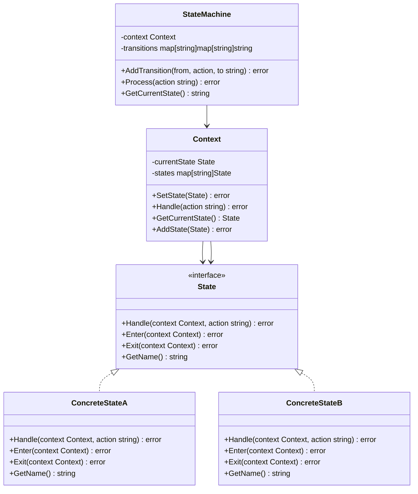
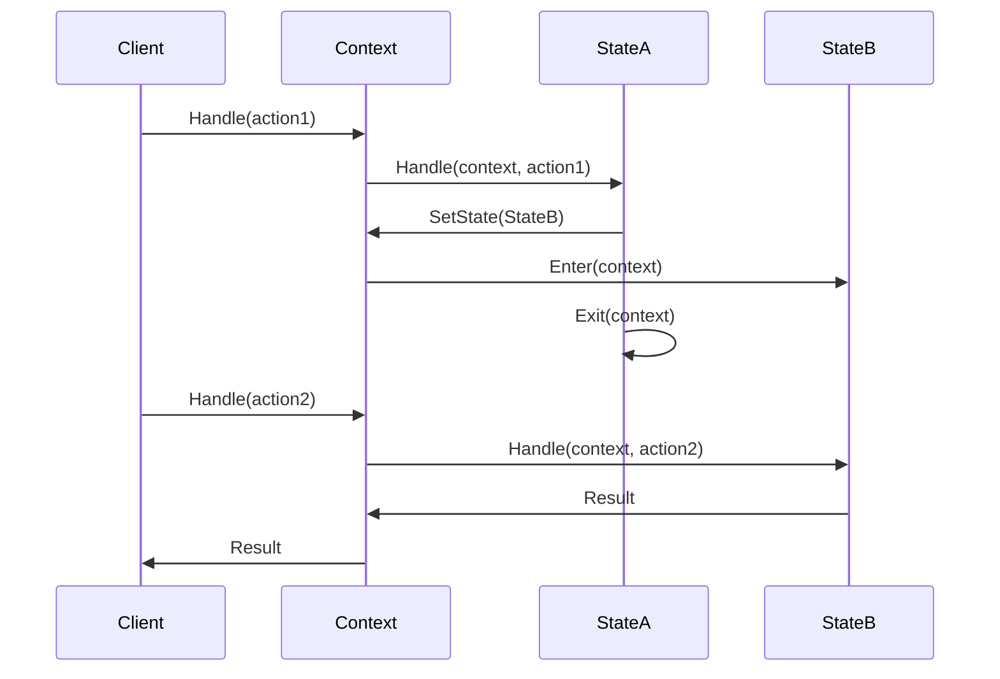
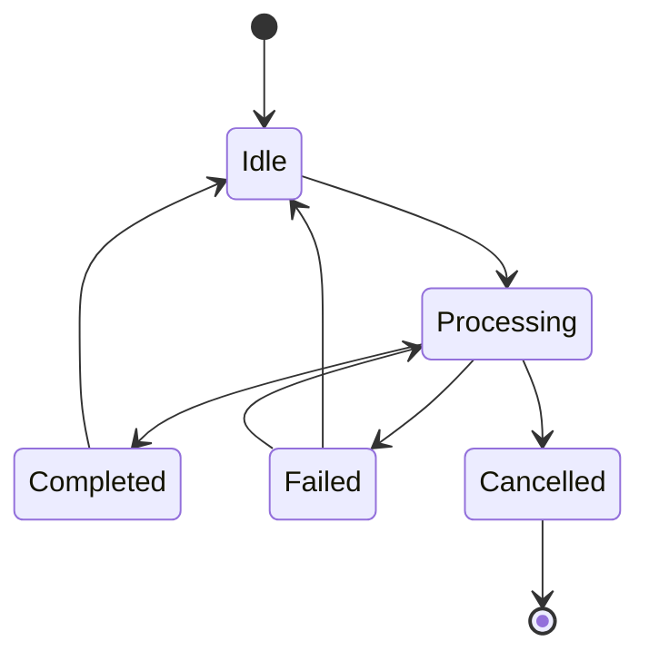

# 状态模式 (State Pattern)

## 目录

- [状态模式 (State Pattern)](#状态模式-state-pattern)
  - [目录](#目录)
  - [1. 概述](#1-概述)
    - [1.1 模式定义](#11-模式定义)
    - [1.2 核心思想](#12-核心思想)
  - [2. 形式化定义](#2-形式化定义)
    - [2.1 数学定义](#21-数学定义)
    - [2.2 状态机代数](#22-状态机代数)
    - [2.3 状态转换公理](#23-状态转换公理)
    - [2.4 状态机系统](#24-状态机系统)
  - [3. 结构分析](#3-结构分析)
    - [3.1 UML类图](#31-uml类图)
    - [3.2 时序图](#32-时序图)
    - [3.3 状态转换图](#33-状态转换图)
  - [4. Golang实现](#4-golang实现)
    - [4.1 核心接口设计](#41-核心接口设计)
    - [4.2 基础状态实现](#42-基础状态实现)
    - [4.3 上下文实现](#43-上下文实现)
    - [4.4 状态机实现](#44-状态机实现)
    - [4.5 具体状态实现](#45-具体状态实现)
    - [4.6 状态持久化](#46-状态持久化)
  - [5. 性能分析](#5-性能分析)
    - [5.1 时间复杂度分析](#51-时间复杂度分析)
      - [5.1.1 状态转换](#511-状态转换)
      - [5.1.2 动作处理](#512-动作处理)
      - [5.1.3 状态机验证](#513-状态机验证)
    - [5.2 空间复杂度分析](#52-空间复杂度分析)
      - [5.2.1 内存使用](#521-内存使用)
      - [5.2.2 内存优化](#522-内存优化)
    - [5.3 并发性能分析](#53-并发性能分析)
      - [5.3.1 并发状态机](#531-并发状态机)
      - [5.3.2 状态同步](#532-状态同步)
    - [5.4 基准测试](#54-基准测试)
  - [6. 应用场景](#6-应用场景)
    - [6.1 工作流引擎](#61-工作流引擎)
    - [6.2 游戏状态管理](#62-游戏状态管理)
    - [6.3 网络连接状态管理](#63-网络连接状态管理)
  - [7. 最佳实践](#7-最佳实践)
    - [7.1 设计原则](#71-设计原则)
    - [7.2 实现建议](#72-实现建议)
    - [7.3 常见陷阱](#73-常见陷阱)
  - [8. 案例分析](#8-案例分析)
    - [8.1 完整的订单处理系统](#81-完整的订单处理系统)
    - [8.2 状态持久化示例](#82-状态持久化示例)

## 1. 概述

### 1.1 模式定义

状态模式允许对象在内部状态改变时改变其行为，对象看起来好像修改了其类。
在Golang中，状态模式充分利用接口和组合特性，实现灵活的状态管理机制。

### 1.2 核心思想

- **状态封装**：将状态相关的行为封装在独立的状态类中
- **状态转换**：对象可以在不同状态间转换
- **行为变化**：同一操作在不同状态下有不同的行为
- **状态隔离**：每个状态只负责自己的行为
- **开闭原则**：新增状态不需要修改现有代码

## 2. 形式化定义

### 2.1 数学定义

设 $S$ 为状态集合，$O$ 为对象集合，$A$ 为动作集合，定义状态系统：

$$\mathcal{S} = (S, O, A, \rightarrow, \phi, \psi, \delta)$$

其中：

- $\rightarrow \subseteq S \times A \times S$ 为状态转换关系
- $\phi: O \times S \rightarrow \{true, false\}$ 为状态有效性函数
- $\psi: S \times A \rightarrow A$ 为状态行为函数
- $\delta: O \times A \rightarrow S$ 为状态转换函数

### 2.2 状态机代数

定义状态机代数：

$$(S, \oplus, \otimes, \circ, \preceq)$$

其中：

- $\oplus$ 为状态组合：$s_1 \oplus s_2$ 表示状态组合
- $\otimes$ 为状态变换：$s_1 \otimes s_2$ 表示状态变换
- $\circ$ 为状态应用：$s_1 \circ s_2$ 表示状态应用
- $\preceq$ 为优先级关系：$s_1 \preceq s_2$ 表示 $s_1$ 优先级不高于 $s_2$

### 2.3 状态转换公理

**公理1（状态一致性）**：
$$\forall s \in S, a \in A: \psi(s, a) \in A$$

**公理2（转换传递性）**：
$$\forall s_1, s_2, s_3 \in S, a_1, a_2 \in A: s_1 \xrightarrow{a_1} s_2 \land s_2 \xrightarrow{a_2} s_3 \Rightarrow s_1 \xrightarrow{a_1 \circ a_2} s_3$$

**公理3（状态唯一性）**：
$$\forall o \in O: \exists! s \in S: \phi(o, s)$$

### 2.4 状态机系统

定义状态机系统：

$$\mathcal{M} = (Q, \Sigma, \delta, q_0, F)$$

其中：

- $Q$ 为状态集合
- $\Sigma$ 为输入字母表
- $\delta: Q \times \Sigma \rightarrow Q$ 为状态转换函数
- $q_0 \in Q$ 为初始状态
- $F \subseteq Q$ 为接受状态集合

## 3. 结构分析

### 3.1 UML类图



### 3.2 时序图



### 3.3 状态转换图



## 4. Golang实现

### 4.1 核心接口设计

```go
// State 状态接口
type State interface {
    Handle(context Context, action string) error
    Enter(context Context) error
    Exit(context Context) error
    GetName() string
    CanHandle(action string) bool
}

// Context 上下文接口
type Context interface {
    SetState(state State) error
    Handle(action string) error
    GetCurrentState() State
    AddState(state State) error
    GetData() map[string]interface{}
    SetData(key string, value interface{})
}

// StateMachine 状态机接口
type StateMachine interface {
    AddTransition(from, action, to string) error
    Process(action string) error
    GetCurrentState() string
    GetAvailableActions() []string
    IsValidTransition(from, action, to string) bool
}

// StateTransition 状态转换
type StateTransition struct {
    From   string
    Action string
    To     string
    Guard  func(Context) bool
}

// StateEvent 状态事件
type StateEvent struct {
    Type      string
    FromState string
    ToState   string
    Action    string
    Data      map[string]interface{}
    Timestamp time.Time
}

```

### 4.2 基础状态实现

```go
// BaseState 基础状态
type BaseState struct {
    name string
}

func NewBaseState(name string) *BaseState {
    return &BaseState{
        name: name,
    }
}

func (s *BaseState) GetName() string {
    return s.name
}

func (s *BaseState) CanHandle(action string) bool {
    return true // 默认处理所有动作
}

func (s *BaseState) Enter(context Context) error {
    log.Printf("Entering state: %s", s.name)
    return nil
}

func (s *BaseState) Exit(context Context) error {
    log.Printf("Exiting state: %s", s.name)
    return nil
}

// ConcreteState 具体状态
type ConcreteState struct {
    BaseState
    handler func(Context, string) error
    actions map[string]bool
}

func NewConcreteState(name string, handler func(Context, string) error) *ConcreteState {
    return &ConcreteState{
        BaseState: *NewBaseState(name),
        handler:   handler,
        actions:   make(map[string]bool),
    }
}

func (s *ConcreteState) Handle(context Context, action string) error {
    if !s.CanHandle(action) {
        return fmt.Errorf("action %s not supported in state %s", action, s.GetName())
    }
    
    if s.handler != nil {
        return s.handler(context, action)
    }
    
    return nil
}

func (s *ConcreteState) CanHandle(action string) bool {
    if len(s.actions) == 0 {
        return true
    }
    return s.actions[action]
}

func (s *ConcreteState) AddAction(action string) {
    s.actions[action] = true
}

func (s *ConcreteState) RemoveAction(action string) {
    delete(s.actions, action)
}

```

### 4.3 上下文实现

```go
// StateContext 状态上下文
type StateContext struct {
    currentState State
    states       map[string]State
    data         map[string]interface{}
    mu           sync.RWMutex
    history      []StateEvent
}

func NewStateContext() *StateContext {
    return &StateContext{
        states:  make(map[string]State),
        data:    make(map[string]interface{}),
        history: make([]StateEvent, 0),
    }
}

func (c *StateContext) SetState(state State) error {
    c.mu.Lock()
    defer c.mu.Unlock()
    
    if state == nil {
        return fmt.Errorf("state cannot be nil")
    }
    
    // 退出当前状态
    if c.currentState != nil {
        if err := c.currentState.Exit(c); err != nil {
            return fmt.Errorf("failed to exit current state: %w", err)
        }
        
        // 记录状态转换事件
        event := StateEvent{
            Type:      "state_exit",
            FromState: c.currentState.GetName(),
            ToState:   state.GetName(),
            Timestamp: time.Now(),
        }
        c.history = append(c.history, event)
    }
    
    // 进入新状态
    if err := state.Enter(c); err != nil {
        return fmt.Errorf("failed to enter new state: %w", err)
    }
    
    c.currentState = state
    
    // 记录状态转换事件
    event := StateEvent{
        Type:      "state_enter",
        FromState: "",
        ToState:   state.GetName(),
        Timestamp: time.Now(),
    }
    c.history = append(c.history, event)
    
    return nil
}

func (c *StateContext) Handle(action string) error {
    c.mu.RLock()
    defer c.mu.RUnlock()
    
    if c.currentState == nil {
        return fmt.Errorf("no current state")
    }
    
    if !c.currentState.CanHandle(action) {
        return fmt.Errorf("action %s not supported in current state %s", action, c.currentState.GetName())
    }
    
    // 记录动作事件
    event := StateEvent{
        Type:      "action",
        FromState: c.currentState.GetName(),
        Action:    action,
        Data:      c.copyData(),
        Timestamp: time.Now(),
    }
    c.history = append(c.history, event)
    
    return c.currentState.Handle(c, action)
}

func (c *StateContext) GetCurrentState() State {
    c.mu.RLock()
    defer c.mu.RUnlock()
    return c.currentState
}

func (c *StateContext) AddState(state State) error {
    c.mu.Lock()
    defer c.mu.Unlock()
    
    if state == nil {
        return fmt.Errorf("state cannot be nil")
    }
    
    stateName := state.GetName()
    if _, exists := c.states[stateName]; exists {
        return fmt.Errorf("state %s already exists", stateName)
    }
    
    c.states[stateName] = state
    return nil
}

func (c *StateContext) GetData() map[string]interface{} {
    c.mu.RLock()
    defer c.mu.RUnlock()
    
    result := make(map[string]interface{})
    for k, v := range c.data {
        result[k] = v
    }
    return result
}

func (c *StateContext) SetData(key string, value interface{}) {
    c.mu.Lock()
    defer c.mu.Unlock()
    c.data[key] = value
}

func (c *StateContext) GetHistory() []StateEvent {
    c.mu.RLock()
    defer c.mu.RUnlock()
    
    result := make([]StateEvent, len(c.history))
    copy(result, c.history)
    return result
}

func (c *StateContext) copyData() map[string]interface{} {
    result := make(map[string]interface{})
    for k, v := range c.data {
        result[k] = v
    }
    return result
}

```

### 4.4 状态机实现

```go
// StateMachine 状态机
type StateMachine struct {
    context     Context
    transitions map[string]map[string]string
    guards      map[string]func(Context) bool
    mu          sync.RWMutex
}

func NewStateMachine(context Context) *StateMachine {
    return &StateMachine{
        context:     context,
        transitions: make(map[string]map[string]string),
        guards:      make(map[string]func(Context) bool),
    }
}

func (sm *StateMachine) AddTransition(from, action, to string) error {
    sm.mu.Lock()
    defer sm.mu.Unlock()
    
    if sm.transitions[from] == nil {
        sm.transitions[from] = make(map[string]string)
    }
    
    sm.transitions[from][action] = to
    return nil
}

func (sm *StateMachine) AddTransitionWithGuard(from, action, to string, guard func(Context) bool) error {
    if err := sm.AddTransition(from, action, to); err != nil {
        return err
    }
    
    sm.mu.Lock()
    defer sm.mu.Unlock()
    
    key := fmt.Sprintf("%s:%s", from, action)
    sm.guards[key] = guard
    
    return nil
}

func (sm *StateMachine) Process(action string) error {
    sm.mu.RLock()
    defer sm.mu.RUnlock()
    
    currentState := sm.context.GetCurrentState()
    if currentState == nil {
        return fmt.Errorf("no current state")
    }
    
    fromState := currentState.GetName()
    
    // 检查转换是否存在
    transitions, exists := sm.transitions[fromState]
    if !exists {
        return fmt.Errorf("no transitions from state %s", fromState)
    }
    
    toState, exists := transitions[action]
    if !exists {
        return fmt.Errorf("no transition from %s with action %s", fromState, action)
    }
    
    // 检查守卫条件
    key := fmt.Sprintf("%s:%s", fromState, action)
    if guard, exists := sm.guards[key]; exists {
        if !guard(sm.context) {
            return fmt.Errorf("guard condition failed for transition %s -> %s", fromState, toState)
        }
    }
    
    // 执行状态转换
    if err := sm.context.Handle(action); err != nil {
        return fmt.Errorf("failed to handle action: %w", err)
    }
    
    // 设置新状态
    newState, err := sm.getState(toState)
    if err != nil {
        return fmt.Errorf("failed to get state %s: %w", toState, err)
    }
    
    return sm.context.SetState(newState)
}

func (sm *StateMachine) GetCurrentState() string {
    currentState := sm.context.GetCurrentState()
    if currentState == nil {
        return ""
    }
    return currentState.GetName()
}

func (sm *StateMachine) GetAvailableActions() []string {
    sm.mu.RLock()
    defer sm.mu.RUnlock()
    
    currentState := sm.context.GetCurrentState()
    if currentState == nil {
        return []string{}
    }
    
    fromState := currentState.GetName()
    transitions, exists := sm.transitions[fromState]
    if !exists {
        return []string{}
    }
    
    actions := make([]string, 0, len(transitions))
    for action := range transitions {
        actions = append(actions, action)
    }
    
    return actions
}

func (sm *StateMachine) IsValidTransition(from, action, to string) bool {
    sm.mu.RLock()
    defer sm.mu.RUnlock()
    
    transitions, exists := sm.transitions[from]
    if !exists {
        return false
    }
    
    expectedTo, exists := transitions[action]
    if !exists {
        return false
    }
    
    return expectedTo == to
}

func (sm *StateMachine) getState(stateName string) (State, error) {
    // 这里需要从context中获取状态
    // 实际实现中可能需要修改Context接口
    return nil, fmt.Errorf("state %s not found", stateName)
}

```

### 4.5 具体状态实现

```go
// 工作流状态
type WorkflowState struct {
    BaseState
    allowedActions map[string]bool
    onEnter        func(Context) error
    onExit         func(Context) error
    onAction       func(Context, string) error
}

func NewWorkflowState(name string) *WorkflowState {
    return &WorkflowState{
        BaseState:      *NewBaseState(name),
        allowedActions: make(map[string]bool),
    }
}

func (w *WorkflowState) AddAllowedAction(action string) {
    w.allowedActions[action] = true
}

func (w *WorkflowState) SetOnEnter(handler func(Context) error) {
    w.onEnter = handler
}

func (w *WorkflowState) SetOnExit(handler func(Context) error) {
    w.onExit = handler
}

func (w *WorkflowState) SetOnAction(handler func(Context, string) error) {
    w.onAction = handler
}

func (w *WorkflowState) Enter(context Context) error {
    if w.onEnter != nil {
        return w.onEnter(context)
    }
    return w.BaseState.Enter(context)
}

func (w *WorkflowState) Exit(context Context) error {
    if w.onExit != nil {
        return w.onExit(context)
    }
    return w.BaseState.Exit(context)
}

func (w *WorkflowState) Handle(context Context, action string) error {
    if !w.CanHandle(action) {
        return fmt.Errorf("action %s not allowed in state %s", action, w.GetName())
    }
    
    if w.onAction != nil {
        return w.onAction(context, action)
    }
    
    return nil
}

func (w *WorkflowState) CanHandle(action string) bool {
    return w.allowedActions[action]
}

// 异步状态
type AsyncState struct {
    BaseState
    handler    func(Context, string) error
    resultChan chan error
    done       chan struct{}
}

func NewAsyncState(name string, handler func(Context, string) error) *AsyncState {
    return &AsyncState{
        BaseState:  *NewBaseState(name),
        handler:    handler,
        resultChan: make(chan error, 1),
        done:       make(chan struct{}),
    }
}

func (a *AsyncState) Handle(context Context, action string) error {
    if a.handler == nil {
        return fmt.Errorf("no handler defined for async state")
    }
    
    go func() {
        err := a.handler(context, action)
        select {
        case a.resultChan <- err:
        case <-a.done:
        }
    }()
    
    select {
    case err := <-a.resultChan:
        return err
    case <-time.After(30 * time.Second):
        return fmt.Errorf("async state operation timeout")
    }
}

func (a *AsyncState) Stop() {
    close(a.done)
}

```

### 4.6 状态持久化

```go
// StatePersistence 状态持久化接口
type StatePersistence interface {
    Save(context Context) error
    Load(context Context) error
    GetStateHistory(contextID string) ([]StateEvent, error)
}

// FileStatePersistence 文件状态持久化
type FileStatePersistence struct {
    filePath string
    mu       sync.RWMutex
}

func NewFileStatePersistence(filePath string) *FileStatePersistence {
    return &FileStatePersistence{
        filePath: filePath,
    }
}

func (f *FileStatePersistence) Save(context Context) error {
    f.mu.Lock()
    defer f.mu.Unlock()
    
    currentState := context.GetCurrentState()
    if currentState == nil {
        return fmt.Errorf("no current state to save")
    }
    
    stateData := map[string]interface{}{
        "currentState": currentState.GetName(),
        "data":         context.GetData(),
        "timestamp":    time.Now(),
    }
    
    data, err := json.Marshal(stateData)
    if err != nil {
        return fmt.Errorf("failed to marshal state data: %w", err)
    }
    
    return os.WriteFile(f.filePath, data, 0644)
}

func (f *FileStatePersistence) Load(context Context) error {
    f.mu.RLock()
    defer f.mu.RUnlock()
    
    data, err := os.ReadFile(f.filePath)
    if err != nil {
        return fmt.Errorf("failed to read state file: %w", err)
    }
    
    var stateData map[string]interface{}
    if err := json.Unmarshal(data, &stateData); err != nil {
        return fmt.Errorf("failed to unmarshal state data: %w", err)
    }
    
    // 恢复数据
    if data, ok := stateData["data"].(map[string]interface{}); ok {
        for k, v := range data {
            context.SetData(k, v)
        }
    }
    
    // 恢复状态
    if stateName, ok := stateData["currentState"].(string); ok {
        // 这里需要根据状态名称获取状态对象
        // 实际实现中可能需要状态注册机制
    }
    
    return nil
}

func (f *FileStatePersistence) GetStateHistory(contextID string) ([]StateEvent, error) {
    // 实现状态历史查询
    return []StateEvent{}, nil
}

```

## 5. 性能分析

### 5.1 时间复杂度分析

#### 5.1.1 状态转换

状态转换的时间复杂度：

$$T(n) = O(1)$$

其中 $n$ 为状态数量。

**证明**：

- 状态转换主要涉及查找和设置操作
- 使用映射表进行状态查找，时间复杂度为 $O(1)$
- 状态设置操作为常数时间

#### 5.1.2 动作处理

动作处理的时间复杂度：

$$T(n) = O(f(n))$$

其中 $f(n)$ 为具体动作的处理复杂度。

**证明**：

- 动作处理时间取决于具体实现
- 不同动作可能有不同的复杂度
- 总时间复杂度为 $O(f(n))$

#### 5.1.3 状态机验证

状态机验证的时间复杂度：

$$T(n, m) = O(n \cdot m)$$

其中：

- $n$ 为状态数量
- $m$ 为动作数量

**证明**：

- 需要验证所有状态和动作的组合
- 每个组合的验证时间为常数
- 总时间复杂度为 $O(n \cdot m)$

### 5.2 空间复杂度分析

#### 5.2.1 内存使用

空间复杂度为：

$$S(n) = O(n)$$

其中 $n$ 为状态数量。

**分析**：

- 每个状态占用常数空间
- 状态存储占用 $O(n)$ 空间
- 转换表占用 $O(n \cdot m)$ 空间，其中 $m$ 为动作数量

#### 5.2.2 内存优化

```go
// 状态池优化
type StatePool struct {
    pool sync.Pool
}

func NewStatePool() *StatePool {
    return &StatePool{
        pool: sync.Pool{
            New: func() interface{} {
                return &BaseState{}
            },
        },
    }
}

func (p *StatePool) Get() *BaseState {
    return p.pool.Get().(*BaseState)
}

func (p *StatePool) Put(state *BaseState) {
    state.name = ""
    p.pool.Put(state)
}

```

### 5.3 并发性能分析

#### 5.3.1 并发状态机

定义并发状态机性能：

$$C(n, m) = \frac{n \cdot m}{t_{avg}}$$

其中：

- $n$ 为并发数
- $m$ 为状态转换数
- $t_{avg}$ 为平均转换时间

#### 5.3.2 状态同步

定义状态同步性能：

$$S(n) = t_{sync} + t_{process} + t_{commit}$$

其中：

- $t_{sync}$ 为同步时间
- $t_{process}$ 为处理时间
- $t_{commit}$ 为提交时间

### 5.4 基准测试

```go
func BenchmarkStateTransition(b *testing.B) {
    context := NewStateContext()
    
    // 创建状态
    stateA := NewConcreteState("stateA", func(ctx Context, action string) error {
        return nil
    })
    stateB := NewConcreteState("stateB", func(ctx Context, action string) error {
        return nil
    })
    
    context.AddState(stateA)
    context.AddState(stateB)
    context.SetState(stateA)
    
    b.ResetTimer()
    for i := 0; i < b.N; i++ {
        context.SetState(stateB)
        context.SetState(stateA)
    }
}

func BenchmarkStateMachine(b *testing.B) {
    context := NewStateContext()
    machine := NewStateMachine(context)
    
    // 创建状态和转换
    stateA := NewConcreteState("stateA", func(ctx Context, action string) error {
        return nil
    })
    stateB := NewConcreteState("stateB", func(ctx Context, action string) error {
        return nil
    })
    
    context.AddState(stateA)
    context.AddState(stateB)
    context.SetState(stateA)
    
    machine.AddTransition("stateA", "action1", "stateB")
    machine.AddTransition("stateB", "action2", "stateA")
    
    b.ResetTimer()
    for i := 0; i < b.N; i++ {
        machine.Process("action1")
        machine.Process("action2")
    }
}

func BenchmarkAsyncState(b *testing.B) {
    context := NewStateContext()
    
    asyncState := NewAsyncState("async", func(ctx Context, action string) error {
        time.Sleep(1 * time.Millisecond) // 模拟异步操作
        return nil
    })
    
    context.AddState(asyncState)
    context.SetState(asyncState)
    
    b.ResetTimer()
    b.RunParallel(func(pb *testing.PB) {
        for pb.Next() {
            context.Handle("test_action")
        }
    })
    
    asyncState.Stop()
}

```

## 6. 应用场景

### 6.1 工作流引擎

```go
// 工作流状态
type WorkflowState struct {
    BaseState
    allowedActions map[string]bool
    onEnter        func(Context) error
    onExit         func(Context) error
    onAction       func(Context, string) error
}

func NewWorkflowState(name string) *WorkflowState {
    return &WorkflowState{
        BaseState:      *NewBaseState(name),
        allowedActions: make(map[string]bool),
    }
}

func (w *WorkflowState) AddAllowedAction(action string) {
    w.allowedActions[action] = true
}

func (w *WorkflowState) SetOnEnter(handler func(Context) error) {
    w.onEnter = handler
}

func (w *WorkflowState) SetOnExit(handler func(Context) error) {
    w.onExit = handler
}

func (w *WorkflowState) SetOnAction(handler func(Context, string) error) {
    w.onAction = handler
}

func (w *WorkflowState) Enter(context Context) error {
    if w.onEnter != nil {
        return w.onEnter(context)
    }
    return w.BaseState.Enter(context)
}

func (w *WorkflowState) Exit(context Context) error {
    if w.onExit != nil {
        return w.onExit(context)
    }
    return w.BaseState.Exit(context)
}

func (w *WorkflowState) Handle(context Context, action string) error {
    if !w.CanHandle(action) {
        return fmt.Errorf("action %s not allowed in state %s", action, w.GetName())
    }
    
    if w.onAction != nil {
        return w.onAction(context, action)
    }
    
    return nil
}

func (w *WorkflowState) CanHandle(action string) bool {
    return w.allowedActions[action]
}

// 工作流引擎
type WorkflowEngine struct {
    context Context
    machine *StateMachine
}

func NewWorkflowEngine() *WorkflowEngine {
    context := NewStateContext()
    machine := NewStateMachine(context)
    
    engine := &WorkflowEngine{
        context: context,
        machine: machine,
    }
    
    // 创建工作流状态
    engine.createWorkflowStates()
    
    return engine
}

func (w *WorkflowEngine) createWorkflowStates() {
    // 创建状态
    draft := NewWorkflowState("draft")
    draft.AddAllowedAction("submit")
    draft.SetOnEnter(func(ctx Context) error {
        ctx.SetData("status", "draft")
        return nil
    })
    
    review := NewWorkflowState("review")
    review.AddAllowedAction("approve")
    review.AddAllowedAction("reject")
    review.SetOnEnter(func(ctx Context) error {
        ctx.SetData("status", "review")
        return nil
    })
    
    approved := NewWorkflowState("approved")
    approved.AddAllowedAction("publish")
    approved.SetOnEnter(func(ctx Context) error {
        ctx.SetData("status", "approved")
        return nil
    })
    
    published := NewWorkflowState("published")
    published.SetOnEnter(func(ctx Context) error {
        ctx.SetData("status", "published")
        return nil
    })
    
    // 添加状态到上下文
    w.context.AddState(draft)
    w.context.AddState(review)
    w.context.AddState(approved)
    w.context.AddState(published)
    
    // 设置初始状态
    w.context.SetState(draft)
    
    // 添加转换
    w.machine.AddTransition("draft", "submit", "review")
    w.machine.AddTransition("review", "approve", "approved")
    w.machine.AddTransition("review", "reject", "draft")
    w.machine.AddTransition("approved", "publish", "published")
}

```

### 6.2 游戏状态管理

```go
// 游戏状态
type GameState struct {
    BaseState
    gameLogic func(Context, string) error
}

func NewGameState(name string, gameLogic func(Context, string) error) *GameState {
    return &GameState{
        BaseState: *NewBaseState(name),
        gameLogic: gameLogic,
    }
}

func (g *GameState) Handle(context Context, action string) error {
    if g.gameLogic != nil {
        return g.gameLogic(context, action)
    }
    return nil
}

// 游戏状态机
type GameStateMachine struct {
    context Context
    machine *StateMachine
}

func NewGameStateMachine() *GameStateMachine {
    context := NewStateContext()
    machine := NewStateMachine(context)
    
    gameMachine := &GameStateMachine{
        context: context,
        machine: machine,
    }
    
    gameMachine.createGameStates()
    
    return gameMachine
}

func (g *GameStateMachine) createGameStates() {
    // 创建游戏状态
    menu := NewGameState("menu", func(ctx Context, action string) error {
        switch action {
        case "start_game":
            return g.machine.Process("start_game")
        case "quit":
            return g.machine.Process("quit")
        }
        return nil
    })
    
    playing := NewGameState("playing", func(ctx Context, action string) error {
        switch action {
        case "pause":
            return g.machine.Process("pause")
        case "game_over":
            return g.machine.Process("game_over")
        }
        return nil
    })
    
    paused := NewGameState("paused", func(ctx Context, action string) error {
        switch action {
        case "resume":
            return g.machine.Process("resume")
        case "quit":
            return g.machine.Process("quit")
        }
        return nil
    })
    
    gameOver := NewGameState("game_over", func(ctx Context, action string) error {
        switch action {
        case "restart":
            return g.machine.Process("restart")
        case "menu":
            return g.machine.Process("menu")
        }
        return nil
    })
    
    // 添加状态
    g.context.AddState(menu)
    g.context.AddState(playing)
    g.context.AddState(paused)
    g.context.AddState(gameOver)
    
    // 设置初始状态
    g.context.SetState(menu)
    
    // 添加转换
    g.machine.AddTransition("menu", "start_game", "playing")
    g.machine.AddTransition("menu", "quit", "menu")
    g.machine.AddTransition("playing", "pause", "paused")
    g.machine.AddTransition("playing", "game_over", "game_over")
    g.machine.AddTransition("paused", "resume", "playing")
    g.machine.AddTransition("paused", "quit", "menu")
    g.machine.AddTransition("game_over", "restart", "playing")
    g.machine.AddTransition("game_over", "menu", "menu")
}

```

### 6.3 网络连接状态管理

```go
// 连接状态
type ConnectionState struct {
    BaseState
    connection *Connection
}

func NewConnectionState(name string, connection *Connection) *ConnectionState {
    return &ConnectionState{
        BaseState:  *NewBaseState(name),
        connection: connection,
    }
}

// 连接对象
type Connection struct {
    context Context
    machine *StateMachine
    conn    net.Conn
}

func NewConnection() *Connection {
    context := NewStateContext()
    machine := NewStateMachine(context)
    
    conn := &Connection{
        context: context,
        machine: machine,
    }
    
    conn.createConnectionStates()
    
    return conn
}

func (c *Connection) createConnectionStates() {
    // 创建连接状态
    disconnected := NewConnectionState("disconnected", c)
    connecting := NewConnectionState("connecting", c)
    connected := NewConnectionState("connected", c)
    reconnecting := NewConnectionState("reconnecting", c)
    
    // 添加状态
    c.context.AddState(disconnected)
    c.context.AddState(connecting)
    c.context.AddState(connected)
    c.context.AddState(reconnecting)
    
    // 设置初始状态
    c.context.SetState(disconnected)
    
    // 添加转换
    c.machine.AddTransition("disconnected", "connect", "connecting")
    c.machine.AddTransition("connecting", "connected", "connected")
    c.machine.AddTransition("connecting", "failed", "disconnected")
    c.machine.AddTransition("connected", "disconnect", "disconnected")
    c.machine.AddTransition("connected", "error", "reconnecting")
    c.machine.AddTransition("reconnecting", "connected", "connected")
    c.machine.AddTransition("reconnecting", "failed", "disconnected")
}

```

## 7. 最佳实践

### 7.1 设计原则

1. **单一职责**：每个状态只负责自己的行为
2. **开闭原则**：新增状态不需要修改现有代码
3. **依赖倒置**：依赖抽象状态而非具体实现
4. **状态隔离**：状态间不直接依赖

### 7.2 实现建议

1. **使用接口**：定义清晰的State接口
2. **状态机验证**：实现状态转换的验证机制
3. **状态持久化**：支持状态的持久化和恢复
4. **并发安全**：考虑并发环境下的状态管理
5. **测试覆盖**：完整的单元测试

### 7.3 常见陷阱

1. **状态爆炸**：避免过多的状态类
2. **循环依赖**：避免状态间的循环依赖
3. **状态同步**：注意并发环境下的状态同步
4. **内存泄漏**：避免状态对象的内存泄漏

## 8. 案例分析

### 8.1 完整的订单处理系统

```go
// 订单处理系统示例
func OrderProcessingSystem() {
    engine := NewWorkflowEngine()
    
    // 模拟订单处理流程
    fmt.Printf("Initial state: %s\n", engine.machine.GetCurrentState())
    
    // 提交订单
    if err := engine.machine.Process("submit"); err != nil {
        log.Printf("Failed to submit: %v", err)
        return
    }
    fmt.Printf("After submit: %s\n", engine.machine.GetCurrentState())
    
    // 审批订单
    if err := engine.machine.Process("approve"); err != nil {
        log.Printf("Failed to approve: %v", err)
        return
    }
    fmt.Printf("After approve: %s\n", engine.machine.GetCurrentState())
    
    // 发布订单
    if err := engine.machine.Process("publish"); err != nil {
        log.Printf("Failed to publish: %v", err)
        return
    }
    fmt.Printf("After publish: %s\n", engine.machine.GetCurrentState())
    
    // 显示状态历史
    history := engine.context.GetHistory()
    fmt.Println("State history:")
    for _, event := range history {
        fmt.Printf("  %s: %s -> %s\n", event.Type, event.FromState, event.ToState)
    }
}

// 游戏状态机示例
func GameStateMachineExample() {
    game := NewGameStateMachine()
    
    fmt.Printf("Initial state: %s\n", game.machine.GetCurrentState())
    
    // 开始游戏
    if err := game.machine.Process("start_game"); err != nil {
        log.Printf("Failed to start game: %v", err)
        return
    }
    fmt.Printf("After start_game: %s\n", game.machine.GetCurrentState())
    
    // 暂停游戏
    if err := game.machine.Process("pause"); err != nil {
        log.Printf("Failed to pause: %v", err)
        return
    }
    fmt.Printf("After pause: %s\n", game.machine.GetCurrentState())
    
    // 恢复游戏
    if err := game.machine.Process("resume"); err != nil {
        log.Printf("Failed to resume: %v", err)
        return
    }
    fmt.Printf("After resume: %s\n", game.machine.GetCurrentState())
    
    // 游戏结束
    if err := game.machine.Process("game_over"); err != nil {
        log.Printf("Failed to game over: %v", err)
        return
    }
    fmt.Printf("After game_over: %s\n", game.machine.GetCurrentState())
    
    // 重新开始
    if err := game.machine.Process("restart"); err != nil {
        log.Printf("Failed to restart: %v", err)
        return
    }
    fmt.Printf("After restart: %s\n", game.machine.GetCurrentState())
}

```

### 8.2 状态持久化示例

```go
// 状态持久化示例
func StatePersistenceExample() {
    context := NewStateContext()
    persistence := NewFileStatePersistence("/tmp/state.json")
    
    // 创建状态
    stateA := NewConcreteState("stateA", func(ctx Context, action string) error {
        ctx.SetData("lastAction", action)
        return nil
    })
    
    context.AddState(stateA)
    context.SetState(stateA)
    
    // 执行一些操作
    context.Handle("action1")
    context.Handle("action2")
    
    // 保存状态
    if err := persistence.Save(context); err != nil {
        log.Printf("Failed to save state: %v", err)
        return
    }
    
    fmt.Println("State saved successfully")
    
    // 创建新的上下文并加载状态
    newContext := NewStateContext()
    if err := persistence.Load(newContext); err != nil {
        log.Printf("Failed to load state: %v", err)
        return
    }
    
    fmt.Printf("Loaded state: %s\n", newContext.GetCurrentState().GetName())
    fmt.Printf("Loaded data: %v\n", newContext.GetData())
}

```

---

**参考文献**：

1. Gamma, E., Helm, R., Johnson, R., & Vlissides, J. (1994). Design Patterns: Elements of Reusable Object-Oriented Software
2. Go Language Specification. <https://golang.org/ref/spec>
3. Go Concurrency Patterns. <https://golang.org/doc/effective_go.html#concurrency>
4. Effective Go. <https://golang.org/doc/effective_go.html>
