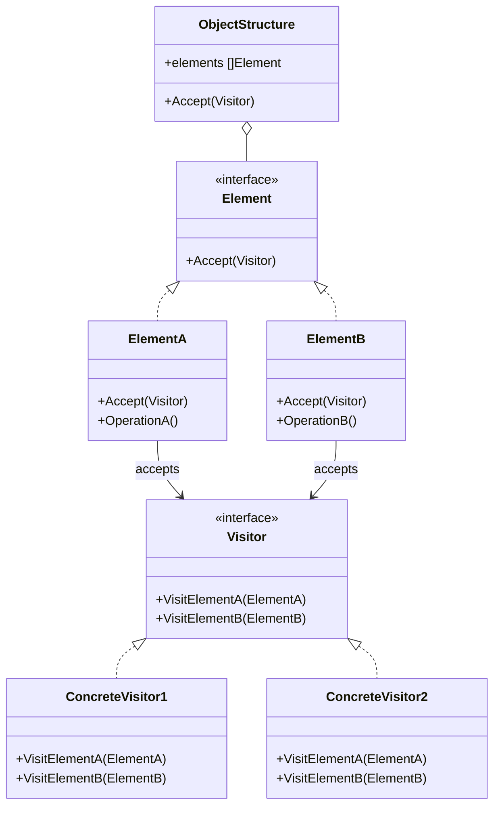
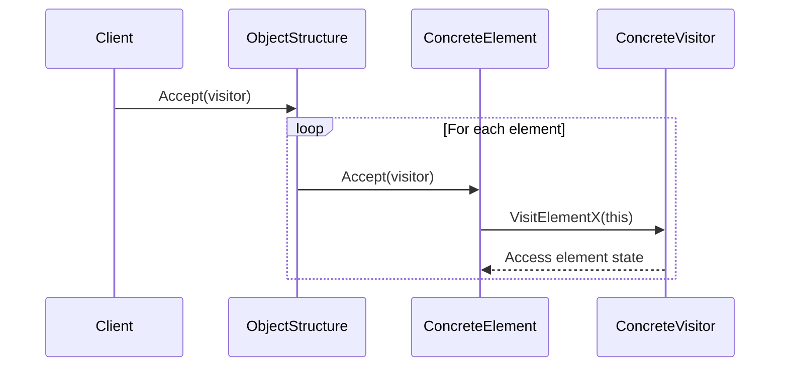
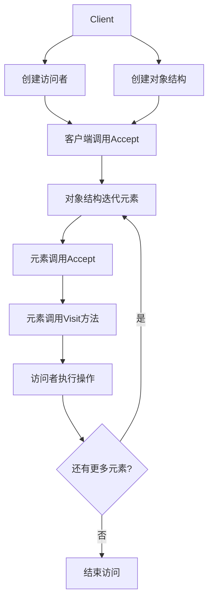

# 访问者模式 (Visitor Pattern)

## 目录

- [访问者模式 (Visitor Pattern)](#访问者模式-visitor-pattern)
  - [目录](#目录)
  - [1. 概述](#1-概述)
    - [1.1 模式定义](#11-模式定义)
    - [1.2 核心思想](#12-核心思想)
  - [2. 形式化定义](#2-形式化定义)
    - [2.1 数学定义](#21-数学定义)
    - [2.2 访问者代数](#22-访问者代数)
    - [2.3 访问者公理](#23-访问者公理)
  - [3. 结构分析](#3-结构分析)
    - [3.1 UML类图](#31-uml类图)
    - [3.2 时序图](#32-时序图)
    - [3.3 流程图](#33-流程图)
  - [4. Golang实现](#4-golang实现)
    - [4.1 基本实现](#41-基本实现)
    - [4.2 高级实现：动态分派的访问者](#42-高级实现动态分派的访问者)
    - [4.3 反射实现的访问者](#43-反射实现的访问者)
    - [4.4 功能强化的访问者模式](#44-功能强化的访问者模式)
  - [5. 性能分析](#5-性能分析)
    - [5.1 时间复杂度分析](#51-时间复杂度分析)
    - [5.2 空间复杂度分析](#52-空间复杂度分析)
    - [5.3 性能优化策略](#53-性能优化策略)
    - [5.4 基准测试](#54-基准测试)
  - [6. 应用场景](#6-应用场景)
    - [6.1 编译器和解释器](#61-编译器和解释器)
    - [6.2 图形处理](#62-图形处理)
    - [6.3 报表生成](#63-报表生成)
    - [6.4 数据结构遍历](#64-数据结构遍历)
  - [7. 最佳实践](#7-最佳实践)
    - [7.1 设计原则](#71-设计原则)
    - [7.2 使用建议](#72-使用建议)
    - [7.3 常见陷阱](#73-常见陷阱)
    - [7.4 与其他模式的关系](#74-与其他模式的关系)
  - [8. 案例分析](#8-案例分析)
    - [8.1 文件系统遍历器](#81-文件系统遍历器)
    - [8.2 语法树解析器](#82-语法树解析器)
    - [8.3 GUI渲染系统](#83-gui渲染系统)

## 1. 概述

### 1.1 模式定义

访问者模式是一种行为型设计模式，它允许在不改变元素类的前提下定义对元素的新操作。
该模式通过将操作从元素类中分离出来，将操作封装在独立的访问者对象中，从而实现对对象结构中的各个元素进行不同的操作，而不需要修改元素类。

### 1.2 核心思想

- **操作与数据分离**：将操作逻辑从元素类中分离出来
- **双重分派机制**：通过双重分派实现操作与元素类型的匹配
- **扩展性**：易于添加新的操作而不修改已有类
- **集中性**：相关的行为被集中在访问者类中
- **类型安全**：编译时类型检查

## 2. 形式化定义

### 2.1 数学定义

设 $V$ 为访问者集合，$E$ 为元素集合，定义访问者系统：

$$\mathcal{V} = (V, E, \triangleright, \triangleleft, \Delta)$$

其中：

- $\triangleright: V \times E \rightarrow V$ 为访问者更新函数
- $\triangleleft: E \times V \rightarrow E$ 为元素接受函数
- $\Delta: V \times E \rightarrow R$ 为操作结果函数，$R$ 是结果集合

### 2.2 访问者代数

定义访问者代数：

$$(V, E, \oplus, \otimes, \circ)$$

其中：

- $\oplus: V \times V \rightarrow V$ 为访问者组合操作
- $\otimes: V \times E \rightarrow R$ 为访问操作
- $\circ: V \times V \rightarrow V$ 为访问者组合函数

### 2.3 访问者公理

**公理1（双重分派）**：
$$\forall v \in V, e \in E: v \otimes e = \Delta(v, e)$$

**公理2（访问者组合）**：
$$\forall v_1, v_2 \in V, e \in E: (v_1 \oplus v_2) \otimes e = v_1 \otimes e + v_2 \otimes e$$

**公理3（元素接受）**：
$$\forall v \in V, e \in E: e \triangleleft v = e'$$

## 3. 结构分析

### 3.1 UML类图



### 3.2 时序图



### 3.3 流程图



## 4. Golang实现

### 4.1 基本实现

```go
// Visitor 访问者接口
type Visitor interface {
    VisitElementA(*ElementA)
    VisitElementB(*ElementB)
}

// Element 元素接口
type Element interface {
    Accept(Visitor)
}

// ElementA 具体元素A
type ElementA struct {
    Name string
    Data int
}

func (e *ElementA) Accept(visitor Visitor) {
    visitor.VisitElementA(e)
}

func (e *ElementA) OperationA() string {
    return fmt.Sprintf("ElementA: %s with data %d", e.Name, e.Data)
}

// ElementB 具体元素B
type ElementB struct {
    Value string
    Count int
}

func (e *ElementB) Accept(visitor Visitor) {
    visitor.VisitElementB(e)
}

func (e *ElementB) OperationB() string {
    return fmt.Sprintf("ElementB: %s with count %d", e.Value, e.Count)
}

// ConcreteVisitor1 具体访问者1
type ConcreteVisitor1 struct {
    result string
}

func (v *ConcreteVisitor1) VisitElementA(element *ElementA) {
    v.result += fmt.Sprintf("ConcreteVisitor1: Processing %s\n", element.OperationA())
}

func (v *ConcreteVisitor1) VisitElementB(element *ElementB) {
    v.result += fmt.Sprintf("ConcreteVisitor1: Processing %s\n", element.OperationB())
}

func (v *ConcreteVisitor1) GetResult() string {
    return v.result
}

// ConcreteVisitor2 具体访问者2
type ConcreteVisitor2 struct {
    count int
}

func (v *ConcreteVisitor2) VisitElementA(element *ElementA) {
    v.count += element.Data
}

func (v *ConcreteVisitor2) VisitElementB(element *ElementB) {
    v.count += element.Count
}

func (v *ConcreteVisitor2) GetCount() int {
    return v.count
}

// ObjectStructure 对象结构
type ObjectStructure struct {
    elements []Element
}

func (o *ObjectStructure) Append(element Element) {
    o.elements = append(o.elements, element)
}

func (o *ObjectStructure) Accept(visitor Visitor) {
    for _, element := range o.elements {
        element.Accept(visitor)
    }
}

```

### 4.2 高级实现：动态分派的访问者

```go
// DynamicVisitor 动态访问者接口
type DynamicVisitor interface {
    Visit(element Element) interface{}
}

// DynamicElement 支持动态分派的元素接口
type DynamicElement interface {
    Accept(visitor DynamicVisitor) interface{}
    Type() string
}

// DynamicElementA 具体元素A
type DynamicElementA struct {
    Name string
    Data int
}

func (e *DynamicElementA) Accept(visitor DynamicVisitor) interface{} {
    return visitor.Visit(e)
}

func (e *DynamicElementA) Type() string {
    return "DynamicElementA"
}

// DynamicElementB 具体元素B
type DynamicElementB struct {
    Value string
    Count int
}

func (e *DynamicElementB) Accept(visitor DynamicVisitor) interface{} {
    return visitor.Visit(e)
}

func (e *DynamicElementB) Type() string {
    return "DynamicElementB"
}

// TypeVisitor 基于类型的访问者
type TypeVisitor struct{}

func (v *TypeVisitor) Visit(element Element) interface{} {
    switch e := element.(type) {
    case *DynamicElementA:
        return fmt.Sprintf("Processing ElementA: %s with data %d", e.Name, e.Data)
    case *DynamicElementB:
        return fmt.Sprintf("Processing ElementB: %s with count %d", e.Value, e.Count)
    default:
        return fmt.Sprintf("Unknown element type")
    }
}

```

### 4.3 反射实现的访问者

```go
// ReflectionVisitor 使用反射的访问者
type ReflectionVisitor struct{}

func (v *ReflectionVisitor) Visit(element interface{}) interface{} {
    // 使用反射获取元素类型
    elemType := reflect.TypeOf(element)
    elemValue := reflect.ValueOf(element)
    
    // 查找合适的方法
    methodName := "Visit" + elemType.Elem().Name()
    
    // 通过反射调用方法
    method := reflect.ValueOf(v).MethodByName(methodName)
    if !method.IsValid() {
        return fmt.Sprintf("No method found for %s", elemType.Elem().Name())
    }
    
    // 调用方法
    results := method.Call([]reflect.Value{elemValue})
    if len(results) > 0 {
        return results[0].Interface()
    }
    return nil
}

func (v *ReflectionVisitor) VisitElementA(element *ElementA) interface{} {
    return fmt.Sprintf("Reflection visit ElementA: %s", element.OperationA())
}

func (v *ReflectionVisitor) VisitElementB(element *ElementB) interface{} {
    return fmt.Sprintf("Reflection visit ElementB: %s", element.OperationB())
}

```

### 4.4 功能强化的访问者模式

```go
// ResultVisitor 带结果的访问者
type ResultVisitor struct {
    results []interface{}
}

func (v *ResultVisitor) VisitElementA(element *ElementA) {
    v.results = append(v.results, element.OperationA())
}

func (v *ResultVisitor) VisitElementB(element *ElementB) {
    v.results = append(v.results, element.OperationB())
}

func (v *ResultVisitor) GetResults() []interface{} {
    return v.results
}

// ParallelVisitor 并行访问者
type ParallelVisitor struct {
    results []interface{}
    mu      sync.Mutex
    wg      sync.WaitGroup
}

func (v *ParallelVisitor) VisitElementA(element *ElementA) {
    v.wg.Add(1)
    go func() {
        defer v.wg.Done()
        result := element.OperationA()
        v.mu.Lock()
        v.results = append(v.results, result)
        v.mu.Unlock()
    }()
}

func (v *ParallelVisitor) VisitElementB(element *ElementB) {
    v.wg.Add(1)
    go func() {
        defer v.wg.Done()
        result := element.OperationB()
        v.mu.Lock()
        v.results = append(v.results, result)
        v.mu.Unlock()
    }()
}

func (v *ParallelVisitor) Wait() {
    v.wg.Wait()
}

func (v *ParallelVisitor) GetResults() []interface{} {
    return v.results
}

```

## 5. 性能分析

### 5.1 时间复杂度分析

- **单个元素访问**：$O(1)$，常数时间
- **对象结构遍历**：$O(n)$，其中 $n$ 是元素数量
- **并行访问**：$O(n/p)$，其中 $p$ 是并行度

### 5.2 空间复杂度分析

- **基本访问者**：$O(1)$，常数空间
- **结果收集**：$O(n)$，其中 $n$ 是元素数量
- **对象结构**：$O(n)$，其中 $n$ 是元素数量

### 5.3 性能优化策略

1. **异步处理**：使用goroutine并行处理元素
2. **内存池**：重用访问者和结果对象
3. **惰性计算**：只在需要时计算结果
4. **批处理**：分批处理大量元素
5. **缓存结果**：缓存常用操作的结果

```go
// 使用对象池优化的访问者
var visitorPool = sync.Pool{
    New: func() interface{} {
        return &ConcreteVisitor1{result: ""}
    },
}

func GetVisitor() *ConcreteVisitor1 {
    return visitorPool.Get().(*ConcreteVisitor1)
}

func ReleaseVisitor(visitor *ConcreteVisitor1) {
    visitor.result = ""
    visitorPool.Put(visitor)
}

```

### 5.4 基准测试

```go
func BenchmarkVisitorPattern(b *testing.B) {
    structure := &ObjectStructure{}
    for i := 0; i < 1000; i++ {
        if i%2 == 0 {
            structure.Append(&ElementA{Name: fmt.Sprintf("Element A %d", i), Data: i})
        } else {
            structure.Append(&ElementB{Value: fmt.Sprintf("Element B %d", i), Count: i})
        }
    }
    
    b.ResetTimer()
    for i := 0; i < b.N; i++ {
        visitor := &ConcreteVisitor1{}
        structure.Accept(visitor)
    }
}

func BenchmarkParallelVisitor(b *testing.B) {
    structure := &ObjectStructure{}
    for i := 0; i < 1000; i++ {
        if i%2 == 0 {
            structure.Append(&ElementA{Name: fmt.Sprintf("Element A %d", i), Data: i})
        } else {
            structure.Append(&ElementB{Value: fmt.Sprintf("Element B %d", i), Count: i})
        }
    }
    
    b.ResetTimer()
    for i := 0; i < b.N; i++ {
        visitor := &ParallelVisitor{}
        structure.Accept(visitor)
        visitor.Wait()
    }
}

```

## 6. 应用场景

### 6.1 编译器和解释器

- **语法树遍历**：遍历抽象语法树的不同节点
- **代码生成**：为不同节点生成不同的代码
- **语义分析**：对不同节点进行不同的语义检查

### 6.2 图形处理

- **绘图操作**：对不同图形元素应用不同的绘图操作
- **变换操作**：对不同图形应用不同的变换
- **导出功能**：导出不同格式的文件

### 6.3 报表生成

- **数据导出**：将不同类型的数据导出为不同格式
- **报表计算**：对不同数据类型执行不同的计算
- **格式化输出**：根据数据类型应用不同的格式化

### 6.4 数据结构遍历

- **复杂结构处理**：处理复杂的异构数据结构
- **树形结构遍历**：遍历树形结构并应用不同操作
- **复合对象操作**：处理组合模式中的不同元素

## 7. 最佳实践

### 7.1 设计原则

1. **单一职责原则**：每个访问者只负责一种类型的操作
2. **开闭原则**：易于添加新的访问者，而不需修改现有元素类
3. **依赖倒置原则**：依赖抽象接口而非具体实现
4. **最少知识原则**：访问者只与必要的元素交互
5. **组合/聚合复用原则**：优先使用组合而非继承

### 7.2 使用建议

1. **接口设计**：为每类元素定义清晰的访问方法
2. **访问者层次**：根据需要设计访问者的继承层次
3. **元素稳定性**：确保元素结构相对稳定
4. **多重分派**：利用类型断言或反射实现多重分派
5. **访问者状态**：根据需要在访问者中维护状态

### 7.3 常见陷阱

1. **循环依赖**：避免访问者和元素之间的循环引用
2. **类型安全性**：确保类型安全，避免运行时错误
3. **性能考虑**：在大型元素结构上注意性能问题
4. **元素变化**：当元素类型频繁变化时，避免使用此模式
5. **复杂性管理**：避免访问者类爆炸

### 7.4 与其他模式的关系

- **组合模式**：访问者常与组合模式一起使用，遍历复杂结构
- **迭代器模式**：可与迭代器结合使用，遍历和操作集合元素
- **命令模式**：访问者可以封装命令，分离调用和实现
- **解释器模式**：访问者可以解释不同的语法树节点

## 8. 案例分析

### 8.1 文件系统遍历器

```go
// FileSystemElement 文件系统元素接口
type FileSystemElement interface {
    Accept(FileSystemVisitor)
    GetName() string
    GetPath() string
}

// File 文件实现
type File struct {
    name    string
    path    string
    size    int64
    modTime time.Time
}

func (f *File) Accept(visitor FileSystemVisitor) {
    visitor.VisitFile(f)
}

func (f *File) GetName() string {
    return f.name
}

func (f *File) GetPath() string {
    return f.path
}

func (f *File) GetSize() int64 {
    return f.size
}

func (f *File) GetModTime() time.Time {
    return f.modTime
}

// Directory 目录实现
type Directory struct {
    name     string
    path     string
    children []FileSystemElement
}

func (d *Directory) Accept(visitor FileSystemVisitor) {
    visitor.VisitDirectory(d)
    for _, child := range d.children {
        child.Accept(visitor)
    }
}

func (d *Directory) GetName() string {
    return d.name
}

func (d *Directory) GetPath() string {
    return d.path
}

func (d *Directory) GetChildren() []FileSystemElement {
    return d.children
}

func (d *Directory) AddChild(element FileSystemElement) {
    d.children = append(d.children, element)
}

// FileSystemVisitor 文件系统访问者接口
type FileSystemVisitor interface {
    VisitFile(*File)
    VisitDirectory(*Directory)
}

// FileSizeCalculator 文件大小计算访问者
type FileSizeCalculator struct {
    TotalSize int64
    FileCount int
    DirCount  int
}

func (v *FileSizeCalculator) VisitFile(file *File) {
    v.TotalSize += file.GetSize()
    v.FileCount++
}

func (v *FileSizeCalculator) VisitDirectory(directory *Directory) {
    v.DirCount++
}

// FileSearchVisitor 文件搜索访问者
type FileSearchVisitor struct {
    Pattern string
    Results []FileSystemElement
}

func (v *FileSearchVisitor) VisitFile(file *File) {
    if strings.Contains(file.GetName(), v.Pattern) {
        v.Results = append(v.Results, file)
    }
}

func (v *FileSearchVisitor) VisitDirectory(directory *Directory) {
    if strings.Contains(directory.GetName(), v.Pattern) {
        v.Results = append(v.Results, directory)
    }
}

```

### 8.2 语法树解析器

```go
// Expression 表达式接口
type Expression interface {
    Accept(ExpressionVisitor)
}

// NumberExpression 数字表达式
type NumberExpression struct {
    Value int
}

func (e *NumberExpression) Accept(visitor ExpressionVisitor) {
    visitor.VisitNumber(e)
}

// BinaryExpression 二元表达式
type BinaryExpression struct {
    Left     Expression
    Right    Expression
    Operator string // "+", "-", "*", "/"
}

func (e *BinaryExpression) Accept(visitor ExpressionVisitor) {
    visitor.VisitBinary(e)
}

// ExpressionVisitor 表达式访问者接口
type ExpressionVisitor interface {
    VisitNumber(*NumberExpression)
    VisitBinary(*BinaryExpression)
}

// EvaluationVisitor 表达式求值访问者
type EvaluationVisitor struct {
    Results []int
}

func (v *EvaluationVisitor) VisitNumber(expr *NumberExpression) {
    v.Results = append(v.Results, expr.Value)
}

func (v *EvaluationVisitor) VisitBinary(expr *BinaryExpression) {
    // 处理左表达式
    expr.Left.Accept(v)
    leftIndex := len(v.Results) - 1
    leftValue := v.Results[leftIndex]
    
    // 处理右表达式
    expr.Right.Accept(v)
    rightIndex := len(v.Results) - 1
    rightValue := v.Results[rightIndex]
    
    // 计算结果并替换栈顶两个值
    v.Results = v.Results[:leftIndex]
    
    var result int
    switch expr.Operator {
    case "+":
        result = leftValue + rightValue
    case "-":
        result = leftValue - rightValue
    case "*":
        result = leftValue * rightValue
    case "/":
        if rightValue != 0 {
            result = leftValue / rightValue
        } else {
            panic("Division by zero")
        }
    }
    
    v.Results = append(v.Results, result)
}

```

### 8.3 GUI渲染系统

```go
// UIElement UI元素接口
type UIElement interface {
    Accept(UIVisitor)
    GetID() string
    GetBounds() Rectangle
}

// Rectangle 矩形区域
type Rectangle struct {
    X, Y, Width, Height int
}

// Button 按钮实现
type Button struct {
    ID      string
    Bounds  Rectangle
    Text    string
    Enabled bool
}

func (b *Button) Accept(visitor UIVisitor) {
    visitor.VisitButton(b)
}

func (b *Button) GetID() string {
    return b.ID
}

func (b *Button) GetBounds() Rectangle {
    return b.Bounds
}

// TextField 文本框实现
type TextField struct {
    ID      string
    Bounds  Rectangle
    Text    string
    Editable bool
}

func (t *TextField) Accept(visitor UIVisitor) {
    visitor.VisitTextField(t)
}

func (t *TextField) GetID() string {
    return t.ID
}

func (t *TextField) GetBounds() Rectangle {
    return t.Bounds
}

// UIVisitor UI访问者接口
type UIVisitor interface {
    VisitButton(*Button)
    VisitTextField(*TextField)
}

// RenderVisitor 渲染访问者
type RenderVisitor struct {
    RenderedElements []string
}

func (v *RenderVisitor) VisitButton(button *Button) {
    state := "enabled"
    if !button.Enabled {
        state = "disabled"
    }
    v.RenderedElements = append(v.RenderedElements, 
        fmt.Sprintf("Button[%s]: %s (%s)", button.ID, button.Text, state))
}

func (v *RenderVisitor) VisitTextField(textField *TextField) {
    state := "editable"
    if !textField.Editable {
        state = "readonly"
    }
    v.RenderedElements = append(v.RenderedElements, 
        fmt.Sprintf("TextField[%s]: %s (%s)", textField.ID, textField.Text, state))
}

// UIEventsVisitor UI事件处理访问者
type UIEventsVisitor struct {
    ClickedElement UIElement
    MouseX, MouseY int
}

func (v *UIEventsVisitor) VisitButton(button *Button) {
    bounds := button.GetBounds()
    if v.MouseX >= bounds.X && v.MouseX <= bounds.X+bounds.Width &&
       v.MouseY >= bounds.Y && v.MouseY <= bounds.Y+bounds.Height {
        v.ClickedElement = button
    }
}

func (v *UIEventsVisitor) VisitTextField(textField *TextField) {
    bounds := textField.GetBounds()
    if v.MouseX >= bounds.X && v.MouseX <= bounds.X+bounds.Width &&
       v.MouseY >= bounds.Y && v.MouseY <= bounds.Y+bounds.Height {
        v.ClickedElement = textField
    }
}

```

---

**参考文献**：

1. Gamma, E., Helm, R., Johnson, R., & Vlissides, J. (1994). Design Patterns: Elements of Reusable Object-Oriented Software. Addison-Wesley.
2. Martin, R. C. (2017). Clean Architecture: A Craftsman's Guide to Software Structure and Design. Prentice Hall.
3. Nystrom, R. (2014). Game Programming Patterns. Genever Benning.
4. Cox, B. J. (1991). Object-Oriented Programming: An Evolutionary Approach. Addison-Wesley.
5. Go Design Patterns. <https://github.com/tmrts/go-patterns>
