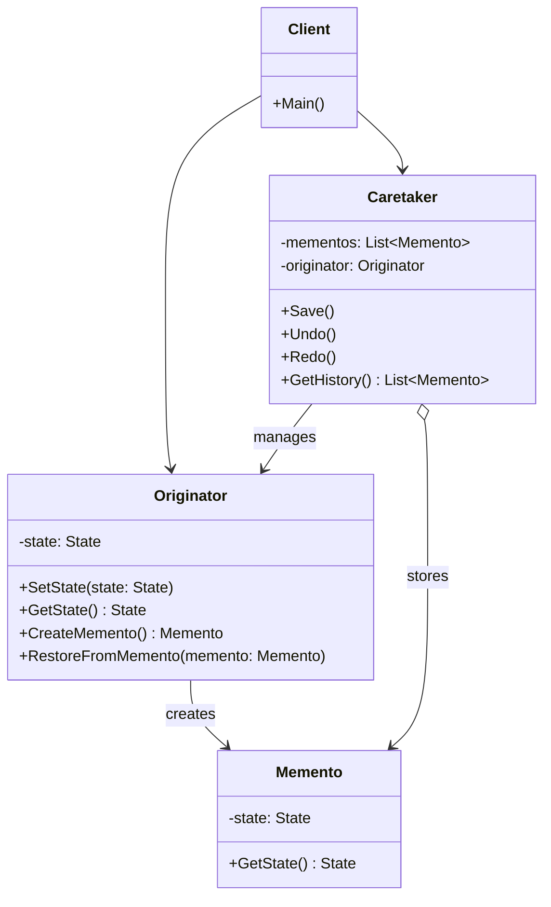
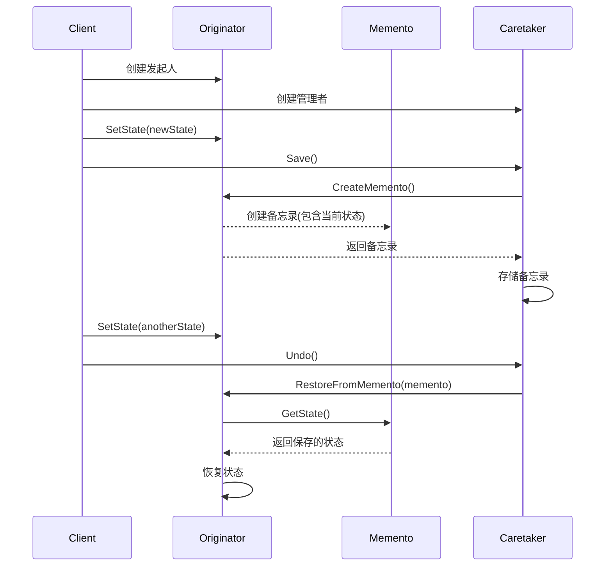
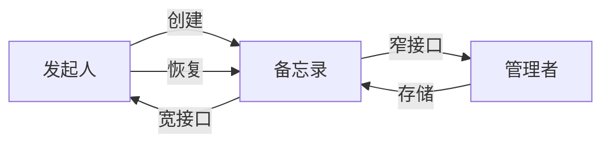
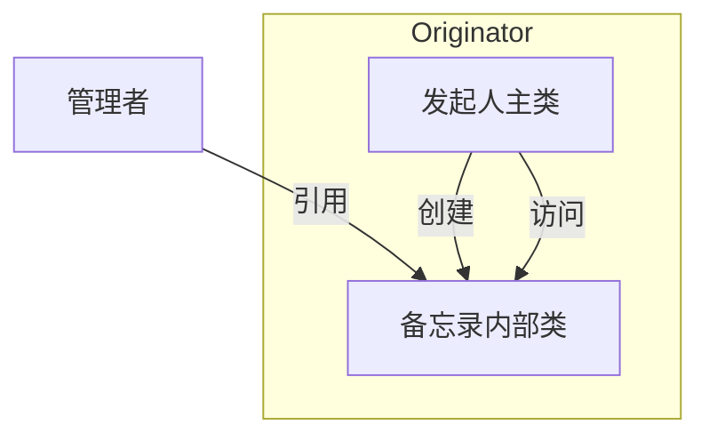
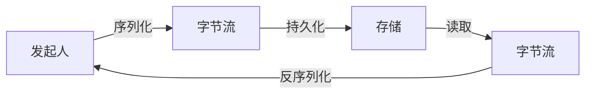
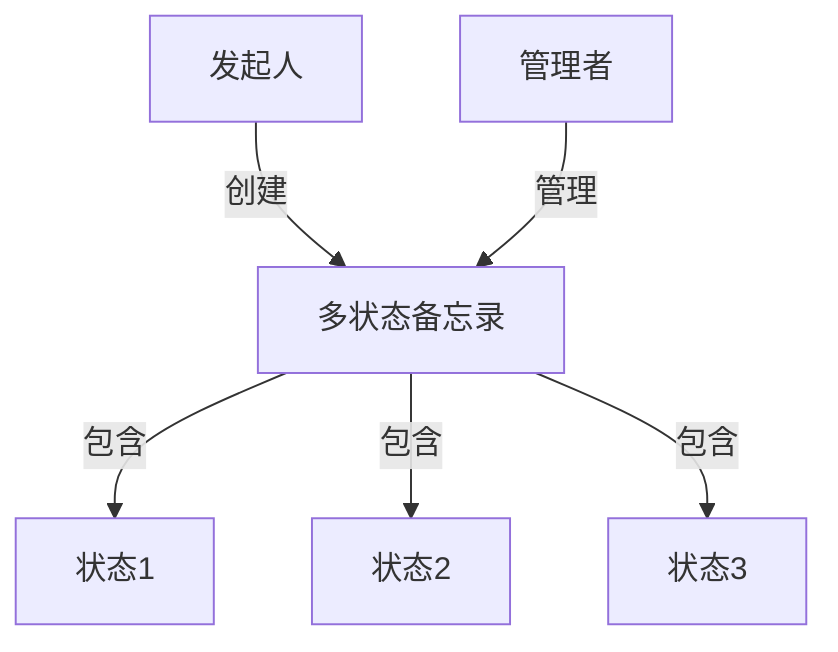

# 备忘录模式 (Memento Pattern)

## 目录

1. [概述](#1-概述)
2. [形式化定义](#2-形式化定义)
3. [结构分析](#3-结构分析)
4. [Golang实现](#4-golang实现)
5. [性能分析](#5-性能分析)
6. [应用场景](#6-应用场景)
7. [最佳实践](#7-最佳实践)
8. [案例分析](#8-案例分析)

## 1. 概述

### 1.1 模式定义

备忘录模式是一种行为型设计模式，允许在不破坏对象封装性的前提下保存和恢复对象之前的状态。该模式将对象状态的存储和恢复操作委托给一个称为"备忘录"的外部对象，避免了直接暴露对象的内部结构。

### 1.2 核心思想

- **状态捕获**: 将对象的内部状态捕获并存储在外部的备忘录对象中
- **封装保护**: 不破坏被存储对象的封装，不暴露其实现细节
- **历史记录**: 可以保存对象的多个历史状态，实现多层次撤销/恢复操作
- **职责分离**: 将状态管理的责任从原始对象中分离出来
- **时间旅行**: 允许对象在其生命周期中的不同时间点之间移动

### 1.3 解决的问题

- **撤销/重做操作**: 支持对象状态的回滚和前进操作
- **快照管理**: 在关键时刻创建对象状态的快照
- **历史记录**: 跟踪和记录对象状态的变化
- **状态恢复**: 从错误或异常状态中恢复
- **事务回滚**: 在事务失败时恢复到之前的状态

### 1.4 适用场景

- 需要保存和恢复对象状态的应用
- 实现撤销/重做功能的编辑器
- 游戏存档系统
- 系统事务处理
- 状态历史记录和回放功能

## 2. 形式化定义

### 2.1 数学定义

设 $O$ 为对象状态空间，$T$ 为时间轴，备忘录系统可以定义为一个六元组：

$$M = (O, S, C, R, \Phi, \Psi)$$

其中：

- $O$ 是原始对象的状态空间
- $S$ 是备忘录状态空间
- $C: O \times T \rightarrow S$ 是捕获函数，将对象状态在特定时间点转换为备忘录
- $R: S \rightarrow O$ 是恢复函数，将备忘录状态恢复到对象
- $\Phi: O \times O \rightarrow O$ 是状态转换函数
- $\Psi: S \times T \rightarrow S$ 是备忘录管理函数

### 2.2 备忘录公理

**公理1（捕获-恢复一致性）**: 对于任意对象状态 $o \in O$ 和时间点 $t \in T$，有：

$$R(C(o, t)) = o$$

**公理2（状态独立性）**: 对于任意对象 $o_1, o_2 \in O$ 和时间点 $t_1, t_2 \in T$，如果 $o_1 \neq o_2$，则：

$$C(o_1, t_1) \neq C(o_2, t_2)$$

**公理3（备忘录封装）**: 对于任意备忘录 $s \in S$，原始对象 $o \in O$ 不能直接访问或修改 $s$ 的内部状态。

### 2.3 备忘录代数

定义备忘录代数系统：

$$(O, S, \oplus, \otimes, \odot)$$

其中：

- $\oplus: O \times S \rightarrow O$ 是状态恢复操作
- $\otimes: O \times T \rightarrow S$ 是状态保存操作
- $\odot: S \times S \rightarrow S$ 是备忘录组合操作

备忘录代数满足以下特性：

1. **恢复一致性**: $o \oplus (o \otimes t) = o$，对任意 $o \in O, t \in T$
2. **序列性**: $(o \oplus s_1) \oplus s_2 \neq o \oplus (s_1 \odot s_2)$，对某些 $s_1, s_2 \in S$
3. **非交换性**: $s_1 \odot s_2 \neq s_2 \odot s_1$，对某些 $s_1, s_2 \in S$

### 2.4 时序逻辑

使用时序逻辑定义备忘录模式的行为：

1. **状态保存**: $\square(Save(o, t) \rightarrow \exists s \in S: s = C(o, t))$
2. **状态恢复**: $\square(Restore(s) \rightarrow \exists o \in O: o = R(s))$
3. **历史一致性**: $\square(Save(o_1, t_1) \wedge (t_1 < t_2) \wedge Save(o_2, t_2) \rightarrow CanRestore(o_1, t_1))$

其中：

- $\square$ 表示"总是"
- $\exists$ 表示"存在"
- $Save$ 和 $Restore$ 是操作
- $CanRestore$ 表示可以恢复到特定时间点的状态

## 3. 结构分析

### 3.1 UML类图



### 3.2 角色解析

1. **发起人（Originator）**:
   - 需要保存状态的对象
   - 创建备忘录以保存当前状态
   - 使用备忘录恢复到先前状态
   - 定义了用于产生和恢复状态的接口

2. **备忘录（Memento）**:
   - 存储发起人对象的内部状态
   - 保护其内容不被发起人以外的对象访问
   - 提供窄接口给管理者，宽接口给发起人

3. **管理者（Caretaker）**:
   - 保存备忘录对象
   - 不操作或检查备忘录对象的内容
   - 维护备忘录的历史记录
   - 决定何时请求发起人保存其状态，何时恢复状态

4. **客户端（Client）**:
   - 创建发起人和管理者
   - 请求发起人创建备忘录
   - 将备忘录传递给管理者保存
   - 触发管理者进行状态恢复

### 3.3 时序图



### 3.4 备忘录模式变体

#### 3.4.1 标准备忘录模式

- 备忘录对象是私有的，只有创建它的发起人可以访问其内部状态
- 管理者负责备忘录对象的存储和管理，但不能访问其内容
- 提供最佳的封装性和状态保护



#### 3.4.2 嵌套类备忘录模式

- 备忘录作为发起人的内部类实现
- 为发起人提供完全访问权限，同时对外部类保持状态隐藏
- 在支持嵌套类的语言中较为常见



#### 3.4.3 序列化备忘录模式

- 使用序列化技术保存对象的完整状态
- 可支持深拷贝和持久化存储
- 适用于需要保存到磁盘或通过网络传输的场景



#### 3.4.4 多状态备忘录模式

- 单个备忘录对象存储多个状态点
- 可以进行增量存储，节省内存
- 支持更复杂的状态管理和恢复策略



### 3.5 结构优缺点分析

#### 3.5.1 优点

1. **封装性**: 保留对象的封装边界，不暴露其实现细节
2. **职责分离**: 发起人专注于业务逻辑，管理者专注于状态历史管理
3. **状态历史**: 可以保存对象状态的完整历史记录
4. **易实现撤销/重做**: 为撤销和重做功能提供了良好的架构基础
5. **简化发起人**: 将状态存储和管理的责任转移到外部

#### 3.5.2 缺点

1. **内存消耗**: 存储多个状态可能导致大量内存使用
2. **保存成本**: 创建大对象的备忘录可能消耗资源
3. **兼容性维护**: 发起人的更改需要同步更新备忘录的实现
4. **恢复限制**: 只能恢复已保存的状态点，无法做到任意时间点恢复
5. **动态属性问题**: 对于具有动态添加属性能力的对象，备忘录实现复杂

## 4. Golang实现

### 4.1 基本实现

```go
package memento

import (
 "fmt"
 "time"
)

// Memento 备忘录对象，存储发起人的状态
type Memento struct {
 state     string
 timestamp time.Time
 metadata  map[string]interface{}
}

// GetState 获取状态（窄接口）
func (m *Memento) GetState() string {
 return m.state
}

// GetTimestamp 获取时间戳（窄接口）
func (m *Memento) GetTimestamp() time.Time {
 return m.timestamp
}

// Originator 发起人对象
type Originator struct {
 state    string
 metadata map[string]interface{}
}

// NewOriginator 创建发起人
func NewOriginator(state string) *Originator {
 return &Originator{
  state:    state,
  metadata: make(map[string]interface{}),
 }
}

// SetState 设置状态
func (o *Originator) SetState(state string) {
 fmt.Printf("设置状态为: %s\n", state)
 o.state = state
}

// SetMetadata 设置元数据
func (o *Originator) SetMetadata(key string, value interface{}) {
 o.metadata[key] = value
}

// GetState 获取状态
func (o *Originator) GetState() string {
 return o.state
}

// SaveToMemento 保存到备忘录
func (o *Originator) SaveToMemento() *Memento {
 fmt.Printf("保存当前状态: %s\n", o.state)
 
 // 复制元数据以避免共享引用
 metadataCopy := make(map[string]interface{})
 for k, v := range o.metadata {
  metadataCopy[k] = v
 }
 
 return &Memento{
  state:     o.state,
  timestamp: time.Now(),
  metadata:  metadataCopy,
 }
}

// RestoreFromMemento 从备忘录恢复
func (o *Originator) RestoreFromMemento(m *Memento) {
 o.state = m.state
 
 // 清除当前元数据
 o.metadata = make(map[string]interface{})
 
 // 复制备忘录中的元数据
 for k, v := range m.metadata {
  o.metadata[k] = v
 }
 
 fmt.Printf("恢复到之前的状态: %s (从 %v)\n", 
  o.state, m.timestamp.Format("15:04:05"))
}

// Caretaker 管理者对象
type Caretaker struct {
 mementos []*Memento
 current  int
}

// NewCaretaker 创建管理者
func NewCaretaker() *Caretaker {
 return &Caretaker{
  mementos: make([]*Memento, 0),
  current:  -1,
 }
}

// Save 保存状态
func (c *Caretaker) Save(o *Originator) {
 // 如果当前不在最新状态，移除当前之后的所有状态
 if c.current < len(c.mementos)-1 {
  c.mementos = c.mementos[:c.current+1]
 }
 
 // 添加新备忘录
 c.mementos = append(c.mementos, o.SaveToMemento())
 c.current = len(c.mementos) - 1
 
 fmt.Printf("管理者: 已保存状态 #%d\n", c.current)
}

// Undo 撤销操作
func (c *Caretaker) Undo(o *Originator) bool {
 if c.current <= 0 {
  fmt.Println("无法撤销: 已经到达最初状态")
  return false
 }
 
 c.current--
 o.RestoreFromMemento(c.mementos[c.current])
 fmt.Printf("管理者: 已撤销到状态 #%d\n", c.current)
 return true
}

// Redo 重做操作
func (c *Caretaker) Redo(o *Originator) bool {
 if c.current >= len(c.mementos)-1 {
  fmt.Println("无法重做: 已经到达最新状态")
  return false
 }
 
 c.current++
 o.RestoreFromMemento(c.mementos[c.current])
 fmt.Printf("管理者: 已重做到状态 #%d\n", c.current)
 return true
}

// Count 获取历史记录数
func (c *Caretaker) Count() int {
 return len(c.mementos)
}

// CurrentIndex 获取当前索引
func (c *Caretaker) CurrentIndex() int {
 return c.current
}

// GetHistory 获取历史记录
func (c *Caretaker) GetHistory() []string {
 result := make([]string, 0, len(c.mementos))
 for i, m := range c.mementos {
  marker := " "
  if i == c.current {
   marker = "*"
  }
  result = append(result, fmt.Sprintf("%s %d: %s (%v)", 
   marker, i, m.state, m.timestamp.Format("15:04:05")))
 }
 return result
}

```

### 4.2 使用示例

```go
package main

import (
 "fmt"
 "memento"
 "time"
)

func main() {
 // 创建发起人和管理者
 originator := memento.NewOriginator("初始状态")
 caretaker := memento.NewCaretaker()
 
 // 保存初始状态
 caretaker.Save(originator)
 
 // 修改并保存状态
 originator.SetState("状态 1")
 originator.SetMetadata("version", 1)
 caretaker.Save(originator)
 
 time.Sleep(1 * time.Second)
 
 originator.SetState("状态 2")
 originator.SetMetadata("version", 2)
 caretaker.Save(originator)
 
 time.Sleep(1 * time.Second)
 
 originator.SetState("状态 3")
 originator.SetMetadata("version", 3)
 caretaker.Save(originator)
 
 // 显示历史记录
 fmt.Println("\n历史记录:")
 for _, h := range caretaker.GetHistory() {
  fmt.Println(h)
 }
 
 // 执行撤销和重做操作
 fmt.Println("\n执行撤销:")
 caretaker.Undo(originator)
 fmt.Printf("当前状态: %s\n", originator.GetState())
 
 caretaker.Undo(originator)
 fmt.Printf("当前状态: %s\n", originator.GetState())
 
 fmt.Println("\n执行重做:")
 caretaker.Redo(originator)
 fmt.Printf("当前状态: %s\n", originator.GetState())
 
 // 修改当前状态后保存
 fmt.Println("\n从中间状态修改:")
 originator.SetState("状态 2 (修改)")
 caretaker.Save(originator)
 
 // 查看更新后的历史记录
 fmt.Println("\n更新后的历史记录:")
 for _, h := range caretaker.GetHistory() {
  fmt.Println(h)
 }
}

```

执行结果：

```text
设置状态为: 初始状态
保存当前状态: 初始状态
管理者: 已保存状态 #0
设置状态为: 状态 1
保存当前状态: 状态 1
管理者: 已保存状态 #1
设置状态为: 状态 2
保存当前状态: 状态 2
管理者: 已保存状态 #2
设置状态为: 状态 3
保存当前状态: 状态 3
管理者: 已保存状态 #3

历史记录:
  0: 初始状态 (15:04:01)
  1: 状态 1 (15:04:02)
  2: 状态 2 (15:04:03)
* 3: 状态 3 (15:04:04)

执行撤销:
恢复到之前的状态: 状态 2 (从 15:04:03)
管理者: 已撤销到状态 #2
当前状态: 状态 2
恢复到之前的状态: 状态 1 (从 15:04:02)
管理者: 已撤销到状态 #1
当前状态: 状态 1

执行重做:
恢复到之前的状态: 状态 2 (从 15:04:03)
管理者: 已重做到状态 #2
当前状态: 状态 2

从中间状态修改:
设置状态为: 状态 2 (修改)
保存当前状态: 状态 2 (修改)
管理者: 已保存状态 #3

更新后的历史记录:
  0: 初始状态 (15:04:01)
  1: 状态 1 (15:04:02)
  2: 状态 2 (15:04:03)
* 3: 状态 2 (修改) (15:04:05)

```

### 4.3 嵌套类实现

由于Go语言不支持真正的嵌套类，我们可以使用闭包和私有结构体来模拟这一行为：

```go
package memento

import (
 "fmt"
 "time"
)

// OriginatorWithInnerMemento 使用闭包模拟内部类的发起人
type OriginatorWithInnerMemento struct {
 state    string
 metadata map[string]interface{}
 
 // 提供创建和访问备忘录的方法
 createMemento func() interface{}
 setMemento    func(m interface{})
}

// NewOriginatorWithInnerMemento 创建带有内部备忘录的发起人
func NewOriginatorWithInnerMemento(initialState string) *OriginatorWithInnerMemento {
 // 创建发起人
 o := &OriginatorWithInnerMemento{
  state:    initialState,
  metadata: make(map[string]interface{}),
 }
 
 // 内部备忘录的结构定义
 type innerMemento struct {
  state     string
  timestamp time.Time
  metadata  map[string]interface{}
 }
 
 // 设置创建备忘录的闭包方法
 o.createMemento = func() interface{} {
  fmt.Printf("保存当前状态: %s\n", o.state)
  
  // 深拷贝元数据
  metadataCopy := make(map[string]interface{})
  for k, v := range o.metadata {
   metadataCopy[k] = v
  }
  
  return &innerMemento{
   state:     o.state,
   timestamp: time.Now(),
   metadata:  metadataCopy,
  }
 }
 
 // 设置从备忘录恢复的闭包方法
 o.setMemento = func(m interface{}) {
  if memo, ok := m.(*innerMemento); ok {
   o.state = memo.state
   
   // 清除并恢复元数据
   o.metadata = make(map[string]interface{})
   for k, v := range memo.metadata {
    o.metadata[k] = v
   }
   
   fmt.Printf("恢复到之前的状态: %s (从 %v)\n", 
    o.state, memo.timestamp.Format("15:04:05"))
  }
 }
 
 return o
}

// SetState 设置状态
func (o *OriginatorWithInnerMemento) SetState(state string) {
 fmt.Printf("设置状态为: %s\n", state)
 o.state = state
}

// GetState 获取状态
func (o *OriginatorWithInnerMemento) GetState() string {
 return o.state
}

// SetMetadata 设置元数据
func (o *OriginatorWithInnerMemento) SetMetadata(key string, value interface{}) {
 o.metadata[key] = value
}

// SaveToMemento 保存到备忘录
func (o *OriginatorWithInnerMemento) SaveToMemento() interface{} {
 return o.createMemento()
}

// RestoreFromMemento 从备忘录恢复
func (o *OriginatorWithInnerMemento) RestoreFromMemento(m interface{}) {
 o.setMemento(m)
}

// CaretakerForInner 内部备忘录的管理者
type CaretakerForInner struct {
 mementos []interface{}
 current  int
}

// NewCaretakerForInner 创建内部备忘录的管理者
func NewCaretakerForInner() *CaretakerForInner {
 return &CaretakerForInner{
  mementos: make([]interface{}, 0),
  current:  -1,
 }
}

// Save 保存状态
func (c *CaretakerForInner) Save(o *OriginatorWithInnerMemento) {
 // 如果当前不在最新状态，移除当前之后的所有状态
 if c.current < len(c.mementos)-1 {
  c.mementos = c.mementos[:c.current+1]
 }
 
 // 添加新备忘录
 c.mementos = append(c.mementos, o.SaveToMemento())
 c.current = len(c.mementos) - 1
 
 fmt.Printf("管理者: 已保存状态 #%d\n", c.current)
}

// Undo 撤销操作
func (c *CaretakerForInner) Undo(o *OriginatorWithInnerMemento) bool {
 if c.current <= 0 {
  fmt.Println("无法撤销: 已经到达最初状态")
  return false
 }
 
 c.current--
 o.RestoreFromMemento(c.mementos[c.current])
 fmt.Printf("管理者: 已撤销到状态 #%d\n", c.current)
 return true
}

// Redo 重做操作
func (c *CaretakerForInner) Redo(o *OriginatorWithInnerMemento) bool {
 if c.current >= len(c.mementos)-1 {
  fmt.Println("无法重做: 已经到达最新状态")
  return false
 }
 
 c.current++
 o.RestoreFromMemento(c.mementos[c.current])
 fmt.Printf("管理者: 已重做到状态 #%d\n", c.current)
 return true
}

```

### 4.4 序列化实现

使用Golang的编码/解码包实现备忘录的序列化和反序列化存储：

```go
package memento

import (
 "bytes"
 "encoding/gob"
 "fmt"
 "io/ioutil"
 "os"
 "path/filepath"
 "time"
)

// SerializableOriginator 可序列化的发起人
type SerializableOriginator struct {
 State    string
 Metadata map[string]interface{}
}

// NewSerializableOriginator 创建可序列化的发起人
func NewSerializableOriginator(state string) *SerializableOriginator {
 return &SerializableOriginator{
  State:    state,
  Metadata: make(map[string]interface{}),
 }
}

// SetState 设置状态
func (o *SerializableOriginator) SetState(state string) {
 fmt.Printf("设置状态为: %s\n", state)
 o.State = state
}

// GetState 获取状态
func (o *SerializableOriginator) GetState() string {
 return o.State
}

// SetMetadata 设置元数据
func (o *SerializableOriginator) SetMetadata(key string, value interface{}) {
 o.Metadata[key] = value
}

// CreateMemento 创建备忘录（已序列化）
func (o *SerializableOriginator) CreateMemento() ([]byte, error) {
 fmt.Printf("序列化当前状态: %s\n", o.State)
 
 var buf bytes.Buffer
 enc := gob.NewEncoder(&buf)
 
 if err := enc.Encode(o); err != nil {
  return nil, fmt.Errorf("序列化失败: %v", err)
 }
 
 return buf.Bytes(), nil
}

// RestoreFromMemento 从备忘录恢复
func (o *SerializableOriginator) RestoreFromMemento(data []byte) error {
 buf := bytes.NewBuffer(data)
 dec := gob.NewDecoder(buf)
 
 tempOrig := &SerializableOriginator{}
 if err := dec.Decode(tempOrig); err != nil {
  return fmt.Errorf("反序列化失败: %v", err)
 }
 
 o.State = tempOrig.State
 o.Metadata = tempOrig.Metadata
 
 fmt.Printf("恢复到状态: %s\n", o.State)
 return nil
}

// SerializableCaretaker 管理序列化备忘录的管理者
type SerializableCaretaker struct {
 savePath  string
 mementoIDs []string
 current   int
}

// NewSerializableCaretaker 创建序列化备忘录的管理者
func NewSerializableCaretaker(savePath string) (*SerializableCaretaker, error) {
 // 确保保存目录存在
 if err := os.MkdirAll(savePath, 0755); err != nil {
  return nil, fmt.Errorf("创建保存目录失败: %v", err)
 }
 
 caretaker := &SerializableCaretaker{
  savePath:  savePath,
  mementoIDs: []string{},
  current:   -1,
 }
 
 // 加载现有备忘录列表
 files, err := ioutil.ReadDir(savePath)
 if err != nil {
  return nil, fmt.Errorf("读取保存目录失败: %v", err)
 }
 
 // 过滤并排序备忘录文件
 for _, file := range files {
  if !file.IsDir() && filepath.Ext(file.Name()) == ".memento" {
   caretaker.mementoIDs = append(caretaker.mementoIDs, file.Name())
  }
 }
 
 caretaker.current = len(caretaker.mementoIDs) - 1
 return caretaker, nil
}

// Save 保存状态
func (c *SerializableCaretaker) Save(o *SerializableOriginator) error {
 // 如果当前不在最新状态，移除当前之后的所有状态
 if c.current < len(c.mementoIDs)-1 {
  // 从文件系统中删除未来状态
  for i := c.current + 1; i < len(c.mementoIDs); i++ {
   path := filepath.Join(c.savePath, c.mementoIDs[i])
   os.Remove(path)
  }
  
  // 更新内存中的数组
  c.mementoIDs = c.mementoIDs[:c.current+1]
 }
 
 // 创建新的备忘录
 data, err := o.CreateMemento()
 if err != nil {
  return err
 }
 
 // 使用时间戳创建唯一文件名
 filename := fmt.Sprintf("%d.memento", time.Now().UnixNano())
 path := filepath.Join(c.savePath, filename)
 
 // 写入文件
 if err := ioutil.WriteFile(path, data, 0644); err != nil {
  return fmt.Errorf("写入备忘录文件失败: %v", err)
 }
 
 // 更新内存中的数组和当前索引
 c.mementoIDs = append(c.mementoIDs, filename)
 c.current = len(c.mementoIDs) - 1
 
 fmt.Printf("管理者: 已保存状态到文件 #%d (%s)\n", c.current, filename)
 return nil
}

// Undo 撤销操作
func (c *SerializableCaretaker) Undo(o *SerializableOriginator) error {
 if c.current <= 0 {
  fmt.Println("无法撤销: 已经到达最初状态")
  return nil
 }
 
 c.current--
 return c.loadMemento(c.current, o)
}

// Redo 重做操作
func (c *SerializableCaretaker) Redo(o *SerializableOriginator) error {
 if c.current >= len(c.mementoIDs)-1 {
  fmt.Println("无法重做: 已经到达最新状态")
  return nil
 }
 
 c.current++
 return c.loadMemento(c.current, o)
}

// loadMemento 从文件加载备忘录
func (c *SerializableCaretaker) loadMemento(index int, o *SerializableOriginator) error {
 if index < 0 || index >= len(c.mementoIDs) {
  return fmt.Errorf("无效的备忘录索引: %d", index)
 }
 
 filename := c.mementoIDs[index]
 path := filepath.Join(c.savePath, filename)
 
 data, err := ioutil.ReadFile(path)
 if err != nil {
  return fmt.Errorf("读取备忘录文件失败: %v", err)
 }
 
 if err := o.RestoreFromMemento(data); err != nil {
  return err
 }
 
 fmt.Printf("管理者: 已从文件加载状态 #%d (%s)\n", index, filename)
 return nil
}

```

## 5. 性能分析

### 5.1 时间复杂度分析

备忘录模式的主要操作时间复杂度：

| 操作 | 实现方式 | 时间复杂度 | 说明 |
|-----|----------|-----------|-----|
| 创建备忘录 | 基本实现 | O(n) | n是对象状态大小，需要复制对象状态 |
| 创建备忘录 | 浅拷贝 | O(1) | 只复制引用，但可能导致状态共享 |
| 恢复备忘录 | 基本实现 | O(n) | n是对象状态大小，需要复制备忘录状态到对象 |
| 添加备忘录 | 数组存储 | O(1) | 向数组末尾追加，平均情况为常量时间 |
| 移除备忘录 | 数组存储 | O(k) | k是被移除的备忘录数量 |
| 获取历史记录 | 数组遍历 | O(m) | m是存储的备忘录总数 |
| 序列化备忘录 | Gob编码 | O(n) | n是对象状态大小 |
| 反序列化备忘录 | Gob解码 | O(n) | n是对象状态大小 |

对于大型对象或状态很复杂的对象，创建和恢复备忘录的成本可能很高。

### 5.2 空间复杂度分析

| 存储类型 | 空间复杂度 | 说明 |
|--------|-----------|-----|
| 内存存储 | O(m * n) | m是备忘录数量，n是每个备忘录平均大小 |
| 增量存储 | O(m * d) | d是状态差异的平均大小，通常 d << n |
| 选择性存储 | O(m * s) | s是选定的关键状态大小，通常 s < n |
| 序列化存储 | O(m * n) + 额外开销 | 序列化格式可能需要额外元数据 |

对于长历史记录链，空间消耗可能成为主要问题。实际应用中通常需要定期清理或合并历史记录。

### 5.3 性能优化策略

#### 5.3.1 增量存储

只存储变化的状态部分，而不是整个对象状态：

```go
// DifferentialMemento 差异备忘录
type DifferentialMemento struct {
    changedFields map[string]interface{}
    previousState *Memento  // 引用前一个状态
    timestamp     time.Time
}

// CreateDifferentialMemento 创建差异备忘录
func (o *Originator) CreateDifferentialMemento(previous *Memento) *DifferentialMemento {
    diff := &DifferentialMemento{
        changedFields: make(map[string]interface{}),
        previousState: previous,
        timestamp:     time.Now(),
    }
    
    // 计算当前状态与前一状态的差异
    // 这需要对象结构的反射能力或明确的差异计算
    // ...
    
    return diff
}

```

#### 5.3.2 懒拷贝

延迟复制操作，只在必要时才进行深拷贝：

```go
// LazyMemento 懒拷贝备忘录
type LazyMemento struct {
    state        *StateReference
    deepCopyDone bool
    originator   *Originator
    timestamp    time.Time
}

// StateReference 状态引用
type StateReference struct {
    data map[string]interface{}
}

// GetState 获取状态（需要时执行深拷贝）
func (m *LazyMemento) GetState() map[string]interface{} {
    if !m.deepCopyDone {
        // 执行深拷贝
        m.state = m.originator.DeepCopyState()
        m.deepCopyDone = true
    }
    return m.state.data
}

```

#### 5.3.3 状态压缩

对备忘录状态进行压缩以减少存储空间：

```go
// CompressedMemento 压缩备忘录
type CompressedMemento struct {
    compressedData []byte
    timestamp      time.Time
}

// CreateCompressedMemento 创建压缩备忘录
func (o *Originator) CreateCompressedMemento() (*CompressedMemento, error) {
    // 序列化对象状态
    var buf bytes.Buffer
    enc := gob.NewEncoder(&buf)
    if err := enc.Encode(o.state); err != nil {
        return nil, err
    }
    
    // 压缩序列化数据
    var compressed bytes.Buffer
    w := gzip.NewWriter(&compressed)
    if _, err := w.Write(buf.Bytes()); err != nil {
        return nil, err
    }
    if err := w.Close(); err != nil {
        return nil, err
    }
    
    return &CompressedMemento{
        compressedData: compressed.Bytes(),
        timestamp:      time.Now(),
    }, nil
}

```

#### 5.3.4 池化备忘录

使用对象池减少备忘录创建和垃圾回收的开销：

```go
// MementoPool 备忘录对象池
type MementoPool struct {
    pool sync.Pool
}

// NewMementoPool 创建备忘录池
func NewMementoPool() *MementoPool {
    return &MementoPool{
        pool: sync.Pool{
            New: func() interface{} {
                return &Memento{
                    state:    make(map[string]interface{}),
                    metadata: make(map[string]interface{}),
                }
            },
        },
    }
}

// GetMemento 从池获取备忘录
func (p *MementoPool) GetMemento() *Memento {
    return p.pool.Get().(*Memento)
}

// ReleaseMemento 返回备忘录到池
func (p *MementoPool) ReleaseMemento(m *Memento) {
    // 清除状态
    for k := range m.state {
        delete(m.state, k)
    }
    for k := range m.metadata {
        delete(m.metadata, k)
    }
    
    p.pool.Put(m)
}

```

### 5.4 基准测试

```go
func BenchmarkCreateMemento(b *testing.B) {
    originator := NewOriginator("初始状态")
    for i := 0; i < 10; i++ {
        originator.SetMetadata(fmt.Sprintf("key%d", i), i)
    }
    
    b.ResetTimer()
    for i := 0; i < b.N; i++ {
        originator.SaveToMemento()
    }
}

func BenchmarkRestoreMemento(b *testing.B) {
    originator := NewOriginator("初始状态")
    for i := 0; i < 10; i++ {
        originator.SetMetadata(fmt.Sprintf("key%d", i), i)
    }
    memento := originator.SaveToMemento()
    
    b.ResetTimer()
    for i := 0; i < b.N; i++ {
        originator.RestoreFromMemento(memento)
    }
}

func BenchmarkSerializeMemento(b *testing.B) {
    originator := NewSerializableOriginator("初始状态")
    for i := 0; i < 10; i++ {
        originator.SetMetadata(fmt.Sprintf("key%d", i), i)
    }
    
    b.ResetTimer()
    for i := 0; i < b.N; i++ {
        originator.CreateMemento()
    }
}

```

## 6. 应用场景

### 6.1 文本编辑器的撤销/重做功能

文本编辑器是备忘录模式的经典应用场景，用于实现撤销/重做功能：

```go
// TextEditor 文本编辑器
type TextEditor struct {
    content     string
    cursorPos   int
    isModified  bool
}

// TextMemento 文本编辑器备忘录
type TextMemento struct {
    content     string
    cursorPos   int
    timestamp   time.Time
}

// CreateMemento 创建备忘录
func (e *TextEditor) CreateMemento() *TextMemento {
    return &TextMemento{
        content:   e.content,
        cursorPos: e.cursorPos,
        timestamp: time.Now(),
    }
}

// RestoreFromMemento 从备忘录恢复
func (e *TextEditor) RestoreFromMemento(m *TextMemento) {
    e.content = m.content
    e.cursorPos = m.cursorPos
    e.isModified = true
}

// TextEditorHistory 文本编辑器历史管理器
type TextEditorHistory struct {
    editor      *TextEditor
    undoStack   []*TextMemento
    redoStack   []*TextMemento
}

// RecordChange 记录变更
func (h *TextEditorHistory) RecordChange() {
    // 清除重做栈
    h.redoStack = nil
    
    // 保存到撤销栈
    memento := h.editor.CreateMemento()
    h.undoStack = append(h.undoStack, memento)
}

// Undo 撤销
func (h *TextEditorHistory) Undo() bool {
    if len(h.undoStack) <= 1 {
        return false
    }
    
    // 将当前状态放入重做栈
    currentMemento := h.editor.CreateMemento()
    h.redoStack = append(h.redoStack, currentMemento)
    
    // 恢复前一个状态
    previousMemento := h.undoStack[len(h.undoStack)-2]
    h.undoStack = h.undoStack[:len(h.undoStack)-1]
    h.editor.RestoreFromMemento(previousMemento)
    
    return true
}

// Redo 重做
func (h *TextEditorHistory) Redo() bool {
    if len(h.redoStack) == 0 {
        return false
    }
    
    // 从重做栈取出状态
    memento := h.redoStack[len(h.redoStack)-1]
    h.redoStack = h.redoStack[:len(h.redoStack)-1]
    
    // 应用状态
    h.editor.RestoreFromMemento(memento)
    
    // 放回撤销栈
    h.undoStack = append(h.undoStack, memento)
    
    return true
}

```

### 6.2 游戏存档系统

游戏存档使用备忘录模式保存玩家游戏状态：

```go
// GameState 游戏状态
type GameState struct {
    PlayerPosition Vector3
    Health         int
    Inventory      []Item
    QuestProgress  map[string]int
    GameTime       int64
    SaveTime       time.Time
}

// GameSaveSystem 游戏存档系统
type GameSaveSystem struct {
    currentGame  *Game
    saveDir      string
    autoSaveTimer *time.Timer
}

// SaveGame 保存游戏
func (s *GameSaveSystem) SaveGame(slotName string) error {
    // 从游戏获取当前状态
    state := s.currentGame.CreateGameState()
    
    // 序列化状态
    data, err := json.Marshal(state)
    if err != nil {
        return err
    }
    
    // 写入文件
    savePath := filepath.Join(s.saveDir, slotName+".save")
    return ioutil.WriteFile(savePath, data, 0644)
}

// LoadGame 加载游戏
func (s *GameSaveSystem) LoadGame(slotName string) error {
    // 读取文件
    savePath := filepath.Join(s.saveDir, slotName+".save")
    data, err := ioutil.ReadFile(savePath)
    if err != nil {
        return err
    }
    
    // 反序列化状态
    var state GameState
    if err := json.Unmarshal(data, &state); err != nil {
        return err
    }
    
    // 恢复游戏状态
    return s.currentGame.RestoreGameState(state)
}

// ListSaves 列出存档
func (s *GameSaveSystem) ListSaves() []string {
    files, err := ioutil.ReadDir(s.saveDir)
    if err != nil {
        return nil
    }
    
    var saves []string
    for _, f := range files {
        if !f.IsDir() && filepath.Ext(f.Name()) == ".save" {
            saves = append(saves, strings.TrimSuffix(f.Name(), ".save"))
        }
    }
    
    return saves
}

```

### 6.3 系统事务处理

在数据库和系统操作中，备忘录模式可以实现事务的回滚机制：

```go
// SystemTransaction 系统事务
type SystemTransaction struct {
    operations []Operation
    snapshots  []interface{}
    resources  []Resource
}

// Begin 开始事务
func (t *SystemTransaction) Begin() {
    // 为所有资源创建快照
    for _, res := range t.resources {
        snapshot := res.CreateSnapshot()
        t.snapshots = append(t.snapshots, snapshot)
    }
}

// Execute 执行操作
func (t *SystemTransaction) Execute() error {
    // 执行所有操作
    for _, op := range t.operations {
        if err := op.Execute(); err != nil {
            t.Rollback()
            return err
        }
    }
    return nil
}

// Commit 提交事务
func (t *SystemTransaction) Commit() {
    // 清理快照
    t.snapshots = nil
}

// Rollback 回滚事务
func (t *SystemTransaction) Rollback() {
    // 从快照恢复所有资源
    for i, res := range t.resources {
        if i < len(t.snapshots) {
            res.RestoreSnapshot(t.snapshots[i])
        }
    }
}

```

### 6.4 应用程序状态管理

在现代前端和桌面应用中，备忘录模式用于管理应用状态：

```go
// AppStateManager 应用状态管理器
type AppStateManager struct {
    currentState *AppState
    history      []*AppState
    historyIndex int
    maxHistory   int
}

// AppState 应用状态
type AppState struct {
    UIState      map[string]interface{}
    DataCache    map[string]interface{}
    UserSettings map[string]interface{}
    timestamp    time.Time
}

// UpdateState 更新状态
func (m *AppStateManager) UpdateState(updater func(*AppState)) {
    // 克隆当前状态
    newState := m.cloneState(m.currentState)
    
    // 应用更新
    updater(newState)
    newState.timestamp = time.Now()
    
    // 清除当前之后的历史
    if m.historyIndex < len(m.history)-1 {
        m.history = m.history[:m.historyIndex+1]
    }
    
    // 添加到历史
    m.history = append(m.history, newState)
    m.historyIndex = len(m.history) - 1
    
    // 限制历史大小
    if len(m.history) > m.maxHistory {
        m.history = m.history[1:]
        m.historyIndex--
    }
    
    // 更新当前状态
    m.currentState = newState
}

// TimeTravel 时间旅行（到特定状态）
func (m *AppStateManager) TimeTravel(index int) bool {
    if index < 0 || index >= len(m.history) {
        return false
    }
    
    m.historyIndex = index
    m.currentState = m.cloneState(m.history[index])
    return true
}

// cloneState 克隆状态
func (m *AppStateManager) cloneState(state *AppState) *AppState {
    // 深拷贝实现...
    return nil // 简化示例
}

```

### 6.5 网络请求重试和回滚

备忘录模式可用于网络请求的状态管理和错误恢复：

```go
// RequestExecutor 请求执行器
type RequestExecutor struct {
    client           *http.Client
    requestStack     []*http.Request
    responseStack    []*http.Response
    contextSnapshots []Context
}

// Context 请求上下文
type Context struct {
    Headers     map[string]string
    QueryParams map[string]string
    State       map[string]interface{}
}

// Execute 执行请求序列
func (e *RequestExecutor) Execute() error {
    for i, req := range e.requestStack {
        // 保存上下文快照
        if i >= len(e.contextSnapshots) {
            e.contextSnapshots = append(e.contextSnapshots, e.captureContext())
        }
        
        // 执行请求
        resp, err := e.client.Do(req)
        if err != nil {
            return e.handleError(i, err)
        }
        
        // 保存响应
        e.responseStack = append(e.responseStack, resp)
        
        // 处理响应
        if err := e.processResponse(resp); err != nil {
            return e.handleError(i, err)
        }
    }
    
    return nil
}

// handleError 处理错误
func (e *RequestExecutor) handleError(index int, err error) error {
    // 回滚到请求前的上下文
    if index < len(e.contextSnapshots) {
        e.restoreContext(e.contextSnapshots[index])
    }
    
    // 重试逻辑
    // ...
    
    return err
}

// captureContext 捕获当前上下文
func (e *RequestExecutor) captureContext() Context {
    // 实现上下文捕获
    return Context{}
}

// restoreContext 恢复上下文
func (e *RequestExecutor) restoreContext(ctx Context) {
    // 实现上下文恢复
}

// processResponse 处理响应
func (e *RequestExecutor) processResponse(resp *http.Response) error {
    // 处理响应
    return nil
}

```

## 7. 最佳实践

### 7.1 设计指南

1. **职责分明**
   - 发起人负责创建备忘录和从备忘录恢复
   - 备忘录负责存储发起人状态
   - 管理者负责保存和管理备忘录，但不操作其内容

2. **状态封装**
   - 备忘录应封装状态，不向外界暴露内部结构
   - 使用私有字段和方法，或者使用窄接口模式
   - 避免备忘录状态被外部直接修改

3. **深拷贝状态**
   - 创建备忘录时对状态进行深拷贝，避免共享引用
   - 恢复状态时同样需要进行深拷贝
   - 特别注意包含引用类型的状态对象

4. **状态粒度**
   - 选择合适的状态存储粒度，避免过多无关信息
   - 对于大型对象，考虑只存储必要的状态属性
   - 考虑使用增量存储减少冗余

### 7.2 Golang实现建议

1. **使用接口隔离**

   ```go
   // 提供给管理者的窄接口
   type MementoInterface interface {
       GetTimestamp() time.Time
       GetID() string
   }
  
   // 提供给发起人的完全接口
   type CompleteMemento interface {
       MementoInterface
       GetState() interface{}
   }
   ```

2. **利用闭包保护状态**

   ```go
   func NewOriginator() *Originator {
       o := &Originator{/* 初始化 */}
  
       // 创建备忘录的闭包方法
       o.createMemento = func() interface{} {
           // 内部直接访问发起人的私有状态
           return deepCopy(o.state)
       }
  
       return o
   }
   ```

3. **序列化状态**

   ```go
   // 使用Golang的gob、json或其他序列化机制
   func (o *Originator) SerializeState() ([]byte, error) {
       var buf bytes.Buffer
       enc := gob.NewEncoder(&buf)
       err := enc.Encode(o.state)
       return buf.Bytes(), err
   }
   ```

4. **使用类型断言增强安全性**

   ```go
   func (o *Originator) RestoreFromMemento(m interface{}) error {
       memento, ok := m.(*Memento)
       if !ok {
           return errors.New("无效的备忘录类型")
       }
       // 进行恢复...
       return nil
   }
   ```

### 7.3 常见错误

1. **浅拷贝问题**
   - 错误：在创建备忘录时只进行浅拷贝
   - 后果：备忘录和原始对象共享状态，修改会相互影响
   - 解决：使用深拷贝或序列化技术确保状态独立

2. **备忘录过大**
   - 错误：存储整个对象状态，包括不必要的信息
   - 后果：内存占用过大，性能下降
   - 解决：只存储关键状态，考虑增量存储

3. **暴露备忘录内部**
   - 错误：允许管理者直接访问和修改备忘录内部状态
   - 后果：破坏封装，导致状态不一致
   - 解决：使用接口隔离，为管理者提供窄接口

4. **忽略类型安全**
   - 错误：使用通用interface{}类型存储和恢复备忘录
   - 后果：运行时类型错误，需要频繁类型断言
   - 解决：使用泛型或专用接口提高类型安全性

### 7.4 性能考量

1. **内存管理**
   - 限制历史记录长度，避免无限增长
   - 使用LRU缓存策略管理备忘录
   - 考虑周期性清理长期未使用的备忘录

2. **创建成本**
   - 对创建频率高的备忘录使用对象池
   - 延迟创建备忘录，仅在需要时才捕获状态
   - 可以使用记录操作而非状态的方式代替完整备忘录

3. **序列化优化**
   - 使用二进制编码如gob、protobuf而非JSON获得更好性能
   - 考虑压缩大型备忘录减少存储空间
   - 使用增量序列化只保存变化的部分

### 7.5 安全性考量

1. **防止状态泄露**
   - 不要在备忘录中存储敏感信息
   - 如必须存储敏感数据，考虑加密备忘录内容
   - 序列化到持久化存储时注意权限控制

2. **防止备忘录篡改**
   - 为序列化备忘录添加校验和或签名
   - 验证备忘录的完整性和来源
   - 防止从外部注入恶意备忘录

3. **处理失效的备忘录**
   - 实现版本检查机制，识别不兼容的旧备忘录
   - 在恢复过程中添加错误处理和优雅降级
   - 对不可恢复的备忘录提供清晰的错误信息

## 8. 案例分析

### 8.1 代码编辑器撤销系统

#### 8.1.1 问题描述

设计一个代码编辑器的撤销/重做系统，需要支持以下功能：

- 文本编辑操作的撤销和重做
- 光标位置和选择区域的恢复
- 有效处理内存使用，避免过度占用
- 支持撤销/重做快捷键和用户界面集成

#### 8.1.2 备忘录模式解决方案

```go
// 代码编辑器状态结构
type EditorState struct {
    Content      string
    CursorLine   int
    CursorColumn int
    SelectionStart int
    SelectionEnd   int
    ScrollPosition int
}

// 发起人：代码编辑器
type CodeEditor struct {
    state    EditorState
    history  *EditorHistory
    filename string
    modified bool
}

// 备忘录：编辑器状态快照
type EditorMemento struct {
    state     EditorState
    timestamp time.Time
    label     string  // 可选的操作标签
}

// 管理者：历史记录管理器
type EditorHistory struct {
    editor      *CodeEditor
    undoStack   []*EditorMemento
    redoStack   []*EditorMemento
    maxHistory  int
    grouping    bool        // 是否正在分组操作
    groupStart  time.Time   // 分组开始时间
    groupWindow time.Duration // 分组时间窗口
}

// 实现分析

// 1. 高效的编辑器状态捕获
func (e *CodeEditor) CreateSnapshot(label string) *EditorMemento {
    // 复制当前状态
    stateCopy := e.state
    
    return &EditorMemento{
        state:     stateCopy,
        timestamp: time.Now(),
        label:     label,
    }
}

// 2. 智能分组（将短时间内的类似操作合并为一个撤销步骤）
func (h *EditorHistory) RecordAction(label string) {
    now := time.Now()
    
    // 是否需要开始新的分组
    if !h.grouping || now.Sub(h.groupStart) > h.groupWindow || 
       (len(h.undoStack) > 0 && h.undoStack[len(h.undoStack)-1].label != label) {
        
        h.grouping = true
        h.groupStart = now
        
        // 创建新快照
        memento := h.editor.CreateSnapshot(label)
        
        // 添加到撤销栈
        h.undoStack = append(h.undoStack, memento)
        
        // 清空重做栈
        h.redoStack = nil
        
        // 限制历史大小
        if len(h.undoStack) > h.maxHistory {
            h.undoStack = h.undoStack[1:]
        }
    }
}

// 3. 撤销操作
func (h *EditorHistory) Undo() bool {
    // 检查是否有可撤销的操作
    if len(h.undoStack) <= 1 {  // 保留初始状态
        return false
    }
    
    // 将当前状态添加到重做栈
    currentMemento := h.editor.CreateSnapshot("redo")
    h.redoStack = append(h.redoStack, currentMemento)
    
    // 从撤销栈取出前一个状态
    h.undoStack = h.undoStack[:len(h.undoStack)-1]
    previousMemento := h.undoStack[len(h.undoStack)-1]
    
    // 恢复状态
    h.editor.state = previousMemento.state
    h.editor.modified = true
    
    // 重置分组状态
    h.grouping = false
    
    return true
}

// 4. 重做操作
func (h *EditorHistory) Redo() bool {
    if len(h.redoStack) == 0 {
        return false
    }
    
    // 取出重做栈顶部的状态
    redoMemento := h.redoStack[len(h.redoStack)-1]
    h.redoStack = h.redoStack[:len(h.redoStack)-1]
    
    // 将当前状态添加到撤销栈
    currentMemento := h.editor.CreateSnapshot("undo")
    h.undoStack = append(h.undoStack, currentMemento)
    
    // 恢复状态
    h.editor.state = redoMemento.state
    h.editor.modified = true
    
    // 重置分组状态
    h.grouping = false
    
    return true
}

```

#### 8.1.3 收益分析

1. **用户体验增强**
   - 用户可以自由尝试编辑而不担心出错
   - 通过智能分组减少撤销步骤数量
   - 保持光标和滚动位置，提供无缝操作体验

2. **内存使用优化**
   - 通过设置历史记录上限控制内存使用
   - 只存储必要的状态信息，而非整个文档对象
   - 可以选择性丢弃长期未使用的历史记录

3. **功能扩展性**
   - 轻松添加保存快照功能
   - 可实现本地自动保存和恢复
   - 支持标记重要版本点供后续跳转

### 8.2 数据库事务管理

#### 8.2.1 问题描述

在一个数据库ORM框架中实现事务管理功能：

- 支持复杂的多表事务
- 在出错时自动回滚所有更改
- 提供嵌套事务能力
- 优化性能，避免不必要的状态复制

#### 8.2.2 备忘录模式解决方案

```go
// 数据库连接和事务管理
type DBConnection struct {
    tx          *sql.Tx
    autoCommit  bool
    savepoints  []string
    snapshots   []*DBSnapshot
    isInTx      bool
}

// 数据库状态快照
type DBSnapshot struct {
    tables      map[string][]Row
    savepoint   string
    timestamp   time.Time
}

// 创建事务和快照
func (db *DBConnection) BeginTransaction() error {
    // 如果已在事务中，创建保存点
    if db.isInTx {
        savepoint := fmt.Sprintf("SP_%d", len(db.savepoints)+1)
        _, err := db.tx.Exec(fmt.Sprintf("SAVEPOINT %s", savepoint))
        if err != nil {
            return err
        }
        
        // 创建快照
        snapshot := db.createSnapshot(savepoint)
        db.snapshots = append(db.snapshots, snapshot)
        db.savepoints = append(db.savepoints, savepoint)
        
        return nil
    }
    
    // 开始新事务
    tx, err := db.db.BeginTx(context.Background(), nil)
    if err != nil {
        return err
    }
    
    db.tx = tx
    db.isInTx = true
    
    // 创建初始快照
    snapshot := db.createSnapshot("initial")
    db.snapshots = append(db.snapshots, snapshot)
    
    return nil
}

// 创建数据库状态快照
func (db *DBConnection) createSnapshot(savepoint string) *DBSnapshot {
    // 在实际实现中，可能不会复制所有数据，
    // 而是记录操作日志或仅复制修改过的表数据
    
    tables := make(map[string][]Row)
    
    // 为关键表创建快照
    for _, table := range db.trackedTables {
        rows, _ := db.tx.Query(fmt.Sprintf("SELECT * FROM %s", table))
        // 读取行数据...
        tables[table] = rowsData
    }
    
    return &DBSnapshot{
        tables:    tables,
        savepoint: savepoint,
        timestamp: time.Now(),
    }
}

// 提交事务或保存点
func (db *DBConnection) Commit() error {
    if !db.isInTx {
        return errors.New("不在事务中")
    }
    
    // 如果有保存点，提交最近的保存点
    if len(db.savepoints) > 0 {
        // 弹出最后的保存点
        db.savepoints = db.savepoints[:len(db.savepoints)-1]
        db.snapshots = db.snapshots[:len(db.snapshots)-1]
        return nil
    }
    
    // 提交整个事务
    err := db.tx.Commit()
    if err == nil {
        db.isInTx = false
        db.snapshots = nil
    }
    return err
}

// 回滚事务或保存点
func (db *DBConnection) Rollback() error {
    if !db.isInTx {
        return errors.New("不在事务中")
    }
    
    // 如果有保存点，回滚到最近的保存点
    if len(db.savepoints) > 0 {
        savepoint := db.savepoints[len(db.savepoints)-1]
        _, err := db.tx.Exec(fmt.Sprintf("ROLLBACK TO SAVEPOINT %s", savepoint))
        
        // 弹出最后的保存点
        db.savepoints = db.savepoints[:len(db.savepoints)-1]
        db.snapshots = db.snapshots[:len(db.snapshots)-1]
        
        return err
    }
    
    // 回滚整个事务
    err := db.tx.Rollback()
    if err == nil {
        db.isInTx = false
        db.snapshots = nil
    }
    return err
}

```

#### 8.2.3 收益分析

1. **数据一致性保障**
   - 即使在复杂操作中出错也能恢复到安全状态
   - 提供ACID事务语义
   - 支持原子操作和部分提交

2. **性能优化**
   - 利用数据库原生的事务机制
   - 避免不必要的数据复制
   - 通过保存点减少回滚开销

3. **开发友好性**
   - 自动化事务管理，减少手动错误
   - 简化嵌套事务处理
   - 提供清晰的事务边界
