# 模块管理 (Go Modules)

## 📚 模块概述

Go Modules 是 Go 语言官方的依赖管理系统，从 Go 1.11 开始引入，在 Go 1.13 成为默认模式。它解决了 GOPATH 的诸多限制，提供了版本化依赖管理、更好的可重现构建和更灵活的项目组织方式。

## 🎯 学习目标

- 理解 Go Modules 的核心概念和工作原理
- 掌握 go.mod 和 go.sum 文件的作用
- 学会使用 go mod 命令管理依赖
- 了解语义化版本控制 (Semantic Versioning)
- 掌握私有模块和代理的配置
- 理解模块的最小版本选择算法 (MVS)

## 📋 内容结构

### 核心概念

- [01-Go-Modules简介.md](./01-Go-Modules简介.md) - Go Modules 基础概念
- [02-go-mod文件详解.md](./02-go-mod文件详解.md) - go.mod 文件格式和语法
- [03-go-sum文件详解.md](./03-go-sum文件详解.md) - go.sum 文件的作用
- [04-语义化版本.md](./04-语义化版本.md) - 语义化版本控制规范

### 命令使用

- [05-go-mod命令.md](./05-go-mod命令.md) - go mod 常用命令
- [06-依赖管理.md](./06-依赖管理.md) - 添加、更新、删除依赖
- [07-版本选择.md](./07-版本选择.md) - 最小版本选择算法

### 高级话题

- [08-私有模块.md](./08-私有模块.md) - 私有Git仓库和模块
- [09-模块代理.md](./09-模块代理.md) - GOPROXY 和镜像配置
- [10-Vendor目录.md](./10-Vendor目录.md) - vendor 机制
- [11-工作区模式.md](./11-工作区模式.md) - Go 1.18+ Workspace 模式

## 🚀 快速开始

### 创建新模块

```bash
# 1. 创建项目目录
mkdir myproject
cd myproject

# 2. 初始化模块
go mod init github.com/username/myproject

# 3. 创建main.go
cat > main.go << 'EOF'
package main

import "fmt"

func main() {
    fmt.Println("Hello, Go Modules!")
}
EOF

# 4. 运行程序
go run main.go
```

### 添加依赖

```bash
# 方式1: 在代码中导入后，运行 go mod tidy
# main.go
import "github.com/gin-gonic/gin"

# 然后执行
go mod tidy

# 方式2: 直接使用 go get
go get github.com/gin-gonic/gin@latest
go get github.com/gin-gonic/gin@v1.9.1

# 方式3: 编辑 go.mod 后执行 go mod download
```

### 更新依赖

```bash
# 更新所有依赖到最新版本
go get -u ./...

# 更新指定依赖
go get -u github.com/gin-gonic/gin

# 更新到指定版本
go get github.com/gin-gonic/gin@v1.9.1
```

## 📊 核心命令速查

| 命令 | 功能 | 使用场景 |
|------|------|---------|
| `go mod init` | 初始化新模块 | 创建新项目 |
| `go mod tidy` | 整理依赖 | 添加缺失、删除未使用的依赖 |
| `go mod download` | 下载依赖 | CI/CD 构建 |
| `go mod verify` | 验证依赖 | 确保依赖完整性 |
| `go mod vendor` | 创建vendor目录 | 离线构建 |
| `go mod edit` | 编辑go.mod | 批量修改依赖 |
| `go mod graph` | 打印依赖图 | 分析依赖关系 |
| `go mod why` | 解释依赖原因 | 查找间接依赖 |
| `go list -m all` | 列出所有依赖 | 查看依赖版本 |
| `go get` | 添加/更新依赖 | 管理依赖 |

## 🎯 最佳实践

### 1. 模块初始化

```bash
# ✅ 推荐: 使用完整的模块路径
go mod init github.com/username/project

# ❌ 避免: 使用不完整的路径
go mod init myproject
```

### 2. 依赖管理

```bash
# ✅ 推荐: 定期整理依赖
go mod tidy

# ✅ 推荐: 提交 go.mod 和 go.sum
git add go.mod go.sum
git commit -m "Update dependencies"

# ❌ 避免: 手动编辑 go.sum
```

### 3. 版本控制

```bash
# ✅ 推荐: 使用具体版本
go get github.com/gin-gonic/gin@v1.9.1

# ⚠️ 谨慎: 使用 @latest 可能引入破坏性变更
go get github.com/gin-gonic/gin@latest
```

### 4. 私有模块配置

```bash
# 配置私有模块不走代理
go env -w GOPRIVATE=github.com/mycompany/*

# 配置Git凭证
git config --global url."git@github.com:".insteadOf "https://github.com/"
```

### 5. 中国大陆加速

```bash
# 使用七牛云代理
go env -w GOPROXY=https://goproxy.cn,direct

# 使用阿里云代理
go env -w GOPROXY=https://mirrors.aliyun.com/goproxy/,direct

# 使用官方代理 (可能较慢)
go env -w GOPROXY=https://proxy.golang.org,direct
```

## 📝 go.mod 文件示例

```go
module github.com/username/myproject

go 1.25  // Go 版本要求

// 直接依赖
require (
    github.com/gin-gonic/gin v1.9.1
    github.com/go-sql-driver/mysql v1.7.1
    go.uber.org/zap v1.26.0
)

// 替换依赖 (本地开发、fork版本)
replace (
    github.com/old/package => github.com/new/package v1.0.0
    github.com/local/package => ../local/package
)

// 排除特定版本 (有已知问题)
exclude github.com/broken/package v1.2.3

// 收回已发布版本
retract (
    v1.0.0 // 包含安全漏洞
    [v1.1.0, v1.2.0] // 性能问题
)
```

## 🔍 常见问题

### Q1: go.mod 和 go.sum 的区别？

**A**: 
- `go.mod`: 记录模块的依赖关系和版本要求（人类可读）
- `go.sum`: 记录依赖包的哈希值，用于验证完整性（机器校验）
- 两者都应该提交到版本控制系统

### Q2: 如何解决依赖冲突？

**A**:
```bash
# 1. 查看依赖树
go mod graph

# 2. 查找冲突的包
go list -m all | grep package-name

# 3. 使用 replace 指令统一版本
go mod edit -replace=old@version=new@version

# 4. 整理依赖
go mod tidy
```

### Q3: GOPATH 还需要吗？

**A**: 
- Go Modules 项目不依赖 GOPATH
- GOPATH 仍用于存储下载的模块缓存 (`$GOPATH/pkg/mod`)
- 可以在任意目录创建项目

### Q4: 如何升级所有依赖？

**A**:
```bash
# 升级所有直接和间接依赖
go get -u ./...

# 仅升级直接依赖
go get -u

# 升级 patch 版本 (更安全)
go get -u=patch ./...
```

### Q5: vendor 目录还需要吗？

**A**:
- 通常不需要，Go Modules 会缓存依赖
- 以下场景仍然有用：
  - 离线构建
  - 企业内网环境
  - 确保构建的可重现性

```bash
# 创建 vendor 目录
go mod vendor

# 使用 vendor 构建
go build -mod=vendor
```

## 📚 参考资料

### 官方文档

- [Go Modules Reference](https://go.dev/ref/mod)
- [Tutorial: Create a Go module](https://go.dev/doc/tutorial/create-module)
- [Module compatibility](https://go.dev/doc/modules/release-workflow)
- [Developing modules](https://go.dev/doc/modules/developing)

### 博客文章

- [Using Go Modules](https://go.dev/blog/using-go-modules)
- [Migrating to Go Modules](https://go.dev/blog/migrating-to-go-modules)
- [Module Mirror and Checksum Database Launched](https://go.dev/blog/module-mirror-launch)

### 工具和资源

- [pkg.go.dev](https://pkg.go.dev/) - Go 包搜索和文档
- [Go Proxy](https://goproxy.io/) - 模块代理
- [Athens](https://github.com/gomods/athens) - 自建模块代理

## 🔧 环境变量

| 变量 | 默认值 | 说明 |
|------|--------|------|
| `GO111MODULE` | `on` | 启用 Go Modules (Go 1.16+) |
| `GOPROXY` | `https://proxy.golang.org,direct` | 模块代理地址 |
| `GOPRIVATE` | 空 | 私有模块前缀，不走代理 |
| `GONOPROXY` | `$GOPRIVATE` | 不走代理的模块 |
| `GONOSUMDB` | `$GOPRIVATE` | 不校验的模块 |
| `GOSUMDB` | `sum.golang.org` | 校验和数据库 |
| `GOMODCACHE` | `$GOPATH/pkg/mod` | 模块缓存目录 |

### 配置示例

```bash
# 查看当前配置
go env

# 设置代理
go env -w GOPROXY=https://goproxy.cn,direct

# 设置私有模块
go env -w GOPRIVATE=github.com/mycompany/*,gitlab.com/myteam/*

# 重置为默认值
go env -u GOPROXY
```

## 🎯 学习路线

```mermaid
graph TD
    A[Go Modules 基础] --> B[go.mod 文件]
    B --> C[依赖管理命令]
    C --> D[语义化版本]
    D --> E[依赖更新策略]
    E --> F[私有模块配置]
    F --> G[模块代理和镜像]
    G --> H[Workspace 模式]
    H --> I[高级技巧和最佳实践]
    
    style A fill:#e1f5ff
    style I fill:#e1f5ff
```



### 学习建议

1. **基础阶段** (1-2天)
   - 理解模块的基本概念
   - 学会初始化模块和管理依赖
   - 掌握常用命令

2. **进阶阶段** (2-3天)
   - 理解版本选择算法
   - 学习私有模块配置
   - 掌握代理和镜像使用

3. **高级阶段** (3-5天)
   - 深入理解 MVS 算法
   - 学习 Workspace 模式
   - 掌握企业级最佳实践

## 💡 实用技巧

### 1. 快速清理缓存

```bash
# 清理模块缓存
go clean -modcache

# 查看缓存大小
du -sh $GOPATH/pkg/mod
```

### 2. 分析依赖大小

```bash
# 安装工具
go install github.com/Depado/modv@latest

# 分析模块
modv analyze
```

### 3. 依赖更新检查

```bash
# 检查可更新的依赖
go list -u -m all

# 仅显示直接依赖
go list -u -m -f '{{if not .Indirect}}{{.}}{{end}}' all
```

### 4. 本地开发多模块

```bash
# 使用 replace 指向本地路径
go mod edit -replace=github.com/user/module=../module

# 或直接编辑 go.mod
# replace github.com/user/module => ../module
```

### 5. CI/CD 优化

```bash
# Dockerfile 示例
FROM golang:1.25 AS builder
WORKDIR /app

# 先复制 go.mod 和 go.sum，利用Docker层缓存
COPY go.mod go.sum ./
RUN go mod download

# 再复制代码
COPY . .
RUN go build -o myapp

FROM alpine:latest
COPY --from=builder /app/myapp /myapp
CMD ["/myapp"]
```

---

**模块维护者**: Go Module Team  
**最后更新**: 2025年10月19日  
**模块状态**: 完成  
**适用版本**: Go 1.11+，推荐 Go 1.25.3+

