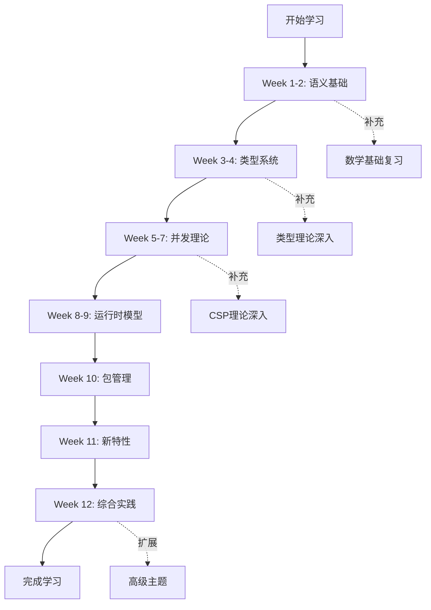

# Go 1.25.3形式化理论学习路线图

**文档类型**: 学习指南  
**目标读者**: 希望系统学习形式化理论的Go开发者  
**学习周期**: 8-12周  
**难度等级**: ⭐⭐⭐⭐⭐ (高级)  
**最后更新**: 2025年10月22日

---

## 🎯 学习目标

完成本路线图后,你将能够:

✅ **理解**: Go语言的完整形式化语义  
✅ **证明**: 并发程序的正确性与安全性  
✅ **分析**: 类型系统的安全性保证  
✅ **应用**: 形式化方法解决实际工程问题  
✅ **设计**: 基于理论的程序优化与验证

---

## 📋 前置知识要求

### 必需知识 (Must Have)

- ✅ Go语言基础 (语法、并发、接口)
- ✅ 基础数学 (集合论、逻辑、证明方法)
- ✅ 数据结构与算法 (图、树、基本算法)

### 推荐知识 (Nice to Have)

- 💡 λ演算基础
- 💡 编译原理 (语法分析、语义分析)
- 💡 离散数学 (关系、函数、归纳法)

### 知识自测

```mathematical
/* 如果你能理解以下内容,说明你已具备前置知识 */

1. 函数类型: f : A → B 表示什么?
2. 集合运算: A ∪ B, A ∩ B, A \ B
3. 逻辑符号: ∀, ∃, ⇒, ⟺
4. 归纳法: 如何证明 P(n) 对所有自然数n成立?
5. Go基础: Goroutine, Channel, Interface 是什么?
```

如果你对上述问题感到陌生,建议先学习:

- [数学基础补充材料](#数学基础补充)
- [Go语言基础](../01-语法基础/README.md)

---

## 🗺️ 完整学习路线

### 路线总览



---

## 📅 详细学习计划

### 第1-2周: 语义基础 (Foundation)

**学习目标**: 建立形式化语义的基础认知

#### Week 1: EBNF与AST

**必读文档**:

- [01-语义模型](01-Go语言语义模型.md) - 第1-3部分

**学习内容**:

1. **EBNF语法规范** (2天)
   - 理解BNF和EBNF的区别
   - 学习Go的完整语法定义
   - 练习:手写简单语句的EBNF

2. **抽象语法树** (2天)
   - 代数数据类型定义
   - 具体语法到抽象语法的映射
   - 练习:构造表达式的AST

3. **语法解析** (3天)
   - 递归下降解析
   - 使用go/parser包
   - 实践:实现简单表达式解析器

**实践项目**:

```go
// 项目1: 表达式解析器
// 解析: 1 + 2 * 3
// 构造AST并求值
type Expr interface{ Eval() int }
type BinaryOp struct {
    Op    string
    Left  Expr
    Right Expr
}
// TODO: 实现完整解析器
```

**自测题**:

1. 写出`if x > 0 { y = 1 }`的EBNF定义
2. 构造`func add(a, b int) int`的AST
3. 实现一个简单的算术表达式解析器

#### Week 2: 操作语义

**必读文档**:

- [01-语义模型](01-Go语言语义模型.md) - 第4-6部分

**学习内容**:

1. **小步操作语义** (2天)
   - 理解单步执行规则
   - 学习符号: ⟨e, σ⟩ → ⟨e', σ'⟩
   - 练习:手动推导简单程序的执行

2. **大步操作语义** (2天)
   - 理解整体求值规则
   - 符号: ⟨e, σ⟩ ⇓ ⟨v, σ'⟩
   - 练习:证明两种语义的等价性

3. **指称语义** (3天)
   - 基于λ演算的语义域
   - 表达式的指称函数
   - 练习:定义简单语句的指称

**实践项目**:

```go
// 项目2: 语义解释器
// 实现小步和大步解释器
type SmallStepInterpreter struct {
    expr  Expr
    store map[string]int
}
func (i *SmallStepInterpreter) Step() bool {
    // 执行一步,返回是否继续
}
// TODO: 实现完整解释器
```

**自测题**:

1. 用小步语义推导`x := 1; y := x + 1`
2. 用大步语义求值`if true { 1 } else { 2 }`
3. 定义变量赋值的指称语义

**Week 1-2总结**:

- ✅ 掌握EBNF和AST
- ✅ 理解操作语义
- ✅ 能够手动推导简单程序

---

### 第3-4周: 类型系统 (Type System)

**学习目标**: 深入理解Go的类型系统及其形式化

#### Week 3: 类型判断规则

**必读文档**:

- [03-类型系统](03-Go类型系统形式化定义.md) - 第1-4部分

**学习内容**:

1. **类型环境** (2天)
   - 类型环境Γ的定义
   - 类型判断 Γ ⊢ e : T
   - 练习:构造简单程序的类型推导树

2. **基本类型规则** (2天)
   - [T-Var], [T-Lit], [T-Op]等规则
   - 规则的应用
   - 练习:手动类型检查

3. **复合类型** (3天)
   - 函数类型
   - 结构体类型
   - 接口类型
   - 练习:定义自定义类型的规则

**实践项目**:

```go
// 项目3: 类型检查器
type TypeChecker struct {
    env map[string]Type
}
func (tc *TypeChecker) Check(expr Expr) (Type, error) {
    // 实现类型检查
}
// TODO: 支持函数、结构体、接口
```

**自测题**:

1. 推导`func(x int) int { return x + 1 }`的类型
2. 证明`var x interface{} = 42`是良类型的
3. 实现一个简单的类型检查器

#### Week 4: 泛型与类型安全

**必读文档**:

- [03-类型系统](03-Go类型系统形式化定义.md) - 第5-7部分
- [06-新特性](06-Go-1.25.3新特性形式化分析.md) - 第1部分

**学习内容**:

1. **泛型类型** (2天)
   - 类型参数与约束
   - 类型实例化规则
   - 练习:定义泛型函数的类型规则

2. **类型推断** (2天)
   - Hindley-Milner算法
   - 约束求解
   - 练习:手动推断泛型类型

3. **类型安全性** (3天)
   - Progress定理
   - Preservation定理
   - 练习:证明简单语言的类型安全性

**实践项目**:

```go
// 项目4: 泛型类型检查
func TypeCheck[T any](expr Expr[T]) (Type, error) {
    // 实现泛型类型检查
}
// 测试:
// Max[int](1, 2)
// Filter[string]([]string{"a", "b"}, pred)
```

**自测题**:

1. 推导`Max[int](1, 2)`的类型
2. 证明Progress定理的Base Case
3. 实现泛型约束检查

**Week 3-4总结**:

- ✅ 掌握类型判断规则
- ✅ 理解泛型系统
- ✅ 能够证明类型安全性

---

### 第5-7周: 并发理论 (Concurrency)

**学习目标**: 掌握CSP模型和并发安全性证明

#### Week 5: CSP基础

**必读文档**:

- [02-CSP模型](02-CSP并发模型与形式化证明.md) - 第1-3部分

**学习内容**:

1. **CSP进程代数** (3天)
   - 基本进程: STOP, SKIP, P ∥ Q
   - 通信: c!v, c?x
   - 练习:用CSP表达简单并发程序

2. **Goroutine形式化** (2天)
   - `go f()`的CSP表示
   - Goroutine生命周期
   - 练习:形式化简单并发模式

3. **Channel操作** (2天)
   - 发送/接收语义
   - 缓冲channel vs 无缓冲channel
   - 练习:证明channel通信的正确性

**实践项目**:

```go
// 项目5: CSP模拟器
type Process interface {
    Run(env *Environment) error
}

type Parallel struct {
    P, Q Process
}

func (p *Parallel) Run(env *Environment) error {
    // 并行执行P和Q
}
// TODO: 实现完整CSP模拟器
```

**自测题**:

1. 用CSP表达:两个goroutine通过channel通信
2. 证明无缓冲channel的同步性
3. 实现简单的CSP模拟器

#### Week 6: 并发安全性

**必读文档**:

- [02-CSP模型](02-CSP并发模型与形式化证明.md) - 第4-6部分
- [05-运行时](05-运行时与内存模型.md) - 第3-4部分

**学习内容**:

1. **Deadlock-Freedom** (2天)
   - 死锁的形式化定义
   - Coffman条件
   - 练习:检测简单程序的死锁

2. **Race-Freedom** (2天)
   - 数据竞争定义
   - Happens-Before关系
   - 练习:使用HB分析竞争

3. **Liveness性质** (3天)
   - 最终性质
   - 公平性
   - 练习:证明简单并发程序的liveness

**实践项目**:

```go
// 项目6: 死锁检测器
type DeadlockDetector struct {
    resourceGraph map[string][]string
}

func (d *DeadlockDetector) HasCycle() bool {
    // 检测资源依赖图中的环
}
// TODO: 集成到实际Go程序
```

**自测题**:

1. 证明生产者-消费者模式无死锁
2. 分析以下代码的数据竞争:

   ```go
   var x int
   go func() { x = 1 }()
   go func() { x = 2 }()
   ```

3. 实现简单的竞争检测器

#### Week 7: Select与高级模式

**必读文档**:

- [02-CSP模型](02-CSP并发模型与形式化证明.md) - 第7部分
- [07-综合案例](07-综合案例与证明.md) - 第2部分

**学习内容**:

1. **Select语句** (2天)
   - Select的CSP语义
   - 非确定性选择
   - 练习:形式化select case

2. **并发模式** (3天)
   - Worker Pool
   - Pipeline
   - Fan-out/Fan-in
   - 练习:证明常见模式的安全性

3. **高级证明** (2天)
   - Linearizability
   - 无锁数据结构
   - 练习:证明并发Map的正确性

**实践项目**:

```go
// 项目7: 并发模式验证
// 实现并证明Worker Pool的正确性
type WorkerPool struct {
    workers int
    tasks   chan Task
}

// 证明:
// 1. 无死锁
// 2. 所有任务终将完成
// 3. 无数据竞争
```

**自测题**:

1. 证明以下select无死锁:

   ```go
   select {
   case <-ch1:
   case <-ch2:
   }
   ```

2. 分析Pipeline模式的性能
3. 证明无锁栈的Linearizability

**Week 5-7总结**:

- ✅ 掌握CSP进程代数
- ✅ 能够形式化并发程序
- ✅ 能够证明并发安全性

---

### 第8-9周: 运行时模型 (Runtime)

**学习目标**: 理解Go运行时的形式化模型

#### Week 8: GMP调度

**必读文档**:

- [05-运行时](05-运行时与内存模型.md) - 第1-2部分

**学习内容**:

1. **GMP三元组** (2天)
   - Goroutine, Machine, Processor
   - 调度器状态机
   - 练习:模拟GMP调度

2. **Work Stealing** (2天)
   - 算法描述
   - 正确性证明
   - 练习:分析负载均衡

3. **抢占式调度** (3天)
   - 抢占条件
   - 栈管理
   - 练习:实现简单调度器

**实践项目**:

```go
// 项目8: GMP模拟器
type Scheduler struct {
    goroutines []*Goroutine
    machines   []*Machine
    processors []*Processor
}

func (s *Scheduler) Schedule() {
    // 实现调度逻辑
}
```

**自测题**:

1. 证明Work Stealing的正确性
2. 分析抢占式调度的公平性
3. 实现一个简化的调度器

#### Week 9: GC与内存模型

**必读文档**:

- [05-运行时](05-运行时与内存模型.md) - 第3-5部分

**学习内容**:

1. **三色标记GC** (2天)
   - 算法不变式
   - 写屏障
   - 练习:手动执行GC

2. **并发GC** (2天)
   - GC与mutator的交互
   - GC暂停时间
   - 练习:分析GC性能

3. **Happens-Before** (3天)
   - 8条HB规则
   - 原子操作
   - 练习:使用HB分析程序

**实践项目**:

```go
// 项目9: GC模拟器
type GarbageCollector struct {
    heap map[*Object]*Object
}

func (gc *GarbageCollector) Mark() {
    // 标记阶段
}

func (gc *GarbageCollector) Sweep() {
    // 清除阶段
}
```

**自测题**:

1. 证明三色不变式
2. 分析以下代码的HB关系:

   ```go
   var x, y int
   go func() { x = 1; y = 2 }()
   go func() { a := y; b := x }()
   ```

3. 实现简单的标记-清除GC

**Week 8-9总结**:

- ✅ 理解GMP调度模型
- ✅ 掌握GC算法
- ✅ 熟悉Happens-Before

---

### 第10周: 包管理 (Modules)

**学习目标**: 掌握Go模块管理的形式化理论

**必读文档**:

- [04-包管理](04-Modules与Workspace包管理模型.md)

**学习内容**:

1. **MVS算法** (2天)
   - Minimal Version Selection
   - 算法正确性
   - 练习:手动执行MVS

2. **依赖图** (2天)
   - 构建依赖图
   - 循环检测
   - 练习:分析依赖冲突

3. **Workspace模式** (3天)
   - Workspace语义
   - replace指令
   - 练习:多模块开发

**实践项目**:

```go
// 项目10: MVS实现
type Module struct {
    Path    string
    Version string
    Require map[string]string
}

func MVS(modules []Module) map[string]string {
    // 实现MVS算法
}
```

**自测题**:

1. 执行MVS选择版本
2. 检测循环依赖
3. 实现简单的模块解析器

**Week 10总结**:

- ✅ 理解MVS算法
- ✅ 能够分析依赖关系
- ✅ 掌握Workspace用法

---

### 第11周: Go 1.25.3新特性 (New Features)

**学习目标**: 形式化分析最新语言特性

**必读文档**:

- [06-新特性](06-Go-1.25.3新特性形式化分析.md)

**学习内容**:

1. **泛型类型别名** (1天)
   - 语法与语义
   - 类型等价性
   - 练习:使用类型别名重构代码

2. **循环变量作用域** (2天)
   - 新旧语义对比
   - Bug分析
   - 练习:迁移旧代码

3. **range-over-func** (2天)
   - iter.Seq类型
   - 零开销证明
   - 练习:实现自定义迭代器

4. **其他新特性** (2天)
   - unique.Handle
   - testing.B.Loop()
   - 练习:应用新特性优化代码

**实践项目**:

```go
// 项目11: 迭代器框架
func Count(n int) iter.Seq[int] {
    return func(yield func(int) bool) {
        for i := 0; i < n; i++ {
            if !yield(i) {
                return
            }
        }
    }
}

// 使用:
for v := range Count(10) {
    println(v)
}
```

**自测题**:

1. 分析类型别名的性能影响
2. 修复循环变量捕获bug
3. 实现高性能迭代器

**Week 11总结**:

- ✅ 掌握Go 1.25.3新特性
- ✅ 理解向后兼容性
- ✅ 能够应用新特性优化代码

---

### 第12周: 综合实践 (Practice)

**学习目标**: 综合应用所学知识解决实际问题

**必读文档**:

- [07-综合案例](07-综合案例与证明.md)

**学习内容**:

1. **完整程序验证** (2天)
   - 生产者-消费者模式
   - 并发Map
   - 内存池

2. **Bug分析** (2天)
   - 循环变量捕获
   - Channel死锁
   - 数据竞争
   - 内存泄漏

3. **编译器优化** (3天)
   - 内联优化
   - 逃逸分析
   - 边界检查消除

**综合项目**:

```go
// 项目12: 完整并发服务器
// 要求:
// 1. 使用形式化方法设计
// 2. 证明无死锁
// 3. 证明无数据竞争
// 4. 性能优化
// 5. 完整文档

type Server struct {
    // 设计你的并发服务器
}

// 提供形式化证明:
// 1. Safety: 数据一致性
// 2. Liveness: 请求终将完成
// 3. Deadlock-Free: 无死锁
// 4. Race-Free: 无竞争
```

**自测题**:

1. 验证一个完整并发程序
2. 分析并修复实际bug
3. 优化并证明优化的正确性

**Week 12总结**:

- ✅ 能够验证完整程序
- ✅ 能够分析实际bug
- ✅ 能够应用形式化方法优化代码

---

## 🎓 学习成果检验

### 基础级 (Week 1-4)

**必须掌握**:

- [ ] 能够写出Go语句的EBNF定义
- [ ] 能够构造表达式的AST
- [ ] 能够用操作语义推导程序执行
- [ ] 能够推导简单程序的类型
- [ ] 能够证明Progress定理的简单情况

**实践能力**:

- [ ] 实现简单的解析器
- [ ] 实现简单的解释器
- [ ] 实现简单的类型检查器

### 中级 (Week 5-9)

**必须掌握**:

- [ ] 能够用CSP表达并发程序
- [ ] 能够分析程序的死锁可能性
- [ ] 能够使用Happens-Before分析竞争
- [ ] 理解GMP调度模型
- [ ] 理解GC算法原理

**实践能力**:

- [ ] 能够形式化验证并发模式
- [ ] 能够检测并修复并发bug
- [ ] 能够分析GC性能

### 高级 (Week 10-12)

**必须掌握**:

- [ ] 理解MVS算法
- [ ] 掌握Go 1.25.3所有新特性
- [ ] 能够验证完整并发程序
- [ ] 能够证明编译器优化的正确性

**实践能力**:

- [ ] 设计并实现复杂并发系统
- [ ] 应用形式化方法解决实际问题
- [ ] 编写高质量的形式化文档

### 专家级 (扩展)

**研究方向**:

- [ ] 扩展形式化理论到新语言特性
- [ ] 开发自动化验证工具
- [ ] 发表学术论文
- [ ] 参与Go编译器开发

---

## 📚 学习资源

### 核心文档

1. [形式化理论体系README](README.md)
2. [快速参考手册](00-快速参考手册.md)
3. 7个核心理论文档 (01-07)

### 补充材料

#### 数学基础补充

**集合论**:

- 集合运算: ∪, ∩, \, ⊆, ∈
- 关系: R ⊆ A × B
- 函数: f : A → B

**逻辑**:

- 命题逻辑: ∧, ∨, ¬, ⇒, ⟺
- 谓词逻辑: ∀, ∃
- 证明方法: 直接证明、反证法、归纳法

**λ演算**:

- λ抽象: λx.e
- 应用: (λx.e) v
- β-规约: (λx.e) v → e[x:=v]

**推荐书籍**:

1. "离散数学及其应用" - Rosen
2. "形式语义学导论" - Winskel
3. "类型与程序设计语言" - Pierce

#### 视频教程

- MIT 6.820: Fundamentals of Program Analysis
- Stanford CS242: Programming Languages
- CMU 15-814: Type Systems

#### 在线资源

- [Go语言规范](https://go.dev/ref/spec)
- [Go内存模型](https://go.dev/ref/mem)
- [Effective Go](https://go.dev/doc/effective_go)

---

## 💡 学习建议

### 学习方法

1. **理论先行**: 先理解概念,再看代码
2. **手动推导**: 不要只看,要动手推导
3. **实践验证**: 用代码验证理论
4. **循序渐进**: 不要跳过基础
5. **反复回顾**: 定期复习前面内容

### 常见陷阱

❌ **陷阱1**: 跳过数学推导  
✅ **正确**: 每个定理都要理解证明思路

❌ **陷阱2**: 只看理论不实践  
✅ **正确**: 理论学习后立即编码验证

❌ **陷阱3**: 追求完美理解  
✅ **正确**: 80%理解即可继续,后续会加深

❌ **陷阱4**: 孤立学习  
✅ **正确**: 加入学习小组,互相讨论

### 时间管理

**每周投入**: 15-20小时

- 阅读文档: 6-8小时
- 手动推导: 4-6小时
- 编码实践: 5-6小时

**学习节奏**:

- 工作日: 每天2-3小时
- 周末: 每天4-5小时

---

## 🎯 进阶方向

### 研究方向

1. **编译器研究**
   - 优化技术
   - 静态分析
   - 程序变换

2. **程序验证**
   - 自动定理证明
   - 模型检测
   - 符号执行

3. **语言设计**
   - 新特性设计
   - 类型系统研究
   - 语言语义

### 职业发展

**技能提升**:

- ✅ 能够设计安全的并发系统
- ✅ 能够进行深度代码审查
- ✅ 能够优化复杂系统性能
- ✅ 能够指导团队技术决策

**职位方向**:

- 高级/资深Go工程师
- 技术架构师
- 编译器工程师
- 静态分析工程师
- 技术专家/研究员

---

## 📞 获取帮助

### 学习社区

- [Go语言中文网](https://studygolang.com)
- [Go Forum](https://forum.golangbridge.org)
- [r/golang](https://reddit.com/r/golang)

### 答疑渠道

1. **GitHub Issues**: 提交问题到本项目
2. **技术论坛**: 在社区提问
3. **邮件列表**: <golang-nuts@googlegroups.com>

### 贡献指南

发现错误或有改进建议?

- 提交Issue报告问题
- 提交PR贡献代码
- 完善文档和示例

---

## ✅ 学习检查清单

### Week 1-2: 语义基础

- [ ] 理解EBNF语法
- [ ] 能够构造AST
- [ ] 掌握操作语义
- [ ] 完成项目1和2
- [ ] 通过自测题

### Week 3-4: 类型系统

- [ ] 掌握类型判断规则
- [ ] 理解泛型系统
- [ ] 证明Progress定理
- [ ] 完成项目3和4
- [ ] 通过自测题

### Week 5-7: 并发理论

- [ ] 掌握CSP进程代数
- [ ] 能够分析死锁
- [ ] 理解Happens-Before
- [ ] 完成项目5-7
- [ ] 通过自测题

### Week 8-9: 运行时模型

- [ ] 理解GMP调度
- [ ] 掌握GC算法
- [ ] 熟悉内存模型
- [ ] 完成项目8和9
- [ ] 通过自测题

### Week 10: 包管理

- [ ] 理解MVS算法
- [ ] 能够分析依赖
- [ ] 完成项目10
- [ ] 通过自测题

### Week 11: 新特性

- [ ] 掌握所有新特性
- [ ] 完成项目11
- [ ] 通过自测题

### Week 12: 综合实践

- [ ] 验证完整程序
- [ ] 分析实际bug
- [ ] 完成综合项目
- [ ] 通过最终考核

---

<div align="center">

# 🎓 祝你学习成功

**坚持学习,终将掌握Go语言的形式化理论**

---

[📚 开始学习](01-Go语言语义模型.md) | [🔍 快速参考](00-快速参考手册.md) | [📖 返回目录](README.md)

Made with ❤️ for Go Learners

</div>

---

**文档版本**: v1.0  
**最后更新**: 2025-10-22  
**维护者**: Go Formal Methods Research Group  
**预计更新**: 根据学习者反馈持续优化
