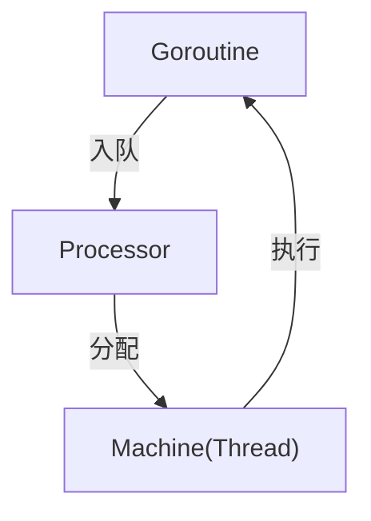

# Go调度器与G-P-M模型

> **简介**: 深度剖析Go运行时调度器的G-P-M模型，理解Goroutine调度原理和性能优化
> **版本**: Go 1.23+  
> **难度**: ⭐⭐⭐⭐  
> **标签**: #调度器 #GPM模型 #运行时 #性能优化

<!-- TOC START -->
- [Go调度器与G-P-M模型](#go调度器与g-p-m模型)
  - [1. 理论基础](#1-理论基础)
    - [形式化描述](#形式化描述)
  - [2. 源码分析（简要）](#2-源码分析简要)
  - [3. 工程意义与最佳实践](#3-工程意义与最佳实践)
  - [4. 图示](#4-图示)
  - [5. 参考文献](#5-参考文献)
<!-- TOC END -->

## 1. 理论基础

Go运行时采用协作式调度，核心是G（Goroutine）、P（Processor）、M（Machine/Thread）三元组模型。

- **G（Goroutine）**：用户级轻量线程，包含栈、上下文等。
- **M（Machine）**：操作系统线程，负责实际执行。
- **P（Processor）**：调度器的抽象，管理可运行G队列，分配给M。

调度流程：G被P调度，P绑定M，M负责执行G。P的数量由GOMAXPROCS控制。

### 形式化描述

- $G = \{g_1, g_2, \ldots, g_n\}$
- $M = \{m_1, m_2, \ldots, m_k\}$
- $P = \{p_1, p_2, \ldots, p_p\}$
- $\text{调度}: P_i \to M_j, G_x \in P_i.\text{runq}$

---

## 2. 源码分析（简要）

Go源码（runtime/proc.go）核心结构体：

```go
type G struct { /* ... */ }
type M struct { /* ... */ }
type P struct { /* ... */ }

```

调度主循环：

```go
func schedule() {
    // 取出可运行G，分配给M
}

```

---

## 3. 工程意义与最佳实践

- 合理设置GOMAXPROCS，充分利用多核。
- 避免Goroutine泄漏，及时回收。
- 利用channel、sync包实现安全通信。
- 监控Goroutine数量，防止调度压力过大。

---

## 4. 图示



---

## 5. 参考文献

- Go runtime源码：<https://github.com/golang/go/tree/master/src/runtime>
- Go官方博客：Go Scheduler: <https://blog.golang.org/scheduler>
- 《Go语言高级编程》

---

**文档维护者**: Go Documentation Team  
**最后更新**: 2025年10月20日  
**文档状态**: 完成  
**适用版本**: Go 1.25.3+
