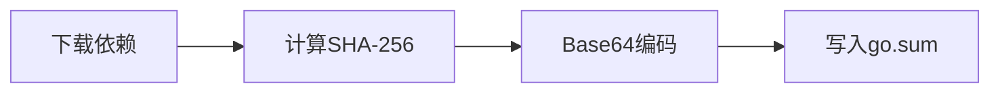
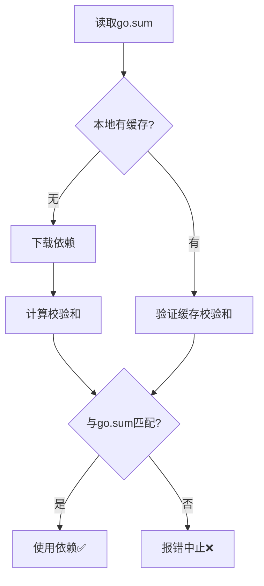

# go.sum文件详解

> 📚 **简介**
>
> 本文详细介绍go.sum文件的作用、格式和工作原理，帮助开发者理解Go模块的安全验证机制。内容涵盖校验和计算、安全保障、问题排查等核心知识。
>
> 通过本文，您将了解go.sum文件如何保障依赖的完整性和安全性。

<!-- TOC START -->
- [go.sum文件详解](#gosum文件详解)
  - [1. 📚 go.sum文件概述](#1--gosum文件概述)
    - [1.1 文件作用](#11-文件作用)
    - [1.2 为什么需要go.sum](#12-为什么需要gosum)
  - [2. 📝 文件格式](#2--文件格式)
    - [2.1 条目格式](#21-条目格式)
    - [2.2 校验和类型](#22-校验和类型)
  - [3. 💻 示例解析](#3--示例解析)
  - [4. 🔧 工作原理](#4--工作原理)
    - [4.1 校验和生成](#41-校验和生成)
    - [4.2 验证流程](#42-验证流程)
  - [5. 🎯 最佳实践](#5--最佳实践)
    - [✅ 推荐做法](#-推荐做法)
    - [❌ 避免的做法](#-避免的做法)
  - [6. ⚠️ 常见问题](#6-️-常见问题)
    - [Q1: go.sum文件很大，可以不提交吗？](#q1-gosum文件很大可以不提交吗)
    - [Q2: 为什么go.sum比go.mod的依赖多？](#q2-为什么gosum比gomod的依赖多)
    - [Q3: 遇到校验和不匹配怎么办？](#q3-遇到校验和不匹配怎么办)
    - [Q4: 如何验证所有依赖的完整性？](#q4-如何验证所有依赖的完整性)
    - [Q5: go.sum中的/go.mod后缀是什么？](#q5-gosum中的gomod后缀是什么)
  - [7. 📚 扩展阅读](#7--扩展阅读)
    - [官方文档](#官方文档)
    - [相关文档](#相关文档)
    - [安全最佳实践](#安全最佳实践)
<!-- TOC END -->

---

## 1. 📚 go.sum文件概述

### 1.1 文件作用

`go.sum`文件记录了每个依赖包的**加密校验和**（cryptographic checksum），用于：

- 🔐 **验证依赖完整性**: 确保下载的代码未被篡改
- 🛡️ **防止供应链攻击**: 检测恶意代码注入
- 🔒 **确保构建可重现**: 保证不同环境使用相同的代码
- ✅ **提供安全保障**: 对比校验和发现异常

### 1.2 为什么需要go.sum

**安全场景**:

```text
开发者A下载依赖 → 校验和记录到go.sum
            ↓
开发者B克隆项目 → Go验证依赖校验和
            ↓
    校验和匹配 ✅  或  校验和不匹配 ❌
```

如果没有go.sum：

- ❌ 依赖可能被恶意替换
- ❌ 无法确保所有人使用相同版本
- ❌ 构建结果可能不一致

---

## 2. 📝 文件格式

### 2.1 条目格式

每行记录一个依赖的校验和：

```text
模块路径 版本[/go.mod] 校验和算法:校验和值
```

**示例**:

```text
github.com/gin-gonic/gin v1.9.1 h1:4idEAncQnU5cB7BeOkPtxjfCSye0AAm1R0RVIqJ+Jmg=
github.com/gin-gonic/gin v1.9.1/go.mod h1:hPrL7YrpYKXt5YId3A/Tnip5kqbEAP+KLuI3SUcPTeU=
```

### 2.2 校验和类型

每个依赖通常有**两个条目**：

1. **模块校验和** (`h1:...`)
   - 整个模块内容的校验和
   - 用于验证模块完整性

2. **go.mod校验和** (`h1:...`)
   - 仅go.mod文件的校验和
   - 用于快速验证依赖声明

**标识符说明**:

- `h1:`: 使用SHA-256算法
- 后续可能支持h2、h3等新算法

---

## 3. 💻 示例解析

**完整示例**:

```text
github.com/gin-gonic/gin v1.9.1 h1:4idEAncQnU5cB7BeOkPtxjfCSye0AAm1R0RVIqJ+Jmg=
github.com/gin-gonic/gin v1.9.1/go.mod h1:hPrL7YrpYKXt5YId3A/Tnip5kqbEAP+KLuI3SUcPTeU=
github.com/go-playground/validator/v10 v10.14.0 h1:vgvQWe3XCz3gIeFDm/HnTIbj6UGmg/+t63MyGU2n5js=
github.com/go-playground/validator/v10 v10.14.0/go.mod h1:9iXMQijp/C/p+UdY+i1R9JNRLsXZBPJ/sqnEqBW7J8A=
```

**解读**:

1. **第1、2行**: gin v1.9.1的两个校验和
   - 整个模块内容的hash
   - go.mod文件的hash

2. **第3、4行**: validator v10.14.0的两个校验和
   - 同样包含模块和go.mod的校验和

---

## 4. 🔧 工作原理

### 4.1 校验和生成

当执行`go get`或`go mod tidy`时：



**具体流程**:

1. 📥 从代理或源下载模块
2. 🔢 计算模块内容的SHA-256
3. 📝 Base64编码校验和
4. 💾 追加到go.sum文件

### 4.2 验证流程

每次构建时：



---

## 5. 🎯 最佳实践

### ✅ 推荐做法

1. **始终提交go.sum到版本控制**

   ```bash
   git add go.sum
   git commit -m "Update dependencies"
   ```

2. **不要手动编辑go.sum**
   - 使用`go mod tidy`维护
   - 使用`go get`更新依赖

3. **保持go.sum同步**

   ```bash
   # 添加/移除依赖后
   go mod tidy
   ```

4. **验证go.sum完整性**

   ```bash
   go mod verify
   ```

5. **定期清理无用条目**

   ```bash
   go mod tidy
   ```

### ❌ 避免的做法

1. ❌ 将go.sum添加到.gitignore
2. ❌ 手动修改go.sum内容
3. ❌ 忽略校验和不匹配的警告
4. ❌ 在CI/CD中禁用校验和验证

---

## 6. ⚠️ 常见问题

### Q1: go.sum文件很大，可以不提交吗？

**A**: ❌ **必须提交**！go.sum是安全保障的关键，不提交会导致：

- 无法验证依赖完整性
- 团队成员可能下载不同版本
- 构建结果不可重现

### Q2: 为什么go.sum比go.mod的依赖多？

**A**: go.sum包含：

- ✅ 直接依赖
- ✅ 间接依赖
- ✅ 历史版本（升级前的版本）

而go.mod只记录当前使用的版本。

### Q3: 遇到校验和不匹配怎么办？

**错误信息**:

```text
verifying github.com/some/pkg@v1.0.0: checksum mismatch
```

**解决方案**:

1. **检查是否遭受攻击**

   ```bash
   # 清除缓存重新下载
   go clean -modcache
   go mod download
   ```

2. **如果确认安全，更新校验和**

   ```bash
   go mod tidy
   ```

3. **联系依赖维护者**
   - 如果问题持续存在
   - 可能是代理或源的问题

### Q4: 如何验证所有依赖的完整性？

**A**: 使用`go mod verify`命令：

```bash
$ go mod verify
all modules verified

# 或发现问题
github.com/some/pkg v1.0.0: dir has been modified
```

### Q5: go.sum中的/go.mod后缀是什么？

**A**: 表示该条目是go.mod文件的校验和，不是整个模块。这样可以：

- 快速验证依赖声明
- 不需要下载完整模块即可进行部分验证

---

## 7. 📚 扩展阅读

### 官方文档

- [Module authentication](https://go.dev/ref/mod#authenticating)
- [go.sum file format](https://go.dev/ref/mod#go-sum-files)

### 相关文档

- [01-Go-Modules简介.md](./01-Go-Modules简介.md)
- [02-go-mod文件详解.md](./02-go-mod文件详解.md)
- [04-语义化版本.md](./04-语义化版本.md)

### 安全最佳实践

- [Go Security](https://go.dev/security/)
- [Module Mirror and Checksum Database](https://go.dev/ref/mod#module-proxy)

---

**文档维护者**: Go Documentation Team  
**最后更新**: 2025年10月20日  
**文档状态**: 完成  
**适用版本**: Go 1.25.3+
