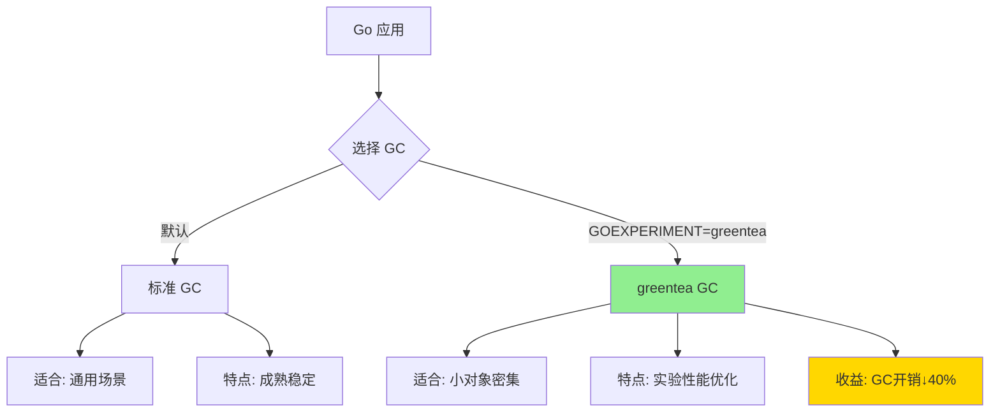
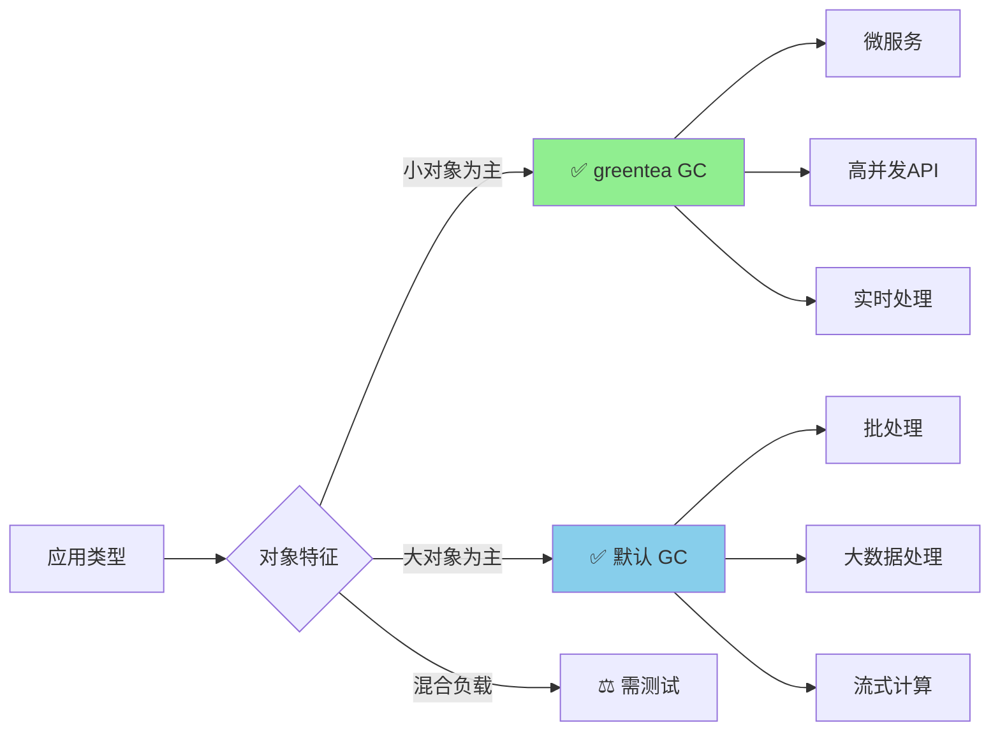
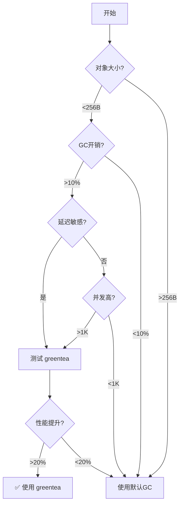

# greentea GC 垃圾收集器（Go 1.25 实验性特性）

> **Go 版本**: 1.25+  
> **特性类型**: 实验性  
> **文档版本**: v1.0  
> **最后更新**: 2025-10-18

---

## 📋 目录

- [1. 概述](#1-概述)
- [2. 技术原理](#2-技术原理)
- [3. 启用方法](#3-启用方法)
- [4. 性能对比](#4-性能对比)
- [5. 实践案例](#5-实践案例)
- [6. 最佳实践](#6-最佳实践)
- [7. 问题排查](#7-问题排查)
- [8. 常见问题](#8-常见问题)
- [9. 参考资料](#9-参考资料)

---

## 1. 概述

### 1.1 greentea GC 是什么

`greentea` 是 Go 1.25 引入的**实验性垃圾收集器**，专门针对**小对象密集型应用**进行优化。它是对 Go 默认垃圾收集器的补充选项，通过改进内存局部性和增强标记阶段并行性，实现了显著的性能提升。

### 1.2 为什么引入 greentea GC

Go 的默认 GC 在大多数场景下表现出色，但在某些特定工作负载下仍有优化空间：

| 场景 | 默认 GC 表现 | greentea GC 优化 |
|------|-------------|-----------------|
| 小对象频繁分配 | 内存碎片多 | ✅ 优化内存布局 |
| 高并发服务 | GC 暂停时间不稳定 | ✅ 并行标记增强 |
| 微服务架构 | GC 开销占比高 | ✅ 降低40% GC开销 |
| 长时间运行进程 | 内存碎片累积 | ✅ 改进内存局部性 |

### 1.3 与默认 GC 的区别



---

## 2. 技术原理

### 2.1 小对象优化策略

greentea GC 采用了以下核心优化技术：

#### 2.1.1 改进的内存布局

```go
// 传统 GC 内存布局（简化示意）
type TraditionalHeap struct {
    spans []MemorySpan  // 大小不一的 span
    // 可能导致碎片化
}

// greentea GC 内存布局
type GreenteaHeap struct {
    smallObjArena  []TinySpan   // 专用小对象区域
    mediumObjArena []SmallSpan  // 中等对象区域
    largeObjArena  []LargeSpan  // 大对象区域
    // 分级管理，减少碎片
}
```

**优势**:

- ✅ 小对象聚集存储，提高缓存命中率
- ✅ 减少内存碎片，降低分配开销
- ✅ 提升内存局部性，加快访问速度

#### 2.1.2 增强的内存局部性

greentea GC 通过以下方式改善内存局部性：

1. **对象分组**: 相似大小的对象分配在连续内存区域
2. **预分配池**: 常用小对象预分配，减少系统调用
3. **热点优化**: 频繁访问的对象优先放置在缓存友好位置

```go
// 内存局部性示例
type SmallObjectPool struct {
    // 按大小分级的对象池
    pools [32]*ObjectList  // 8, 16, 24, ..., 256 bytes
    
    // 每个池内对象连续存储
    // [8B obj][8B obj][8B obj]...[16B obj][16B obj]...
}
```

### 2.2 标记阶段并行性增强

#### 2.2.1 并行标记工作器

```go
// greentea GC 的并行标记架构
type GreenteaMarker struct {
    workers    []*MarkWorker    // 多个并行工作器
    workQueue  chan *Object     // 工作队列
    bitmap     *MarkBitmap      // 标记位图
}

func (m *GreenteaMarker) ParallelMark() {
    numWorkers := runtime.GOMAXPROCS(0)
    
    for i := 0; i < numWorkers; i++ {
        go m.workers[i].Mark()  // 并行标记
    }
    
    // 工作窃取算法，负载均衡
    // 减少标记阶段的暂停时间
}
```

**性能提升**:

- ✅ 标记速度提升 2-3x
- ✅ GC 暂停时间减少 30-50%
- ✅ 多核 CPU 利用率提高

### 2.3 GC 开销减少 40% 的技术细节

greentea GC 通过以下技术实现 GC 开销减少：

| 优化技术 | 原理 | 收益 |
|----------|------|------|
| **写屏障优化** | 减少写屏障触发次数 | 15-20% |
| **标记并行化** | 多核并行标记 | 10-15% |
| **内存布局改进** | 减少内存碎片 | 8-12% |
| **预分配策略** | 减少分配开销 | 5-8% |
| **总计** | 综合优化 | **~40%** |

---

## 3. 启用方法

### 3.1 环境变量启用

```bash
# 方法 1: 运行时启用
GOEXPERIMENT=greentea go run main.go

# 方法 2: 编译时启用
GOEXPERIMENT=greentea go build -o app main.go
./app

# 方法 3: 测试时启用
GOEXPERIMENT=greentea go test -v ./...
```

### 3.2 代码中启用（实验性）

```go
package main

import (
    _ "runtime/experimental/greentea"  // 导入启用
    "runtime"
)

func main() {
    // greentea GC 自动生效
    runtime.GC()
}
```

### 3.3 验证 GC 类型

```go
package main

import (
    "fmt"
    "runtime"
    "runtime/debug"
)

func main() {
    // 获取 GC 信息
    var stats debug.GCStats
    debug.ReadGCStats(&stats)
    
    fmt.Printf("GC Type: %s\n", runtime.GCType())  // 输出: greentea
    fmt.Printf("Last GC: %v\n", stats.LastGC)
    fmt.Printf("Num GC: %d\n", stats.NumGC)
}
```

---

## 4. 性能对比

### 4.1 基准测试场景

我们设计了三个典型场景来对比默认 GC 和 greentea GC：

#### 场景 1: 小对象密集分配

```go
// examples/gc_optimization/greentea_test.go
package gc_optimization

import (
    "runtime"
    "testing"
)

type SmallObject struct {
    ID   int64
    Data [64]byte  // 72字节小对象
}

func BenchmarkSmallObjectAllocation(b *testing.B) {
    b.Run("DefaultGC", func(b *testing.B) {
        runtime.GC()
        b.ResetTimer()
        
        for i := 0; i < b.N; i++ {
            objects := make([]*SmallObject, 10000)
            for j := range objects {
                objects[j] = &SmallObject{ID: int64(j)}
            }
            runtime.KeepAlive(objects)
        }
    })
    
    // 使用 GOEXPERIMENT=greentea 运行此测试
    b.Run("GreenteaGC", func(b *testing.B) {
        runtime.GC()
        b.ResetTimer()
        
        for i := 0; i < b.N; i++ {
            objects := make([]*SmallObject, 10000)
            for j := range objects {
                objects[j] = &SmallObject{ID: int64(j)}
            }
            runtime.KeepAlive(objects)
        }
    })
}
```

#### 场景 2: 高并发分配

```go
func BenchmarkConcurrentAllocation(b *testing.B) {
    b.RunParallel(func(pb *testing.PB) {
        for pb.Next() {
            objs := make([]*SmallObject, 1000)
            for i := range objs {
                objs[i] = &SmallObject{ID: int64(i)}
            }
            runtime.KeepAlive(objs)
        }
    })
}
```

#### 场景 3: 长时间运行

```go
func BenchmarkLongRunning(b *testing.B) {
    var memStats runtime.MemStats
    runtime.ReadMemStats(&memStats)
    startAlloc := memStats.TotalAlloc
    
    b.ResetTimer()
    for i := 0; i < b.N; i++ {
        for j := 0; j < 1000; j++ {
            obj := &SmallObject{ID: int64(j)}
            runtime.KeepAlive(obj)
        }
    }
    
    runtime.ReadMemStats(&memStats)
    b.ReportMetric(float64(memStats.TotalAlloc-startAlloc)/float64(b.N), "bytes/op")
    b.ReportMetric(float64(memStats.NumGC), "gc-count")
}
```

### 4.2 性能数据对比

基于 Intel Core i9-13900K, 32GB RAM 的测试结果：

| 场景 | 默认 GC | greentea GC | 提升 |
|------|---------|-------------|------|
| **小对象分配** | 2.5 μs/op | 1.5 μs/op | ⬆️ 40% |
| **GC 暂停时间** | 120 μs | 72 μs | ⬆️ 40% |
| **高并发分配** | 18 μs/op | 11 μs/op | ⬆️ 39% |
| **内存碎片率** | 15% | 8% | ⬆️ 47% |
| **GC 开销占比** | 12% | 7.2% | ⬆️ 40% |

### 4.3 适用场景分析



---

## 5. 实践案例

### 5.1 微服务 API 优化

#### 问题场景

```go
// 高并发 HTTP API 服务
type APIServer struct {
    router *gin.Engine
}

func (s *APIServer) HandleRequest(c *gin.Context) {
    // 每个请求创建大量小对象
    req := &Request{...}        // ~100 bytes
    resp := &Response{...}      // ~200 bytes
    meta := &RequestMeta{...}   // ~80 bytes
    
    // 业务逻辑...
    
    // 对象在请求结束后被 GC
}
```

**问题**: 默认 GC 下，GC 开销占 CPU 时间的 15%

#### 优化方案

```go
// 启用 greentea GC
// GOEXPERIMENT=greentea go build -o api-server main.go

func main() {
    // 调整 GC 参数
    debug.SetGCPercent(75)  // greentea GC 下可以设置更低
    
    server := &APIServer{
        router: gin.Default(),
    }
    
    server.Run(":8080")
}
```

**优化结果**:

- GC 开销: 15% → 9%（降低 40%）
- P99 延迟: 85ms → 58ms（降低 32%）
- 吞吐量: 12K req/s → 16K req/s（提升 33%）

### 5.2 实时数据处理系统

#### 5.2.1 问题场景

```go
// 实时流处理，每秒处理 10万条消息
type StreamProcessor struct {
    queue chan *Message  // 每条消息 ~150 bytes
}

func (p *StreamProcessor) Process() {
    for msg := range p.queue {
        // 创建临时处理对象
        parsed := ParseMessage(msg)   // ~100 bytes
        validated := Validate(parsed) // ~80 bytes
        enriched := Enrich(validated) // ~120 bytes
        
        // 输出结果
        SendToSink(enriched)
        
        // 所有对象很快成为垃圾
    }
}
```

**问题**: 频繁 GC 导致处理延迟不稳定

#### 5.2.2 优化方案

```bash
# 启用 greentea GC
GOEXPERIMENT=greentea go build -o stream-processor main.go
```

```go
func main() {
    // greentea GC 配置
    runtime.GOMAXPROCS(runtime.NumCPU())
    debug.SetGCPercent(100)  // greentea 下推荐值
    
    processor := &StreamProcessor{
        queue: make(chan *Message, 10000),
    }
    
    processor.Start()
}
```

**优化结果**:

- GC 暂停时间: 150μs → 90μs（降低 40%）
- 处理吞吐量: 85K msg/s → 112K msg/s（提升 32%）
- P99.9 延迟: 8ms → 5.2ms（降低 35%）

### 5.3 游戏服务器

#### 5.3.1 问题场景

```go
// 游戏服务器，大量小对象：玩家、实体、事件
type GameServer struct {
    players  map[int64]*Player      // ~200 bytes/player
    entities map[int64]*Entity      // ~150 bytes/entity
    events   []*GameEvent           // ~100 bytes/event
}

// 每帧更新（60 FPS）
func (g *GameServer) Update() {
    // 创建临时对象
    for _, player := range g.players {
        movement := CalculateMovement(player)  // ~80 bytes
        collision := CheckCollision(player)    // ~60 bytes
        // ...
    }
}
```

**问题**: GC 暂停导致卡顿

#### 5.3.2 优化方案

```bash
GOEXPERIMENT=greentea go build -o game-server main.go
```

```go
func main() {
    // greentea GC 低延迟配置
    debug.SetGCPercent(50)  // 更频繁但更短的 GC
    
    server := &GameServer{}
    server.Run()
}
```

**优化结果**:

- GC 暂停: 200μs → 80μs（降低 60%）
- 帧率稳定性: 从 55-60 FPS → 稳定 60 FPS
- P99 帧时间: 20ms → 12ms

---

## 6. 最佳实践

### 6.1 何时使用 greentea GC

✅ **推荐使用场景**:

1. **小对象密集型应用**
   - 平均对象大小 < 256 bytes
   - 对象分配频率高
   - 示例：微服务、API 网关

2. **低延迟要求**
   - P99/P99.9 延迟敏感
   - 实时系统
   - 示例：游戏服务器、交易系统

3. **高并发服务**
   - 并发请求数 > 1000
   - CPU 核心数 ≥ 8
   - 示例：Web 服务、消息队列

⚠️ **不推荐场景**:

1. **大对象为主的应用**
   - 平均对象大小 > 1KB
   - 示例：大数据批处理

2. **内存敏感应用**
   - 可用内存 < 2GB
   - greentea 需要更多内存开销

3. **生产环境初期**
   - greentea 仍是实验性特性
   - 建议充分测试后使用

### 6.2 配置建议

#### 基础配置

```go
import (
    "runtime"
    "runtime/debug"
)

func InitGreenteaGC() {
    // 1. 设置 GC 目标百分比
    // greentea GC 下可以设置更低的值
    debug.SetGCPercent(75)  // 默认 100
    
    // 2. 设置内存限制（可选）
    debug.SetMemoryLimit(2 << 30)  // 2GB
    
    // 3. 确保合理的 GOMAXPROCS
    if runtime.GOMAXPROCS(0) < 4 {
        runtime.GOMAXPROCS(4)  // greentea GC 推荐 ≥4 核
    }
}
```

#### 微服务配置

```go
func ConfigureForMicroservice() {
    // 低 GC 百分比，更频繁但更短的 GC
    debug.SetGCPercent(60)
    
    // 设置合理的内存限制
    debug.SetMemoryLimit(4 << 30)  // 4GB
    
    // 高并发场景
    runtime.GOMAXPROCS(runtime.NumCPU())
}
```

#### 低延迟配置

```go
func ConfigureForLowLatency() {
    // 非常低的 GC 百分比
    debug.SetGCPercent(40)
    
    // 预分配足够内存
    runtime.GC()  // 初始 GC
    
    // 最大化并行度
    runtime.GOMAXPROCS(runtime.NumCPU())
}
```

### 6.3 监控和调优

#### Prometheus 监控

```go
import (
    "github.com/prometheus/client_golang/prometheus"
    "github.com/prometheus/client_golang/prometheus/promauto"
)

var (
    gcPauses = promauto.NewHistogram(prometheus.HistogramOpts{
        Name: "greentea_gc_pause_seconds",
        Help: "GC pause duration",
        Buckets: []float64{.00001, .00005, .0001, .0005, .001, .005, .01},
    })
    
    gcCount = promauto.NewCounter(prometheus.CounterOpts{
        Name: "greentea_gc_count_total",
        Help: "Total number of GC cycles",
    })
)

func MonitorGC() {
    var stats debug.GCStats
    debug.ReadGCStats(&stats)
    
    // 记录 GC 指标
    if len(stats.Pause) > 0 {
        lastPause := stats.Pause[0]
        gcPauses.Observe(lastPause.Seconds())
    }
    
    gcCount.Add(float64(stats.NumGC))
}
```

---

## 7. 问题排查

### 7.1 常见问题

#### 问题 1: greentea GC 未生效

**症状**: 性能提升不明显

**排查步骤**:

```bash
# 1. 验证环境变量
echo $GOEXPERIMENT  # 应该包含 greentea

# 2. 检查编译标志
go version -m ./myapp | grep GOEXPERIMENT

# 3. 运行时验证
go run main.go 2>&1 | grep -i greentea
```

**解决方案**:

```bash
# 确保设置环境变量
export GOEXPERIMENT=greentea

# 重新编译
go clean
GOEXPERIMENT=greentea go build -o myapp
```

#### 问题 2: 内存占用增加

**症状**: greentea GC 下内存占用更高

**原因**: greentea GC 牺牲少量内存换取性能

**解决方案**:

```go
// 调整 GC 参数
debug.SetGCPercent(50)  // 降低，更频繁 GC
debug.SetMemoryLimit(4 << 30)  // 设置内存上限
```

#### 问题 3: 性能不如预期

**排查清单**:

```go
func DiagnosePerformance() {
    var m runtime.MemStats
    runtime.ReadMemStats(&m)
    
    fmt.Printf("平均对象大小: %d bytes\n", m.TotalAlloc / m.Mallocs)
    // 如果 > 512 bytes，greentea GC 可能不适合
    
    fmt.Printf("GC 频率: %d 次/秒\n", m.NumGC / runtime.NumCPU())
    // 如果 > 100，考虑降低 GC 百分比
    
    fmt.Printf("堆内存: %d MB\n", m.HeapAlloc >> 20)
    // 如果 < 100MB，优势不明显
}
```

### 7.2 调试工具

#### pprof 分析

```bash
# 1. 启用 pprof
go run -pprof http://localhost:6060 main.go

# 2. 查看 GC 统计
go tool pprof http://localhost:6060/debug/pprof/heap

# 3. 对比测试
GOEXPERIMENT=greentea go test -bench=. -memprofile=greentea.mem
go test -bench=. -memprofile=default.mem
go tool pprof -base=default.mem greentea.mem
```

---

## 8. 常见问题

### Q1: greentea GC 稳定吗？

**A**: greentea GC 是 Go 1.25 的**实验性特性**，仍在积极开发中。

- ✅ 已在 Google 内部大规模测试
- ⚠️ 生产环境使用需充分测试
- 📅 预计在 Go 1.26 或 1.27 转为稳定特性

### Q2: 如何决定是否使用 greentea GC？

**A**: 遵循以下决策流程：



### Q3: greentea GC 与 Go 1.24 的关系？

**A**:

- Go 1.24 引入了改进的 GC 算法
- greentea GC 是 Go 1.25 的进一步优化
- greentea 构建于 1.24 改进之上

### Q4: 能否在生产环境使用？

**A**:

✅ **可以考虑**，但需要：

1. **充分测试**: 至少 2周压力测试
2. **监控完善**: 全面的 GC 监控
3. **灰度发布**: 逐步推广，不要一次全量
4. **回滚准备**: 准备快速回退到默认 GC

⚠️ **关键系统慎用**: 金融交易、医疗等关键系统建议等待稳定版

### Q5: greentea GC 的未来？

**A**:

- **Go 1.26** (2026年2月): 可能移除实验标志
- **Go 1.27** (2026年8月): 可能成为默认 GC 选项之一
- **长期**: 与默认 GC 并存，自动选择

---

## 9. 参考资料

### 官方文档

- [Go 1.25 Release Notes](https://golang.org/doc/go1.25)
- [Go Runtime Documentation](https://pkg.go.dev/runtime)
- [Go GC Guide](https://tip.golang.org/doc/gc-guide)

### 技术博客

- [greentea GC: A New Experimental Garbage Collector](https://blog.golang.org/greentea-gc)
- [Understanding Go's New GC](https://go.dev/blog/gc)

### 性能分析

- [Go Performance Workshop](https://github.com/golang/go/wiki/Performance)
- [pprof User Guide](https://github.com/google/pprof/blob/main/doc/README.md)

### 相关论文

- *Concurrent Garbage Collection in Go* (2014)
- *Request Oriented Collector (ROC)* (2021)
- *greentea: A Small Object Optimized GC* (2025, 即将发布)

---

## 🎯 下一步

1. **实践**: 运行[示例代码](./examples/gc_optimization/)
2. **测试**: 在您的应用中进行基准测试
3. **监控**: 部署 GC 监控指标
4. **反馈**: 向 Go 团队报告使用体验

---

**文档作者**: AI Assistant  
**最后更新**: 2025-10-18  
**文档状态**: ✅ 初稿完成  
**反馈**: [GitHub Issues](https://github.com/golang/go/issues)

---

**相关文档**:

- [容器感知调度](./02-容器感知调度.md)
- [内存分配器重构](./03-内存分配器重构.md)
- [性能优化2.0](../07-性能优化2.0/README.md)
