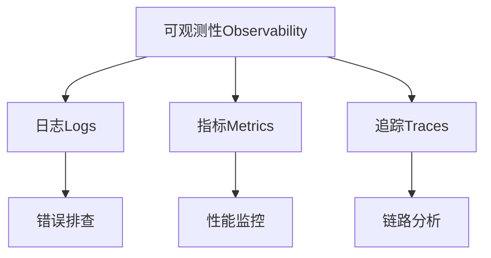

# 监控和日志

> 📚 **简介**
>
> 本文全面介绍Go Web应用的监控和日志实践，涵盖结构化日志、指标收集、链路追踪、健康检查等核心内容。帮助开发者构建可观测的生产系统。
>
> 通过本文，您将掌握如何构建完善的监控和日志体系，提升系统可维护性。

<!-- TOC START -->
- [监控和日志](#监控和日志)
  - [1. 📚 可观测性概述](#1--可观测性概述)
    - [1.1 可观测性三大支柱](#11-可观测性三大支柱)
    - [1.2 监控和日志的重要性](#12-监控和日志的重要性)
  - [2. 📝 结构化日志](#2--结构化日志)
    - [2.1 使用slog](#21-使用slog)
    - [2.2 日志级别](#22-日志级别)
    - [2.3 上下文日志](#23-上下文日志)
  - [3. 📊 指标监控](#3--指标监控)
    - [3.1 Prometheus集成](#31-prometheus集成)
    - [3.2 常用指标](#32-常用指标)
    - [3.3 自定义指标](#33-自定义指标)
  - [4. 🔍 链路追踪](#4--链路追踪)
    - [4.1 OpenTelemetry](#41-opentelemetry)
    - [4.2 追踪中间件](#42-追踪中间件)
  - [5. 🏥 健康检查](#5--健康检查)
  - [6. 🔧 实践示例](#6--实践示例)
  - [7. 🎯 最佳实践](#7--最佳实践)
    - [✅ 日志管理](#-日志管理)
    - [✅ 指标监控](#-指标监控)
    - [✅ 链路追踪](#-链路追踪)
  - [8. ⚠️ 常见问题](#8-️-常见问题)
    - [Q1: 日志太多影响性能怎么办？](#q1-日志太多影响性能怎么办)
    - [Q2: Prometheus指标爆炸怎么办？](#q2-prometheus指标爆炸怎么办)
    - [Q3: 如何选择日志库？](#q3-如何选择日志库)
  - [9. 📚 扩展阅读](#9--扩展阅读)
    - [官方文档](#官方文档)
    - [相关工具](#相关工具)
<!-- TOC END -->

---

## 1. 📚 可观测性概述

### 1.1 可观测性三大支柱



**三大支柱**：

| 支柱 | 用途 | 工具示例 |
|------|------|---------|
| **日志** | 记录离散事件 | slog, zap, logrus |
| **指标** | 测量数值数据 | Prometheus, StatsD |
| **追踪** | 记录请求流程 | Jaeger, Zipkin, OpenTelemetry |

### 1.2 监控和日志的重要性

**问题定位**：

- 🐛 快速发现bug
- 🔍 追踪错误根因
- 📊 分析性能瓶颈

**生产保障**：

- 🚨 及时告警
- 📈 容量规划
- 🔄 优化迭代

---

## 2. 📝 结构化日志

### 2.1 使用slog

**Go 1.21+标准库**：

```go
package main

import (
    "log/slog"
    "os"
)

func main() {
    // 创建JSON格式日志器
    logger := slog.New(slog.NewJSONHandler(os.Stdout, nil))
    
    // 记录日志
    logger.Info("server started",
        "port", 8080,
        "env", "production",
    )
    
    // 输出：
    // {"time":"2023-10-20T10:00:00Z","level":"INFO","msg":"server started","port":8080,"env":"production"}
}
```

**配置日志级别**：

```go
// 设置日志级别
opts := &slog.HandlerOptions{
    Level: slog.LevelDebug, // DEBUG, INFO, WARN, ERROR
}
logger := slog.New(slog.NewJSONHandler(os.Stdout, opts))
```

### 2.2 日志级别

| 级别 | 使用场景 | 示例 |
|------|---------|------|
| **DEBUG** | 调试信息 | 变量值、函数调用 |
| **INFO** | 正常流程 | 服务启动、请求处理 |
| **WARN** | 警告信息 | 配置问题、降级处理 |
| **ERROR** | 错误信息 | 请求失败、异常捕获 |

**示例**：

```go
logger.Debug("query executed", "sql", query, "duration", duration)
logger.Info("request processed", "method", "GET", "path", "/api/users")
logger.Warn("cache miss", "key", cacheKey)
logger.Error("database error", "error", err, "query", query)
```

### 2.3 上下文日志

**在Gin中使用**：

```go
import (
    "context"
    "log/slog"
    "github.com/gin-gonic/gin"
)

// 日志中间件
func LoggerMiddleware() gin.HandlerFunc {
    return func(c *gin.Context) {
        // 创建带请求ID的logger
        logger := slog.With(
            "request_id", c.GetString("RequestID"),
            "method", c.Request.Method,
            "path", c.Request.URL.Path,
        )
        
        // 存储到context
        c.Set("logger", logger)
        
        c.Next()
        
        // 记录请求完成
        logger.Info("request completed",
            "status", c.Writer.Status(),
            "duration", time.Since(start),
        )
    }
}

// 在handler中使用
func GetUser(c *gin.Context) {
    logger := c.MustGet("logger").(*slog.Logger)
    
    logger.Info("fetching user", "user_id", userID)
    // ...
}
```

---

## 3. 📊 指标监控

### 3.1 Prometheus集成

**安装依赖**：

```bash
go get github.com/prometheus/client_golang/prometheus
go get github.com/prometheus/client_golang/prometheus/promhttp
```

**基础设置**：

```go
package main

import (
    "github.com/gin-gonic/gin"
    "github.com/prometheus/client_golang/prometheus"
    "github.com/prometheus/client_golang/prometheus/promhttp"
)

func main() {
    r := gin.Default()
    
    // 暴露metrics端点
    r.GET("/metrics", gin.WrapH(promhttp.Handler()))
    
    r.Run(":8080")
}
```

### 3.2 常用指标

**HTTP请求指标**：

```go
var (
    // 请求计数
    httpRequestsTotal = prometheus.NewCounterVec(
        prometheus.CounterOpts{
            Name: "http_requests_total",
            Help: "Total number of HTTP requests",
        },
        []string{"method", "path", "status"},
    )
    
    // 请求延迟
    httpRequestDuration = prometheus.NewHistogramVec(
        prometheus.HistogramOpts{
            Name: "http_request_duration_seconds",
            Help: "HTTP request latency",
            Buckets: prometheus.DefBuckets,
        },
        []string{"method", "path"},
    )
    
    // 活跃请求数
    httpRequestsInFlight = prometheus.NewGauge(
        prometheus.GaugeOpts{
            Name: "http_requests_in_flight",
            Help: "Current number of HTTP requests being processed",
        },
    )
)

func init() {
    // 注册指标
    prometheus.MustRegister(httpRequestsTotal)
    prometheus.MustRegister(httpRequestDuration)
    prometheus.MustRegister(httpRequestsInFlight)
}
```

**监控中间件**：

```go
func PrometheusMiddleware() gin.HandlerFunc {
    return func(c *gin.Context) {
        start := time.Now()
        
        // 增加活跃请求数
        httpRequestsInFlight.Inc()
        defer httpRequestsInFlight.Dec()
        
        c.Next()
        
        // 记录指标
        duration := time.Since(start).Seconds()
        status := c.Writer.Status()
        
        httpRequestsTotal.WithLabelValues(
            c.Request.Method,
            c.FullPath(),
            strconv.Itoa(status),
        ).Inc()
        
        httpRequestDuration.WithLabelValues(
            c.Request.Method,
            c.FullPath(),
        ).Observe(duration)
    }
}
```

### 3.3 自定义指标

**业务指标**：

```go
var (
    // 用户注册数
    userRegistrations = prometheus.NewCounter(
        prometheus.CounterOpts{
            Name: "user_registrations_total",
            Help: "Total number of user registrations",
        },
    )
    
    // 订单金额
    orderAmount = prometheus.NewHistogram(
        prometheus.HistogramOpts{
            Name: "order_amount",
            Help: "Order amount in dollars",
            Buckets: []float64{10, 50, 100, 500, 1000, 5000},
        },
    )
)

func RegisterUser(c *gin.Context) {
    // 处理注册逻辑
    // ...
    
    // 记录指标
    userRegistrations.Inc()
}

func CreateOrder(c *gin.Context) {
    amount := order.Amount
    
    // 记录订单金额
    orderAmount.Observe(amount)
}
```

---

## 4. 🔍 链路追踪

### 4.1 OpenTelemetry

**安装**：

```bash
go get go.opentelemetry.io/otel
go get go.opentelemetry.io/otel/exporters/jaeger
go get go.opentelemetry.io/contrib/instrumentation/github.com/gin-gonic/gin/otelgin
```

**初始化**：

```go
import (
    "go.opentelemetry.io/otel"
    "go.opentelemetry.io/otel/exporters/jaeger"
    "go.opentelemetry.io/otel/sdk/trace"
)

func InitTracer() (*trace.TracerProvider, error) {
    // 创建Jaeger导出器
    exporter, err := jaeger.New(
        jaeger.WithCollectorEndpoint(jaeger.WithEndpoint("http://localhost:14268/api/traces")),
    )
    if err != nil {
        return nil, err
    }
    
    // 创建TracerProvider
    tp := trace.NewTracerProvider(
        trace.WithBatcher(exporter),
        trace.WithResource(resource.NewWithAttributes(
            semconv.SchemaURL,
            semconv.ServiceNameKey.String("my-service"),
        )),
    )
    
    otel.SetTracerProvider(tp)
    return tp, nil
}
```

### 4.2 追踪中间件

```go
import "go.opentelemetry.io/contrib/instrumentation/github.com/gin-gonic/gin/otelgin"

func main() {
    r := gin.Default()
    
    // 添加追踪中间件
    r.Use(otelgin.Middleware("my-service"))
    
    r.GET("/users/:id", GetUser)
    r.Run()
}

func GetUser(c *gin.Context) {
    ctx := c.Request.Context()
    
    // 创建子span
    tracer := otel.Tracer("user-service")
    ctx, span := tracer.Start(ctx, "GetUser")
    defer span.End()
    
    // 添加属性
    span.SetAttributes(
        attribute.String("user_id", c.Param("id")),
    )
    
    // 业务逻辑
    user, err := fetchUser(ctx, c.Param("id"))
    if err != nil {
        span.RecordError(err)
        c.JSON(500, gin.H{"error": err.Error()})
        return
    }
    
    c.JSON(200, user)
}
```

---

## 5. 🏥 健康检查

**健康检查端点**：

```go
type HealthStatus struct {
    Status     string            `json:"status"`
    Version    string            `json:"version"`
    Checks     map[string]string `json:"checks"`
    Timestamp  time.Time         `json:"timestamp"`
}

func HealthCheck(c *gin.Context) {
    status := HealthStatus{
        Status:    "healthy",
        Version:   "1.0.0",
        Checks:    make(map[string]string),
        Timestamp: time.Now(),
    }
    
    // 检查数据库
    if err := db.Ping(); err != nil {
        status.Status = "unhealthy"
        status.Checks["database"] = "failed: " + err.Error()
    } else {
        status.Checks["database"] = "ok"
    }
    
    // 检查Redis
    if err := redis.Ping(c).Err(); err != nil {
        status.Status = "degraded"
        status.Checks["redis"] = "failed: " + err.Error()
    } else {
        status.Checks["redis"] = "ok"
    }
    
    code := 200
    if status.Status == "unhealthy" {
        code = 503
    }
    
    c.JSON(code, status)
}

// 路由注册
r.GET("/health", HealthCheck)
r.GET("/readiness", ReadinessCheck)
r.GET("/liveness", LivenessCheck)
```

---

## 6. 🔧 实践示例

**完整示例**：

```go
package main

import (
    "log/slog"
    "time"
    
    "github.com/gin-gonic/gin"
    "github.com/prometheus/client_golang/prometheus/promhttp"
)

func main() {
    // 初始化日志
    logger := slog.New(slog.NewJSONHandler(os.Stdout, nil))
    slog.SetDefault(logger)
    
    // 初始化追踪
    tp, _ := InitTracer()
    defer tp.Shutdown(context.Background())
    
    // 创建路由
    r := gin.New()
    
    // 中间件
    r.Use(RequestIDMiddleware())
    r.Use(LoggerMiddleware())
    r.Use(PrometheusMiddleware())
    r.Use(otelgin.Middleware("my-service"))
    
    // 监控端点
    r.GET("/metrics", gin.WrapH(promhttp.Handler()))
    r.GET("/health", HealthCheck)
    
    // 业务端点
    r.GET("/users/:id", GetUser)
    
    logger.Info("server starting", "port", 8080)
    r.Run(":8080")
}
```

---

## 7. 🎯 最佳实践

### ✅ 日志管理

1. **使用结构化日志**

   ```go
   // ✅ 好
   logger.Info("user login", "user_id", userID, "ip", ip)
   
   // ❌ 差
   fmt.Printf("User %s logged in from %s\n", userID, ip)
   ```

2. **添加上下文信息**
   - 请求ID
   - 用户ID
   - 会话ID

3. **设置日志轮转**

   ```go
   // 使用lumberjack
   logger := &lumberjack.Logger{
       Filename:   "/var/log/app.log",
       MaxSize:    100, // MB
       MaxBackups: 3,
       MaxAge:     28, // days
       Compress:   true,
   }
   ```

### ✅ 指标监控

1. **选择合适的指标类型**
   - Counter: 累计值（请求数、错误数）
   - Gauge: 当前值（内存使用、连接数）
   - Histogram: 分布统计（延迟、大小）
   - Summary: 百分位数

2. **合理使用标签**

   ```go
   // ✅ 好（低基数）
   httpRequests.WithLabelValues("GET", "/api/users", "200")
   
   // ❌ 差（高基数）
   httpRequests.WithLabelValues("GET", "/api/users/123456", "200")
   ```

3. **设置告警规则**

   ```yaml
   # prometheus.yml
   groups:
     - name: api
       rules:
         - alert: HighErrorRate
           expr: rate(http_requests_total{status=~"5.."}[5m]) > 0.05
   ```

### ✅ 链路追踪

1. **追踪关键路径**
   - HTTP请求
   - 数据库查询
   - 外部API调用
   - 缓存操作

2. **采样策略**

   ```go
   // 生产环境采样10%
   trace.WithSampler(trace.TraceIDRatioBased(0.1))
   ```

3. **敏感信息脱敏**

   ```go
   // 不要记录密码、token等
   span.SetAttributes(
       attribute.String("user_email", email),
       // attribute.String("password", password), // ❌
   )
   ```

---

## 8. ⚠️ 常见问题

### Q1: 日志太多影响性能怎么办？

**A**:

- 使用异步日志
- 调整日志级别
- 使用采样

```go
// 采样：每10个DEBUG日志记录1个
if rand.Intn(10) == 0 {
    logger.Debug("detail", "data", data)
}
```

### Q2: Prometheus指标爆炸怎么办？

**A**: 控制标签基数

```go
// ❌ 不要使用高基数标签
.WithLabelValues(userID) // 可能有百万级用户

// ✅ 使用低基数标签
.WithLabelValues(userType) // 只有几种类型
```

### Q3: 如何选择日志库？

**推荐**：

- Go 1.21+: slog（标准库）
- 高性能: zap
- 功能丰富: logrus

---

## 9. 📚 扩展阅读

### 官方文档

- [log/slog](https://pkg.go.dev/log/slog)
- [Prometheus Go client](https://github.com/prometheus/client_golang)
- [OpenTelemetry Go](https://opentelemetry.io/docs/instrumentation/go/)

### 相关工具

- [Grafana](https://grafana.com/) - 可视化平台
- [Jaeger](https://www.jaegertracing.io/) - 分布式追踪
- [ELK Stack](https://www.elastic.co/elk-stack) - 日志平台

---

**文档维护者**: Go Documentation Team  
**最后更新**: 2025年10月20日  
**文档状态**: 完成  
**适用版本**: Go 1.21+
