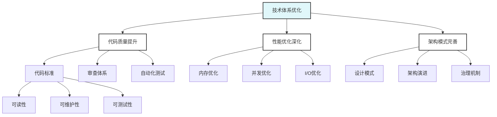

# Go语言技术体系优化

> 摘要：通过代码质量提升、性能优化深化和架构模式完善，构建高质量的技术体系。

## 📚 模块概述

本模块专注于Go语言技术体系的全面优化，涵盖代码质量提升、性能优化深化和架构模式完善三个核心领域，旨在构建高质量、高性能、可维护的技术体系。

## 🎯 学习目标

- 建立企业级代码质量标准
- 掌握深度性能优化技术
- 完善架构设计模式
- 构建可持续的技术体系

## 📋 学习内容

### 01-代码质量提升

- [代码质量提升](./01-代码质量提升/README.md) - 代码标准、审查体系、自动化测试

### 02-性能优化深化

- [性能优化深化](./02-性能优化深化/README.md) - 深度优化、工具链、最佳实践

### 03-架构模式完善

- [架构模式完善](./03-架构模式完善/README.md) - 设计模式、架构演进、治理机制

## 🚀 快速开始

### 代码质量提升

```go
// 企业级代码标准示例
type UserService struct {
    repo UserRepository
    validator *validator.Validate
    logger Logger
}

// 依赖注入和接口抽象
func NewUserService(repo UserRepository, validator *validator.Validate, logger Logger) *UserService {
    return &UserService{
        repo: repo,
        validator: validator,
        logger: logger,
    }
}

// 单一职责原则
func (s *UserService) CreateUser(ctx context.Context, req CreateUserRequest) (*User, error) {
    if err := s.validator.Struct(req); err != nil {
        return nil, fmt.Errorf("validation failed: %w", err)
    }
    
    user := &User{
        Name:  req.Name,
        Email: req.Email,
    }
    
    return s.repo.Create(ctx, user)
}
```

### 性能优化深化

```go
// 内存池优化
var userPool = sync.Pool{
    New: func() interface{} {
        return &User{}
    },
}

func GetUser() *User {
    return userPool.Get().(*User)
}

func PutUser(u *User) {
    u.Reset()
    userPool.Put(u)
}

// 零拷贝优化
func (s *Server) handleRequest(w http.ResponseWriter, r *http.Request) {
    // 使用sendfile进行零拷贝传输
    file, err := os.Open("large-file.dat")
    if err != nil {
        http.Error(w, err.Error(), http.StatusInternalServerError)
        return
    }
    defer file.Close()
    
    w.Header().Set("Content-Type", "application/octet-stream")
    io.Copy(w, file)
}
```

### 架构模式完善

```go
// Clean Architecture示例
type UserUseCase struct {
    userRepo UserRepository
    eventBus EventBus
}

func (uc *UserUseCase) CreateUser(ctx context.Context, cmd CreateUserCommand) error {
    user := &User{
        ID:    uuid.New(),
        Name:  cmd.Name,
        Email: cmd.Email,
    }
    
    if err := uc.userRepo.Save(ctx, user); err != nil {
        return err
    }
    
    // 发布领域事件
    event := UserCreatedEvent{
        UserID: user.ID,
        Name:   user.Name,
        Email:  user.Email,
    }
    
    return uc.eventBus.Publish(ctx, event)
}
```

## 📊 学习进度

| 主题 | 状态 | 完成度 | 预计时间 |
|------|------|--------|----------|
| 代码质量提升 | 🔄 进行中 | 70% | 2-3周 |
| 性能优化深化 | ⏳ 待开始 | 0% | 3-4周 |
| 架构模式完善 | ⏳ 待开始 | 0% | 2-3周 |

## 🎯 实践项目

### 项目1: 代码质量提升工具链

- 集成静态分析工具
- 建立代码审查流程
- 实现自动化质量检查

### 项目2: 性能优化实践

- 构建性能测试框架
- 实现性能监控系统
- 建立性能优化流程

### 项目3: 架构模式重构

- 重构现有系统架构
- 应用设计模式
- 建立架构治理机制

## 📚 参考资料

### 官方文档

- [Go语言规范](https://golang.org/ref/spec)
- [Go语言性能优化指南](https://golang.org/doc/diagnostics.html)

### 书籍推荐

- 《Clean Architecture》
- 《Design Patterns》
- 《Performance Engineering》

### 在线资源

- [Go性能优化](https://golang.org/doc/diagnostics.html)
- [Go代码审查指南](https://github.com/golang/go/wiki/CodeReviewComments)

## 🔧 工具推荐

### 代码质量工具

- **golangci-lint**: 静态代码分析
- **go vet**: 官方代码检查
- **SonarQube**: 代码质量平台

### 性能分析工具

- **pprof**: 性能分析
- **go-torch**: 火焰图
- **trace**: 执行追踪

### 架构设计工具

- **PlantUML**: 架构图绘制
- **Mermaid**: 流程图绘制
- **ArchUnit**: 架构测试

## 🎯 学习建议

### 质量优先

- 建立代码质量标准
- 注重代码可读性
- 持续重构优化

### 性能导向

- 建立性能基准
- 定期性能测试
- 关注性能瓶颈

### 架构思维

- 系统化思考问题
- 注重设计模式
- 建立架构治理

## 📝 重要概念

### 代码质量

- **可读性**: 代码清晰易懂
- **可维护性**: 易于修改和扩展
- **可测试性**: 易于编写测试

### 性能优化

- **内存优化**: 减少内存分配
- **并发优化**: 提高并发性能
- **I/O优化**: 优化输入输出

### 架构模式

- **分层架构**: 职责分离
- **微服务架构**: 服务拆分
- **事件驱动**: 异步处理

## 🔍 质量保证

### 代码质量1

- 静态代码分析
- 代码审查流程
- 自动化测试

### 性能质量

- 性能基准测试
- 性能监控
- 性能回归检测

### 架构质量

- 架构审查
- 设计模式应用
- 架构演进管理

## 📊 技术体系图谱



## ❓ 常见FAQ

### 代码质量2

- Q: 如何建立代码质量标准？
  A: 制定编码规范，使用静态分析工具，建立代码审查流程。

### 性能优化1

- Q: 如何进行性能优化？
  A: 建立性能基准，使用性能分析工具，识别瓶颈并优化。

### 架构模式1

- Q: 如何选择合适的架构模式？
  A: 根据业务需求和技术特点，选择适合的架构模式和设计模式。

---

**模块维护者**: AI Assistant  
**最后更新**: 2025年1月15日  
**模块状态**: 持续更新中
