# 01-基础数据结构

> Go语言中的基础数据结构实现与应用

---

## 📚 章节概览

本章介绍Go语言中常用的基础数据结构,包括数组、切片、链表、栈、队列、哈希表、树和图等。

---

## 1. 数组 (Array)

### 1.1 数组基础

```go
package main

import "fmt"

func main() {
    // 声明和初始化
    var arr1 [5]int
    arr2 := [5]int{1, 2, 3, 4, 5}
    arr3 := [...]int{1, 2, 3} // 自动推导长度
    
    fmt.Println(arr1) // [0 0 0 0 0]
    fmt.Println(arr2) // [1 2 3 4 5]
    fmt.Println(arr3) // [1 2 3]
}
```

### 1.2 数组操作

```go
// 遍历数组
arr := [5]int{1, 2, 3, 4, 5}

// 方式1: for循环
for i := 0; i < len(arr); i++ {
    fmt.Printf("arr[%d] = %d\n", i, arr[i])
}

// 方式2: range
for index, value := range arr {
    fmt.Printf("arr[%d] = %d\n", index, value)
}
```

---

## 2. 切片 (Slice)

### 2.1 切片基础

```go
package main

import "fmt"

func main() {
    // 创建切片
    slice1 := []int{1, 2, 3}
    slice2 := make([]int, 5)      // 长度5
    slice3 := make([]int, 5, 10)  // 长度5,容量10
    
    fmt.Printf("slice1: %v, len: %d, cap: %d\n", 
               slice1, len(slice1), cap(slice1))
}
```

### 2.2 切片操作

```go
// 追加元素
slice := []int{1, 2, 3}
slice = append(slice, 4, 5)

// 切片截取
subSlice := slice[1:4]  // [2 3 4]

// 复制切片
dst := make([]int, len(slice))
copy(dst, slice)
```

---

## 3. 链表 (Linked List)

### 3.1 单链表实现

```go
package main

import "fmt"

// 定义节点
type Node struct {
    Data int
    Next *Node
}

// 定义链表
type LinkedList struct {
    Head *Node
    Size int
}

// 在头部插入
func (list *LinkedList) InsertAtHead(data int) {
    newNode := &Node{Data: data}
    newNode.Next = list.Head
    list.Head = newNode
    list.Size++
}

// 在尾部插入
func (list *LinkedList) InsertAtTail(data int) {
    newNode := &Node{Data: data}
    
    if list.Head == nil {
        list.Head = newNode
        list.Size++
        return
    }
    
    current := list.Head
    for current.Next != nil {
        current = current.Next
    }
    current.Next = newNode
    list.Size++
}

// 打印链表
func (list *LinkedList) Print() {
    current := list.Head
    for current != nil {
        fmt.Printf("%d -> ", current.Data)
        current = current.Next
    }
    fmt.Println("nil")
}

func main() {
    list := &LinkedList{}
    list.InsertAtHead(3)
    list.InsertAtHead(2)
    list.InsertAtHead(1)
    list.InsertAtTail(4)
    
    list.Print() // 1 -> 2 -> 3 -> 4 -> nil
}
```

---

## 4. 栈 (Stack)

### 4.1 栈实现

```go
package main

import (
    "errors"
    "fmt"
)

// 使用切片实现栈
type Stack struct {
    items []interface{}
}

// 入栈
func (s *Stack) Push(item interface{}) {
    s.items = append(s.items, item)
}

// 出栈
func (s *Stack) Pop() (interface{}, error) {
    if len(s.items) == 0 {
        return nil, errors.New("stack is empty")
    }
    
    item := s.items[len(s.items)-1]
    s.items = s.items[:len(s.items)-1]
    return item, nil
}

// 查看栈顶
func (s *Stack) Peek() (interface{}, error) {
    if len(s.items) == 0 {
        return nil, errors.New("stack is empty")
    }
    return s.items[len(s.items)-1], nil
}

// 判断是否为空
func (s *Stack) IsEmpty() bool {
    return len(s.items) == 0
}

func main() {
    stack := &Stack{}
    stack.Push(1)
    stack.Push(2)
    stack.Push(3)
    
    fmt.Println(stack.Pop())  // 3
    fmt.Println(stack.Peek()) // 2
}
```

---

## 5. 队列 (Queue)

### 5.1 队列实现

```go
package main

import (
    "errors"
    "fmt"
)

// 使用切片实现队列
type Queue struct {
    items []interface{}
}

// 入队
func (q *Queue) Enqueue(item interface{}) {
    q.items = append(q.items, item)
}

// 出队
func (q *Queue) Dequeue() (interface{}, error) {
    if len(q.items) == 0 {
        return nil, errors.New("queue is empty")
    }
    
    item := q.items[0]
    q.items = q.items[1:]
    return item, nil
}

// 查看队首
func (q *Queue) Peek() (interface{}, error) {
    if len(q.items) == 0 {
        return nil, errors.New("queue is empty")
    }
    return q.items[0], nil
}

func main() {
    queue := &Queue{}
    queue.Enqueue(1)
    queue.Enqueue(2)
    queue.Enqueue(3)
    
    fmt.Println(queue.Dequeue()) // 1
    fmt.Println(queue.Peek())    // 2
}
```

---

## 6. 哈希表 (Hash Map)

### 6.1 哈希表内部结构可视化

```mermaid
graph TB
    subgraph "哈希表结构"
        Hash[Hash Function<br/>hash=key%buckets]
    end
    
    subgraph "Buckets 桶数组"
        B0[Bucket 0]
        B1[Bucket 1]
        B2[Bucket 2]
        B3[Bucket 3]
        B4[Bucket 4]
    end
    
    Key1["Key: 'apple'"] --> Hash
    Key2["Key: 'banana'"] --> Hash
    Key3["Key: 'orange'"] --> Hash
    
    Hash -->|hash=0| B0
    Hash -->|hash=1| B1
    Hash -->|hash=2| B2
    Hash -->|hash=3| B3
    Hash -->|hash=4| B4
    
    B1 --> KV1[["Key: 'apple'<br/>Val: 1"]]
    B2 --> KV2[["Key: 'banana'<br/>Val: 2"]]
    B2 --> KV3[["Key: 'orange'<br/>Val: 3"]]
    
    KV2 -.冲突链.-> KV3
    
    style Hash fill:#e1f5ff
    style B0 fill:#f0f0f0
    style B1 fill:#e1ffe1
    style B2 fill:#ffe1e1
    style B3 fill:#f0f0f0
    style B4 fill:#f0f0f0
    style KV1 fill:#fff4e1
    style KV2 fill:#fff4e1
    style KV3 fill:#fff4e1
```



### 6.2 Map基础

```go
package main

import "fmt"

func main() {
    // 创建map
    m1 := make(map[string]int)
    m2 := map[string]int{
        "apple":  1,
        "banana": 2,
    }
    
    // 添加/修改
    m1["orange"] = 3
    
    // 查询
    value, exists := m1["orange"]
    if exists {
        fmt.Println(value)
    }
    
    // 删除
    delete(m1, "orange")
    
    // 遍历
    for key, value := range m2 {
        fmt.Printf("%s: %d\n", key, value)
    }
}
```

---

## 7. 树 (Tree)

### 7.1 二叉树结构可视化

```mermaid
graph TD
    subgraph "二叉树结构"
        Root[根节点 Root<br/>Val: 1]
        Left[左子树 Left<br/>Val: 2]
        Right[右子树 Right<br/>Val: 3]
        LL[Left-Left<br/>Val: 4]
        LR[Left-Right<br/>Val: 5]
        RL[Right-Left<br/>Val: 6]
        RR[Right-Right<br/>Val: 7]
    end
    
    Root --> Left
    Root --> Right
    Left --> LL
    Left --> LR
    Right --> RL
    Right --> RR
    
    style Root fill:#e1f5ff
    style Left fill:#e1ffe1
    style Right fill:#e1ffe1
    style LL fill:#fff4e1
    style LR fill:#fff4e1
    style RL fill:#fff4e1
    style RR fill:#fff4e1
    
    classDef nodeClass stroke:#333,stroke-width:2px;
    class Root,Left,Right,LL,LR,RL,RR nodeClass;
```



#### 二叉树遍历顺序可视化

```mermaid
graph TB
    subgraph "前序遍历 Pre-order"
        P1[1 根]
        P2[2 左]
        P3[3 右]
        P1 --> P2 --> P3
    end
    
    subgraph "中序遍历 In-order"
        I1[1 左]
        I2[2 根]
        I3[3 右]
        I1 --> I2 --> I3
    end
    
    subgraph "后序遍历 Post-order"
        PO1[1 左]
        PO2[2 右]
        PO3[3 根]
        PO1 --> PO2 --> PO3
    end
    
    style P1 fill:#ffe1e1
    style I2 fill:#ffe1e1
    style PO3 fill:#ffe1e1
```



### 7.2 二叉树实现

```go
package main

import "fmt"

// 树节点
type TreeNode struct {
    Val   int
    Left  *TreeNode
    Right *TreeNode
}

// 前序遍历
func preorderTraversal(root *TreeNode) []int {
    if root == nil {
        return []int{}
    }
    
    result := []int{root.Val}
    result = append(result, preorderTraversal(root.Left)...)
    result = append(result, preorderTraversal(root.Right)...)
    return result
}

// 中序遍历
func inorderTraversal(root *TreeNode) []int {
    if root == nil {
        return []int{}
    }
    
    result := inorderTraversal(root.Left)
    result = append(result, root.Val)
    result = append(result, inorderTraversal(root.Right)...)
    return result
}

// 后序遍历
func postorderTraversal(root *TreeNode) []int {
    if root == nil {
        return []int{}
    }
    
    result := postorderTraversal(root.Left)
    result = append(result, postorderTraversal(root.Right)...)
    result = append(result, root.Val)
    return result
}

func main() {
    root := &TreeNode{Val: 1}
    root.Left = &TreeNode{Val: 2}
    root.Right = &TreeNode{Val: 3}
    
    fmt.Println("前序:", preorderTraversal(root))
    fmt.Println("中序:", inorderTraversal(root))
    fmt.Println("后序:", postorderTraversal(root))
}
```

---

## 8. 图 (Graph)

### 8.1 图的邻接表可视化

```mermaid
graph LR
    subgraph "顶点 0"
        V0[顶点 0]
    end
    
    subgraph "顶点 1"
        V1[顶点 1]
    end
    
    subgraph "顶点 2"
        V2[顶点 2]
    end
    
    subgraph "顶点 3"
        V3[顶点 3]
    end
    
    V0 -->|边| V1
    V0 -->|边| V2
    V1 -->|边| V2
    V2 -->|边| V3
    
    style V0 fill:#e1f5ff
    style V1 fill:#e1ffe1
    style V2 fill:#fff4e1
    style V3 fill:#ffe1f5
```



#### 邻接表存储结构

```mermaid
graph TB
    subgraph "图的邻接表表示"
        Header[顶点数组<br/>vertices]
    end
    
    Header --> V0[顶点 0]
    Header --> V1[顶点 1]
    Header --> V2[顶点 2]
    Header --> V3[顶点 3]
    
    V0 --> E01[→ 1] --> E02[→ 2] --> Null1[null]
    V1 --> E12[→ 2] --> Null2[null]
    V2 --> E23[→ 3] --> Null3[null]
    V3 --> Null4[null]
    
    style Header fill:#e1f5ff
    style V0 fill:#e1ffe1
    style V1 fill:#e1ffe1
    style V2 fill:#e1ffe1
    style V3 fill:#e1ffe1
    style E01 fill:#fff4e1
    style E02 fill:#fff4e1
    style E12 fill:#fff4e1
    style E23 fill:#fff4e1
```



### 8.2 邻接表实现

```go
package main

import "fmt"

// 图结构
type Graph struct {
    vertices map[int][]int
}

// 创建图
func NewGraph() *Graph {
    return &Graph{
        vertices: make(map[int][]int),
    }
}

// 添加边
func (g *Graph) AddEdge(v1, v2 int) {
    g.vertices[v1] = append(g.vertices[v1], v2)
    // 如果是无向图,添加反向边
    // g.vertices[v2] = append(g.vertices[v2], v1)
}

// 打印图
func (g *Graph) Print() {
    for vertex, edges := range g.vertices {
        fmt.Printf("%d -> %v\n", vertex, edges)
    }
}

func main() {
    graph := NewGraph()
    graph.AddEdge(0, 1)
    graph.AddEdge(0, 2)
    graph.AddEdge(1, 2)
    graph.AddEdge(2, 3)
    
    graph.Print()
}
```

---

## 💡 总结

本章介绍了Go语言中的基础数据结构:

| 数据结构 | 特点 | 适用场景 |
|---------|------|---------|
| 数组 | 固定大小,连续内存 | 固定长度数据 |
| 切片 | 动态大小,引用类型 | 动态数据集合 |
| 链表 | 动态插入删除 | 频繁插入删除 |
| 栈 | 后进先出 (LIFO) | 函数调用,表达式求值 |
| 队列 | 先进先出 (FIFO) | 任务调度,BFS |
| 哈希表 | O(1)查找 | 快速查找,去重 |
| 树 | 层次结构 | 文件系统,搜索 |
| 图 | 节点关系 | 社交网络,路径查找 |

---

## 🔗 相关章节

- [02-常用算法](02-常用算法.md) - 数据结构应用
- [03-算法模式](03-算法模式.md) - 解题技巧
- [04-实战案例](04-实战案例.md) - LeetCode题目

---

**维护者**: Documentation Team  
**创建日期**: 2025-10-22  
**最后更新**: 2025-10-22  
**文档状态**: ✅ 初稿完成
