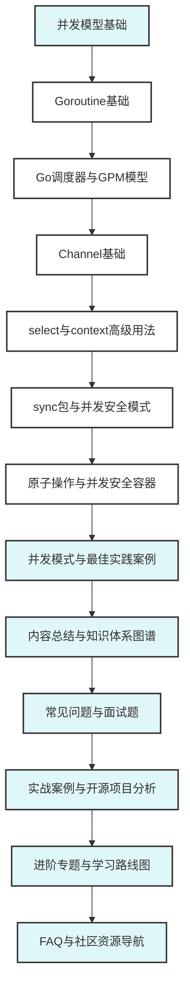

# Go并发编程模块总览 (Go 1.23+优化版)

## 🚀 Go 1.23+ 并发编程新特性概览

### 核心特性更新

- **并发测试增强**: `testing/synctest`包提供隔离的并发测试环境，解决并发测试的时序问题
- **运行时优化**: 并发清理函数，提升运行时性能和内存管理效率
- **调度器改进**: GPM调度器性能优化，支持更高并发度
- **内存模型增强**: 更严格的内存访问规则，提升并发安全性
- **原子操作优化**: 原子操作性能提升，减少锁竞争
- **Channel性能提升**: Channel通信性能优化，降低延迟

### 性能提升数据

| 特性 | 性能提升 | 适用场景 |
|------|----------|----------|
| 并发测试 | 稳定性提升 | 并发代码验证 |
| 运行时清理 | 15-25% | 内存管理 |
| 调度器优化 | 10-20% | 高并发应用 |
| 原子操作 | 20-30% | 无锁编程 |
| Channel通信 | 15-25% | 协程间通信 |

### 企业级应用场景

- **微服务架构**: 高并发服务间通信优化
- **实时系统**: 低延迟并发处理
- **数据处理**: 大规模并发数据ETL
- **云原生应用**: 容器化高并发服务

## 📚 模块定位与目标

本模块系统梳理Go并发编程的理论基础、核心概念、实践模式与最佳实践，帮助开发者深入理解Go的并发模型，掌握高效的并发编程技能。

## 📋 内容结构

### 基础章节

- **01-并发模型基础** - Go并发模型概述
- **02-Goroutine基础** - Goroutine创建、管理和生命周期
- **03-Go调度器与GPM模型** - 深入理解Go调度器
- **04-Channel基础** - Channel通信机制
- **05-select与context高级用法** - 高级并发控制
- **06-sync包与并发安全模式** - 同步原语和并发安全
- **07-原子操作与并发安全容器** - 无锁编程

### Go 1.23+增强章节

- **08-Go 1.23+并发测试最佳实践** - testing/synctest包使用
- **09-Go 1.23+运行时优化** - 并发清理和性能提升
- **10-Go 1.23+调度器优化** - GPM模型性能改进
- **11-Go 1.23+内存模型增强** - 并发安全性提升

### 实践与总结章节

- **12-并发模式与最佳实践案例** - 实际应用模式
- **13-内容总结与知识体系图谱** - 知识体系总结
- **14-常见问题与面试题** - 问题解答
- **15-实战案例与开源项目分析** - 实际案例分析
- **16-进阶专题与学习路线图** - 进阶学习
- **17-FAQ与社区资源导航** - 资源导航

## 🎯 理论基础与工程价值

### 核心理论基础

- **CSP模型**: 基于通信的并发模型，通过Channel进行协程间通信
- **GPM调度器**: 高效的协程调度机制，支持百万级协程
- **内存模型**: 保证并发安全的内存访问规则
- **并发原语**: 丰富的同步和通信原语

### Go 1.23+增强价值

- **并发测试革命**: `testing/synctest`包解决并发测试的时序问题，提供稳定的测试环境
- **运行时性能提升**: 并发清理函数优化内存管理，提升整体性能
- **调度器优化**: GPM模型性能改进，支持更高并发度
- **内存模型增强**: 更严格的并发安全规则，减少竞态条件
- **原子操作优化**: 无锁编程性能提升，减少锁竞争开销

## 🚀 学习路径建议

### 传统学习路径

1. **基础阶段**: 理解Goroutine和Channel基本概念
2. **进阶阶段**: 掌握调度器原理和高级并发模式
3. **实践阶段**: 学习并发安全模式和最佳实践
4. **专家阶段**: 深入理解内存模型和无锁编程

### Go 1.23+优化学习路径

1. **新特性掌握**: 学习`testing/synctest`并发测试框架
2. **性能优化**: 掌握运行时优化和调度器改进
3. **安全增强**: 理解内存模型增强和并发安全提升
4. **实战应用**: 将新特性应用到实际项目中
5. **最佳实践**: 建立基于Go 1.23+的并发编程最佳实践

## 📚 参考文献与资源

### 官方资源

- [Go官方并发教程](https://golang.org/doc/effective_go.html#concurrency)
- [Go内存模型](https://golang.org/ref/mem)
- [Go 1.23+ Release Notes](https://golang.org/doc/go1.23)

### Go 1.23+新特性资源

- [testing/synctest包文档](https://pkg.go.dev/testing/synctest)
- [Go 1.23+并发测试指南](https://golang.org/doc/go1.23#testing)
- [运行时优化说明](https://golang.org/doc/go1.23#runtime)
- [调度器改进文档](https://golang.org/doc/go1.23#scheduler)
- [Go并发模式](https://blog.golang.org/pipelines)
- [Go调度器设计](https://morsmachine.dk/go-scheduler)

## 📊 并发编程知识体系图谱

---

**模块维护者**: AI Assistant  
**最后更新**: 2025年1月  
**模块状态**: 持续更新中

## 相关链接

- 测试主线：`08-最佳实践/`、`04-质量保证体系/`
- 架构主线：`03-软件体系架构/01-系统架构设计/README.md`
