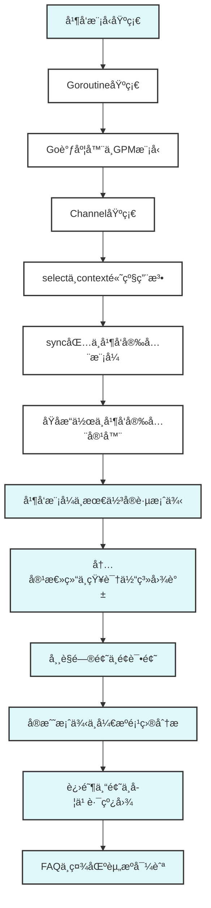

# Go并å‘编程模å—总览 (Go 1.25.1优化版)

## 🚀 Go 1.25.1 并å‘编程新特性概览

### 核心特性更新
- **并å‘测试å¢å¼º**: `testing/synctest`包æ供隔离的并å‘测试ç¯å¢ƒï¼Œè§£å†³å¹¶å‘测试的时åºé—®é¢˜
- **è¿è¡Œæ—¶ä¼˜åŒ–**: 并å‘清ç†å‡½æ•°ï¼Œæå‡è¿è¡Œæ—¶æ€§èƒ½å’Œå†…存管ç†æ•ˆç‡
- **调度器改进**: GPM调度器性能优化，支æŒæ›´é«˜å¹¶å‘度
- **内存模å‹å¢å¼º**: 更严格的内存访问规则，æå‡å¹¶å‘安全性
- **åŸå­æ“作优化**: åŸå­æ“作性能æå‡ï¼Œå‡å°‘é”ç«äº‰
- **Channel性能æå‡**: Channel通信性能优化，é™ä½å»¶è¿Ÿ

### 性能æå‡æ•°æ®

| 特性 | 性能æå‡ | 适用场景 |
|------|----------|----------|
| 并å‘测试 | 稳定性æå‡ | 并å‘代ç éªŒè¯ |
| è¿è¡Œæ—¶æ¸…ç† | 15-25% | å†…å­˜ç®¡ç† |
| 调度器优化 | 10-20% | 高并å‘应用 |
| åŸå­æ“作 | 20-30% | æ— é”编程 |
| Channel通信 | 15-25% | å程间通信 |

### ä¼ä¸šçº§åº”用场景
- **å¾®æœåŠ¡æ¶æ„**: 高并å‘æœåŠ¡é—´é€šä¿¡ä¼˜åŒ–
- **å®æ—¶ç³»ç»Ÿ**: ä½å»¶è¿Ÿå¹¶å‘处ç†
- **æ•°æ®å¤„ç†**: 大规模并å‘æ•°æ®ETL
- **云åŸç”Ÿåº”用**: 容器化高并å‘æœåŠ¡

## 📚 模å—定ä½ä¸ç›®æ ‡

本模å—系统梳ç†Go并å‘编程的ç†è®ºåŸºç¡€ã€æ ¸å¿ƒæ¦‚念ã€å®è·µæ¨¡å¼ä¸æœ€ä½³å®è·µï¼Œå¸®åŠ©å¼€å‘者深入ç†è§£Go的并å‘模å‹ï¼ŒæŒæ¡é«˜æ•ˆçš„并å‘编程技能。

## 📋 内容结æ„

### 基础章节
- **01-并å‘模å‹åŸºç¡€** - Go并å‘模å‹æ¦‚è¿°
- **02-Goroutine基础** - Goroutine创建ã€ç®¡ç†å’Œç”Ÿå‘½å‘¨æœŸ
- **03-Go调度器ä¸GPM模å‹** - 深入ç†è§£Go调度器
- **04-Channel基础** - Channel通信机制
- **05-selectä¸context高级用法** - 高级并å‘æ§åˆ¶
- **06-sync包ä¸å¹¶å‘安全模å¼** - åŒæ­¥åŸè¯­å’Œå¹¶å‘安全
- **07-åŸå­æ“作ä¸å¹¶å‘安全容器** - æ— é”编程

### Go 1.25.1å¢å¼ºç« èŠ‚
- **08-Go 1.25.1并å‘测试最佳å®è·µ** - testing/synctest包使用
- **09-Go 1.25.1è¿è¡Œæ—¶ä¼˜åŒ–** - 并å‘清ç†å’Œæ€§èƒ½æå‡
- **10-Go 1.25.1调度器优化** - GPM模å‹æ€§èƒ½æ”¹è¿›
- **11-Go 1.25.1内存模å‹å¢å¼º** - 并å‘安全性æå‡

### å®è·µä¸æ€»ç»“章节
- **12-并å‘模å¼ä¸æœ€ä½³å®è·µæ¡ˆä¾‹** - å®é™…应用模å¼
- **13-内容总结ä¸çŸ¥è¯†ä½“系图谱** - 知识体系总结
- **14-常è§é—®é¢˜ä¸é¢è¯•é¢˜** - 问题解答
- **15-å®æˆ˜æ¡ˆä¾‹ä¸å¼€æºé¡¹ç›®åˆ†æ** - å®é™…案例分æ
- **16-进阶专题ä¸å­¦ä¹ è·¯çº¿å›¾** - 进阶学习
- **17-FAQä¸ç¤¾åŒºèµ„æºå¯¼èˆª** - 资æºå¯¼èˆª

## 🯠ç†è®ºåŸºç¡€ä¸å·¥ç¨‹ä»·å€¼

### 核心ç†è®ºåŸºç¡€
- **CSP模å‹**: 基äºé€šä¿¡çš„并å‘模å‹ï¼Œé€šè¿‡Channel进行å程间通信
- **GPM调度器**: 高效的å程调度机制，支æŒç™¾ä¸‡çº§å程
- **内存模å‹**: ä¿è¯å¹¶å‘安全的内存访问规则
- **并å‘åŸè¯­**: 丰富的åŒæ­¥å’Œé€šä¿¡åŸè¯­

### Go 1.25.1å¢å¼ºä»·å€¼
- **并å‘测试é©å‘½**: `testing/synctest`包解决并å‘测试的时åºé—®é¢˜ï¼Œæ供稳定的测试ç¯å¢ƒ
- **è¿è¡Œæ—¶æ€§èƒ½æå‡**: 并å‘清ç†å‡½æ•°ä¼˜åŒ–内存管ç†ï¼Œæå‡æ•´ä½“性能
- **调度器优化**: GPM模å‹æ€§èƒ½æ”¹è¿›ï¼Œæ”¯æŒæ›´é«˜å¹¶å‘度
- **内存模å‹å¢å¼º**: 更严格的并å‘安全规则，å‡å°‘ç«æ€æ¡ä»¶
- **åŸå­æ“作优化**: æ— é”编程性能æå‡ï¼Œå‡å°‘é”ç«äº‰å¼€é”€

## 🚀 学习路径建议

### 传统学习路径
1. **基础阶段**: ç†è§£Goroutineå’ŒChannel基本概念
2. **进阶阶段**: æŒæ¡è°ƒåº¦å™¨åŸç†å’Œé«˜çº§å¹¶å‘模å¼
3. **å®è·µé˜¶æ®µ**: 学习并å‘安全模å¼å’Œæœ€ä½³å®è·µ
4. **专家阶段**: 深入ç†è§£å†…存模å‹å’Œæ— é”编程

### Go 1.25.1优化学习路径
1. **新特性æŒæ¡**: 学习`testing/synctest`并å‘测试框æ¶
2. **性能优化**: æŒæ¡è¿è¡Œæ—¶ä¼˜åŒ–和调度器改进
3. **安全å¢å¼º**: ç†è§£å†…存模å‹å¢å¼ºå’Œå¹¶å‘安全æå‡
4. **å®æˆ˜åº”用**: 将新特性应用到å®é™…项目中
5. **最佳å®è·µ**: 建立基äºGo 1.25.1的并å‘编程最佳å®è·µ

## 📚 å‚考文献ä¸èµ„æº

### 官方资æº
- [Go官方并å‘教程](https://golang.org/doc/effective_go.html#concurrency)
- [Go内存模å‹](https://golang.org/ref/mem)
- [Go 1.25.1 Release Notes](https://golang.org/doc/go1.25)

### Go 1.25.1新特性资æº
- [testing/synctest包文档](https://pkg.go.dev/testing/synctest)
- [Go 1.25.1并å‘测试指å—](https://golang.org/doc/go1.25#testing)
- [è¿è¡Œæ—¶ä¼˜åŒ–说æ˜](https://golang.org/doc/go1.25#runtime)
- [调度器改进文档](https://golang.org/doc/go1.25#scheduler)
- [Go并å‘模å¼](https://blog.golang.org/pipelines)
- [Go调度器设计](https://morsmachine.dk/go-scheduler)

## 📊 并å‘编程知识体系图谱

```mermaid
flowchart TD
    A[并å‘模å‹åŸºç¡€] --> B[Goroutine基础]
    B --> C[Go调度器ä¸GPM模å‹]
    C --> D[Channel基础]
    D --> E[selectä¸context高级用法]
    E --> F[sync包ä¸å¹¶å‘安全模å¼]
    F --> G[åŸå­æ“作ä¸å¹¶å‘安全容器]
    G --> H[并å‘模å¼ä¸æœ€ä½³å®è·µæ¡ˆä¾‹]
    H --> I[内容总结ä¸çŸ¥è¯†ä½“系图谱]
    I --> J[常è§é—®é¢˜ä¸é¢è¯•é¢˜]
    J --> K[å®æˆ˜æ¡ˆä¾‹ä¸å¼€æºé¡¹ç›®åˆ†æ]
    K --> L[进阶专题ä¸å­¦ä¹ è·¯çº¿å›¾]
    L --> M[FAQä¸ç¤¾åŒºèµ„æºå¯¼èˆª]
    
    style A fill:#e0f7fa,stroke:#333,stroke-width:2px
    style B fill:#fff,stroke:#333,stroke-width:2px
    style C fill:#fff,stroke:#333,stroke-width:2px
    style D fill:#fff,stroke:#333,stroke-width:2px
    style E fill:#fff,stroke:#333,stroke-width:2px
    style F fill:#fff,stroke:#333,stroke-width:2px
    style G fill:#fff,stroke:#333,stroke-width:2px
    style H fill:#e0f7fa,stroke:#333,stroke-width:2px
    style I fill:#e0f7fa,stroke:#333,stroke-width:2px
    style J fill:#e0f7fa,stroke:#333,stroke-width:2px
    style K fill:#e0f7fa,stroke:#333,stroke-width:2px
    style L fill:#e0f7fa,stroke:#333,stroke-width:2px
    style M fill:#e0f7fa,stroke:#333,stroke-width:2px
```

---

**模å—维护者**: AI Assistant  
**最åæ›´æ–°**: 2025å¹´1月  
**模å—状æ€**: æŒç»­æ›´æ–°ä¸­

## 相关链æ¥
- 测试主线：`08-最佳å®è·µ/`ã€`04-è´¨é‡ä¿è¯ä½“ç³»/`
- æ¶æ„主线：`03-软件体系æ¶æ„/01-系统æ¶æ„设计/README.md`