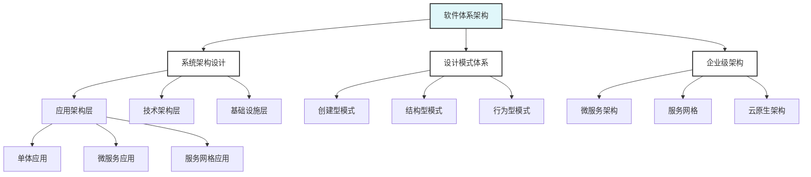

# Go语言软件体系架构

> 摘要：通过系统架构设计、设计模式体系和企业级架构，构建高质量、可扩展的软件系统。

## 📚 模块概述

本模块专注于Go语言软件体系架构的全面构建，涵盖系统架构设计、设计模式体系和企业级架构三个核心领域，旨在帮助开发者构建高质量、可扩展、可维护的软件系统。

## 🎯 学习目标

- 掌握系统架构设计原理
- 建立完整的设计模式体系
- 构建企业级架构能力
- 提升系统设计和架构决策能力

## 📋 学习内容

### 01-系统架构设计
- [系统架构设计](./01-系统架构设计/README.md) - 应用架构、技术架构、基础设施架构

### 02-设计模式体系
- [设计模式体系](./02-设计模式体系/README.md) - 创建型、结构型、行为型模式

### 03-企业级架构
- [企业级架构](./03-企业级架构/README.md) - 微服务、服务网格、云原生架构

## 🚀 快速开始

### 系统架构设计
```go
// 分层架构示例
type UserController struct {
    userService UserService
    logger      Logger
}

type UserService struct {
    userRepo UserRepository
    eventBus EventBus
}

type UserRepository interface {
    Save(ctx context.Context, user *User) error
    FindByID(ctx context.Context, id string) (*User, error)
}

// 依赖注入
func NewUserController(userService UserService, logger Logger) *UserController {
    return &UserController{
        userService: userService,
        logger:      logger,
    }
}
```

### 设计模式体系
```go
// 工厂模式
type UserFactory struct{}

func (f *UserFactory) CreateUser(userType string) User {
    switch userType {
    case "admin":
        return &AdminUser{}
    case "regular":
        return &RegularUser{}
    default:
        return &RegularUser{}
    }
}

// 观察者模式
type EventBus struct {
    subscribers map[string][]EventHandler
    mu          sync.RWMutex
}

func (eb *EventBus) Subscribe(eventType string, handler EventHandler) {
    eb.mu.Lock()
    defer eb.mu.Unlock()
    eb.subscribers[eventType] = append(eb.subscribers[eventType], handler)
}

func (eb *EventBus) Publish(event Event) {
    eb.mu.RLock()
    defer eb.mu.RUnlock()
    
    handlers := eb.subscribers[event.Type()]
    for _, handler := range handlers {
        go handler.Handle(event)
    }
}
```

### 企业级架构
```go
// 微服务架构示例
type UserService struct {
    config     *Config
    db         *gorm.DB
    cache      Cache
    eventBus   EventBus
    logger     Logger
    metrics    Metrics
}

func NewUserService(config *Config) *UserService {
    return &UserService{
        config:   config,
        db:       initDB(config.Database),
        cache:    initCache(config.Cache),
        eventBus: initEventBus(config.EventBus),
        logger:   initLogger(config.Logging),
        metrics:  initMetrics(config.Metrics),
    }
}

// 服务启动
func (s *UserService) Start() error {
    // 启动HTTP服务器
    go s.startHTTPServer()
    
    // 启动事件监听
    go s.startEventListening()
    
    // 启动健康检查
    go s.startHealthCheck()
    
    return nil
}
```

## 📊 学习进度

| 主题 | 状态 | 完成度 | 预计时间 |
|------|------|--------|----------|
| 系统架构设计 | 🔄 进行中 | 80% | 2-3周 |
| 设计模式体系 | ⏳ 待开始 | 0% | 3-4周 |
| 企业级架构 | ⏳ 待开始 | 0% | 4-5周 |

## 🎯 实践项目

### 项目1: 系统架构重构
- 分析现有系统架构
- 设计新的架构方案
- 实施架构重构

### 项目2: 设计模式应用
- 识别设计模式应用场景
- 实现设计模式
- 验证设计效果

### 项目3: 企业级系统构建
- 构建微服务系统
- 实现服务治理
- 建立监控体系

## 📚 参考资料

### 官方文档
- [Go语言规范](https://golang.org/ref/spec)
- [Go语言并发模式](https://golang.org/doc/effective_go.html#concurrency)

### 书籍推荐
- 《软件架构实践》
- 《设计模式：可复用面向对象软件的基础》
- 《微服务架构设计模式》

### 在线资源
- [Go语言设计模式](https://github.com/tmrts/go-patterns)
- [微服务架构指南](https://microservices.io/)

## 🔧 工具推荐

### 架构设计工具
- **PlantUML**: 架构图绘制
- **Mermaid**: 流程图绘制
- **Lucidchart**: 在线图表工具

### 开发工具
- **GoLand**: IDE开发环境
- **VS Code**: 轻量级编辑器
- **Docker**: 容器化部署

### 监控工具
- **Prometheus**: 指标收集
- **Grafana**: 可视化监控
- **Jaeger**: 分布式追踪

## 🎯 学习建议

### 系统思维
- 从整体角度思考问题
- 注重系统间的交互
- 考虑系统的可扩展性

### 模式应用
- 理解设计模式的本质
- 选择合适的模式
- 避免过度设计

### 架构演进
- 支持架构的持续演进
- 建立架构治理机制
- 关注技术发展趋势

## 📝 重要概念

### 系统架构
- **分层架构**: 职责分离，层次清晰
- **微服务架构**: 服务拆分，独立部署
- **事件驱动**: 异步处理，解耦设计

### 设计模式
- **创建型模式**: 对象创建
- **结构型模式**: 对象组合
- **行为型模式**: 对象交互

### 企业级架构
- **服务治理**: 服务发现、配置管理
- **监控体系**: 指标监控、日志追踪
- **安全架构**: 认证授权、数据保护

## 🔍 质量保证

### 架构质量
- 架构审查
- 设计模式验证
- 性能评估

### 代码质量
- 代码审查
- 静态分析
- 自动化测试

### 系统质量
- 性能测试
- 安全测试
- 可用性测试

## 📊 软件体系架构图谱



## ❓ 常见FAQ

### 系统架构
- Q: 如何选择合适的系统架构？
  A: 根据业务需求、团队规模和技术特点，选择适合的架构模式。

### 设计模式
- Q: 如何避免过度设计？
  A: 从实际需求出发，选择必要的设计模式，避免为了模式而模式。

### 企业级架构
- Q: 如何构建企业级架构？
  A: 建立服务治理体系，实现监控和运维自动化，确保系统的高可用性。

---

**模块维护者**: AI Assistant  
**最后更新**: 2025年1月15日  
**模块状态**: 持续更新中
