# Go语言质量保证体系

> 摘要：通过完整测试体系、代码质量控制和持续集成，构建高质量、可靠的Go语言应用。

## 📚 模块概述

本模块专注于Go语言质量保证体系的全面构建，涵盖完整测试体系、代码质量控制和持续集成三个核心领域，旨在帮助开发者构建高质量、可靠、可维护的Go语言应用。

## 🎯 学习目标

- 建立完整的测试体系
- 实现代码质量控制
- 构建持续集成流程
- 提升软件质量和可靠性

## 📋 学习内容

### 01-完整测试体系

- [完整测试体系](./01-完整测试体系/README.md) - 测试金字塔、工具链、覆盖率分析

## 🚀 快速开始

### 完整测试体系

```go
// 单元测试示例
func TestUserService_CreateUser(t *testing.T) {
    tests := []struct {
        name    string
        input   CreateUserRequest
        want    *User
        wantErr bool
    }{
        {
            name: "valid user",
            input: CreateUserRequest{
                Name:  "John Doe",
                Email: "john@example.com",
            },
            want: &User{
                Name:  "John Doe",
                Email: "john@example.com",
            },
            wantErr: false,
        },
        {
            name: "invalid email",
            input: CreateUserRequest{
                Name:  "John Doe",
                Email: "invalid-email",
            },
            want:    nil,
            wantErr: true,
        },
    }

    for _, tt := range tests {
        t.Run(tt.name, func(t *testing.T) {
            service := NewUserService()
            got, err := service.CreateUser(tt.input)
            
            if (err != nil) != tt.wantErr {
                t.Errorf("CreateUser() error = %v, wantErr %v", err, tt.wantErr)
                return
            }
            
            if !reflect.DeepEqual(got, tt.want) {
                t.Errorf("CreateUser() = %v, want %v", got, tt.want)
            }
        })
    }
}

// 集成测试示例
func TestUserAPI_Integration(t *testing.T) {
    // 启动测试服务器
    server := httptest.NewServer(setupRoutes())
    defer server.Close()
    
    // 测试用户创建
    resp, err := http.Post(server.URL+"/users", "application/json", 
        strings.NewReader(`{"name":"John","email":"john@example.com"}`))
    require.NoError(t, err)
    require.Equal(t, http.StatusCreated, resp.StatusCode)
    
    // 测试用户查询
    resp, err = http.Get(server.URL + "/users/1")
    require.NoError(t, err)
    require.Equal(t, http.StatusOK, resp.StatusCode)
}

// 基准测试示例
func BenchmarkUserService_CreateUser(b *testing.B) {
    service := NewUserService()
    req := CreateUserRequest{
        Name:  "John Doe",
        Email: "john@example.com",
    }
    
    b.ResetTimer()
    for i := 0; i < b.N; i++ {
        _, err := service.CreateUser(req)
        if err != nil {
            b.Fatal(err)
        }
    }
}
```

### 代码质量控制

```go
// 代码质量检查配置
// .golangci.yml
linters-settings:
  govet:
    check-shadowing: true
  gocyclo:
    min-complexity: 15
  maligned:
    suggest-new: true
  dupl:
    threshold: 100
  goconst:
    min-len: 2
    min-occurrences: 2
  misspell:
    locale: US
  lll:
    line-length: 140
  unused:
    check-exported: false
  unparam:
    check-exported: false

linters:
  enable:
    - bodyclose
    - deadcode
    - depguard
    - dogsled
    - dupl
    - errcheck
    - exportloopref
    - exhaustive
    - funlen
    - gochecknoinits
    - goconst
    - gocritic
    - gocyclo
    - gofmt
    - goimports
    - golint
    - gomnd
    - goprintffuncname
    - gosec
    - gosimple
    - govet
    - ineffassign
    - interfacer
    - lll
    - misspell
    - nakedret
    - noctx
    - nolintlint
    - rowserrcheck
    - staticcheck
    - structcheck
    - stylecheck
    - typecheck
    - unconvert
    - unparam
    - unused
    - varcheck
    - whitespace

issues:
  exclude-rules:
    - path: _test\.go
      linters:
        - gomnd
        - funlen
```

### 持续集成流程

```yaml
# .github/workflows/ci.yml
name: CI

on:
  push:
    branches: [ main, develop ]
  pull_request:
    branches: [ main ]

jobs:
  test:
    runs-on: ubuntu-latest
    
    steps:
    - uses: actions/checkout@v3
    
    - name: Set up Go
      uses: actions/setup-go@v3
      with:
        go-version: 1.21
    
    - name: Install dependencies
      run: go mod download
    
    - name: Run tests
      run: go test -v -race -coverprofile=coverage.out ./...
    
    - name: Run linting
      uses: golangci/golangci-lint-action@v3
      with:
        version: latest
    
    - name: Upload coverage
      uses: codecov/codecov-action@v3
      with:
        file: ./coverage.out
```

## 📊 学习进度

| 主题 | 状态 | 完成度 | 预计时间 |
|------|------|--------|----------|
| 完整测试体系 | 🔄 进行中 | 90% | 1-2周 |

## 🎯 实践项目

### 项目1: 测试框架构建

- 建立单元测试框架
- 实现集成测试环境
- 构建性能测试工具

### 项目2: 质量检查工具链

- 集成静态分析工具
- 建立代码审查流程
- 实现质量门禁

### 项目3: CI/CD流水线

- 构建持续集成流程
- 实现自动化测试
- 建立部署流水线

## 📚 参考资料

### 官方文档

- [Go语言测试](https://golang.org/doc/tutorial/add-a-test)
- [Go语言基准测试](https://golang.org/doc/effective_go.html#testing)

### 书籍推荐

- 《Go语言测试》
- 《持续集成》
- 《软件测试的艺术》

### 在线资源

- [Go语言测试最佳实践](https://golang.org/doc/effective_go.html#testing)
- [golangci-lint](https://golangci-lint.run/)

## 🔧 工具推荐

### 测试工具

- **go test**: 官方测试框架
- **testify**: 测试断言库
- **gomock**: Mock生成工具

### 质量检查工具

- **golangci-lint**: 静态代码分析
- **go vet**: 官方代码检查
- **SonarQube**: 代码质量平台

### CI/CD工具

- **GitHub Actions**: CI/CD平台
- **GitLab CI**: CI/CD平台
- **Jenkins**: 持续集成工具

## 🎯 学习建议

### 测试驱动开发

- 先写测试，后写代码
- 保持测试的独立性
- 注重测试的可维护性

### 质量优先

- 建立质量标准
- 持续质量改进
- 关注质量指标

### 自动化优先

- 自动化测试
- 自动化检查
- 自动化部署

## 📝 重要概念

### 测试体系

- **单元测试**: 测试最小单元
- **集成测试**: 测试组件交互
- **端到端测试**: 测试完整流程

### 质量控制

- **静态分析**: 代码质量检查
- **代码审查**: 人工质量检查
- **质量门禁**: 自动化质量检查

### 持续集成

- **自动化构建**: 自动编译和打包
- **自动化测试**: 自动运行测试
- **自动化部署**: 自动部署应用

## 🔍 质量保证

### 测试质量

- 测试覆盖率
- 测试用例质量
- 测试执行效率

### 代码质量

- 代码规范
- 代码复杂度
- 代码可维护性

### 流程质量

- 流程标准化
- 流程自动化
- 流程监控

## 📊 质量保证体系图谱

```mermaid
flowchart TD
  A[质量保证体系] --> B[完整测试体系]
  A --> C[代码质量控制]
  A --> D[持续集成]
  
  B --> E[单元测试]
  B --> F[集成测试]
  B --> G[端到端测试]
  
  C --> H[静态分析]
  C --> I[代码审查]
  C --> J[质量门禁]
  
  D --> K[自动化构建]
  D --> L[自动化测试]
  D --> M[自动化部署]
  
  E --> N[测试覆盖率]
  F --> O[组件交互]
  G --> P[完整流程]
  
  style A fill:#e0f7fa,stroke:#333,stroke-width:2px
  style B fill:#fff,stroke:#333,stroke-width:2px
  style C fill:#fff,stroke:#333,stroke-width:2px
  style D fill:#fff,stroke:#333,stroke-width:2px
```



## ❓ 常见FAQ

### 测试体系

- Q: 如何建立完整的测试体系？
  A: 从单元测试开始，逐步建立集成测试和端到端测试，确保测试覆盖率。

### 质量控制

- Q: 如何实现代码质量控制？
  A: 使用静态分析工具，建立代码审查流程，设置质量门禁。

### 持续集成

- Q: 如何构建持续集成流程？
  A: 选择合适的CI/CD工具，建立自动化测试和部署流程。

---

**模块维护者**: AI Assistant  
**最后更新**: 2025年1月15日  
**模块状态**: 持续更新中
