# Go设计模式内容总结与知识体系图谱

<!-- TOC START -->
- [4.1 Go设计模式内容总结与知识体系图谱](#41-go设计模式内容总结与知识体系图谱)
  - [4.1.1 1. 内容总结](#411-1-内容总结)
  - [4.1.2 2. 知识体系图谱](#412-2-知识体系图谱)
  - [4.1.3 3. 学习建议与进阶路线](#413-3-学习建议与进阶路线)
  - [4.1.4 4. 参考文献与资源](#414-4-参考文献与资源)
  - [4.1.5 5. 六大类模式内容闭环](#415-5-六大类模式内容闭环)
  - [4.1.6 6. Go特色与工程价值](#416-6-go特色与工程价值)
  - [4.1.7 7. 进阶建议](#417-7-进阶建议)
  - [4.1.8 8. 未来趋势](#418-8-未来趋势)
<!-- TOC END -->

## 1. 内容总结

本模块系统梳理了Go设计模式六大类：

- 创建型（单例、工厂、抽象工厂、建造者、原型）
- 结构型（适配器、桥接、组合、装饰器、外观、享元、代理）
- 行为型（策略、观察者、责任链、命令、状态、模板方法、访问者、备忘录、解释器、中介者）
- 并发型（Future、Worker Pool、生产者-消费者、Actor、CSP）
- 分布式型（服务注册发现、熔断器、分布式锁、幂等、Saga等）
- 工作流型（Petri网、事件驱动、补偿事务等）

每类模式均配有理论基础、Go idiomatic实现、工程分析、最佳实践与常见陷阱，兼顾理论深度与工程实用。

## 2. 知识体系图谱

```mermaid
graph TD
    A["Go设计模式体系"]
    A --> B1["创建型"]
    B1 --> C1["单例"]
    B1 --> C2["工厂"]
    B1 --> C3["抽象工厂"]
    B1 --> C4["建造者"]
    B1 --> C5["原型"]
    A --> B2["结构型"]
    B2 --> D1["适配器"]
    B2 --> D2["桥接"]
    B2 --> D3["组合"]
    B2 --> D4["装饰器"]
    B2 --> D5["外观"]
    B2 --> D6["享元"]
    B2 --> D7["代理"]
    A --> B3["行为型"]
    B3 --> E1["策略"]
    B3 --> E2["观察者"]
    B3 --> E3["责任链"]
    B3 --> E4["命令"]
    B3 --> E5["状态"]
    B3 --> E6["模板方法"]
    B3 --> E7["访问者"]
    B3 --> E8["备忘录"]
    B3 --> E9["解释器"]
    B3 --> E10["中介者"]
    A --> B4["并发型"]
    B4 --> F1["Future"]
    B4 --> F2["Worker Pool"]
    B4 --> F3["生产者-消费者"]
    B4 --> F4["Actor"]
    B4 --> F5["CSP"]
    A --> B5["分布式型"]
    B5 --> G1["服务注册发现"]
    B5 --> G2["熔断器"]
    B5 --> G3["分布式锁"]
    B5 --> G4["幂等"]
    B5 --> G5["Saga"]
    A --> B6["工作流型"]
    B6 --> H1["Petri网"]
    B6 --> H2["事件驱动"]
    B6 --> H3["补偿事务"]

```

## 3. 学习建议与进阶路线

- 建议先掌握Go基础与接口、组合、并发原语
- 按分类逐步学习各类模式，结合实际项目实践
- 关注Go社区与开源项目中的模式应用
- 进阶可学习分布式、并发、云原生等高级模式

## 4. 参考文献与资源

- Go官方文档：<https://golang.org/doc/>
- GoF《设计模式》、Head First Design Patterns
- Go设计模式实战：<https://github.com/senghoo/golang-design-pattern>
- Go开源项目导航：<https://github.com/avelino/awesome-go>

## 5. 六大类模式内容闭环

- 创建型、结构型、行为型、并发型、分布式型、工作流型均配备：
  - 理论基础与形式化定义
  - Go idiomatic实现与工程分析
  - 典型代码、测试、性能分析
  - 适用场景、常见陷阱、最佳实践
  - 开源项目案例与业务场景结合

## 6. Go特色与工程价值

- 强调组合优于继承、接口驱动、并发原语、云原生友好
- 关注性能、可维护性、扩展性与工程落地
- 结合Go社区主流项目与实际工程问题

## 7. 进阶建议

- 深入理解Go接口、组合、并发、泛型等新特性
- 多做模式对比与适用性分析，避免"为模式而模式"
- 结合实际业务与开源项目持续实践

## 8. 未来趋势

- 云原生、微服务、服务网格、事件驱动架构下的新型模式
- 自动化、可观测性、韧性设计等工程化新需求

---

详见各模式子模块与知识体系图谱。

---

**文档维护者**: Go Documentation Team  
**最后更新**: 2025年10月20日  
**文档状态**: 完成  
**适用版本**: Go 1.21+
