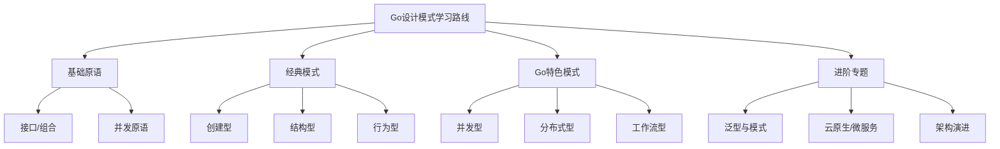

# Go设计模式进阶专题与学习路线图

<!-- TOC START -->
- [4.1 Go设计模式进阶专题与学习路线图](#41-go设计模式进阶专题与学习路线图)
  - [4.1.1 1. 进阶专题](#411-1-进阶专题)
    - [4.1.1.1 泛型与设计模式](#4111-泛型与设计模式)
    - [4.1.1.2 并发/分布式/云原生模式进阶](#4112-并发分布式云原生模式进阶)
    - [4.1.1.3 设计模式与架构演进](#4113-设计模式与架构演进)
  - [4.1.2 2. 学习路线图](#412-2-学习路线图)
  - [4.1.3 3. 资源推荐](#413-3-资源推荐)
<!-- TOC END -->

## 1. 进阶专题

### 泛型与设计模式

- Go 1.18+引入泛型，极大丰富了工厂、策略、缓存、池化等模式的类型安全与复用能力。
- 典型应用：泛型工厂、泛型缓存、泛型装饰器、泛型策略。
- 工程建议：合理使用泛型提升可读性与复用性，避免过度复杂化。

### 并发/分布式/云原生模式进阶

- 并发模式：Actor、CSP、无锁队列、并发安全容器等。
- 分布式模式：CAP理论、Paxos/Raft一致性、分布式事务、服务网格（Istio）等。
- 云原生模式：服务网格、Sidecar、Operator、微服务弹性与可观测性。
- 工程建议：结合Go并发原语、context、开源中间件，关注可观测性与容错。

### 设计模式与架构演进

- 从单体到微服务、Serverless，设计模式在架构演进中的角色。
- 关注领域驱动设计（DDD）、事件风暴、CQRS、Saga等现代架构模式。

---

## 2. 学习路线图

---

## 3. 资源推荐

- Go官方文档：<https://golang.org/doc/>
- Go设计模式实战：<https://github.com/senghoo/golang-design-pattern>
- Go夜读设计模式专栏：<https://github.com/developer-learning/night-reading-go>
- Go泛型最佳实践：<https://github.com/tkrajina/generic>
- Go开源项目导航：<https://github.com/avelino/awesome-go>
- Go社区与架构专栏：<https://studygolang.com/、https://gocn.vip/>

---

**文档维护者**: Go Documentation Team  
**最后更新**: 2025年10月20日  
**文档状态**: 完成  
**适用版本**: Go 1.21+
