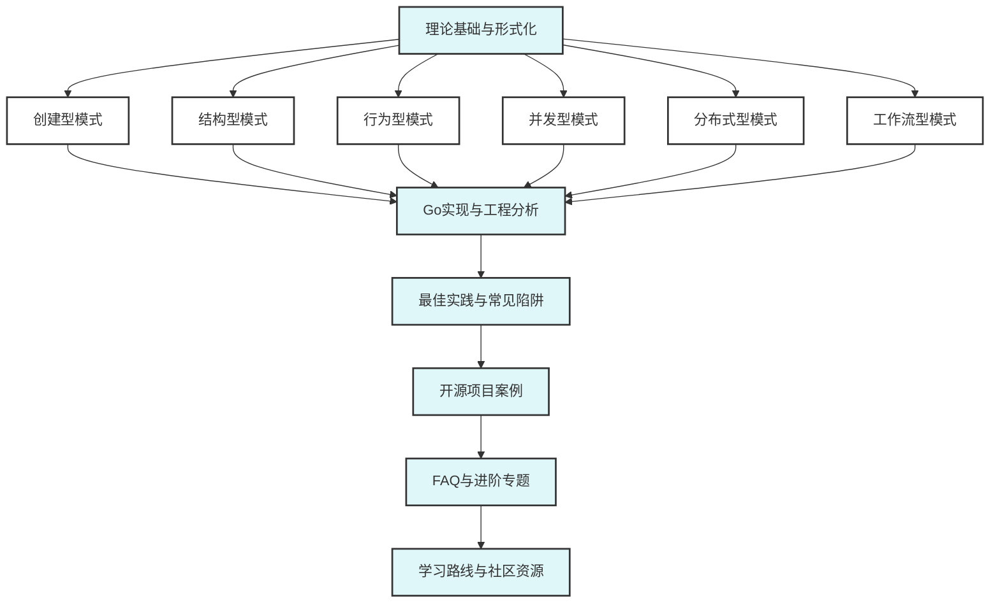

# Go设计模式模块总览

## 📚 理论基础与分类体系

设计模式是软件工程中可复用的设计经验总结，兼具理论严谨性与工程实用性。形式化定义：

$$
\mathcal{P} = (\mathcal{C}, \mathcal{S}, \mathcal{B}, \mathcal{CP}, \mathcal{DP}, \mathcal{WP})
$$

- $\mathcal{C}$: 创建型模式（Creational Patterns）
- $\mathcal{S}$: 结构型模式（Structural Patterns）
- $\mathcal{B}$: 行为型模式（Behavioral Patterns）
- $\mathcal{CP}$: 并发模式（Concurrency Patterns）
- $\mathcal{DP}$: 分布式模式（Distributed Patterns）
- $\mathcal{WP}$: 工作流模式（Workflow Patterns）

## 🎯 Go设计模式工程价值

- 促进代码复用、解耦与可维护性
- 结合Go语言特性（接口、组合、并发原语、泛型等）实现高效、简洁、类型安全的模式落地
- 支持现代工程需求：微服务、云原生、分布式、并发

## 📋 分类与内容结构

- **创建型模式**：单例、工厂、抽象工厂、建造者、原型
- **结构型模式**：适配器、桥接、组合、装饰器、外观、享元、代理
- **行为型模式**：策略、观察者、责任链、命令、状态、模板方法、访问者、备忘录、解释器、中介者
- **并发模式**：Future、Worker Pool、生产者-消费者、Actor、CSP等
- **分布式模式**：服务注册发现、熔断器、分布式锁、幂等、Saga等
- **工作流模式**：Petri网、事件驱动、补偿事务等

## 🚀 Go实战特色

- 每种模式均配有：
  - 形式化定义与工程动机
  - Go idiomatic实现（接口、组合、并发）
  - 典型代码、测试、性能分析
  - 适用场景、常见陷阱与最佳实践
  - 与主流开源项目/业务场景结合

## 🎯 学习路径建议

- 建议先掌握Go基础与接口、组合、并发原语
- 按分类逐步学习各类模式，结合实际项目实践
- 关注Go社区与开源项目中的模式应用
- 进阶可学习分布式、并发、云原生等高级模式

## 📚 参考文献与资源

- Go官方文档：<https://golang.org/doc/>
- GoF《设计模式》、Head First Design Patterns
- Go设计模式实战：<https://github.com/senghoo/golang-design-pattern>
- Go开源项目导航：<https://github.com/avelino/awesome-go>

## 📊 设计模式知识体系图谱

---

**文档维护者**: Go Documentation Team  
**最后更新**: 2025年10月20日  
**文档状态**: 完成  
**适用版本**: Go 1.21+
