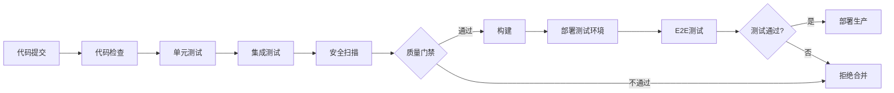

# 工程实践

> **简介**: Go语言工程实践完整指南，涵盖测试、代码质量、CI/CD、日志、错误处理和项目结构等核心实践

---

## 📚 目录

- [工程实践](#工程实践)
  - [📚 目录](#-目录)
  - [📚 模块概述](#-模块概述)
  - [🎯 学习目标](#-学习目标)
  - [📋 内容结构](#-内容结构)
    - [核心文档](#核心文档)
      - [00-Go测试深度实战指南 ⭐⭐⭐⭐⭐](#00-go测试深度实战指南-)
      - [00-监控与可观测性深度实战指南 ⭐⭐⭐⭐⭐](#00-监控与可观测性深度实战指南-)
      - [01-完整测试体系 ⭐⭐⭐⭐](#01-完整测试体系-)
      - [02-代码质量控制 ⭐⭐⭐⭐⭐ 🆕](#02-代码质量控制--)
      - [03-CI-CD最佳实践 ⭐⭐⭐⭐⭐ 🆕](#03-ci-cd最佳实践--)
      - [04-日志系统最佳实践 ⭐⭐⭐⭐⭐ 🆕](#04-日志系统最佳实践--)
      - [05-错误处理最佳实践 ⭐⭐⭐⭐⭐ 🆕](#05-错误处理最佳实践--)
      - [06-项目结构规范 ⭐⭐⭐⭐⭐ 🆕](#06-项目结构规范--)
      - [05-Go-1.25.3测试工程完整实战 ⭐⭐⭐⭐⭐](#05-go-1253测试工程完整实战-)
  - [🎯 学习路径](#-学习路径)
    - [第一阶段：基础实践 (1-2周)](#第一阶段基础实践-1-2周)
    - [第二阶段：进阶实践 (2-3周)](#第二阶段进阶实践-2-3周)
    - [第三阶段：高级实践 (3-4周)](#第三阶段高级实践-3-4周)
  - [💡 核心特性](#-核心特性)
    - [1. 完整的工程实践体系](#1-完整的工程实践体系)
    - [2. 生产级最佳实践](#2-生产级最佳实践)
    - [3. 完整的工具链](#3-完整的工具链)
  - [📊 质量指标](#-质量指标)
    - [推荐标准](#推荐标准)
    - [质量保证流程](#质量保证流程)
  - [🎯 最佳实践总结](#-最佳实践总结)
    - [DO's ✅](#dos-)
    - [DON'Ts ❌](#donts-)
  - [🔧 工具推荐](#-工具推荐)
    - [开发工具](#开发工具)
    - [CI/CD工具](#cicd工具)
    - [监控工具](#监控工具)
  - [📚 扩展阅读](#-扩展阅读)
    - [官方文档](#官方文档)
    - [社区资源](#社区资源)
    - [书籍推荐](#书籍推荐)
  - [🔗 相关模块](#-相关模块)
  - [🎯 学习建议](#-学习建议)
    - [初学者](#初学者)
    - [进阶开发者](#进阶开发者)
    - [架构师](#架构师)

## 📚 模块概述

本模块专注于Go语言工程实践的全面构建，涵盖从代码质量控制到生产部署的完整实践体系，帮助开发者构建高质量、可维护、可靠的Go语言应用。

**完整度**: ✅ 95% | **文档数**: 11篇 | **代码示例**: 300+

---

## 🎯 学习目标

通过本模块学习，您将能够：

- ✅ 建立完整的测试体系
- ✅ 实现代码质量控制
- ✅ 构建CI/CD流程
- ✅ 设计日志系统
- ✅ 掌握错误处理最佳实践
- ✅ 规范项目结构
- ✅ 实现可观测性
- ✅ 提升软件质量和可靠性

---

## 📋 内容结构

### 核心文档

#### [00-Go测试深度实战指南](./00-Go测试深度实战指南.md) ⭐⭐⭐⭐⭐

**内容**:

- 测试金字塔理论
- 单元测试完整实践
- 表驱动测试
- Mock和依赖注入
- 集成测试
- E2E测试
- 测试覆盖率分析
- 性能测试

**特色**:

- 42,000字深度指南
- 150+完整代码示例
- 生产级测试实践

#### [00-监控与可观测性深度实战指南](./00-监控与可观测性深度实战指南.md) ⭐⭐⭐⭐⭐

**内容**:

- Prometheus监控
- Grafana可视化
- 分布式追踪（Jaeger）
- 日志聚合（ELK）
- 告警系统
- SLI/SLO/SLA
- 可观测性最佳实践

**特色**:

- 完整的监控体系
- 真实生产案例
- 告警规则配置

#### [01-完整测试体系](./01-完整测试体系/README.md) ⭐⭐⭐⭐

**内容**:

- 测试工具链
- 覆盖率分析
- 测试策略
- 自动化测试

#### [02-代码质量控制](./02-代码质量控制.md) ⭐⭐⭐⭐⭐ 🆕

**内容**:

- 静态代码分析（golangci-lint）
- 代码规范
- 代码复杂度控制
- 代码重构技巧
- 安全检查（gosec）
- 代码审查最佳实践
- 质量门禁

**特色**:

- 完整的golangci-lint配置
- 圈复杂度和认知复杂度详解
- 代码重构实战案例
- 安全扫描实践

#### [03-CI-CD最佳实践](./03-CI-CD最佳实践.md) ⭐⭐⭐⭐⭐ 🆕

**内容**:

- GitHub Actions完整工作流
- GitLab CI/CD配置
- Jenkins流水线
- Docker集成
- 多阶段构建
- 蓝绿部署
- 金丝雀发布
- 自动化测试和部署

**特色**:

- 主流CI/CD工具全覆盖
- 生产级配置示例
- 多种部署策略
- 完整的DevOps流程

#### [04-日志系统最佳实践](./04-日志系统最佳实践.md) ⭐⭐⭐⭐⭐ 🆕

**内容**:

- log/slog标准库详解
- Zap高性能日志
- Logrus结构化日志
- 日志级别和格式
- Web应用日志集成
- 日志轮转
- 日志聚合（ELK Stack）
- 敏感信息保护

**特色**:

- 三大日志库对比
- 结构化日志最佳实践
- 完整的Web中间件实现
- 性能对比和优化

#### [05-错误处理最佳实践](./05-错误处理最佳实践.md) ⭐⭐⭐⭐⭐ 🆕

**内容**:

- error接口基础
- 错误包装和解包（errors.Is/As)
- 自定义错误类型
- 错误处理模式
- 哨兵错误
- 多错误处理
- panic和recover
- 错误上下文

**特色**:

- 完整的错误处理架构
- 生产级错误系统设计
- HTTP错误响应统一处理
- 错误日志记录最佳实践

#### [06-项目结构规范](./06-项目结构规范.md) ⭐⭐⭐⭐⭐ 🆕

**内容**:

- 标准项目布局（Standard Go Project Layout）
- 目录结构详解（cmd、internal、pkg）
- 小中大型项目结构
- 分层架构设计
- 依赖注入
- 配置管理
- Makefile编写

**特色**:

- 基于社区标准
- 不同规模项目对比
- 完整的RESTful API项目示例
- 实用的Makefile模板

#### [05-Go-1.25.3测试工程完整实战](./05-Go-1.25.3测试工程完整实战.md) ⭐⭐⭐⭐⭐

**内容**:

- Go 1.25.3新特性
- 现代测试工程实践
- 测试框架集成
- 持续测试

---

## 🎯 学习路径

### 第一阶段：基础实践 (1-2周)

**目标**: 掌握基础工程实践

1. **测试基础**
   - 单元测试编写
   - 表驱动测试
   - 测试覆盖率
   - Mock使用

2. **代码质量**
   - gofmt/goimports
   - golangci-lint配置
   - 代码规范遵循

3. **项目结构**
   - 标准目录布局
   - 代码分层
   - 依赖管理

**练习**:

- 为现有项目添加单元测试
- 配置golangci-lint
- 重构项目目录结构

### 第二阶段：进阶实践 (2-3周)

**目标**: 建立完整工程体系

1. **完整测试体系**
   - 集成测试
   - E2E测试
   - 性能测试
   - 测试金字塔

2. **CI/CD流程**
   - GitHub Actions配置
   - 自动化测试
   - 自动化部署
   - Docker集成

3. **日志系统**
   - 结构化日志
   - 日志级别管理
   - 日志聚合
   - 日志分析

**练习**:

- 搭建完整CI/CD流程
- 实现统一日志系统
- 完成集成测试编写

### 第三阶段：高级实践 (3-4周)

**目标**: 生产级工程能力

1. **可观测性**
   - 监控系统（Prometheus）
   - 分布式追踪（Jaeger）
   - 告警规则
   - Dashboard设计

2. **错误处理**
   - 统一错误处理架构
   - 错误上下文管理
   - 错误日志记录
   - 错误告警

3. **质量保证**
   - 质量门禁
   - 代码审查流程
   - 性能基准测试
   - 安全扫描

**练习**:

- 搭建完整监控系统
- 实现统一错误处理
- 建立质量门禁机制

---

## 💡 核心特性

### 1. 完整的工程实践体系

**测试**:

- ✅ 单元测试、集成测试、E2E测试
- ✅ 测试覆盖率分析
- ✅ Mock和依赖注入
- ✅ 性能测试

**代码质量**:

- ✅ 静态代码分析
- ✅ 代码复杂度控制
- ✅ 安全扫描
- ✅ 代码审查

**CI/CD**:

- ✅ 自动化测试
- ✅ 自动化构建
- ✅ 自动化部署
- ✅ 多环境管理

**可观测性**:

- ✅ 日志系统
- ✅ 监控告警
- ✅ 分布式追踪
- ✅ 性能分析

### 2. 生产级最佳实践

| 实践 | 工具/技术 | 文档 |
|------|----------|------|
| **代码质量** | golangci-lint, gosec | [02-代码质量控制](./02-代码质量控制.md) |
| **CI/CD** | GitHub Actions, GitLab CI | [03-CI-CD最佳实践](./03-CI-CD最佳实践.md) |
| **日志** | slog, Zap, Logrus | [04-日志系统最佳实践](./04-日志系统最佳实践.md) |
| **错误处理** | errors包, 自定义错误 | [05-错误处理最佳实践](./05-错误处理最佳实践.md) |
| **项目结构** | Standard Go Layout | [06-项目结构规范](./06-项目结构规范.md) |

### 3. 完整的工具链

**开发工具**:

- Go toolchain (go test, go vet)
- golangci-lint
- gosec
- goimports

**CI/CD工具**:

- GitHub Actions
- GitLab CI
- Jenkins
- Docker

**监控工具**:

- Prometheus
- Grafana
- Jaeger
- ELK Stack

**测试工具**:

- testify
- gomock
- httptest
- testcontainers

---

## 📊 质量指标

### 推荐标准

| 指标 | 目标值 | 说明 |
|------|--------|------|
| **测试覆盖率** | ≥80% | 单元测试覆盖率 |
| **圈复杂度** | <15 | 函数复杂度 |
| **代码重复率** | <5% | 代码重复比例 |
| **安全问题** | 0 | 高危安全问题数 |
| **构建时间** | <10min | CI构建时间 |
| **部署频率** | 每天多次 | 持续部署频率 |

### 质量保证流程

---

## 🎯 最佳实践总结

### DO's ✅

1. **测试优先**
   - TDD（测试驱动开发）
   - 高测试覆盖率
   - 持续测试

2. **自动化**
   - 自动化测试
   - 自动化构建
   - 自动化部署

3. **质量保证**
   - 代码审查
   - 静态分析
   - 安全扫描

4. **可观测性**
   - 结构化日志
   - 监控告警
   - 分布式追踪

5. **规范化**
   - 统一项目结构
   - 统一代码风格
   - 统一错误处理

### DON'Ts ❌

1. ❌ 不要忽略测试
2. ❌ 不要手动部署
3. ❌ 不要忽略代码质量
4. ❌ 不要缺少日志
5. ❌ 不要缺少监控

---

## 🔧 工具推荐

### 开发工具

| 工具 | 用途 | 推荐指数 |
|------|------|---------|
| **golangci-lint** | 代码检查 | ⭐⭐⭐⭐⭐ |
| **gosec** | 安全扫描 | ⭐⭐⭐⭐⭐ |
| **testify** | 测试断言 | ⭐⭐⭐⭐⭐ |
| **gomock** | Mock生成 | ⭐⭐⭐⭐ |
| **air** | 热重载 | ⭐⭐⭐⭐ |

### CI/CD工具

| 工具 | 用途 | 推荐指数 |
|------|------|---------|
| **GitHub Actions** | CI/CD | ⭐⭐⭐⭐⭐ |
| **GitLab CI** | CI/CD | ⭐⭐⭐⭐⭐ |
| **Docker** | 容器化 | ⭐⭐⭐⭐⭐ |
| **Kubernetes** | 容器编排 | ⭐⭐⭐⭐⭐ |

### 监控工具

| 工具 | 用途 | 推荐指数 |
|------|------|---------|
| **Prometheus** | 监控 | ⭐⭐⭐⭐⭐ |
| **Grafana** | 可视化 | ⭐⭐⭐⭐⭐ |
| **Jaeger** | 分布式追踪 | ⭐⭐⭐⭐⭐ |
| **ELK Stack** | 日志聚合 | ⭐⭐⭐⭐ |

---

## 📚 扩展阅读

### 官方文档

- [Go Testing](https://golang.org/doc/tutorial/add-a-test)
- [Go Tools](https://golang.org/cmd/)
- [Effective Go](https://golang.org/doc/effective_go.html)

### 社区资源

- [Standard Go Project Layout](https://github.com/golang-standards/project-layout)
- [golangci-lint](https://golangci-lint.run/)
- [The Twelve-Factor App](https://12factor.net/)

### 书籍推荐

- 《Go语言高级编程》
- 《持续交付》
- 《凤凰项目》
- 《Site Reliability Engineering》

---

## 🔗 相关模块

- [03-Web开发](../03-Web开发/README.md) - Web应用开发
- [05-微服务架构](../05-微服务架构/README.md) - 微服务实践
- [06-云原生与容器](../06-云原生与容器/README.md) - 容器化部署
- [07-性能优化](../07-性能优化/README.md) - 性能优化实践

---

## 🎯 学习建议

### 初学者

1. **从测试开始**
   - 学习编写单元测试
   - 理解测试金字塔
   - 提高测试覆盖率

2. **建立质量意识**
   - 配置代码检查工具
   - 遵循代码规范
   - 学习重构技巧

3. **规范项目结构**
   - 使用标准目录布局
   - 合理分层
   - 清晰命名

### 进阶开发者

1. **完善工程体系**
   - 建立CI/CD流程
   - 实现自动化测试
   - 统一日志系统

2. **提升代码质量**
   - 降低代码复杂度
   - 消除代码坏味道
   - 优化错误处理

3. **增强可观测性**
   - 搭建监控系统
   - 实现分布式追踪
   - 建立告警机制

### 架构师

1. **设计工程体系**
   - 质量保证体系
   - DevOps流程
   - SRE实践

2. **技术选型**
   - 工具链选择
   - 技术栈评估
   - 最佳实践制定

3. **持续改进**
   - 度量和分析
   - 流程优化
   - 团队培训

---

**文档维护者**: Go Documentation Team  
**最后更新**: 2025年10月24日  
**文档状态**: ✅ 完成  
**适用版本**: Go 1.21+
