# Go行业应用模块总览

## 📚 模块定位与目标

本模块系统梳理Go语言在各行业领域（如金融、游戏、物联网、云原生、大数据、区块链、AI等）的工程实践、架构模式、最佳实践与开源案例，兼顾理论深度与工程落地，助力开发者高效应对多样化业务场景。

## 📋 内容结构

- 行业场景与需求分析
- 典型架构模式与技术选型
- 关键工程问题与解决方案
- 行业最佳实践与常见陷阱
- 代表性开源项目案例分析
- 进阶专题与学习路线

## 🏭 行业覆盖示例

- **金融科技（FinTech）**: 高并发交易、风控、微服务、分布式账本
- **游戏开发**: 高性能网络、实时同步、分布式架构、服务治理
- **物联网（IoT）**: 设备接入、数据采集、边缘计算、协议适配
- **云原生与微服务**: 容器化、服务编排、服务网格、弹性伸缩
- **大数据与分析**: 数据管道、流处理、ETL、实时分析
- **区块链与Web3**: 智能合约、分布式存储、共识机制
- **AI与机器学习**: 推理服务、数据预处理、模型部署

## 🎯 工程价值与进阶建议

- 关注行业特有的高并发、高可用、低延迟、可观测性、安全合规等工程挑战
- 结合Go生态主流开源项目与实际业务场景持续实践
- 关注云原生、分布式、自动化、韧性等现代工程趋势

## 📊 行业应用知识体系

```mermaid
graph TD
    A[行业应用] --> B[金融科技]
    A --> C[游戏开发]
    A --> D[物联网]
    A --> E[云原生]
    A --> F[大数据]
    A --> G[区块链]
    A --> H[AI/ML]
    
    B --> B1[高并发交易]
    B --> B2[风控系统]
    B --> B3[支付系统]
    
    C --> C1[游戏服务器]
    C --> C2[实时同步]
    C --> C3[匹配系统]
    
    D --> D1[设备管理]
    D --> D2[数据采集]
    D --> D3[边缘计算]
    
    E --> E1[微服务]
    E --> E2[容器化]
    E --> E3[服务网格]
    
    F --> F1[数据管道]
    F --> F2[流处理]
    F --> F3[实时分析]
    
    G --> G1[智能合约]
    G --> G2[共识机制]
    G --> G3[分布式存储]
    
    H --> H1[推理服务]
    H --> H2[模型部署]
    H --> H3[数据处理]
    
    style A fill:#e1f5fe
    style B fill:#f3e5f5
    style C fill:#e8f5e8
    style D fill:#fff3e0
    style E fill:#ffebee
    style F fill:#f1f8e9
    style G fill:#e0f2f1
    style H fill:#fce4ec
```

## 🚀 学习路径建议

### 基础阶段
1. **Go语言基础** - 掌握Go语言核心特性
2. **并发编程** - 理解Go并发模型
3. **设计模式** - 学习常用设计模式

### 进阶阶段
1. **微服务架构** - 掌握分布式系统设计
2. **云原生技术** - 学习容器化和编排
3. **性能优化** - 提升系统性能

### 专业阶段
1. **行业深入** - 选择特定行业深入学习
2. **架构设计** - 设计大型系统架构
3. **工程实践** - 参与实际项目开发

## 📚 参考资料

### 官方资源
- [Go官方文档](https://golang.org/doc/)
- [Go语言规范](https://golang.org/ref/spec)
- [Effective Go](https://golang.org/doc/effective_go.html)

### 行业资源
- [金融科技最佳实践](https://github.com/avelino/awesome-go#financial)
- [游戏开发资源](https://github.com/avelino/awesome-go#games)
- [物联网项目](https://github.com/avelino/awesome-go#iot)

### 开源项目
- [Kubernetes](https://github.com/kubernetes/kubernetes) - 容器编排
- [Docker](https://github.com/docker/docker) - 容器技术
- [Prometheus](https://github.com/prometheus/prometheus) - 监控系统

## 🔧 工具推荐

### 开发工具
- **IDE**: GoLand, VS Code, Vim
- **调试器**: Delve
- **性能分析**: pprof, trace
- **代码质量**: golangci-lint, go vet

### 行业工具
- **金融**: 交易系统、风控系统、支付系统
- **游戏**: 游戏引擎、网络库、匹配系统
- **物联网**: 设备管理、数据采集、边缘计算
- **云原生**: 容器、编排、服务网格

## 🎯 最佳实践

### 架构设计
- 根据业务需求选择合适的架构模式
- 考虑系统的可扩展性和可维护性
- 关注系统的性能和安全性

### 技术选型
- 选择成熟稳定的技术栈
- 考虑团队的技术能力
- 评估技术的长期维护成本

### 工程实践
- 建立完善的开发流程
- 实现自动化测试和部署
- 建立监控和告警体系

## 📝 重要概念

### 行业特性
- **金融科技**: 高并发、低延迟、强一致性
- **游戏开发**: 实时性、高并发、低延迟
- **物联网**: 设备管理、数据采集、边缘计算
- **云原生**: 容器化、微服务、自动化

### 技术挑战
- **性能优化**: 提升系统吞吐量和响应时间
- **可扩展性**: 支持业务快速增长
- **可靠性**: 保证系统稳定运行
- **安全性**: 保护数据和系统安全

### 解决方案
- **微服务架构**: 提高系统可维护性
- **容器化**: 提高部署效率
- **服务网格**: 提高服务治理能力
- **可观测性**: 提高系统可监控性

---

**模块维护者**: AI Assistant  
**最后更新**: 2025年1月  
**模块状态**: 持续更新中