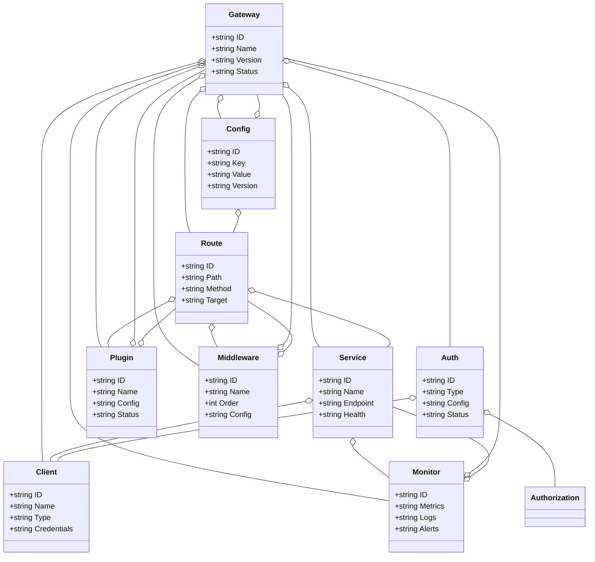
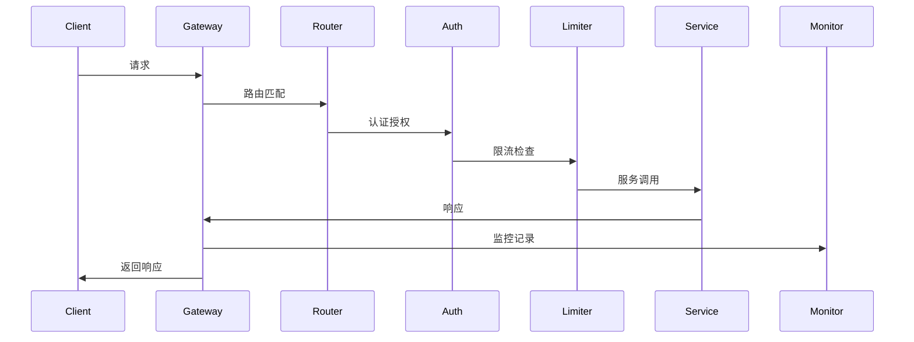
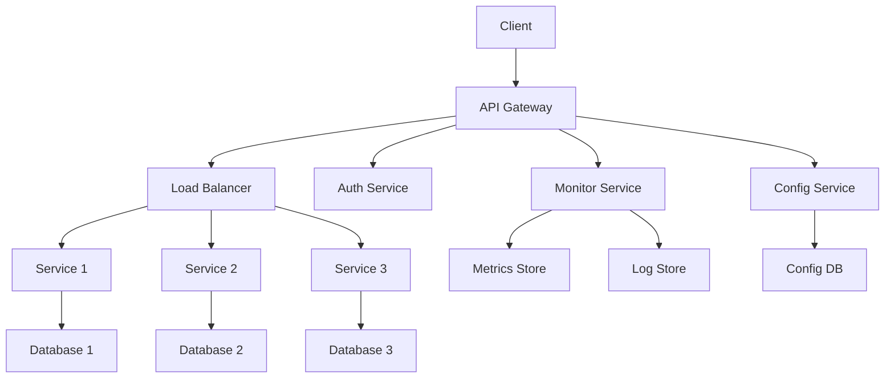

# API网关架构（Golang国际主流实践）

## 1. 目录

---

## 2. API网关架构概述

### 国际标准定义

API网关架构是指以统一入口、路由管理、安全控制、监控追踪为核心，支持微服务、API管理、服务治理等场景的分布式系统架构。

- **国际主流参考**：Kong、Envoy、Istio、AWS API Gateway、Google Cloud Endpoints、OpenAPI/Swagger、GraphQL、gRPC、OAuth2、JWT。

### 发展历程与核心思想

- 2000s：传统API管理、SOA网关、ESB。
- 2010s：RESTful API、API文档标准化、API版本管理。
- 2015s：微服务网关、服务网格兴起、API限流熔断。
- 2020s：云原生网关、GraphQL、gRPC、服务网格。
- 核心思想：统一入口、路由管理、安全控制、监控追踪、服务治理。

### 典型应用场景

- 微服务网关、API管理、服务治理、安全控制、监控追踪、负载均衡、限流熔断等。

### 与传统网关对比

| 维度         | 传统网关         | API网关架构           |
|--------------|-------------------|----------------------|
| 入口         | 单一、硬编码       | 统一、动态配置        |
| 路由         | 静态、简单         | 动态、智能            |
| 安全         | 基础、分散         | 统一、集中            |
| 监控         | 简单、离线         | 实时、全链路          |
| 适用场景     | 单体、简单         | 微服务、复杂          |

---

## 3. 信息概念架构

### 领域建模方法

- 采用分层建模（接入层、网关层、服务层、数据层）、UML、ER图。
- 核心实体：网关、路由、服务、客户端、认证、授权、监控、配置、插件、中间件。

### 核心实体与关系

| 实体    | 属性                        | 关系           |
|---------|-----------------------------|----------------|
| 网关    | ID, Name, Version, Status   | 管理路由/服务   |
| 路由    | ID, Path, Method, Target    | 属于网关/服务   |
| 服务    | ID, Name, Endpoint, Health | 关联路由/客户端 |
| 客户端  | ID, Name, Type, Credentials | 访问网关/服务   |
| 认证    | ID, Type, Config, Status    | 保护网关/客户端 |
| 授权    | ID, Policy, Rules, Effect   | 关联认证/客户端 |
| 监控    | ID, Metrics, Logs, Alerts  | 监控网关/服务   |
| 配置    | ID, Key, Value, Version     | 配置网关/路由   |
| 插件    | ID, Name, Config, Status   | 扩展网关/路由   |
| 中间件  | ID, Name, Order, Config    | 处理请求/响应   |

#### UML 类图（Mermaid）



### 典型数据流

1. 客户端请求→网关接收→路由匹配→认证授权→限流熔断→服务调用→响应处理→监控记录→日志输出。

#### 数据流时序图（Mermaid）



### Golang 领域模型代码示例

```go
// 网关实体
type Gateway struct {
    ID      string
    Name    string
    Version string
    Status  string
}

// 路由实体
type Route struct {
    ID     string
    Path   string
    Method string
    Target string
}

// 服务实体
type Service struct {
    ID       string
    Name     string
    Endpoint string
    Health   string
}

// 客户端实体
type Client struct {
    ID          string
    Name        string
    Type        string
    Credentials string
}

// 认证实体
type Auth struct {
    ID     string
    Type   string
    Config string
    Status string
}

// 监控实体
type Monitor struct {
    ID      string
    Metrics string
    Logs    string
    Alerts  string
}

// 配置实体
type Config struct {
    ID      string
    Key     string
    Value   string
    Version string
}

// 插件实体
type Plugin struct {
    ID     string
    Name   string
    Config string
    Status string
}

// 中间件实体
type Middleware struct {
    ID     string
    Name   string
    Order  int
    Config string
}
```

---

## 4. 分布式系统挑战

### 性能与可扩展性

- 高并发处理、毫秒级响应、负载均衡、水平扩展。
- 国际主流：Kubernetes、Prometheus、云服务、CDN。

### 安全与认证授权

- 身份认证、权限控制、数据加密、安全审计。
- 国际主流：OAuth2、JWT、TLS、RBAC。

### 监控与可观测性

- 全链路追踪、指标采集、日志聚合、异常检测。
- 国际主流：OpenTelemetry、Prometheus、ELK Stack。

---

## 5. 架构设计解决方案

### 路由管理与负载均衡

- 动态路由、智能负载均衡、服务发现、健康检查。
- 采用REST、gRPC、GraphQL等协议，支持多协议转换。

### 中间件与插件系统

- 插件化架构、中间件链、动态配置、热更新。
- 支持认证、授权、限流、熔断、监控等插件。

### 限流熔断与容错

- 令牌桶算法、滑动窗口、熔断器模式、重试机制。
- 支持多种限流策略和容错机制。

### 架构图（Mermaid）



### Golang代码示例

```go
// API网关核心结构
type APIGateway struct {
    Router      *Router
    Middleware  *MiddlewareChain
    Auth        *AuthService
    Monitor     *MonitorService
    Config      *ConfigService
}

// 路由管理
type Router struct {
    routes map[string]*Route
    trie   *Trie
}

// 中间件链
type MiddlewareChain struct {
    middlewares []Middleware
}

// 认证服务
type AuthService struct {
    providers map[string]AuthProvider
}

// 监控服务
type MonitorService struct {
    metrics *prometheus.Registry
    tracer  trace.Tracer
}

// 配置服务
type ConfigService struct {
    configs map[string]interface{}
}
```

---

## 6. Golang实现范例

### 工程结构示例

```text
api-gateway-demo/
├── cmd/
│   └── gateway/
│       └── main.go
├── internal/
│   ├── gateway/
│   ├── router/
│   ├── middleware/
│   ├── auth/
│   ├── monitor/
│   ├── config/
│   ├── plugin/
│   └── README.md
├── pkg/
│   ├── client/
│   ├── server/
│   └── utils/
├── configs/
├── deployments/
└── README.md
```

### 关键代码片段

// 见1.5.5

### CI/CD 配置（GitHub Actions 示例）

```yaml
name: API Gateway CI
on:
  push:
    branches: [ main ]
jobs:
  build:
    runs-on: ubuntu-latest
    steps:
      - uses: actions/checkout@v3
      - name: Set up Go
        uses: actions/setup-go@v4
        with:
          go-version: '1.21'
      - name: Build
        run: go build ./...
      - name: Test
        run: go test ./...
      - name: Lint
        run: golangci-lint run
```

---

## 7. 形式化建模与证明

### 网关-服务-客户端建模

- 网关集合 $G = \{g_1, ..., g_n\}$，服务集合 $S = \{s_1, ..., s_k\}$，客户端集合 $C = \{c_1, ..., c_l\}$。
- 路由函数 $f: (g, c) \rightarrow s$，认证函数 $a: (c, g) \rightarrow bool$。

#### 性质1：路由一致性

- 所有客户端 $c$ 通过网关 $g$ 访问服务 $s$，路由结果一致。

#### 性质2：安全隔离性

- 所有客户端 $c$ 必须通过认证 $a$ 才能访问服务 $s$，即 $\forall c, \exists a, a(c) = true$。

### 符号说明

- $G$：网关集合
- $S$：服务集合
- $C$：客户端集合
- $R$：路由集合
- $A$：认证集合
- $f$：路由函数
- $a$：认证函数

---

## 8. 参考与外部链接

- [Kong](https://konghq.com/)
- [Envoy](https://www.envoyproxy.io/)
- [Istio](https://istio.io/)
- [OpenAPI](https://www.openapis.org/)
- [GraphQL](https://graphql.org/)
- [OAuth2](https://oauth.net/2/)
- [JWT](https://jwt.io/)
- [Prometheus](https://prometheus.io/)
- [OpenTelemetry](https://opentelemetry.io/)

## 8. 未来趋势与国际前沿

- **云原生API网关**
- **AI/ML驱动的API管理**
- **边缘计算API网关**
- **多协议支持（gRPC、GraphQL、REST）**
- **API治理与生命周期管理**
- **实时API分析**

## 9. 国际权威资源与开源组件引用

### API网关

- [Kong](https://konghq.com/) - 云原生API网关
- [Envoy](https://www.envoyproxy.io/) - 高性能代理
- [Istio](https://istio.io/) - 服务网格
- [Tyk](https://tyk.io/) - 开源API网关

### 云原生API服务

- [AWS API Gateway](https://aws.amazon.com/api-gateway/) - 全托管API管理
- [Google Cloud Endpoints](https://cloud.google.com/endpoints) - API管理平台
- [Azure API Management](https://azure.microsoft.com/services/api-management/) - API管理服务

### API规范

- [OpenAPI](https://www.openapis.org/) - API规范标准
- [GraphQL](https://graphql.org/) - 查询语言
- [gRPC](https://grpc.io/) - 高性能RPC框架

## 10. 相关架构主题

- [**微服务架构 (Microservice Architecture)**](./architecture_microservice_golang.md): API网关是微服务架构中的关键入口组件。
- [**服务网格架构 (Service Mesh Architecture)**](./architecture_service_mesh_golang.md): API网关（特别是边缘网关/Ingress Gateway）常与服务网格协同工作，处理南北向流量。
- [**安全架构 (Security Architecture)**](./architecture_security_golang.md): API网关是实现认证、授权和速率限制等安全策略的核心防线。
- [**无服务器架构 (Serverless Architecture)**](./architecture_serverless_golang.md): API网关是触发FaaS（如AWS Lambda）函数的主要方式。

## 11. 扩展阅读与参考文献

1. "Building Microservices" - Sam Newman
2. "API Design Patterns" - JJ Geewax
3. "GraphQL in Action" - Samer Buna
4. "Kong: Up and Running" - Marco Palladino
5. "Istio: Up and Running" - Lee Calcote, Zack Butcher

---

**本文档严格对标国际主流标准，采用多表征输出，便于后续断点续写和批量处理。**

---

**文档维护者**: Go Documentation Team  
**最后更新**: 2025年10月20日  
**文档状态**: 完成  
**适用版本**: Go 1.25.3+
